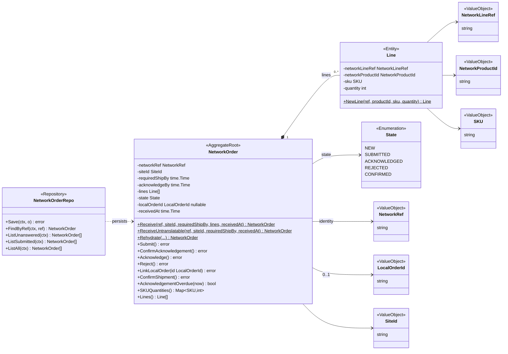
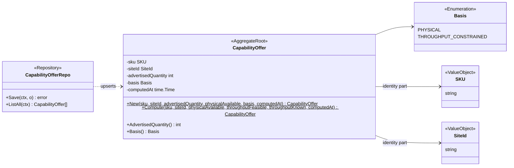
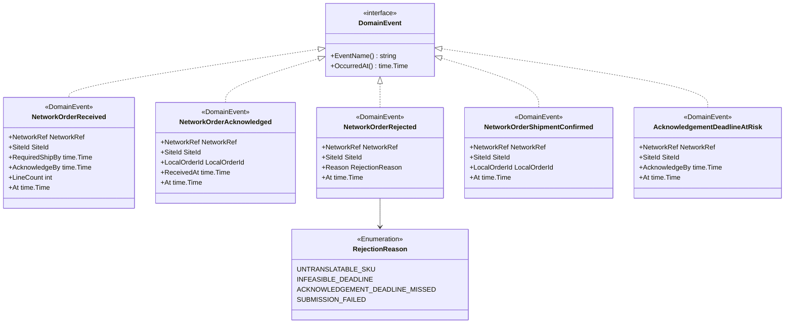
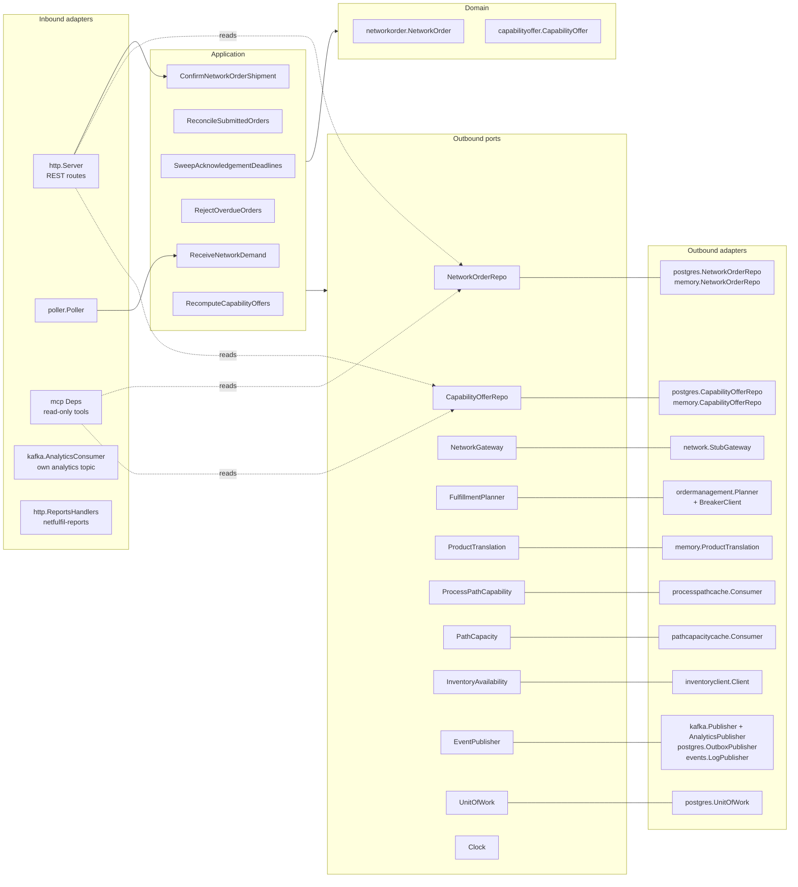

# Class diagrams

:::info[Synced from network-fulfillment]
This page is a copy of [`docs/ddd/class-diagram.md`](https://github.com/IQVO/network-fulfillment/blob/develop/docs/ddd/class-diagram.md) on `develop`, derived from that repository's code. Edit it there, then re-sync.
:::

UML class diagrams of `internal/domain/**`, plus the hexagonal ports and
adapters. Type and member names are the real Go identifiers. Fields are
unexported in Go and shown with `-`; exported methods are shown with `+`.
Only state-changing methods and key queries are shown.

## 1. NetworkOrder aggregate

Source: `internal/domain/networkorder/network_order.go`,
`internal/domain/shared/shared.go`, `internal/application/ports/ports.go`.

Omitted: the read accessors (`NetworkRef()`, `State()` and so on), the
`AcknowledgementWindow` constant (24h), and the error variables (listed on
[aggregate-design-canvas.md](/contexts/network-fulfillment/aggregate-design-canvas)). A `Line` is
modelled as an entity because it has a local identity, `networkLineRef`,
which is unique within its order. In Go it is a struct value owned by the
aggregate. `0..*` lines reflects `ReceiveUntranslatable`; `Receive`
requires at least one.

## 2. CapabilityOffer aggregate

Source: `internal/domain/capabilityoffer/capability_offer.go`,
`internal/application/ports/ports.go`.

Omitted: the five `Err...` variables, and the other read accessors
(`SKU()`, `SiteId()`, `ComputedAt()`). The type has no mutators: `New` and
`Compute` are the only constructors.

## 3. Domain events

Source: `internal/domain/shared/events.go`.

Omitted: JSON tags (camelCase field names on the wire, for example
`networkRef`, `lineCount`). Events are plain structs raised by use cases,
not by aggregate methods.

## 4. Hexagonal ports and adapters

Source: `internal/application/ports/ports.go`, `cmd/netfulfil/main.go`
(the wiring), `cmd/mcp/main.go`, `cmd/netfulfil-projector/main.go`,
`cmd/netfulfil-reports/main.go`, `internal/architecture/architecture_test.go`
(the arch-go dependency rules).

Omitted: `Clock` is satisfied by a `systemClock` in each composition root,
so it has no adapter package. The tickers in `cmd/netfulfil` drive
UC2, UC3, UC4 and UC6, and are not drawn. The analytics consumer and the
reports handlers bypass `application/` and use `internal/analytics/report`
ports (`ProjectionStore`, `ReportStore`) implemented by
`internal/adapters/outbound/analyticsstore`. `postgres.OutboxRelay` drains
`outbox_events` to the Kafka publisher. The HTTP and MCP adapters read the
repositories directly, because every read is a pure projection (see the
`http.Server` doc comment).
