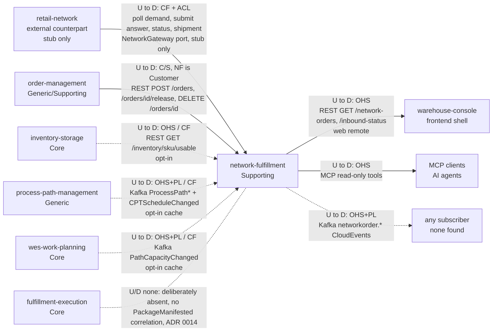

# Context Map

:::info[Synced from network-fulfillment]
This page is a copy of [`docs/ddd/context-map.md`](https://github.com/IQVO/network-fulfillment/blob/develop/docs/ddd/context-map.md) on `develop`, derived from that repository's code. Edit it there, then re-sync.
:::

Following ddd-crew [Context Mapping](https://github.com/ddd-crew/context-mapping).
This is **network-fulfillment's slice** of the fleet map: every
relationship this context has, with the upstream (U) and downstream (D)
side, the pattern, and the technology.

Source: `internal/adapters/outbound/network/gateway.go`,
`internal/adapters/outbound/ordermanagement/planner.go`,
`internal/adapters/outbound/inventoryclient/client.go`,
`internal/adapters/outbound/processpathcache/consumer.go`,
`internal/adapters/outbound/pathcapacitycache/consumer.go`,
`internal/adapters/outbound/kafka/publisher.go`,
`internal/adapters/inbound/http/server.go`, `internal/adapters/inbound/mcp/tools.go`,
`web/src/screens/NetworkFulfillmentScreen.tsx`, `cmd/netfulfil/main.go`,
`docs/adr/0014-explicit-shipment-confirmation-endpoint.md`.

Legend: solid arrow = live by default; dotted arrow = wired but opt-in
(`CAPABILITY_OFFER_ENABLED=true` or `EVENT_PUBLISHER=kafka`) or with no known
consumer; dotted line without an arrow head = deliberately absent. Arrows
point from upstream to downstream. Path parameters are written `id` / `sku`
inside the diagram, for `{id}` / `{sku}`.

Omitted: the analytics loop (this context's own projector consuming its own
analytics topic, an internal relationship); Postgres, Kafka and Kong as
infrastructure; and every fleet context with no relationship to this one.
Those are effectively Separate Ways: `facility-layout`,
`workforce-management`, `labor-performance`, `warehouse-planning`,
`warehouse-ops-agent`.

## Relationships and evidence

| Upstream | Downstream | Pattern | Technology | Status | Evidence |
| --- | --- | --- | --- | --- | --- |
| `retail-network` (external network role) | network-fulfillment | **Conformist + Anti-Corruption Layer** | `ports.NetworkGateway`: `PollDemand`, `SubmitAcknowledgement`, `SubmissionStatus`, `SubmitShipmentConfirmation` | **Stub only.** `NETWORK_MODE=live` refuses to boot (no adapter) | `internal/adapters/outbound/network/gateway.go` (`NewGateway`, `StubGateway`); ADR 0001 §2, ADR 0009 |
| `order-management` | network-fulfillment | **Customer/Supplier** (NF is the Customer; OM ADR 0020 is the Supplier's half) | REST: `POST /orders`, `POST /orders/{id}/release`, `DELETE /orders/{id}` behind one circuit breaker | **Live** | `internal/adapters/outbound/ordermanagement/planner.go`, `breaker.go`; `cmd/netfulfil/main.go` `wirePlanner` |
| `inventory-storage` | network-fulfillment | **Open Host / Conformist** | REST `GET /inventory/{sku}/usable` | **Wired, opt-in** (`CAPABILITY_OFFER_ENABLED`) | `internal/adapters/outbound/inventoryclient/client.go`; the `ports.InventoryAvailability` doc comment explains why this is REST rather than a cache |
| `process-path-management` | network-fulfillment | **Open Host + Published Language / Conformist** | Kafka `warehouse.process-path-management.events`, CE types `...processpath.ProcessPathCreated`, `...ProcessPathUpdated`, `...ProcessPathDeactivated`, `...cptschedule.CPTScheduleChanged`; per-process group `network-fulfillment-process-path-capability-cache-<host>-<pid>-<ts>` | **Wired, opt-in** | `internal/adapters/outbound/processpathcache/consumer.go` |
| `wes-work-planning` | network-fulfillment | **Open Host + Published Language / Conformist** | Kafka `warehouse.work-planning.events`, CE type `com.warehouse.wes.work-planning.workpool.PathCapacityChanged`; per-process group `network-fulfillment-path-capacity-cache-<host>-<pid>-<ts>` | **Wired, opt-in** | `internal/adapters/outbound/pathcapacitycache/consumer.go` |
| network-fulfillment | `warehouse-console` (via `web/` remote) | **Open Host** | REST `GET /network-orders`, `GET /inbound-status` | **Live** | `web/src/screens/NetworkFulfillmentScreen.tsx`; ADR 0010 |
| network-fulfillment | MCP clients | **Open Host** (read-only) | MCP `get_network_order`, `list_network_orders`, `list_capability_offers`, `get_acknowledgement_report` | **Live** (`cmd/mcp`). No fleet MCP client found in the local `warehouse-ops-agent` checkout | `internal/adapters/inbound/mcp/tools.go`, `report_tool.go` |
| network-fulfillment | any subscriber | **Open Host + Published Language** | Kafka `warehouse.network-fulfillment.events`, `com.warehouse.wes.network-fulfillment.networkorder.<Event>` | **Wired-but-unused.** Published with `EVENT_PUBLISHER=kafka`; no consumer found in the local fleet checkouts | `internal/adapters/outbound/kafka/publisher.go`; `apis/asyncapi.yaml` |
| `fulfillment-execution` | network-fulfillment | none | would be Kafka `PackageManifested` | **Deliberately absent** (ADR 0014): there is no persisted `WorkUnitId -> NetworkRef` mapping, so shipment confirmation is an explicit REST call instead | `internal/application/usecases/confirm_network_order_shipment.go` doc comment |

## Notes on the patterns

- **Conformist + ACL toward the network.** Conformist because the
  network owns the protocol (one answer, 24h, fill-or-kill) and the
  identifier formats (`NetworkRef` is opaque). ACL because none of that
  vocabulary crosses `adapters/outbound/network/`: the fleet sees SKUs,
  quantities and a deadline only.
- **Customer/Supplier with `order-management`.** This is a negotiated,
  two-sided contract. The companion OM ADR 0020 added
  `releaseOnAllocation` and `PromisePolicy.FeasibleBy` specifically for
  this Customer. The relationship is not Conformist: the upstream changed
  to serve it.
- **No Shared Kernel.** Value types such as `SKU` and `SiteId` are
  re-declared locally in `internal/domain/shared`; no code is shared.
