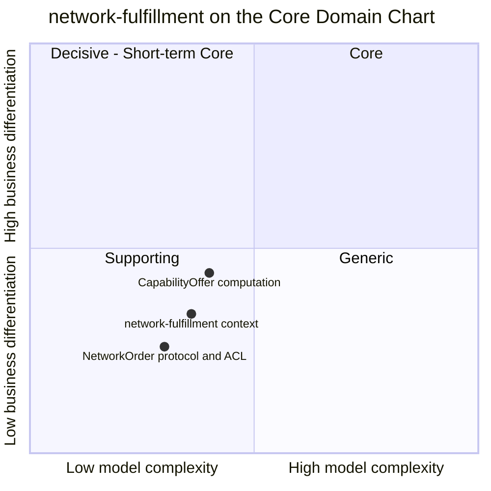

# Core Domain Chart

:::info[Synced from network-fulfillment]
This page is a copy of [`docs/ddd/core-domain-chart.md`](https://github.com/IQVO/network-fulfillment/blob/develop/docs/ddd/core-domain-chart.md) on `develop`, derived from that repository's code. Edit it there, then re-sync.
:::

Following the ddd-crew [Core Domain Charts](https://github.com/ddd-crew/core-domain-charts):
business differentiation (y) against model complexity (x).

Source: `docs/adr/0001-network-fulfillment-bounded-context.md` (Decision:
"a Supporting Subdomain"), `internal/domain/networkorder/network_order.go`,
`internal/domain/capabilityoffer/capability_offer.go`,
`internal/application/usecases/`.

Omitted: the other fleet contexts (their positions belong on their own
charts); the counterpart `retail-network`, which is outside this fleet's
model.

## Classification: Supporting

All three points sit in **quadrant 3 (Supporting)**, bottom-left. This
matches ADR 0001, which classifies the context as a **Supporting
Subdomain**: the fleet needs it to sell capability to an external network,
but the differentiating knowledge it uses (cut-offs, cycle times, path
capacity, promises) is owned elsewhere.

### Evidence for the position

**Differentiation is low to moderate (y ≈ 0.26–0.44).**

- The context makes no fulfillment decision of its own. Feasibility is
  asked of `order-management` (`ports.FulfillmentPlanner.RaiseHeldOrder`;
  ADR 0001 §7: "never recomputed here").
- The acknowledgement protocol is the network's rule set, and the
  context conforms to it: answer once, in full, within 24h
  (`ErrAlreadyAnswered`, `AcknowledgementWindow`).
- The one differentiating idea is `CapabilityOffer`. ADR 0001 calls it "the
  one genuinely new domain concept": advertise
  `min(physicalAvailable, throughputFeasible)` rather than raw stock.
  That is why it is plotted highest. It is still computed from other
  contexts' facts and is **not yet submitted outward**
  (`RecomputeCapabilityOffers` never calls `SubmitAvailability`), so it
  stays below the Core line.

**Model complexity is low to moderate (x ≈ 0.30–0.40).**

- There are two aggregates. `NetworkOrder` has 5 states, 6 state-changing
  methods (`Submit`, `ConfirmAcknowledgement`, `Acknowledge`, `Reject`,
  `LinkLocalOrder`, `ConfirmShipment`) plus 2 constructors (`Receive`,
  `ReceiveUntranslatable`), and 5 aggregate errors plus 6 value-object
  errors in `shared`.
  `CapabilityOffer` has no lifecycle and 5 validation errors.
- The real complexity is in the integration, not in the model: the
  asynchronous submission and reconciliation (`SUBMITTED`,
  `ReconcileSubmittedOrders`), the 24h clock (the sweep plus
  `RejectOverdueOrders`), the transactional outbox (ADR 0003), and two
  replay-from-first-offset Kafka caches.
- There are 14 ADRs (index: [../adr/README.md](https://github.com/IQVO/network-fulfillment/blob/develop/docs/adr/README.md)). Most of
  them record infrastructure decisions (0003–0008, 0010–0013), not domain
  rules.

## Evolution

| Part | Evolution stage | Why |
| --- | --- | --- |
| ACL and acknowledgement protocol | **Custom-built** | Translation (`ProductTranslation`), the hold/answer sequence and the 24h clock are specific to this fleet. The pattern itself is well known. |
| `CapabilityOffer` | **Genesis → Custom** | New to this fleet (ADR 0001 §8). It is opt-in (`CAPABILITY_OFFER_ENABLED`), not yet published outward, and single-site (`SITE_ID`). |
| The counterpart's API | **Product** | The network's protocol is a given that this context conforms to. `retail-network` stands in for it (ADR 0009). |
| Plumbing (outbox, CloudEvents, breaker, MCP) | **Commodity** | Fleet-wide standard building blocks, copied from sibling contexts. |

**Movement to watch.** If a live adapter ships and the throughput-constrained
offer is actually submitted to the counterpart, `CapabilityOffer` could
move up into **quadrant 2 (Decisive - Short-term Core)**: a simple formula
with real differentiating value. That would be a new decision recorded in an
ADR. Nothing in the code today puts it there.
