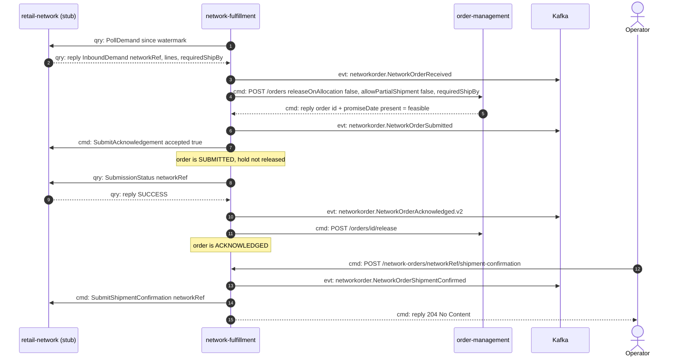
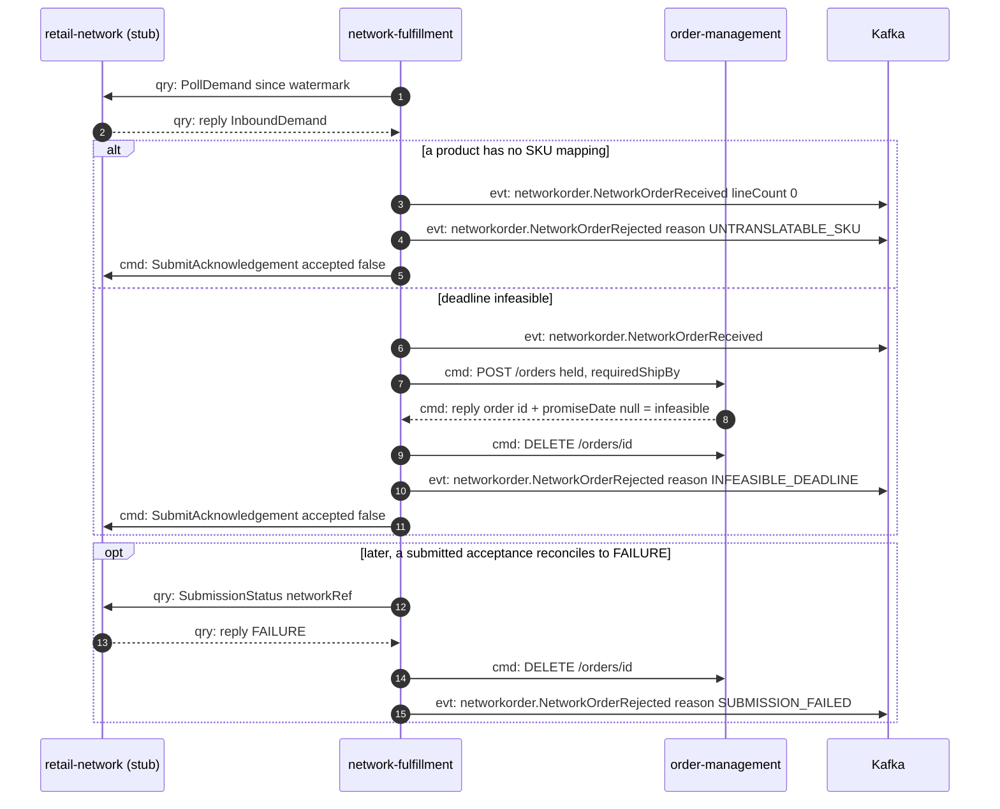
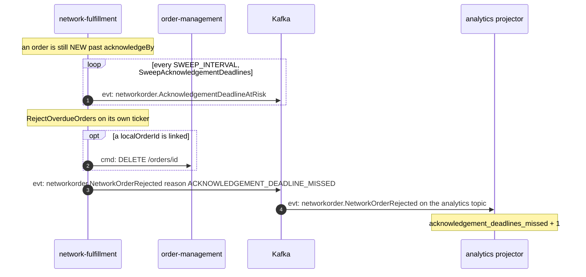
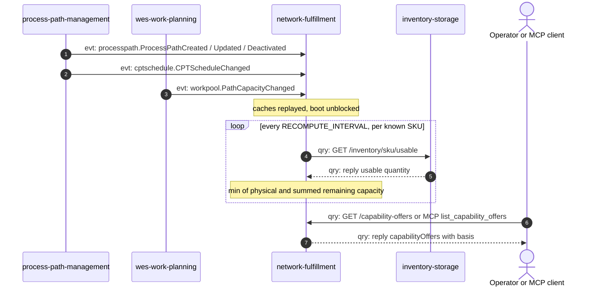

# Domain Message Flow

:::info[Synced from network-fulfillment]
This page is a copy of [`docs/ddd/domain-message-flow.md`](https://github.com/IQVO/network-fulfillment/blob/develop/docs/ddd/domain-message-flow.md) on `develop`, derived from that repository's code. Edit it there, then re-sync.
:::

Following ddd-crew [Domain Message Flow Modelling](https://github.com/ddd-crew/domain-message-flow-modelling).
Four key business scenarios. Participants are contexts and external
systems. Every arrow is a real message (port call, REST route, CloudEvents
type) and is prefixed `cmd:` (command), `qry:` (query) or `evt:` (event).

Kafka events are published only with `EVENT_PUBLISHER=kafka`. With
`DATABASE_URL` set they go through the transactional outbox. Every event
goes to both `warehouse.network-fulfillment.events` and
`warehouse.network-fulfillment.analytics`; the diagrams show one "Kafka"
participant for both.

## 1. Network demand accepted, settled and shipped

Source: `internal/application/usecases/receive_network_demand.go`,
`reconcile_submitted_orders.go`, `confirm_network_order_shipment.go`;
`internal/adapters/outbound/ordermanagement/planner.go`;
`internal/adapters/inbound/http/server.go`.

Omitted: translation (local, no message); the poller's idempotency check;
the reconcile pass runs on its own `POLL_INTERVAL` ticker, minutes after
the submission; `FAILURE` and `PENDING` branches (see scenario 2 and
[sequence-diagrams.md](/contexts/network-fulfillment/sequence-diagrams)). Full types are
`com.warehouse.wes.network-fulfillment.networkorder.<Event>`; REST path
parameters `{id}` / `{networkRef}` are written without braces.

## 2. Network demand rejected

Source: `internal/application/usecases/receive_network_demand.go`
(`rejectUntranslatable`, `reject`), `reconcile_submitted_orders.go` (`fail`).

Omitted: the untranslatable path never calls `order-management` at all.
In the `FAILURE` path the network already knows its own refusal, so no
second `SubmitAcknowledgement` is sent. The analytics projector counts a
`SUBMISSION_FAILED` rejection in `orders_rejected_submission_failed`
(surfaced as `ordersRejectedSubmissionFailed` in the acknowledgement report).

## 3. Acknowledgement window missed

Source: `internal/application/usecases/sweep_acknowledgement_deadlines.go`,
`reject_overdue_orders.go`, `internal/adapters/inbound/kafka/analytics_consumer.go`,
`internal/adapters/outbound/analyticsstore/postgres_projection.go`.

Omitted: the two passes are independent tickers. Whichever runs first
decides whether an at-risk event fires before the rejection. No message is
sent to the network: the window is closed and the order is never
acknowledged late. The projector ignores `AcknowledgementDeadlineAtRisk`.

## 4. Capability offer recomputed

Source: `internal/application/usecases/recompute_capability_offers.go`,
`internal/adapters/outbound/processpathcache/consumer.go`,
`internal/adapters/outbound/pathcapacitycache/consumer.go`,
`internal/adapters/outbound/inventoryclient/client.go`,
`internal/adapters/inbound/http/server.go`, `internal/adapters/inbound/mcp/tools.go`.

Omitted: full CE types are
`com.warehouse.wes.process-path-management.processpath.*`,
`com.warehouse.wes.process-path-management.cptschedule.CPTScheduleChanged`
and `com.warehouse.wes.work-planning.workpool.PathCapacityChanged`. The
whole scenario runs only with `CAPABILITY_OFFER_ENABLED=true`. No message
goes to the network: `SubmitAvailability` is not called yet.
