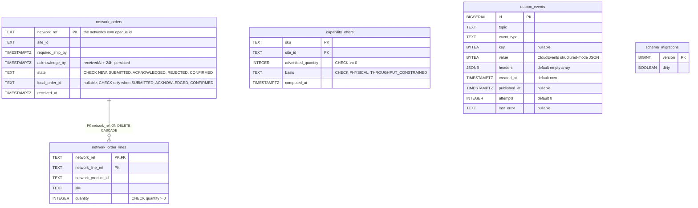
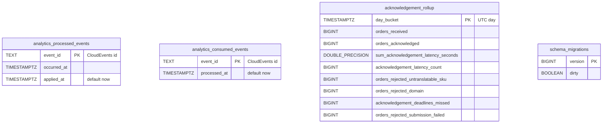

# Entity-relationship diagrams

:::info[Synced from network-fulfillment]
This page is a copy of [`docs/ddd/entity-relationship.md`](https://github.com/IQVO/network-fulfillment/blob/develop/docs/ddd/entity-relationship.md) on `develop`, derived from that repository's code. Edit it there, then re-sync.
:::

The final schema after applying the migrations in order. There are two
separate databases:

- the **OLTP** database (`DATABASE_URL`): `migrations/0001_init`,
  `0002_outbox`, `0003_submitted_state`, `0004_capability_offers`;
- the **analytical** database (`ANALYTICS_DATABASE_URL`):
  `migrations/analytics/0001_report`, `0002_rejected_submission_failed`.

With `DATABASE_URL` unset the service runs on in-memory repositories and
uses neither.

A relationship line is drawn **only** where a real `FOREIGN KEY` exists.

## OLTP database

Source: `migrations/0001_init.up.sql`, `migrations/0002_outbox.up.sql`,
`migrations/0003_submitted_state.up.sql`, `migrations/0004_capability_offers.up.sql`;
`internal/adapters/outbound/postgres/migrate.go` (golang-migrate).

Omitted: indexes. They are `idx_network_orders_unanswered` (partial on
`acknowledge_by WHERE state = 'NEW'`), `idx_network_orders_local_order`
(partial, `local_order_id IS NOT NULL`), `idx_network_order_lines_sku` and
`idx_outbox_events_unpublished` (partial, `published_at IS NULL`).
`schema_migrations` is created by golang-migrate, not by a migration file;
its columns are shown as golang-migrate's Postgres driver creates them.

**Infrastructure tables:** `outbox_events` is the transactional outbox
(ADR 0003), one row per event per topic. `schema_migrations` is
golang-migrate's bookkeeping. There is **no** `processed_events` inbox and
**no** `idempotency_keys` table in this database: the only OLTP Kafka
consumers are the two in-memory capability caches, and inbound idempotency
is "find by `network_ref` first".

**Logical links without a foreign key:**

- `network_orders.local_order_id` → `order-management`'s order id. That is
  another context's database, so the link is by value only (the persisted
  correlation of OM ADR 0018).
- `capability_offers.sku` / `network_order_lines.sku` → the same SKU
  vocabulary. They are separate aggregates and are deliberately not joined.
- `capability_offers.site_id` / `network_orders.site_id`: a shared value,
  not a reference.
- `outbox_events.key` holds the `network_ref` of the order that raised the
  event. It is a Kafka partition key, not a foreign key.

## Analytical database

Source: `migrations/analytics/0001_report.up.sql` and
`0002_rejected_submission_failed.up.sql` (adds
`orders_rejected_submission_failed`);
`internal/adapters/outbound/analyticsstore/postgres_projection.go`,
`consumed_events_repo.go`.

Omitted: the indexes `idx_analytics_processed_events_occurred_at` and
`idx_acknowledgement_rollup_day_bucket`. `DOUBLE_PRECISION` stands for the
SQL type `DOUBLE PRECISION`, because Mermaid needs a single token. There
are no foreign keys in this database.

**All tables here are analytics/projection or infrastructure tables.**
They are derived from the analytics event stream and are not a source of
truth. `analytics_consumed_events` is the consumer's dedupe gate.
`analytics_processed_events` is claimed by the projection upsert and
drives freshness. `acknowledgement_rollup` is the report fact table.

## Table ≠ aggregate

| Table | Aggregate / role | Notes |
| --- | --- | --- |
| `network_orders` | **NetworkOrder** (root) | One row per aggregate. `Save` upserts on `network_ref`; there is no version column (no optimistic concurrency). |
| `network_order_lines` | **NetworkOrder** (its `Line`s) | Inserted with `ON CONFLICT DO NOTHING`; lines never change after receipt. |
| `capability_offers` | **CapabilityOffer** | One row per `(sku, site_id)`, upserted on every recompute. It is a snapshot with no history. |
| `outbox_events` | none (infrastructure) | Written in the same transaction as the aggregate by `postgres.OutboxPublisher`; drained by `postgres.OutboxRelay` (`FOR UPDATE SKIP LOCKED`). |
| `schema_migrations` | none (infrastructure) | golang-migrate. |
| `analytics_processed_events`, `analytics_consumed_events` | none (analytics infrastructure) | Idempotency for the projector. |
| `acknowledgement_rollup` | none (read model) | The "Acknowledgement & Translation" report. |
