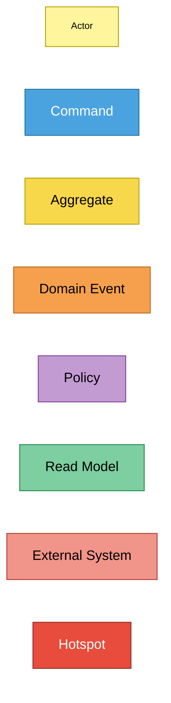
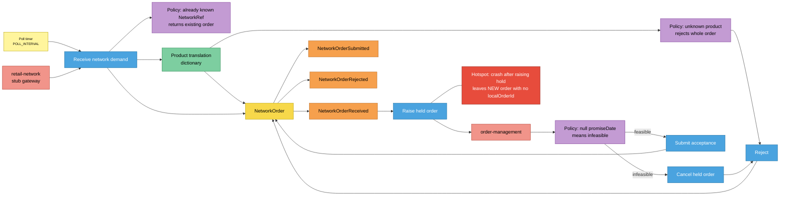
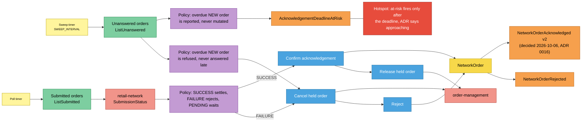
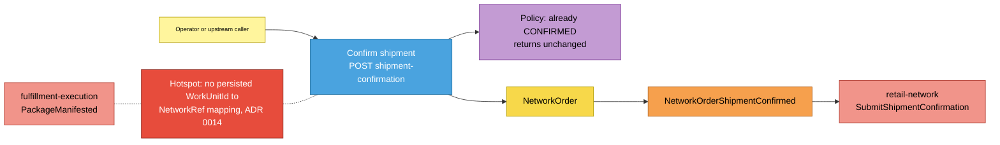
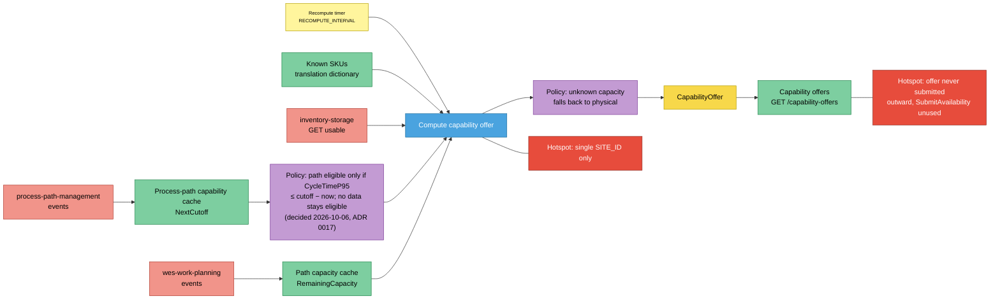

# EventStorming (design level)

:::info[Synced from network-fulfillment]
This page is a copy of [`docs/ddd/eventstorming.md`](https://github.com/IQVO/network-fulfillment/blob/develop/docs/ddd/eventstorming.md) on `develop`, derived from that repository's code. Edit it there, then re-sync.
:::

Uses the ddd-crew [EventStorming glossary & cheat sheet](https://github.com/ddd-crew/eventstorming-glossary-cheat-sheet)
notation. Each sticky is backed by code. The hotspots are real gaps,
taken from ADRs or from the code itself, and none is invented.

## Legend

## 1. Demand intake and answer

Source: `internal/adapters/inbound/poller/poller.go`,
`internal/application/usecases/receive_network_demand.go`,
`internal/adapters/outbound/ordermanagement/planner.go`,
`internal/domain/networkorder/network_order.go`.

Omitted: the submission to the network that follows each answer
(`SubmitAcknowledgement(ref, true|false)`), shown in
[sequence-diagrams.md](/contexts/network-fulfillment/sequence-diagrams); and the outbox write.

## 2. Reconciliation and the acknowledgement clock

Source: `internal/application/usecases/reconcile_submitted_orders.go`,
`sweep_acknowledgement_deadlines.go`, `reject_overdue_orders.go`;
`internal/adapters/outbound/analyticsstore/postgres_projection.go`;
`docs/adr/0001-network-fulfillment-bounded-context.md` §5, §6.

Omitted: the per-order "skip on error, retry next pass" behaviour of all
three passes. The overdue reject cancels the held order only when one is
linked.

## 3. Shipment confirmation

Source: `internal/application/usecases/confirm_network_order_shipment.go`,
`internal/adapters/inbound/http/server.go` (`handleConfirmShipment`),
`internal/adapters/inbound/http/errors.go` (`ErrConfirmBeforeAcknowledge`
maps to 409 `confirm-before-acknowledge`), `docs/adr/0014-explicit-shipment-confirmation-endpoint.md`.

Omitted: the 404 branch for an unknown `networkRef`.

## 4. Capability offer recompute

Source: `internal/application/usecases/recompute_capability_offers.go`,
`internal/domain/capabilityoffer/capability_offer.go`,
`internal/adapters/outbound/{processpathcache,pathcapacitycache,inventoryclient}/`,
`cmd/netfulfil/main.go` (`wireCapabilityOffer`, `siteId`).

Omitted: the boot-time `WaitReady` gate and the
`CAPABILITY_OFFER_ENABLED` switch. `CapabilityOffer` raises no domain
event, so there is no orange sticky.

## Sticky inventory

| Sticky | Kind | Code evidence |
| --- | --- | --- |
| Poll / sweep / recompute timers | Actor | `poller.Run`, `runSweep`, `runRejectOverdue`, `runReconcile`, `runRecompute` in `cmd/netfulfil/main.go` |
| Operator or upstream caller | Actor | `POST /network-orders/{networkRef}/shipment-confirmation` |
| Receive network demand | Command | `ReceiveNetworkDemand.Execute` |
| Raise / release / cancel held order | Command | `FulfillmentPlanner.RaiseHeldOrder` / `ReleaseHeldOrder` / `CancelHeldOrder` |
| Submit acceptance | Command | `NetworkOrder.Submit` + `LinkLocalOrder` |
| Reject | Command | `NetworkOrder.Reject` |
| Confirm acknowledgement | Command | `NetworkOrder.ConfirmAcknowledgement` |
| Confirm shipment | Command | `NetworkOrder.ConfirmShipment`, `ConfirmNetworkOrderShipment` |
| Compute capability offer | Command | `capabilityoffer.Compute` |
| NetworkOrder | Aggregate | `internal/domain/networkorder` |
| CapabilityOffer | Aggregate | `internal/domain/capabilityoffer` |
| NetworkOrderReceived / Submitted / Acknowledged / Rejected / ShipmentConfirmed / AcknowledgementDeadlineAtRisk | Domain Event | `internal/domain/shared/events.go` |
| Already-known NetworkRef | Policy | `ReceiveNetworkDemand.Execute` (`FindByRef`) |
| Unknown product rejects whole order | Policy | `ReceiveNetworkDemand.translate` → `rejectUntranslatable` |
| Null promiseDate means infeasible | Policy | `ordermanagement.Planner.RaiseHeldOrder` |
| SUCCESS / FAILURE / PENDING | Policy | `ReconcileSubmittedOrders.Execute` |
| Overdue reported, never mutated | Policy | `SweepAcknowledgementDeadlines` |
| Overdue refused, never answered late | Policy | `RejectOverdueOrders` |
| Already CONFIRMED returns unchanged | Policy | `ConfirmNetworkOrderShipment.Execute` |
| Unknown capacity falls back to physical | Policy | `capabilityoffer.Compute` (`throughputKnown=false`) |
| Product translation dictionary | Read Model | `memory.ProductTranslation` (`PRODUCT_TRANSLATION_FILE`) |
| Submitted / unanswered orders | Read Model | `NetworkOrderRepo.ListSubmitted` / `ListUnanswered` |
| Process-path capability cache | Read Model | `processpathcache.Consumer.NextCutoff` |
| Path capacity cache | Read Model | `pathcapacitycache.Consumer.RemainingCapacity` |
| Capability offers | Read Model | `CapabilityOfferRepo.ListAll`, `GET /capability-offers` |
| retail-network | External System | `ports.NetworkGateway`, `network.StubGateway` |
| order-management | External System | `internal/adapters/outbound/ordermanagement` |
| inventory-storage | External System | `internal/adapters/outbound/inventoryclient` |
| process-path-management, wes-work-planning | External System | the two Kafka caches |
| fulfillment-execution | External System | named in ADR 0014 as the deliberately unused trigger |
| Decided 2026-10-06: Submitted at SUBMITTED, Acknowledged only on settle (ADR 0016) | Policy | `ReceiveNetworkDemand.acknowledge` publishes `NetworkOrderSubmitted`; `ReconcileSubmittedOrders.confirm` publishes `NetworkOrderAcknowledged` (v2) with the save (ex-hotspots "Acknowledged at SUBMITTED" and "No event on settle") |
| Orphaned hold after crash | Hotspot | `ReceiveNetworkDemand` saves `NEW` before `RaiseHeldOrder`; `RejectOverdueOrders` cancels only a linked hold; ADR 0001 Consequences ("orphaned-hold sweep as an open gap") |
| SUBMISSION_FAILED counted | Policy | `PostgresProjection.ApplyNetworkOrderRejected` increments `orders_rejected_submission_failed` (analytics migration 0002, ADR 0015; resolved 2026-10-06) |
| At-risk only after the deadline | Hotspot | `AcknowledgementOverdue` vs ADR 0001 §6 "approaching" |
| No WorkUnitId → NetworkRef mapping | Hotspot | ADR 0014 |
| Confirm-before-acknowledge → 409 | Policy | `errors.go` maps `ErrConfirmBeforeAcknowledge` to 409 `confirm-before-acknowledge` (resolved 2026-10-06) |
| Offer never submitted outward | Hotspot | `RecomputeCapabilityOffers` doc comment; ADR 0001 §8 "published outward on a schedule" |
| Decided 2026-10-06: path eligible only if CycleTimeP95 ≤ cutoff − now, missing/zero stays eligible (ADR 0017) | Policy | `RecomputeCapabilityOffers.throughputFeasible` / `cycleTimeFits` (ex-hotspot "CycleTimeP95 unused") |
| Single SITE_ID | Hotspot | `RecomputeCapabilityOffers.SiteId`; ADR 0001 Consequences (single-site inherited) |
