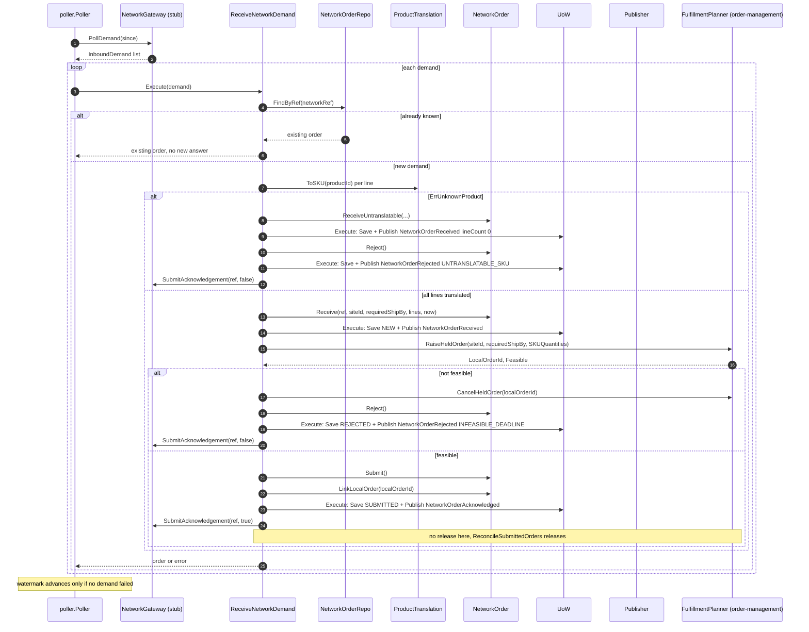
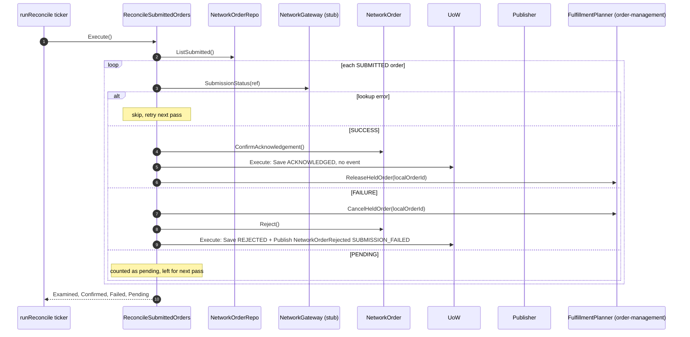
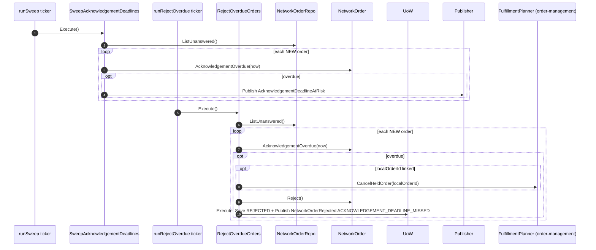
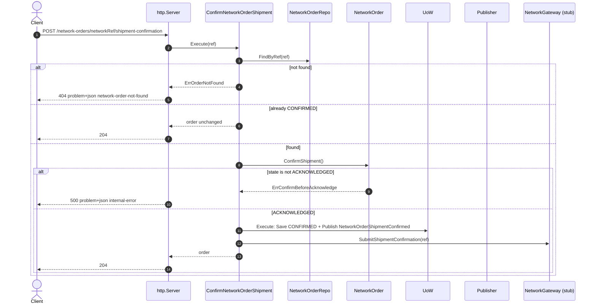
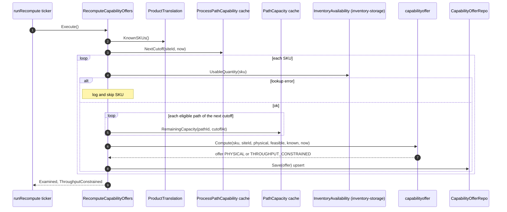
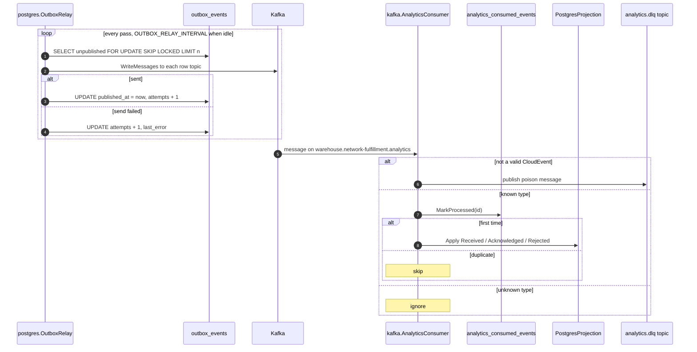

# Sequence diagrams

:::info[Synced from network-fulfillment]
This page is a copy of [`docs/ddd/sequence-diagrams.md`](https://github.com/IQVO/network-fulfillment/blob/develop/docs/ddd/sequence-diagrams.md) on `develop`, derived from that repository's code. Edit it there, then re-sync.
:::

UML sequence diagrams for every command use case, derived from the use-case
function bodies in `internal/application/usecases/`. `UoW` is
`ports.UnitOfWork`, which is `postgres.UnitOfWork` when `DATABASE_URL` is
set. Without Postgres, `atomically` calls the function directly and there
is no transaction. `Publisher` is the wired `ports.EventPublisher`:

- the outbox publisher, which writes `outbox_events` rows for both topics
  inside the transaction;
- the direct Kafka fan-out, when there is no database;
- the log publisher, when `EVENT_PUBLISHER` is unset.

There is no idempotency-key middleware and no optimistic-concurrency
version check anywhere in this context. Idempotency comes from the state
checks shown below.

## 1. ReceiveNetworkDemand (poller)

Source: `internal/application/usecases/receive_network_demand.go`,
`internal/adapters/inbound/poller/poller.go`,
`internal/application/usecases/unit_of_work.go`.

Omitted: the error branches return early. A failed `RaiseHeldOrder` returns
`raise held order: ...` with the order already saved `NEW`. A failed submit
returns `submit acknowledgement` or `submit rejection` after the record has
committed. Any error leaves the demand to be re-polled; the stub keeps it
pending until `SubmitAcknowledgement`. A non-`ErrUnknownProduct`
translation error aborts without saving anything.

## 2. ReconcileSubmittedOrders (ticker, POLL_INTERVAL)

Source: `internal/application/usecases/reconcile_submitted_orders.go`,
`cmd/netfulfil/main.go` (`runReconcile`),
`internal/adapters/outbound/network/gateway.go` (`StubGateway.SubmissionStatus`).

Omitted: release and cancel run only when a `localOrderId` is linked, which
is always the case on this path. The stub reconciles any acknowledged
ref to `SUCCESS` immediately, so in stub mode `FAILURE` never occurs. A
per-order error is skipped and not counted.

## 3. SweepAcknowledgementDeadlines and RejectOverdueOrders (tickers, SWEEP_INTERVAL)

Source: `internal/application/usecases/sweep_acknowledgement_deadlines.go`,
`reject_overdue_orders.go`, `cmd/netfulfil/main.go` (`runSweep`,
`runRejectOverdue`).

Omitted: the sweep's publish is **not** wrapped in a UoW, because it is not
a state change. A per-order failure in either pass is skipped and retried
on the next pass. Nothing is sent to the network.

## 4. ConfirmNetworkOrderShipment (REST)

Source: `internal/application/usecases/confirm_network_order_shipment.go`,
`internal/adapters/inbound/http/server.go` (`handleConfirmShipment`),
`internal/adapters/inbound/http/errors.go`.

Omitted: an empty `networkRef` returns 422 (`ErrEmptyNetworkRef`). A failed
`SubmitShipmentConfirmation` returns 500 after the record has committed;
a retry is then a no-op that returns 204 without re-submitting. The 500
for `ErrConfirmBeforeAcknowledge` happens because `statusFor` has no case
for it. The route is registered only when `ConfirmShipment` is wired,
which `cmd/netfulfil` always does. CORS allows only `GET/OPTIONS`, so a
browser cannot call this route cross-origin.

## 5. RecomputeCapabilityOffers (ticker, RECOMPUTE_INTERVAL)

Source: `internal/application/usecases/recompute_capability_offers.go`,
`internal/domain/capabilityoffer/capability_offer.go`,
`cmd/netfulfil/main.go` (`wireCapabilityOffer`, `runRecompute`).

Omitted: there is no UoW and no event. The whole use case is wired only
with `CAPABILITY_OFFER_ENABLED=true`, after both caches pass `WaitReady`.
When `NextCutoff` reports no schedule, the capacity loop is skipped and
`known=false`.

## 6. Outbox relay and analytics projection

Source: `internal/adapters/outbound/postgres/outbox_relay.go`,
`outbox_publisher.go`, `internal/adapters/inbound/kafka/analytics_consumer.go`,
`internal/adapters/outbound/analyticsstore/`.

Omitted: the relay runs only with both `DATABASE_URL` and
`EVENT_PUBLISHER=kafka`. Phase retries (up to 3, with exponential backoff)
precede a DLQ on infrastructure errors. `cmd/netfulfil-reports` reads
`acknowledgement_rollup` over a read-only pool.
