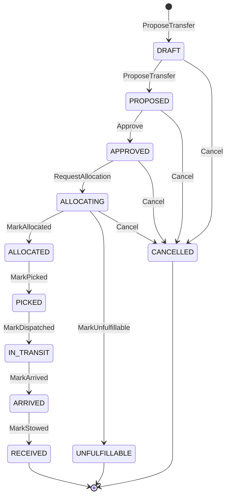

# Aggregate design canvas

:::info[Authored in warehouse-docs]
`network-inventory-planning` does not yet ship a `docs/docs/ddd/` pack, so this page was written here from the repository's code and ADRs on `develop` (commit `8d25980`) instead of being synced. When the repository publishes its pack, replace this page with a synced copy.
:::

Following the ddd-crew [Aggregate Design Canvas v1.1](https://github.com/ddd-crew/aggregate-design-canvas).
This context has **one aggregate**, `InterWarehouseTransfer`. The planner, the
planning snapshot and the read models are not aggregates; see the last section.

## InterWarehouseTransfer

### 1. Name

`InterWarehouseTransfer` (package `internal/domain/transfer`, file `saga.go`
and `workflow.go`). Identity `TransferID`, minted as `trf-<uuid>` by the approval
use case.

### 2. Description

A first-class, event-sourced saga: an operator-approved plan to move a quantity of
one SKU from an origin site to a destination site. It references the origin
reservation and the physical facts and owns neither; every field is unexported and
changes only through the command methods, so an illegal transition is impossible
without going through the state machine
([ADR 0003](https://github.com/IQVO/network-inventory-planning/blob/develop/docs/docs/adr/0003-transfer-saga.md),
[ADR 0005](https://github.com/IQVO/network-inventory-planning/blob/develop/docs/docs/adr/0005-work-demand-release-and-fact-transitions.md)).

### 3. State Transitions

The first two transitions happen inside `ProposeTransfer`, and the approval use
case then applies `Approve` and `RequestAllocation` in the same unit of work, so a
fresh approval is persisted already in `ALLOCATING`. `RECEIVED`, `UNFULFILLABLE`
and `CANCELLED` are terminal (`TransferState.NonTerminal`).

### 4. Enforced Invariants

- Origin and destination must differ; quantity is positive; policy version,
  proposal as-of, clock, idempotency key and expiry are required; the expiry must
  be after now (`ErrProposalExpired`).
- `Approve` is legal only from `PROPOSED` and strictly before `expires_at`.
- Every illegal transition returns `IllegalTransitionError` and mutates nothing.
- `MarkAllocated` accepts a reply only if its line is `<transfer_id>:1`, origin and
  SKU match, a reservation id exists, every allocation names a stock unit, a bin and
  a positive quantity, the allocations sum to the transfer quantity, and an expiry
  is present. Any mismatch is a deterministic error.
- `MarkUnfulfillable` accepts only the closed reasons and the matching line.
- `MarkPicked`: from `ALLOCATED` only; a picked quantity of zero or above the
  allocated quantity is `ErrFactRefused`; a short pick is recorded, not refused.
- `MarkArrived` is legal from `IN_TRANSIT` only, and either `TransferArrived` or
  `TransferReceiptStaged` may trigger it; whichever comes first wins.
- `MarkStowed`: from `ARRIVED` only, the fact must name this line, destination and
  SKU, with a positive stowed quantity and at least one allocation.
- `Cancel` is legal only from `DRAFT`, `PROPOSED`, `APPROVED` or `ALLOCATING`, and
  requires a reason. From `ALLOCATED` onwards it is an illegal transition: the
  saga must not silently forget a hold inventory-storage keeps.
- The audit trail is append-only; the transfer-level idempotency key is unique.
- Persistence mirrors the rules as CHECK constraints: closed state enum,
  `origin_site_id <> destination_site_id`, a reservation id only from `ALLOCATED`
  onwards, and a picked quantity only from `PICKED` onwards and never above the
  planned quantity.

### 5. Corrective Policies

- **Replies and facts that cannot apply** (unknown transfer, illegal transition,
  refused fact) are logged and committed past, never retried: the same payload
  would refuse the same way.
- **Transient failures** (database, transaction) return an error and the consumer
  retries the same message with capped exponential backoff, 200 ms up to 5 s.
- **A fact for a `transfer_ref` this deployment never approved** is logged at WARN
  and committed past.
- **Stuck transfers** are only observed. The health ticker emits
  `TransferStuckDetected`; it never cancels, retries or releases a reservation.
- **A reservation expiry** is recorded (`allocation_expires_at`) but no policy acts
  on it yet; releasing an allocated transfer is a later phase's explicit revocation.

### 6. Handled Commands

| Command | Entry point | Method |
| --- | --- | --- |
| Approve a proposal | `POST /v1/transfers:approve` | `ProposeTransfer`, `Approve`, `RequestAllocation` |
| Apply allocation reply | Kafka `TransferStockAllocated` | `MarkAllocated` |
| Apply rejection reply | Kafka `TransferStockAllocationRejected` | `MarkUnfulfillable` |
| Apply pick fact | Kafka `TransferPicked` | `MarkPicked` |
| Apply dispatch fact | Kafka `TransferDispatched` | `MarkDispatched` |
| Apply arrival fact | Kafka `TransferArrived` or `TransferReceiptStaged` | `MarkArrived` |
| Apply stow fact | Kafka `TransferStockStowed` | `MarkStowed` |
| Cancel | none: `Cancel` exists on the aggregate and is exercised only by tests; no use case, route or tool calls it | `Cancel` |

### 7. Created Events

| Domain event | Raised by | Wire type |
| --- | --- | --- |
| `PlanApproved` | `Approve` | `...transfer.TransferPlanApproved` |
| `AllocationRequested` | `RequestAllocation` | `...transfer.TransferAllocationRequested` |
| `DemandReleased` (pick) | the allocation-reply use case, after `MarkAllocated` | `...workdemand.WorkDemandReleased` |
| `DemandReleased` (dispatch) | the pick-fact use case, after `MarkPicked` | `...workdemand.WorkDemandReleased` |
| `StateAdvanced` | every audit entry, derived by `StateAdvancedSince` | `...saga.TransferStateAdvanced` (analytics topic) |

The aggregate does not raise `TransferProposed`, `TransferPicked` and the like as
integration events; the consumed facts are inputs, and each transition is recorded
in the audit trail instead.

### 8. Throughput (estimate)

One transfer is one operator approval, four integration events published
(`TransferPlanApproved`, `TransferAllocationRequested` and the two work demands),
up to five inbound replies and facts, and one analytics occurrence per audit entry.
The approval path is bounded by the operator, and the relay's drain rate bounds
delivery (ADR 0003). There is no measured throughput in the repository, so none is
claimed here.

### 9. Size (estimate)

One row in `inter_warehouse_transfer` per transfer, nine audit rows per
completed transfer, and JSONB columns for allocations and stow allocations. No
size measurement exists in the repository.

## Not aggregates: read models, value objects and services

- `planning.SiteCapability`, `planning.SiteSkuDemand` and
  `planning.PublishedCapacityPlan` are **local read-model facts**, upserted by
  consumers with last-writer-wins rules. They carry no behaviour beyond validation
  and `Supersedes`.
- `planning.PlanningSnapshot` and `BuildSnapshot` are a **domain service** with
  its result value: pure, clock-injected, fail-closed.
- `transfer.Planner`, `Position`, `Policy`, `Lane`, `Proposal` and `ScoreBreakdown`
  are **value objects and a domain service**: deterministic, with no identity and
  no persistence.
- `transfer.ValidateApproval`, `StuckCheck` and `StuckThresholds` are pure domain
  services.
- `transfer.RebalanceRun` is a persisted **record** of a scheduled pass, not an
  aggregate: it has no behaviour and no invariants beyond its outcome.
