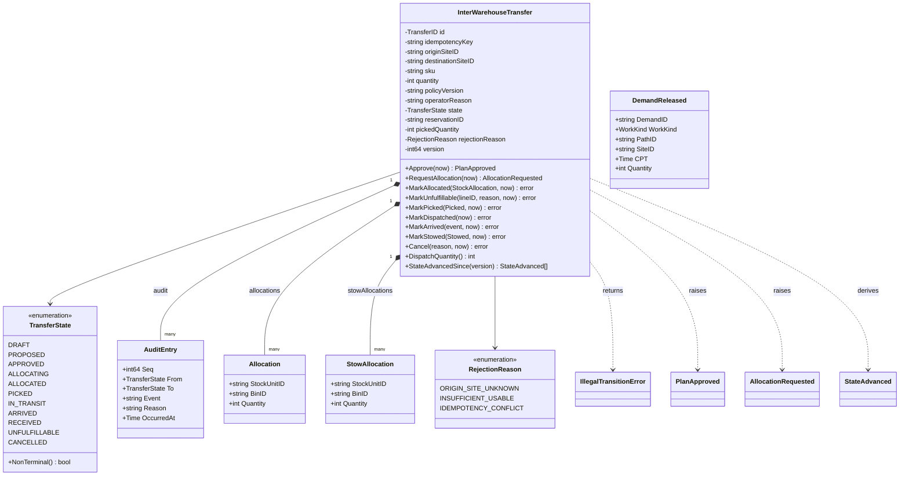
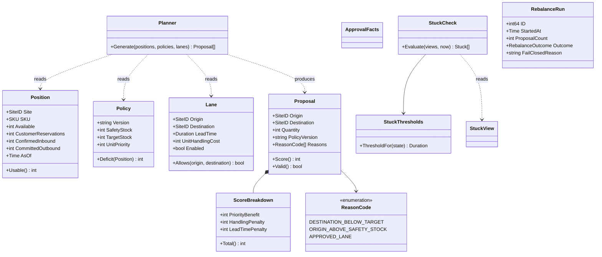
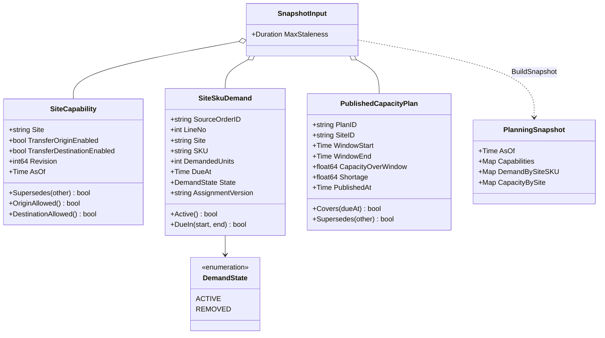
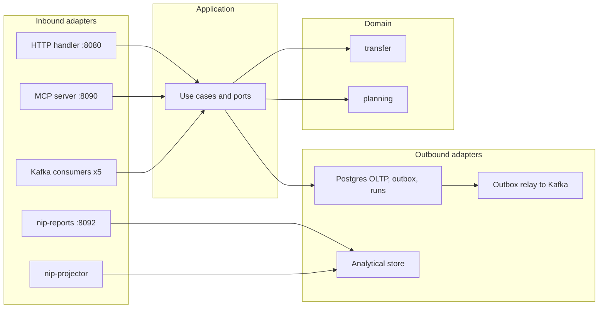

# Class diagrams

:::info[Authored in warehouse-docs]
`network-inventory-planning` does not yet ship a `docs/docs/ddd/` pack, so this page was written here from the repository's code and ADRs on `develop` (commit `8d25980`) instead of being synced. When the repository publishes its pack, replace this page with a synced copy.
:::

UML class diagrams of `internal/domain/**`, split by package, then the ports and
adapters around them. Only types and methods that exist on `develop` are drawn;
trivial getters are summarised. Fields of `InterWarehouseTransfer` are unexported
in the code and shown as attributes for readability.

## Package `transfer`: the saga aggregate

Source: `internal/domain/transfer/saga.go`, `workflow.go`, `events.go`,
`analytics.go`. `DemandReleased` is built by the use cases from a loaded transfer,
not raised by the aggregate. Omits: `ProposalInput`, `Snapshot`/`Rehydrate`
(persistence support) and the plain getters.

## Package `transfer`: planner, approval, stuck detection and runs

Source: `internal/domain/transfer/model.go`, `planner.go`, `approval.go`,
`stuck.go`, `analytics.go`. `ValidateApproval` is a package function over
`ProposalInput` and `ApprovalFacts`, not a type. Omits: the `Snapshot` and `Stuck`
result structs.

## Package `planning`: local read-model facts and the snapshot

Source: `internal/domain/planning/capability.go`, `demand.go`, `capacity_plan.go`,
`snapshot.go`. `BuildSnapshot` is a package function. Omits: the constructors with
their validation (`NewSiteCapability`, `NewSiteSkuDemand`,
`NewPublishedCapacityPlan`).

## Ports and adapters

```mermaid
classDiagram
  class TransferRepository {
    <<interface>>
    +Create(transfer, key) existing
    +Load(id) transfer
    +UpdateState(transfer)
  }
  class TransferQuery {
    <<interface>>
    +Get(id)
    +List(filter)
  }
  class TransferEventPublisher {
    <<interface>>
    +Publish(events)
  }
  class PlanningSnapshotRepository {
    <<interface>>
    +Load() facts
  }
  class ProcessedEventRepository {
    <<interface>>
    +Claim(consumer, eventID) bool
  }
  class UnitOfWork {
    <<interface>>
    +Do(fn) error
  }
  class RebalanceRunRepository {
    <<interface>>
    +Record(run) id
    +List(limit)
  }
  class StuckTransferReader {
    <<interface>>
    +ListNonTerminal()
  }
  class ApproveTransfer
  class SimulateTransferOptions
  class GenerateTransferProposals
  class RunScheduledRebalance
  class CheckStuckTransfers
  class GetTransfer
  class ListTransfers
  class FindStuckTransfers
  class TransferRepo
  class TransferQueryRepo
  class OutboxWriter
  class OutboxRelay
  class SnapshotRepo
  class RebalanceRunRepo
  class Handler
  class Deps
  class TransferReplyConsumer
  class TransferFactConsumer
  ApproveTransfer --> TransferRepository
  ApproveTransfer --> TransferEventPublisher
  ApproveTransfer --> PlanningSnapshotRepository
  ApproveTransfer --> UnitOfWork
  SimulateTransferOptions --> PlanningSnapshotRepository
  RunScheduledRebalance --> RebalanceRunRepository
  RunScheduledRebalance --> TransferEventPublisher
  CheckStuckTransfers --> StuckTransferReader
  GetTransfer --> TransferQuery
  ListTransfers --> TransferQuery
  FindStuckTransfers --> TransferQuery
  TransferRepo ..|> TransferRepository
  TransferQueryRepo ..|> TransferQuery
  OutboxWriter ..|> TransferEventPublisher
  SnapshotRepo ..|> PlanningSnapshotRepository
  RebalanceRunRepo ..|> RebalanceRunRepository
  Handler --> ApproveTransfer
  Handler --> SimulateTransferOptions
  Handler --> GenerateTransferProposals
  Handler --> GetTransfer
  Handler --> ListTransfers
  Deps --> GetTransfer
  Deps --> ListTransfers
  Deps --> FindStuckTransfers
  Deps --> SimulateTransferOptions
  TransferReplyConsumer --> UnitOfWork
  TransferFactConsumer --> UnitOfWork
```

Source: `internal/application/ports/*.go`, `internal/application/usecases/*.go`,
`internal/adapters/**`. Class names are the code's identifiers; the adapters live in
`inbound/http` (`Handler`), `inbound/mcp` (`Deps`, which carries the tool use
cases), `inbound/kafka` and `outbound/postgres`. `OutboxWriter` and `OutboxRelay`
both work on the `outbox_events` table: the writer inserts inside the use case's
transaction, the relay drains it afterwards. Omits: the analytics store, projector and reports (they are a
separate read side, see below), the consumers for the three read models and the
use cases that apply replies and facts.

## Hexagonal view

Source: `cmd/network-inventory-planning/main.go`, `cmd/mcp/main.go`,
`cmd/nip-projector/main.go`, `cmd/nip-reports/main.go`. The domain imports no
adapter; the architecture fitness tests in `internal/architecture` enforce the
layering. The reports and the projector are a separate read side over a second
database and use no OLTP use case.
