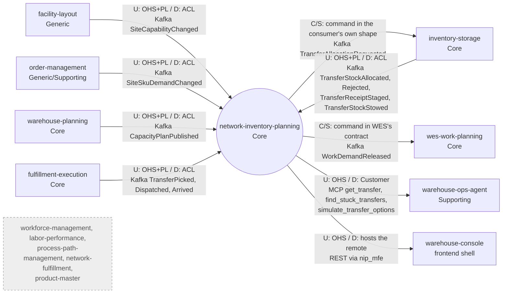

# Context map

:::info[Authored in warehouse-docs]
`network-inventory-planning` does not yet ship a `docs/docs/ddd/` pack, so this page was written here from the repository's code and ADRs on `develop` (commit `8d25980`) instead of being synced. When the repository publishes its pack, replace this page with a synced copy.
:::

This context's slice of the fleet map, following ddd-crew
[Context Mapping](https://github.com/ddd-crew/context-mapping). Solid edges are
live Kafka or REST/MCP edges in code, dotted edges are wired but only on in the
reference deployment's configuration or only partly used, and the grey nodes are
deliberately absent relationships. Neighbour classifications come from the
[fleet context map](/strategic-design/context-map) and
[Subdomain Classification](/strategic-design/subdomain-classification).

Source: `internal/adapters/inbound/kafka/consumers.go`,
`transfer_reply_consumer.go`, `transfer_fact_consumer.go`,
`internal/adapters/outbound/kafka/publisher.go`,
`internal/adapters/inbound/mcp/tools.go`, `web/vite.config.ts`, ADRs 0002, 0003,
0005, 0008, 0010; on the sibling side `inventory-storage`
`cmd/inventory/transfer.go`, `wes-work-planning`
`internal/adapters/inbound/kafka/consumer.go`, `fulfillment-execution`
`internal/adapters/outbound/kafka/publisher.go`, `warehouse-ops-agent` ADR 0019
and `warehouse-console` `src/App.tsx` (all on `develop`).
Omits: this context's own analytics topic, projector and reports (internal, not
a context relationship), the dead-letter topic, and the Kafka broker, Kong and
Nginx infrastructure.

## Relationships

| # | Upstream | Downstream | Patterns (U / D) | Technology | Status | Evidence |
| --- | --- | --- | --- | --- | --- | --- |
| 1 | `facility-layout` | `network-inventory-planning` | OHS + Published Language / Anti-Corruption Layer: the payload is hand-mirrored (`siteCapabilityChangedData`) into a last-writer-wins `site_capability` row | Kafka `warehouse.facility.events`, `com.warehouse.wms.facility-layout.site.SiteCapabilityChanged` | **Live** when `SITE_CAPABILITY_CONSUMER_GROUP` is set (it is in the reference deployment); unset means no consumer | `internal/adapters/inbound/kafka/consumers.go`; `warehouse-infra` `terraform/network-inventory-planning.tf` |
| 2 | `order-management` | `network-inventory-planning` | OHS + PL / ACL: one order line becomes a `site_sku_demand` row, `REMOVED` tombstones it | Kafka `warehouse.order-management.events`, `com.warehouse.wes.order-management.siteskudemand.SiteSkuDemandChanged` | **Live** when `SITE_SKU_DEMAND_CONSUMER_GROUP` is set (set in the reference deployment) | `consumers.go` (`siteSkuDemandChangedData`) |
| 3 | `warehouse-planning` | `network-inventory-planning` | OHS + PL / ACL: a plan is kept per `plan_id`; a legacy event without the additive `site_id` is excluded, never inferred | Kafka `warehouse.warehouse-planning.events`, `com.warehouse.wes.warehouse-planning.capacityplan.CapacityPlanPublished` | **Live** when `CAPACITY_PLAN_CONSUMER_GROUP` is set (set in the reference deployment) | `consumers.go` (`capacityPlanPublishedData`) |
| 4 | `network-inventory-planning` | `inventory-storage` | Customer/Supplier: the command's data is exactly the five fields inventory-storage's consumer defines, so this side conforms to its shape | Kafka `warehouse.network-inventory-planning.events`, `com.warehouse.wes.network-inventory-planning.transfer.TransferAllocationRequested`, key `transfer_line_id` | **Live** on the consumer side only when `TRANSFER_ALLOCATION_CONSUMER_MODE=kafka` (default `off`; set in the reference deployment's `helm-values/inventory-storage.yaml`) | this repo: `internal/domain/transfer/events.go`, outbox encoder; there: `cmd/inventory/transfer.go` ([ADR 0003](https://github.com/IQVO/network-inventory-planning/blob/develop/docs/docs/adr/0003-transfer-saga.md)) |
| 5 | `inventory-storage` | `network-inventory-planning` | OHS + PL / ACL: replies and facts are hand-mirrored, never imported; closed rejection vocabulary | Kafka `warehouse.inventory.events`: `...reservation.TransferStockAllocated`, `...reservation.TransferStockAllocationRejected`, `...stock.TransferReceiptStaged`, `...stock.TransferStockStowed` | **Live** when `TRANSFER_REPLY_CONSUMER_GROUP` is set (set in the reference deployment) | `transfer_reply_consumer.go`; [ADR 0003](https://github.com/IQVO/network-inventory-planning/blob/develop/docs/docs/adr/0003-transfer-saga.md), [ADR 0005](https://github.com/IQVO/network-inventory-planning/blob/develop/docs/docs/adr/0005-work-demand-release-and-fact-transitions.md) |
| 6 | `network-inventory-planning` | `wes-work-planning` | Customer/Supplier: the payload mirrors WES's consumed contract; WES validates `path_id` against its own PathCatalogue and enqueues one work unit under `demand_id` | Kafka `warehouse.network-inventory-planning.events`, `com.warehouse.wes.network-inventory-planning.workdemand.WorkDemandReleased` (pick and dispatch legs; `TRANSFER_ARRIVAL` is never released) | **Live** on the consumer side: it is the fifth topic of `wes-work-planning`'s always-on consumer, with a `.dlq` per topic | `internal/application/usecases/transfer_facts.go`; there: `internal/adapters/inbound/kafka/consumer.go` (`handleNetworkDemandEvent`), its ADR 0033 |
| 7 | `fulfillment-execution` | `network-inventory-planning` | OHS + PL / ACL: `TransferFactData` is hand-mirrored | Kafka `warehouse.fulfillment.events`, `com.warehouse.wes.fulfillment-execution.transfer.TransferPicked`, `...TransferDispatched`, `...TransferArrived` (the last is **reserved**: scan-driven receiving can bypass it) | **Live** when `TRANSFER_FACT_CONSUMER_GROUP` is set (set in the reference deployment) | `transfer_fact_consumer.go`; there: `internal/adapters/outbound/kafka/publisher.go` |
| 8 | `network-inventory-planning` | `warehouse-ops-agent` | OHS / Customer: the agent's client port exposes the four read tools and has no write method; a zero-write fitness test guards it | MCP Streamable HTTP, read tools only | **Live** when the agent's `NETWORK_INVENTORY_PLANNING_MCP_ENDPOINT` is set (set in the reference deployment when MCP servers are deployed); empty means no client and the transfer-watch routes answer 503 | `internal/adapters/inbound/mcp/tools.go`; agent ADR [0019](https://github.com/IQVO/warehouse-ops-agent/blob/develop/docs/docs/adr/0019-network-inventory-planning-transfer-watch.md) |
| 9 | `network-inventory-planning` | `warehouse-console` | OHS; the console only hosts this context's own Module Federation remote `nip_mfe`, which calls this service's REST API through Kong | REST `/api/network-inventory-planning` | **Live**. Kong's CORS plugin must allow `Idempotency-Key` for the Approve action (the reference deployment's `kong-cors.tf` does) | `web/src/api.ts`, `web/vite.config.ts`; console `src/App.tsx`; [ADR 0010](https://github.com/IQVO/network-inventory-planning/blob/develop/docs/docs/adr/0010-console-remote-nip-mfe.md) |
| 10 | `workforce-management`, `labor-performance`, `process-path-management`, `network-fulfillment`, `product-master` | none | **Separate Ways** | none | **Deliberately absent**: no reference to this context in their `internal`, `cmd` or `apis` on `develop`, and none to them here | `git grep` on each `origin/develop` |

`TransferPlanApproved` is published and has no consumer anywhere in the fleet.
There is no Shared Kernel, no Partnership and no Conformist relationship in the
strict sense: no sibling Go package is imported, and every inbound payload is
translated locally. Rows 4 and 6 are the nearest to conformance, because the
contracts there are defined by the receiver and this side adopts them
verbatim, which is the right call for a command.

One indirect dependency worth knowing: the pick and dispatch `path_id` values are
configuration (`TRANSFER_PICK_PATH_ID`, `TRANSFER_DISPATCH_PATH_ID`). They must name
paths in `wes-work-planning`'s catalogue, which is fed by `process-path-management`.
That is a deployment prerequisite, not an edge: this context never reads
`process-path-management`.
