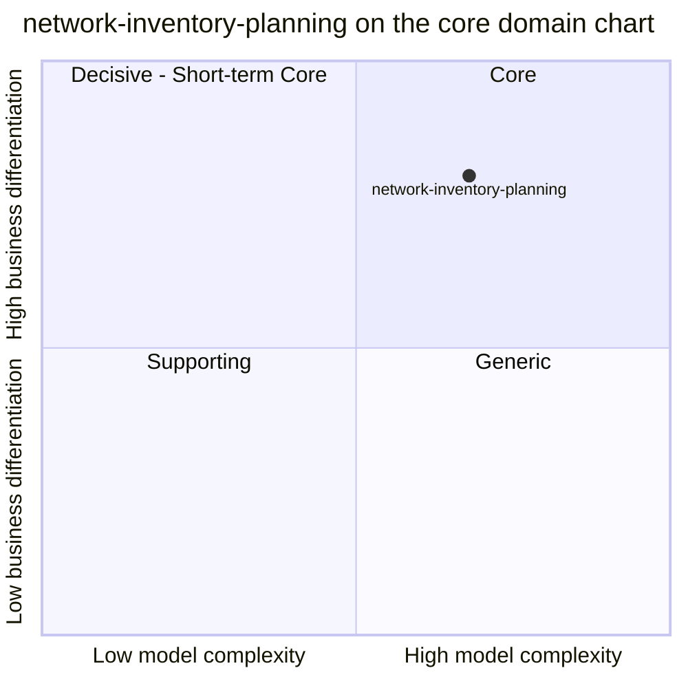

# Core domain chart

:::info[Authored in warehouse-docs]
`network-inventory-planning` does not yet ship a `docs/docs/ddd/` pack, so this page was written here from the repository's code and ADRs on `develop` (commit `8d25980`) instead of being synced. When the repository publishes its pack, replace this page with a synced copy.
:::

Following the ddd-crew [Core Domain Charts](https://github.com/ddd-crew/core-domain-charts):
business differentiation on the vertical axis, model complexity on the
horizontal axis. The coordinates are a judgement from the evidence below, not a
measurement.

Source: `docs/docs/adr/0001-network-inventory-planning-boundary.md`,
`0002`, `0003`, `0005`, `internal/domain/transfer/*.go`,
`internal/domain/planning/*.go`.
Omits: the sibling contexts (their own charts place them) and the
sub-capabilities of this context, which are not classified separately anywhere.

## Classification: Core

[ADR 0001](https://github.com/IQVO/network-inventory-planning/blob/develop/docs/docs/adr/0001-network-inventory-planning-boundary.md)
creates the context as "a WES-core bounded context", and the fleet
classification agrees. The point sits in the top-right quadrant (Core).

**Business differentiation is high (y = 0.80).** No other fleet context decides
whether stock should move between warehouses. `inventory-storage` holds stock
per site but has no view across sites, `order-management` knows demand but not
supply, and `warehouse-planning` knows throughput but not stock. The ability to
recommend a transfer with a reproducible explanation, and then carry it to the
destination without a distributed transaction, is the kind of decision a
network operator competes on. The position is held back from the top by what is
not built: there is no forecasting, no optimisation, and the planner only
sees an explicit snapshot today.

**Model complexity is high (x = 0.68).** Evidence from the code:

- One saga aggregate with eleven states and a closed transition table
  (`InterWarehouseTransfer`), an immutable audit trail, optimistic-concurrency
  versioning and a transfer-level idempotency key.
- A fail-closed `BuildSnapshot` with three read models, last-writer-wins rules on
  three different keys (`capability_revision`, the CloudEvents time, the order
  line), half-open window arithmetic and exclusion rules that must never
  zero-fill.
- Five Kafka consumers, a transactional outbox with a relay that preserves per-key
  order, and rules that make each transition and its outbox rows commit in one
  unit of work.
- Contracts mirrored exactly from three siblings (`inventory-storage`,
  `wes-work-planning`, `fulfillment-execution`) without importing their types.
- A second, analytical database with its own projector and reports.

It is not further right because the planning itself is a small deterministic
calculation (a minimum of surplus and deficit, then a sort), with no search,
forecast or solver. It is not further up because nothing here is yet tuned
against measured outcomes.

## Evolution

**Custom-built**, early in its life. The context was created on 2026-10-06 and
has grown through four phases in a few days: read models and simulation (ADR 0002),
the approval saga (ADR 0003), work release and the physical tail (ADR 0005),
observability and scheduled runs (ADR 0007), then a read side, analytics and a
console remote (ADRs 0008 to 0010). Several parts are explicit simplifications: a
single-line transfer, a flat 24-hour approval expiry, site-level approval
checks, and a scheduled run that cannot yet propose anything. Nothing here is a
product or a commodity; it should stay custom-built while the unbuilt parts of
the plan (forecasting, lane and policy catalogue, cancellation after
allocation) are decided one ADR at a time.
