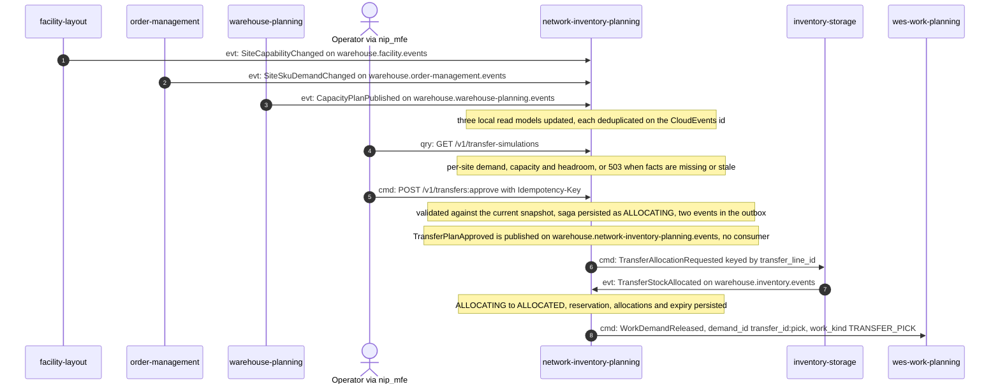
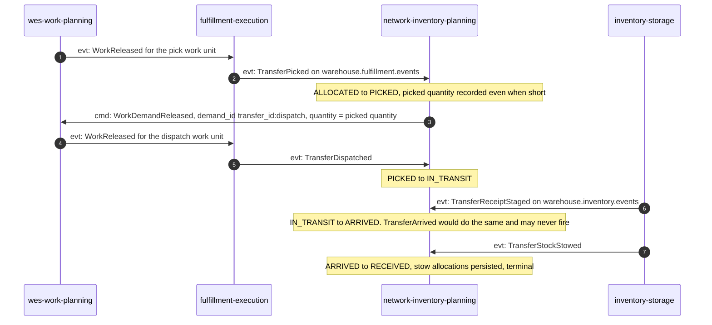
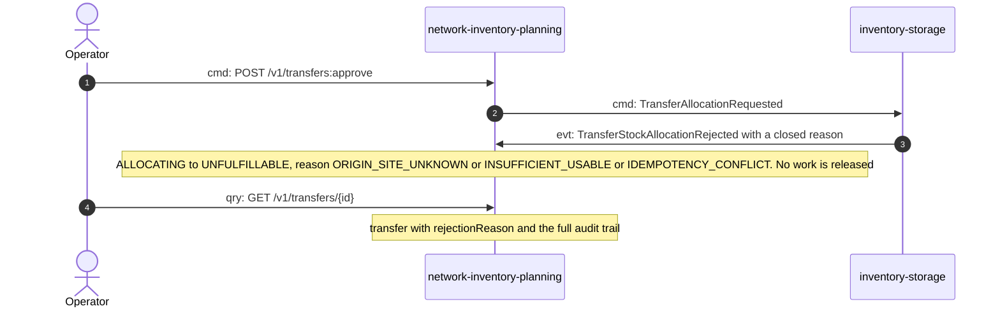
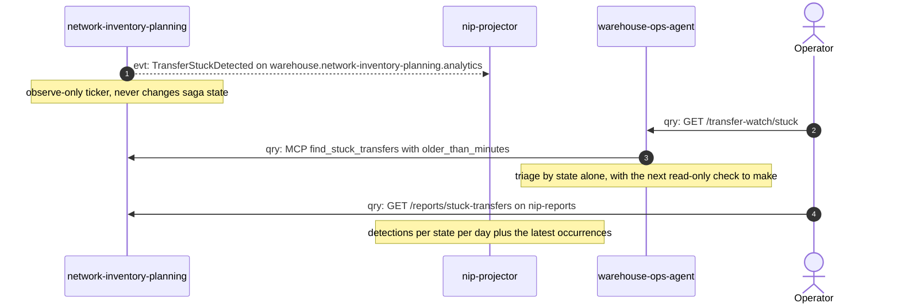

# Domain message flow

:::info[Authored in warehouse-docs]
`network-inventory-planning` does not yet ship a `docs/docs/ddd/` pack, so this page was written here from the repository's code and ADRs on `develop` (commit `8d25980`) instead of being synced. When the repository publishes its pack, replace this page with a synced copy.
:::

Following ddd-crew [Domain Message Flow Modelling](https://github.com/ddd-crew/domain-message-flow-modelling).
Each arrow is numbered and prefixed `cmd:` (command), `evt:` (event) or `qry:`
(query). Only real messages appear: REST routes from the handler, MCP tools from
`tools.go`, and CloudEvents types from the consumers and the encoders. Replies
are shown as notes.

## 1. Facts arrive, an operator approves, stock is reserved, the pick is released

Three siblings publish the facts this context plans from. An operator checks the
advisory simulation and approves. The saga asks `inventory-storage` to reserve
origin stock, and its reply releases the pick work to `wes-work-planning`.

Source: `internal/adapters/inbound/kafka/consumers.go`,
`internal/adapters/inbound/http/handler.go`,
`internal/application/usecases/approve_transfer.go`,
`transfer_facts.go`, `internal/adapters/inbound/kafka/transfer_reply_consumer.go`.
Omits: the outbox relay hop and the analytics copy of each transition.

On the read-model path the simulation is per-site; it does not propose quantities.
The `Proposal` list comes from `POST /v1/transfer-proposals:generate` with an
explicit snapshot. See the open question in the
[Bounded Context Canvas](/contexts/network-inventory-planning/bounded-context-canvas).

## 2. The physical tail: pick, dispatch, arrival, stow

Floor work is done by `fulfillment-execution`. Its facts and `inventory-storage`'s
destination facts drive the saga to `RECEIVED`.

Source: `internal/application/usecases/transfer_facts.go`,
`internal/adapters/inbound/kafka/transfer_fact_consumer.go`,
`transfer_reply_consumer.go`; `wes-work-planning`
`internal/adapters/inbound/kafka/consumer.go` (`handleNetworkDemandEvent`).
Omits: how `wes-work-planning` turns a demand into a `WorkReleased` for
`fulfillment-execution` (that is the existing release path, shown here as one
arrow), and how `inventory-storage` produces its destination facts.
The `TRANSFER_ARRIVAL` work kind exists in the contract, but this context does
not release it.

## 3. Allocation is refused

Source: `internal/domain/transfer/saga.go` (`MarkUnfulfillable`),
`transfer_reply_consumer.go`, `internal/adapters/inbound/http/transfers_read.go`.
Omits: retry. The saga does not retry or re-plan; a refused transfer is terminal
and the operator approves a new one under a new idempotency key.

## 4. Finding a stuck transfer

Source: `internal/application/usecases/saga_health.go`, `periodic.go`,
`internal/adapters/inbound/mcp/tools.go`, `internal/analytics/report/*.go`;
`warehouse-ops-agent` ADR 0019.
Omits: the projector's dead-letter path and the rule that it never dead-letters a
transient failure (ADR 0009). The `Op` to `nip-reports` query is drawn
against `NIP` for brevity; it is served by the separate `cmd/nip-reports` binary on
`:8092`.
