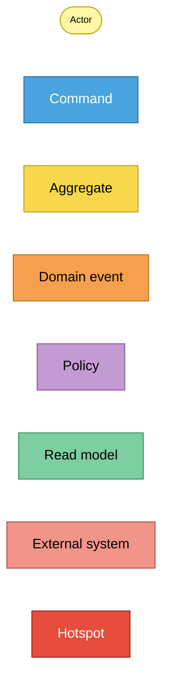
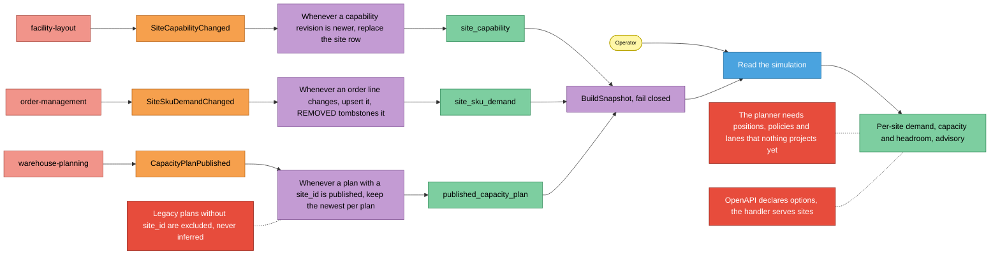
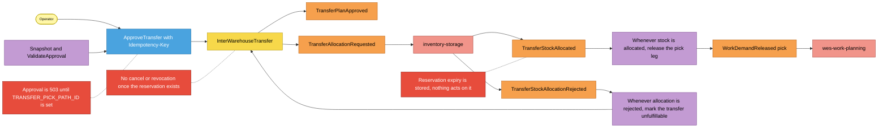
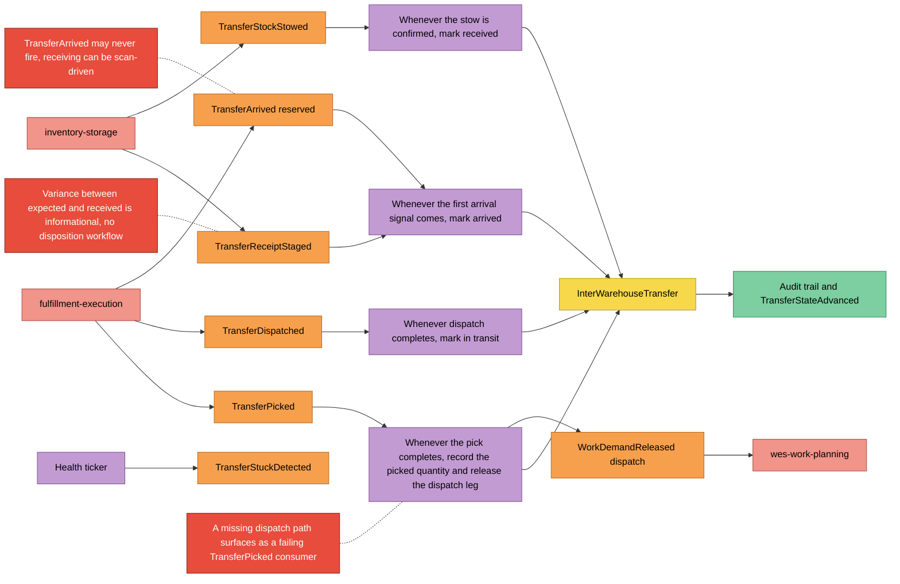

# EventStorming (design level)

:::info[Authored in warehouse-docs]
`network-inventory-planning` does not yet ship a `docs/docs/ddd/` pack, so this page was written here from the repository's code and ADRs on `develop` (commit `8d25980`) instead of being synced. When the repository publishes its pack, replace this page with a synced copy.
:::

Notation from the ddd-crew
[EventStorming glossary and cheat sheet](https://github.com/ddd-crew/eventstorming-glossary-cheat-sheet).
Three processes, each read left to right. Hotspots are real, documented gaps
(ADRs, code comments), not invented ones.

## Legend

Source: ddd-crew cheat-sheet colours as specified for the fleet.
Omits: nothing; this is the key for the three diagrams below.

## 1. Sibling facts become a fail-closed snapshot and an advisory view

Source: `internal/adapters/inbound/kafka/consumers.go`,
`internal/domain/planning/snapshot.go`, `capability.go`, `demand.go`,
`capacity_plan.go`, `internal/application/usecases/simulate_transfer_options.go`,
ADR 0002. Omits: the processed-event claim and offset handling (see the
[sequence diagrams](/contexts/network-inventory-planning/sequence-diagrams)).

## 2. Approve, reserve, release the pick

Source: `internal/application/usecases/approve_transfer.go`,
`transfer_facts.go`, `internal/domain/transfer/saga.go`, `approval.go`, ADRs 0003
and 0005. Omits: the outbox rows and the `TransferStateAdvanced` analytics
occurrence written in each of these transactions.

## 3. Floor facts and destination facts close the transfer

Source: `internal/application/usecases/transfer_facts.go`, `saga_health.go`,
`internal/domain/transfer/workflow.go`, `stuck.go`, ADR 0005 and ADR 0007.
Omits: the out-of-order and unknown-transfer skips, which log and commit past.

## Sticky inventory

- **Read models:** `site_capability`, `site_sku_demand`, `published_capacity_plan`,
  `processed_events`, the `inter_warehouse_transfer` row with `transfer_audit`,
  `rebalance_runs`, and the analytical fact tables (see
  [Entity Relationship](/contexts/network-inventory-planning/entity-relationship)).
- **Hotspots to decide:** the simulation contract drift, a persisted lane and policy
  catalogue so proposals can exist on the read-model path, cancellation or revocation
  after allocation, dispatch-path validation at approval, and per-state dwell time in
  the analytics payload.
- **Not on the board because not built:** forecasting, auto-approval, route
  optimisation, dynamic order-site assignment.
