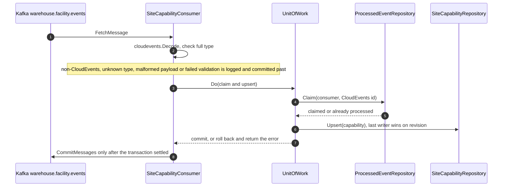
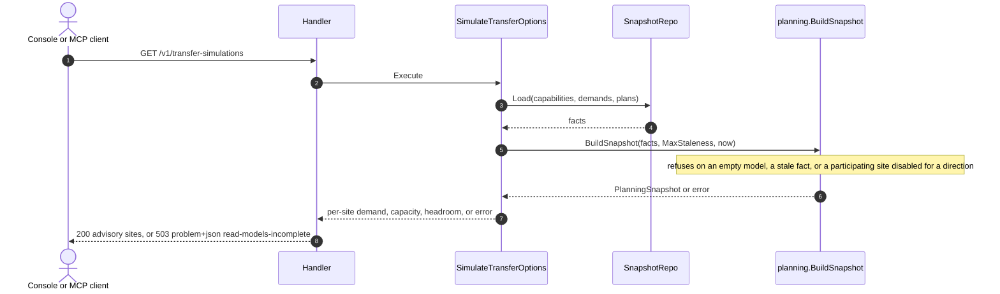
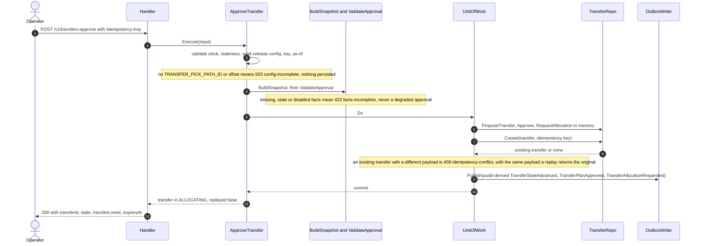
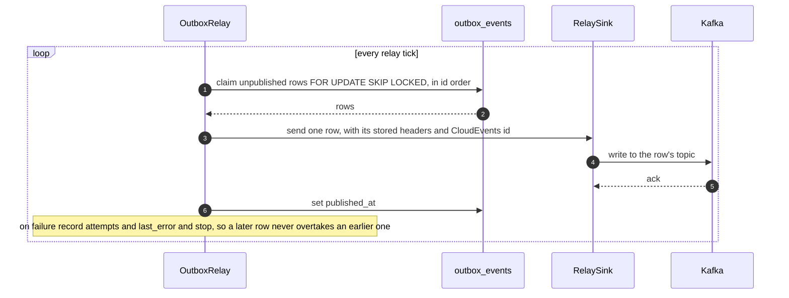
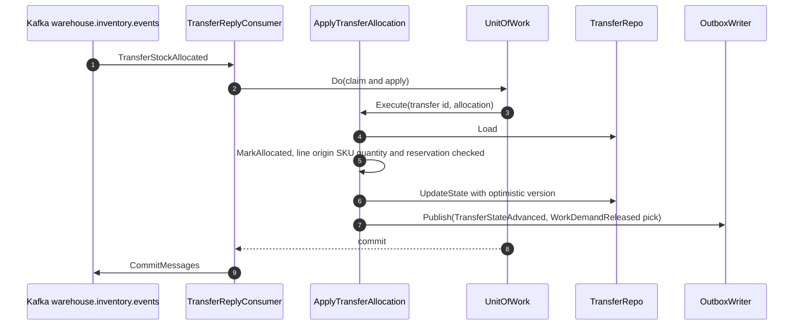
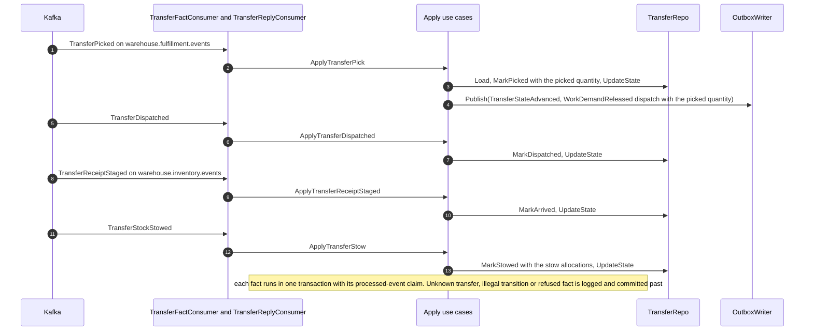
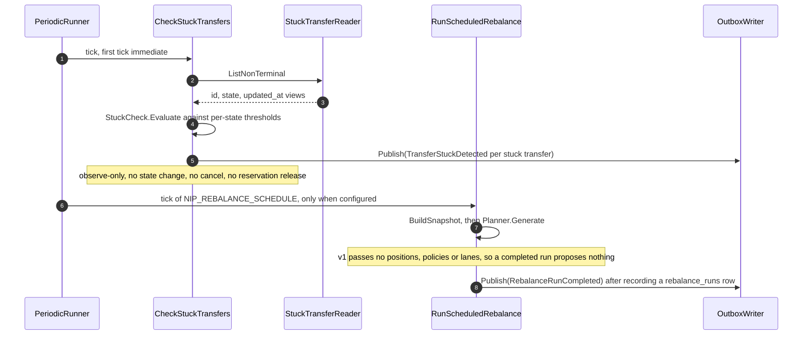
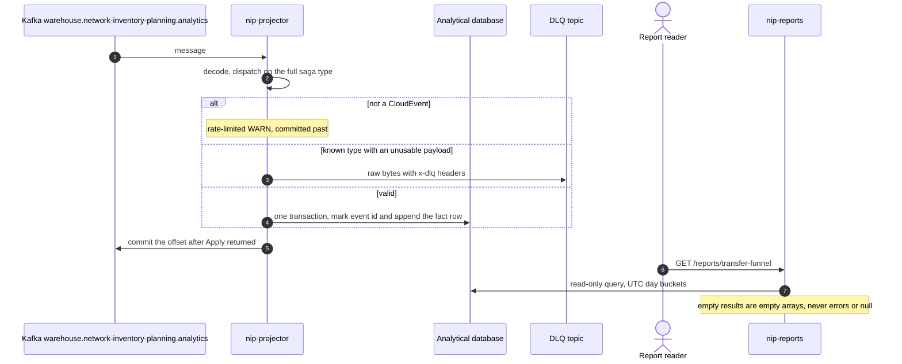

# Sequence diagrams

:::info[Authored in warehouse-docs]
`network-inventory-planning` does not yet ship a `docs/docs/ddd/` pack, so this page was written here from the repository's code and ADRs on `develop` (commit `8d25980`) instead of being synced. When the repository publishes its pack, replace this page with a synced copy.
:::

UML sequence diagrams of the main runtime interactions, derived from the use-case
and adapter code. Replies are shown as notes or dashed returns.

## 1. Project a sibling fact into a read model (Kafka)

All three read-model consumers follow this shape. The example is
`SiteCapabilityChanged`.

Source: `internal/adapters/inbound/kafka/consumers.go`, `kafka.go` (`consumeLoop`).
Omits: the retry loop. A transient error returns non-nil and the same message is
retried with capped exponential backoff, 200 ms up to 5 s, with no attempt limit. The loop also extracts
the W3C `traceparent` header before handling (ADR 0007).

## 2. Advisory simulation (REST and MCP)

Source: `internal/adapters/inbound/http/handler.go` (`simulate`),
`internal/application/usecases/simulate_transfer_options.go`,
`internal/domain/planning/snapshot.go`. An instance without `DATABASE_URL` answers
503 `read-models-unavailable` before reaching the use case. The MCP tool
`simulate_transfer_options` calls the same use case.

## 3. Approve a transfer (REST)

Source: `internal/application/usecases/approve_transfer.go`,
`internal/domain/transfer/saga.go`, `approval.go`,
`internal/adapters/outbound/postgres/transfer_repo.go`, `outbox.go`.
The expiry is a flat 24 hours (`defaultApprovalExpiry`). The three outbox rows
and the aggregate insert commit together or not at all.

## 4. Outbox relay to Kafka

Source: `internal/adapters/outbound/postgres/outbox.go`,
`internal/adapters/outbound/kafka/publisher.go`, ADR 0003. The relay runs when
`OUTBOX_RELAY_ENABLED` is set and `KAFKA_BROKERS` is configured. Without brokers
the rows wait and the endpoint still works. The trace context was injected at
encode time and is forwarded verbatim (ADR 0007).

## 5. Apply the allocation reply and release the pick (Kafka)

Source: `internal/application/usecases/transfer_facts.go`,
`internal/adapters/inbound/kafka/transfer_reply_consumer.go`. The pick demand is
`demand_id = <transfer_id>:pick`, quantity the allocated quantity, `path_id` from
`TRANSFER_PICK_PATH_ID`, `site_id` the origin, `cpt` the reply time plus
`TRANSFER_PICK_CPT_OFFSET`. `TransferStockAllocationRejected` uses the same shape
and calls `MarkUnfulfillable` instead, releasing nothing.

## 6. Apply the pick, dispatch, arrival and stow facts (Kafka)

Source: `internal/application/usecases/transfer_facts.go`,
`transfer_fact_consumer.go`, `transfer_reply_consumer.go`. Omits: the reserved
`TransferArrived`, which calls `MarkArrived` with its own event name; the dispatch
leg's `ValidateDispatch` check, which runs after the transition inside the same unit
of work.

## 7. Stuck check and scheduled rebalance (in-process tickers)

Source: `internal/application/usecases/periodic.go`, `saga_health.go`,
`scheduled_rebalance.go`, ADR 0007. A failed tick is logged and retried at the next
interval. A fail-closed snapshot refusal is recorded as a `FAILED` run with its
reason and publishes nothing.

## 8. Analytics projection and reports

Source: `cmd/nip-projector/main.go`, `internal/adapters/outbound/analyticsstore/*.go`,
`cmd/nip-reports/main.go`, `internal/analytics/report/*.go`, ADR 0009. A transient
failure retries the same message and is never dead-lettered. The five reports are
`transfer-funnel`, `state-dwell`, `stuck-transfers`, `rebalance-runs` and `freshness`.
