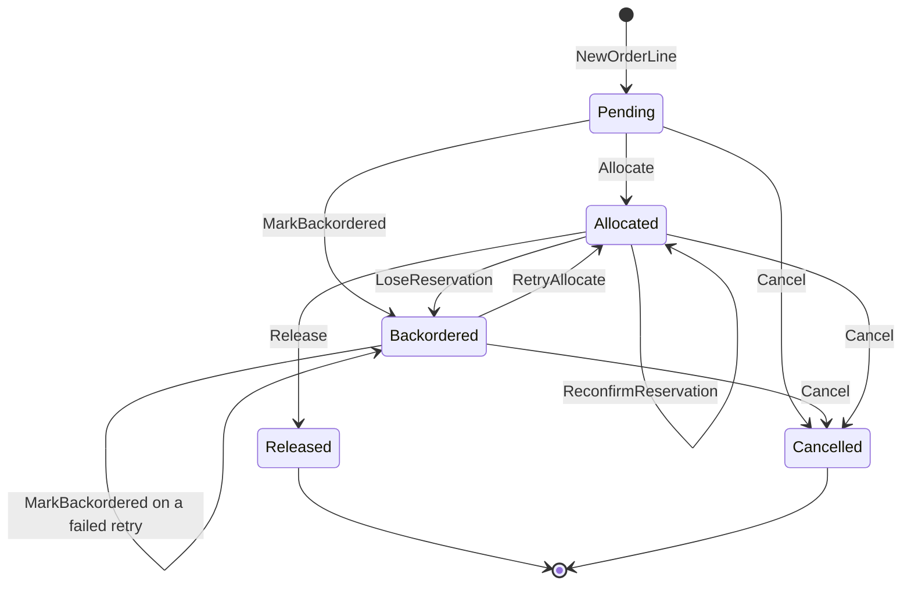
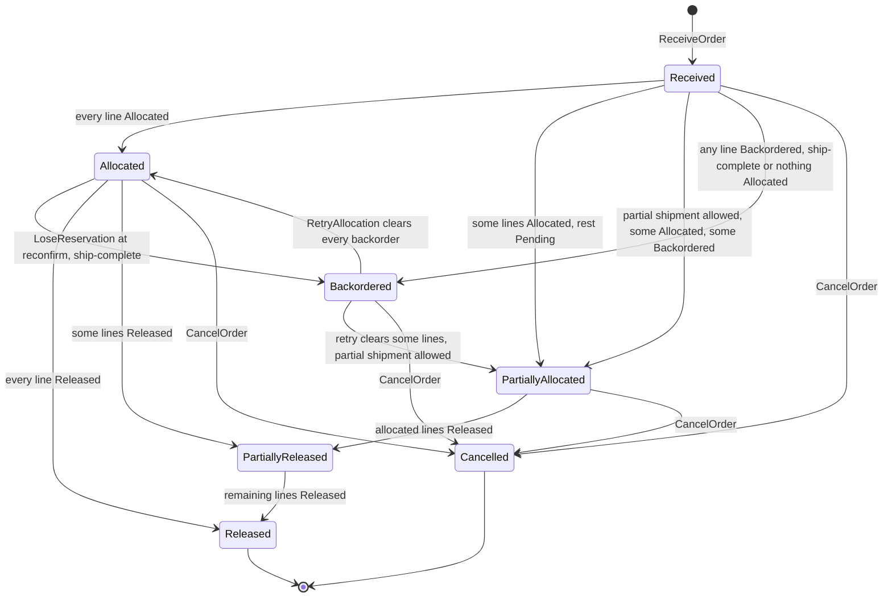

# Aggregate Design Canvas

:::info[Synced from order-management]
This page is a copy of [`docs/docs/ddd/aggregate-design-canvas.md`](https://github.com/IQVO/order-management/blob/develop/docs/docs/ddd/aggregate-design-canvas.md) on `develop`, derived from that repository's code. Edit it there, then re-sync.
:::

This page follows the
[ddd-crew Aggregate Design Canvas v1.1](https://github.com/ddd-crew/aggregate-design-canvas).
It replaces the former "Aggregates & Invariants" page: everything that page
said about invariants, BR3 and BR6 is kept here, re-checked against
`internal/domain/order` on `develop`.

`internal/domain` has exactly **one aggregate root**, `order.Order`, with one
entity inside it, `order.OrderLine`. Everything else in the domain package is
a value object, a policy or a read model — see
[Not aggregates](#not-aggregates-read-models-and-policies) at the end.

## Order

### 1. Name

**Order** (`internal/domain/order.Order`), with its entity **OrderLine**
(`order.OrderLine`). Identity: `shared.OrderId`, minted by
`ports.OrderRepo.NextID` (`ord-<uuid>` in Postgres, `ord-<n>` in memory).

### 2. Description

The unit of consistency for intake, allocation, release, hold and
cancellation of one customer order. It records what was asked for (lines:
SKU, quantity, gift wrap), which process path each line resolved to, which
inventory-storage reservation backs each allocated line, the delivery
promise (per shipment group), and whether the order was held at intake or
carries an external ship-by deadline. Every line mutation goes through an
`Order` method, so no invariant can be bypassed from outside: `order.New`
stores its own copy of each `OrderLine`, so the caller's pointers do not
alias the aggregate's entities. Persisted state comes back through one
entry point, `order.Rehydrate(OrderSnapshot)`, which does not re-run
construction invariants.

Key state (`order.go`): `id`, `lines []*OrderLine`, `allowPartialShipment`,
`promiseDate`/`promiseCptId`/`promiseBasis` (a "latest cutoff" summary of
`promiseGroups`), `promiseGroups []PromiseGroup`, `heldAtIntake` (the
inverse of `ReleaseOnAllocation()`), `requiredShipBy`, and `version`
(optimistic-concurrency metadata only, ADR 0024).

### 3. State Transitions

The aggregate stores **line** states; the order-level `Status` is derived on
every call (`Order.Status()`), never stored.

**Line lifecycle** — `order.LineStatus` and the `Order` methods that move it:

Source: `internal/domain/order/order.go` (`Allocate`, `RetryAllocate`,
`ReconfirmReservation`, `LoseReservation`, `MarkBackordered`, `Release`,
`Cancel`), `internal/domain/order/status.go`, `internal/domain/order/order_line.go`.
Omits: the error returned by each illegal transition (listed under
invariants below). `Cancel` moves **every** line at once and is refused if
any line is `Released`.

**Order status** — derived by `Order.Status()` in this precedence order:

Source: `Order.Status()` in `internal/domain/order/order.go`. Omits: a held
order (`releaseOnAllocation=false`) is deliberately **not** a separate
status — it reads `Allocated` until `ReleaseHeldOrder` runs (ADR 0020).

### 4. Enforced Invariants

| Invariant | Enforced by | Error |
| --- | --- | --- |
| An order has at least one line | `order.New` | `order.ErrNoLines` |
| An order has an id | `order.New`, `shared.NewOrderId` | `shared.ErrEmptyOrderID` |
| SKU is non-empty | `order.NewOrderLine`, `shared.NewSKU` | `shared.ErrEmptySKU` |
| Quantity is greater than zero | `order.NewOrderLine` | `shared.ErrNonPositiveQuantity` |
| A line number addresses a real line | `Order.line` (every mutator) | `order.ErrLineNotFound` |
| A line cannot be allocated twice | `Order.Allocate`, `Order.MarkBackordered` | `order.ErrLineAlreadyAllocated` |
| Only a `Pending` line is allocated by the first pass — a `Backordered` line comes back only through retry | `Order.Allocate` | `order.ErrLineNotPending` |
| Only a `Backordered` line can be retried | `Order.RetryAllocate` | `order.ErrLineNotBackordered` |
| Only an `Allocated` line can be released, reconfirmed or lose its reservation | `Order.Release`, `Order.ReconfirmReservation`, `Order.LoseReservation` | `order.ErrLineNotAllocated` |
| **BR3** — a ship-complete order releases nothing while any line is unallocated | `Order.EnsureReleasable` | `order.ErrShipCompleteBlocked` |
| **BR6** — no cancellation once any line is `Released` | `Order.EnsureCancellable`, `Order.Cancel` | `order.ErrOrderAlreadyReleased` |
| A held order must be ship-complete (ADR 0020) | `order.ValidateIntakeIntent` | `order.ErrHeldOrderMustBeShipComplete` |
| Order `Status` is derived from lines, never stored | `Order.Status()` (no backing field) | — |
| The promise summary always describes the group with the latest cutoff | `Order.SetPromiseGroups` | — |
| No lost update between concurrent read-modify-save | `postgres.OrderRepo.Save` (`WHERE id AND version`) | `ports.ErrConcurrentModification` |

Checked in the use case, before the aggregate is persisted:

| Rule | Enforced by | Error |
| --- | --- | --- |
| Each line's resolved path is active in the catalogue (ADR 0013) | `ReceiveOrder.buildDomainLines` | `shared.ErrUnknownProcessPath` |
| Some active path admits the line's attributes (ADR 0016/0021) | `PathSelectionPolicy.Select` via `buildDomainLines` | `shared.ErrLineIneligibleForResolvedPath` |
| Retry needs a backordered line | `RetryAllocation.Execute` | `usecases.ErrNoBackorderedLines` |
| Release-on-demand only for a held order | `ReleaseHeldOrder.Execute` | `usecases.ErrOrderNotHeld` |

**BR2 (fail closed on ambiguity)** lives at the port boundary: only
`ports.ErrInsufficientStock` (inventory-storage's `409`) backorders a line;
any other error aborts the pass (`allocateLines` in
`internal/application/usecases/allocation.go`). **BR3** in practice:
`releaseAllocatedLines` checks `EnsureReleasable` and, when it fails,
releases nothing and returns no error — so the HTTP caller sees `200`/`201`
with a `Backordered` order, never `409 ship-complete-blocked`.

### 5. Corrective Policies

| Situation | Corrective policy | Code |
| --- | --- | --- |
| A line was backordered (409) | Operator or caller retries: `POST /orders/{id}/retry-allocation` re-reserves only the backordered lines | `usecases.RetryAllocation` |
| A reservation lapsed upstream before release | Reconfirm every previously allocated line right before release; a 409 now moves the line back to `Backordered` (`LoseReservation`) and, for a ship-complete order, blocks the release | `reconfirmAllocatedLines`, `reconfirmBeforeRelease` |
| Hard failure part-way through allocation | Keep the lines that did allocate (their reservations are real), save, and raise `OrderAllocationPartiallyFailed` | `salvageAllocationFailure` |
| The building missed a CPT or manifested a package | Recompute the line's shipment group; if the promise moved, save and raise `OrderRepromised` | `usecases.RepromiseOrder` |
| Customer or network partner withdraws before release | Revoke every allocated reservation, then cancel every line | `usecases.CancelOrder` |
| Concurrent writers | Second save fails with `ErrConcurrentModification` (HTTP 409, Kafka consumer retries then DLQ) | `postgres.OrderRepo.Save` |

Not corrected (documented gaps): an orphaned hold is never swept; released
work is never clawed back after cancellation (ADR 0004, ADR 0020).

### 6. Handled Commands

| Command | Entry point | Aggregate methods |
| --- | --- | --- |
| ReceiveOrder | `POST /orders` | `order.New`, `ValidateIntakeIntent`, `Hold`, `SetRequiredShipBy`, then the allocation pass below |
| Allocation pass (internal, `allocateAndRelease`) | inside ReceiveOrder, RetryAllocation, ReleaseHeldOrder | `Allocate` / `RetryAllocate` / `MarkBackordered`, `SetPromiseGroups`, `ReconfirmReservation` / `LoseReservation`, `EnsureReleasable`, `Release` |
| RetryAllocation | `POST /orders/{id}/retry-allocation` | `RetryAllocate`, `MarkBackordered`, then release as above |
| ReleaseHeldOrder | `POST /orders/{id}/release` | `ReconfirmReservation` / `LoseReservation`, `EnsureReleasable`, `Release` |
| CancelOrder | `DELETE /orders/{id}` | `EnsureCancellable`, `Cancel` |
| RepromiseOrder | Kafka `warehouse.fulfillment.events` | `SetPromiseGroups` |

### 7. Created Events

All events are built in `internal/domain/shared/events.go` and published as
CloudEvents 1.0 with `type = com.warehouse.wes.order-management.order.<EventName>`
(`internal/adapters/kafka/cloudevents`):

| Event | Full CloudEvents type | Raised by |
| --- | --- | --- |
| OrderReceived | `com.warehouse.wes.order-management.order.OrderReceived` | ReceiveOrder |
| OrderLineAllocated | `com.warehouse.wes.order-management.order.OrderLineAllocated` | allocation pass |
| OrderLineBackordered | `com.warehouse.wes.order-management.order.OrderLineBackordered` | allocation pass, reconfirm |
| OrderAllocated | `com.warehouse.wes.order-management.order.OrderAllocated` | allocation pass (status Allocated or Released) |
| OrderPartiallyAllocated | `com.warehouse.wes.order-management.order.OrderPartiallyAllocated` | allocation pass (status PartiallyAllocated or PartiallyReleased) |
| OrderAllocationPartiallyFailed | `com.warehouse.wes.order-management.order.OrderAllocationPartiallyFailed` | `salvageAllocationFailure` |
| OrderCancelled | `com.warehouse.wes.order-management.order.OrderCancelled` | CancelOrder |
| OrderRepromised | `com.warehouse.wes.order-management.order.OrderRepromised` | RepromiseOrder |
| OrderLineReleased | `com.warehouse.wes.order-management.order.OrderLineReleased` | declared, **never raised** today |
| OrderReleased | `com.warehouse.wes.order-management.order.OrderReleased` | declared, **never raised** today |

Topic routing and payloads are on [Domain Events](/contexts/order-management/domain-events).

### 8. Throughput

*Estimate, not measured.* Writes per order are a handful: one intake
transaction plus one allocation transaction per `POST /orders` (both joined
into the idempotency middleware's outer transaction when Postgres is on), one
more per retry, hold release or cancellation, and one per re-promise that
actually moves the promise. Concurrent writes to the **same** order are
rare — a retry racing a cancel, or a re-promise racing a release — and are
caught by the `version` guard rather than locks. Contention is per order,
so throughput scales with order volume, not with the size of any single
aggregate.

### 9. Size

*Estimate, not measured.* An order holds `N` lines (no upper bound in
code), up to `N` promise groups, and one reservation id per allocated line.
Over its lifetime it typically produces `N + 2` events for a clean
ship-complete flow (`OrderReceived`, one `OrderLineAllocated` per line —
the reconfirm step writes no event — and one `OrderAllocated`), plus one
`OrderLineBackordered` per 409, one `OrderRepromised` per moved promise and
one `OrderCancelled` if withdrawn. Lifetime runs from intake to `Released`
or `Cancelled` — minutes to hours for a released order; a held order lives
until its caller releases or cancels it (no sweeper, see above).

## Not aggregates: read models and policies

These live in `internal/domain` (or feed it) but have no lifecycle of their
own and enforce no cross-entity invariant, so they are **not** aggregates:

| Type | Kind | Notes |
| --- | --- | --- |
| `order.PlannedCapacityWindow` | Read model (ADR 0031) | Local copy of warehouse-planning's CapacityPlan, last-writer-wins per `PlanID` (`Supersedes`), validated by `Validate` (`order.ErrInvalidPlannedCapacity`); table `planned_capacity_windows`. Only annotates order responses (`order.CapacityConstraints`). |
| `kafkacatalog.Consumer`, `kafkacptschedule.Consumer`, `kafkapathcapacity.Consumer` | In-memory read models | Full-replay caches of process-path catalogue, CPT schedule and path capacity behind `ports.ProcessPathCatalogue`, `ports.CPTScheduleCache`, `ports.PathCapacity`. |
| `report.Row` (`funnel_rollup`, `repromise_rollup`) | Analytics projection (ADR 0006/0019) | Written only by `cmd/order-projector`. |
| `order.PromisePolicy`, `order.LeadTimePolicy`, `order.PathSelectionPolicy` | Domain policies | Stateless; compute promises and routing for the `Order`. |
| `order.Promise`, `order.PromiseGroup`, `order.CPTWindow`, `order.FulfillmentClass`, `shared.Eligibility`, `shared.OrderId`, `shared.SKU`, `shared.PathId` | Value objects | Immutable values. `FulfillmentClass` (`SINGLE`, `SAME_SKU_MULTI`, `MULTI_LINE_MULTI`) is derived on every call, never stored. |

See the [class diagrams](/contexts/order-management/class-diagram) for their shapes and the
[ER diagram](/contexts/order-management/entity-relationship) for how the aggregate maps onto
tables.
