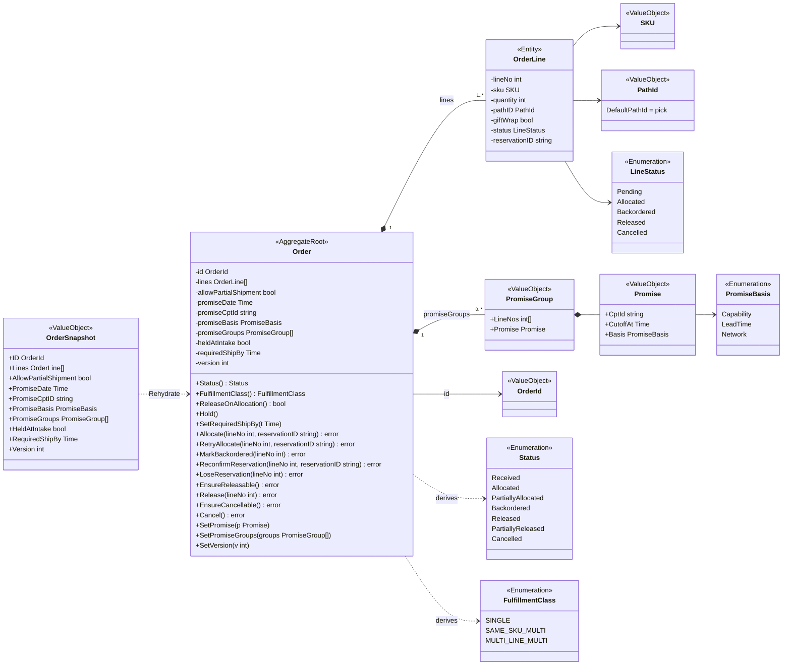
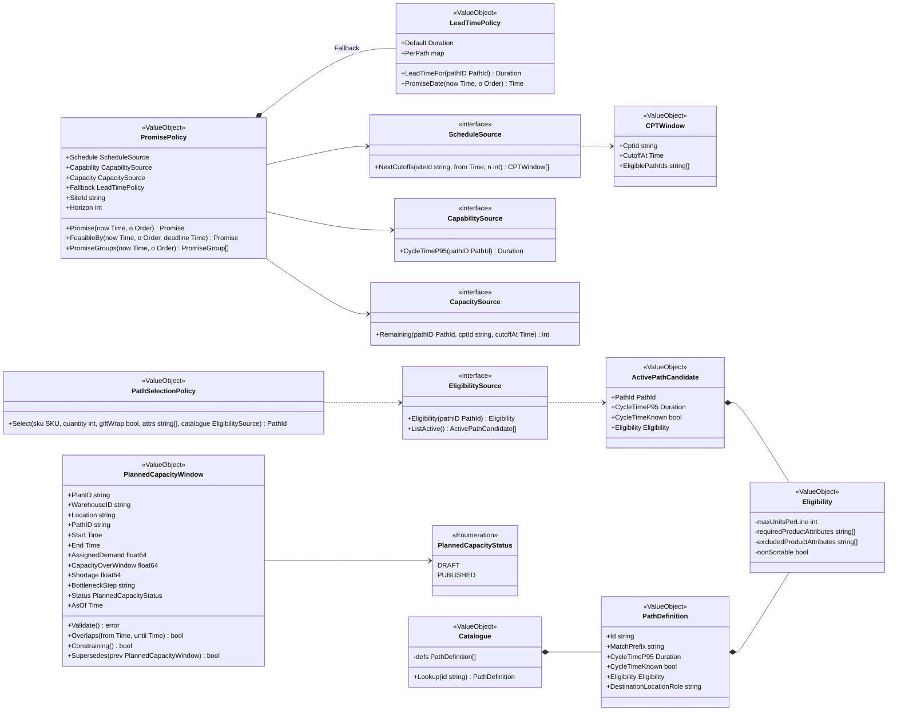
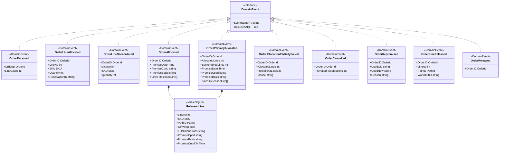
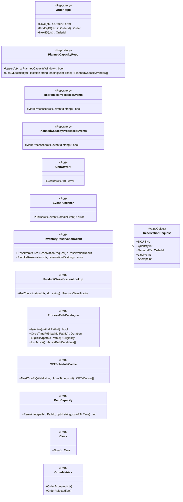
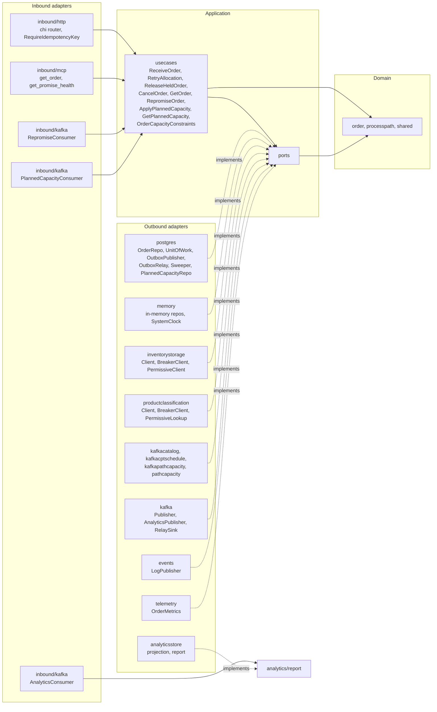

# UML Class Diagrams

:::info[Synced from order-management]
This page is a copy of [`docs/docs/ddd/class-diagram.md`](https://github.com/IQVO/order-management/blob/develop/docs/docs/ddd/class-diagram.md) on `develop`, derived from that repository's code. Edit it there, then re-sync.
:::

Drawn from `internal/domain/**` and `internal/application/ports` on
`develop`. Field and method names are the real Go identifiers (lower-case
fields are unexported). Go pointers and slices are shown as plain types
(`Time`, `OrderLine[]`); only state-changing methods and the key queries
are listed. Stereotypes: `<<AggregateRoot>>`, `<<Entity>>`,
`<<ValueObject>>`, `<<Enumeration>>`, `<<DomainEvent>>`, `<<Repository>>`
(persistence ports) and `<<Port>>` (other outbound ports).

## 1. The Order aggregate

Source: `internal/domain/order/order.go`, `order_line.go`, `status.go`,
`fulfillment_class.go`, `promise_basis.go`, `promise_group.go`,
`internal/domain/shared/order_id.go`, `sku.go`, `path_id.go`.
Omits: the constructors `New` and `NewOrderLine` (`New` stores its own
copy of every line, so the caller's pointers never alias the aggregate's
entities), read-only getters, and `Order.version`'s persistence-only role
(ADR 0024). `OrderSnapshot` is the single input of `order.Rehydrate`, the
one persistence entry point `postgres.OrderRepo.FindByID` calls; a zero
`Version` rehydrates as 1.

## 2. Policies, routing and planned capacity

Source: `internal/domain/order/promise_policy.go`, `promise.go`,
`path_selection.go`, `planned_capacity.go`,
`internal/domain/processpath/catalogue.go`,
`internal/domain/shared/eligibility.go`, `active_path_candidate.go`.
Omits: unexported helpers (`linesFitWindow`, `fallback`,
`promiseForLines`, `lineEligible`) and the free function
`order.CapacityConstraints(o, now, site, windows)`.
`ports.ProcessPathCatalogue`, `ports.CPTScheduleCache` and
`ports.PathCapacity` structurally satisfy `CapabilitySource`/
`EligibilitySource`, `ScheduleSource` and `CapacitySource`.

## 3. Domain events

Source: `internal/domain/shared/events.go`. Omits: the embedded `base`
struct (`eventName`, `occurredAt`) that implements `DomainEvent` for every
event. `OrderLineReleased` and `OrderReleased` are raised by
`allocateAndRelease` at the release transition (analytics topic only).

## 4. Application ports

Source: `internal/application/ports/ports.go`. Omits: the sentinel errors
(`ErrInsufficientStock`, `ErrDownstreamNotConfigured`,
`ErrDownstreamUnavailable`, `ErrConcurrentModification`) and the
`ProductClassification`/`ReservationResult` result structs.

## 5. Hexagonal view: inbound and outbound adapters

Source: `cmd/order/main.go`, `cmd/order/wiring.go`,
`cmd/order/planned_capacity.go`, `cmd/mcp/main.go`,
`cmd/order-projector/main.go`, `internal/adapters/**`. Omits:
`cmd/order-reports` (reads `analytics/report` through `analyticsstore` and
serves `inbound/http.ReportsHandlers`), and the `cloudevents` helper every
Kafka adapter shares. The MCP adapter reaches the report store through its
own `PromiseHealthStore` port, adapted in `cmd/mcp`.
