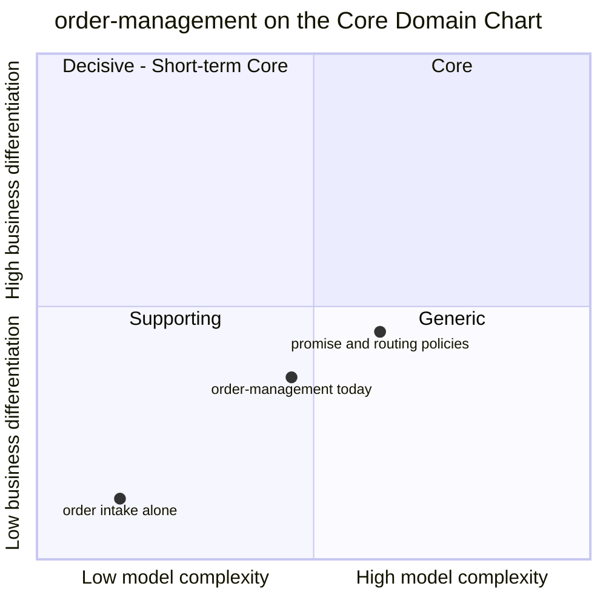

# Core Domain Chart

:::info[Synced from order-management]
This page is a copy of [`docs/docs/ddd/core-domain-chart.md`](https://github.com/IQVO/order-management/blob/develop/docs/docs/ddd/core-domain-chart.md) on `develop`, derived from that repository's code. Edit it there, then re-sync.
:::

Follows the
[ddd-crew Core Domain Charts](https://github.com/ddd-crew/core-domain-charts).
The classification is the one this repo already states — `CLAUDE.md` and
[Subdomain Classification](https://github.com/IQVO/order-management/blob/develop/docs/docs/ddd/subdomain-classification.md): **Generic/Supporting**,
the upstream front door for demand. The chart only places it.

Source: `CLAUDE.md` (title line), `docs/docs/ddd/subdomain-classification.md`,
`internal/domain/**` (19 non-test Go files, about 2,300 lines),
`docs/docs/adr/*.md`. Omits: the sibling contexts — their positions are
owned by their own repos. Coordinates are a judgement, not a measurement.
The two extra points split the context into its parts to show why the
overall point sits on the Supporting/Generic boundary.

## Why this position

**Business differentiation — low to medium (y ≈ 0.36).** Accepting and
validating an order is commodity; the reference model files "Order
Management / ERP interface" under Generic. What lifts it is the
fulfillment-specific rules layered on top: fail-closed allocation (BR2),
ship-complete by default (BR3), the cancellation boundary at release
(BR6), the held-order hold for network demand (ADR 0020), and a promise
derived from the building's own CPT schedule and path capacity rather than
a fixed lead time (ADR 0014/0017). None of these is the platform's
differentiator — that is orchestration, slotting and picking, owned by
wes-work-planning, inventory-storage and fulfillment-execution — but they
are not off-the-shelf either.

**Model complexity — medium (x ≈ 0.46).** Evidence from the code:

| Signal | Value |
| --- | --- |
| Aggregate roots | 1 (`order.Order`, entity `OrderLine`) — see [Aggregate Design Canvas](/contexts/order-management/aggregate-design-canvas) |
| Domain sentinel errors | 15 `Err...` values in `internal/domain` |
| Enforced invariants | 15 in the aggregate, 4 more checked in use cases |
| Domain policies | `PromisePolicy`, `LeadTimePolicy`, `PathSelectionPolicy` |
| Promise bases | 3 (`Capability`, `LeadTime`, `Network`) |
| Use cases | 10 |
| Upstream contexts integrated | 6 (inventory-storage, product-master, process-path-management, wes-work-planning, fulfillment-execution, warehouse-planning) |
| ADRs | 36 |

Most of the complexity is integration and promise computation, not a deep
model: one aggregate, five line states, a derived order status.

## Evolution

| Part | Evolution stage | Note |
| --- | --- | --- |
| Order intake and validation | Commodity | Could be any OMS/ERP front end. |
| Allocation against inventory-storage, hold and release | Product | Well-understood patterns (reserve, backorder, ship-complete); built here to keep the rules explicit and tested. |
| Capability-derived promise, multi-path routing, re-promise | Custom | Specific to this platform's process paths and CPT schedule (ADR 0014, 0017, 0018, 0021); still changing — the most recent ADRs (0031) keep adding inputs. |

The trajectory is toward the bottom of the chart: as the promise and
routing inputs settle, the context should stay Supporting, and intake
itself could be replaced by a bought OMS without moving the Core
contexts.

## What the position implies

- **Build enough, not everything.** Explicit domain rules with failing-path
  tests, but no carrier-rate or transit-time modelling (that is
  commodity).
- **Own references, not truth.** Only `reservationId` is kept from
  inventory-storage; process paths, CPT schedules, capacity and product
  classifications (from product-master, ADR 0036) are local read models
  of upstream data.
- **Same quality gates as a Core context anyway** — coverage, BDD,
  mutation and architecture tests — because the invariants above are real
  (see [Architecture](https://iqvo.github.io/order-management/docs/overview/architecture#quality-gates)).
