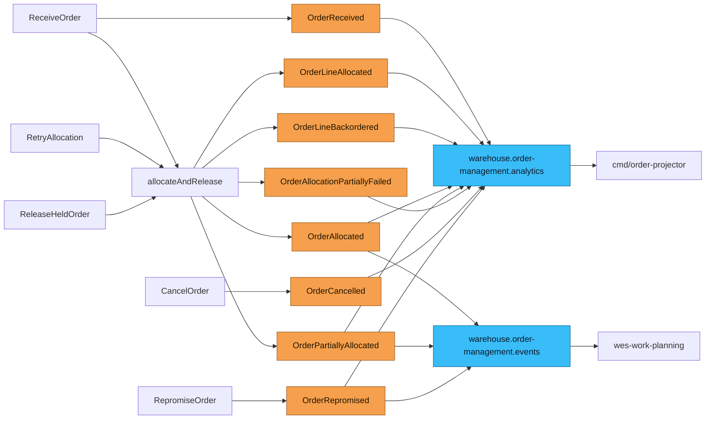

# Domain Events

:::info[Synced from order-management]
This page is a copy of [`docs/docs/ddd/domain-events.md`](https://github.com/IQVO/order-management/blob/develop/docs/docs/ddd/domain-events.md) on `develop`, derived from that repository's code. Edit it there, then re-sync.
:::


This context declares **ten** past-tense domain events in
`internal/domain/shared/events.go` and consumes **ten** CloudEvents types
from four sibling contexts. Every Kafka message, in and out, is a
CloudEvents 1.0 event in **structured** content mode
([ADR 0030](https://iqvo.github.io/order-management/docs/adr/0030-cloudevents-mandatory-event-envelope)), built and
parsed only by `internal/adapters/kafka/cloudevents`:

- `specversion` `1.0`; `id` a UUID minted when the event is encoded (and
  stored in the outbox row, so a redelivery keeps it); `source`
  `/warehouse/order-management`; `type`
  `com.warehouse.wes.order-management.order.<EventName>`; `subject` the
  order id; `time` the domain occurred-at (UTC); `datacontenttype`
  `application/json`; `dataschema`
  `urn:warehouse:order-management:<events|analytics>:<EventName>:v1`.
- Kafka header `content-type: application/cloudevents+json; charset=UTF-8`;
  W3C trace context in `traceparent`/`tracestate`.
- Kafka key = the order id on both outbound topics, with the `Hash`
  balancer, so one order's events stay on one partition
  ([ADR 0027](https://iqvo.github.io/order-management/docs/adr/0027-kafka-integration-publisher-partition-key)).

## How events leave the service

`ports.EventPublisher` is selected by `EVENT_PUBLISHER` in `cmd/order`:

| Configuration | Publisher | Delivery |
| --- | --- | --- |
| `EVENT_PUBLISHER=log` (default) | `events.LogPublisher` | JSON log line only |
| `kafka` with `DATABASE_URL` | `postgres.OutboxPublisher` + `postgres.OutboxRelay` | one `outbox_events` row per (event x topic) in the same transaction as the `Order` save, drained to Kafka by the relay ([ADR 0022](https://iqvo.github.io/order-management/docs/adr/0022-transactional-outbox)) |
| `kafka` without `DATABASE_URL` | `kafka.FanOutPublisher` | written directly to both topics |

Two encoders decide what goes where: `kafka.Publisher` (integration topic)
accepts only `OrderAllocated`, `OrderPartiallyAllocated` and
`OrderRepromised`; `kafka.AnalyticsPublisher` (analytics topic) accepts all
ten.

## Published events

| Event | Full CloudEvents type | Topics | Producing use case | Known consumers |
| --- | --- | --- | --- | --- |
| OrderReceived | `com.warehouse.wes.order-management.order.OrderReceived` | analytics | ReceiveOrder | order-projector |
| OrderLineAllocated | `com.warehouse.wes.order-management.order.OrderLineAllocated` | analytics | allocation pass | order-projector |
| OrderLineBackordered | `com.warehouse.wes.order-management.order.OrderLineBackordered` | analytics | allocation pass, reconfirm before release | order-projector |
| OrderAllocated | `com.warehouse.wes.order-management.order.OrderAllocated` | integration + analytics | allocation pass when the order ends `Allocated` or `Released` | wes-work-planning, order-projector |
| OrderPartiallyAllocated | `com.warehouse.wes.order-management.order.OrderPartiallyAllocated` | integration + analytics | allocation pass when the order ends `PartiallyAllocated` or `PartiallyReleased` | wes-work-planning, order-projector |
| OrderAllocationPartiallyFailed | `com.warehouse.wes.order-management.order.OrderAllocationPartiallyFailed` | analytics | allocation pass, hard failure after some lines allocated | order-projector |
| OrderCancelled | `com.warehouse.wes.order-management.order.OrderCancelled` | analytics | CancelOrder | order-projector |
| OrderRepromised | `com.warehouse.wes.order-management.order.OrderRepromised` | integration + analytics | RepromiseOrder | order-projector; no integration consumer known from this repo |
| OrderLineReleased | `com.warehouse.wes.order-management.order.OrderLineReleased` | analytics (if raised) | **none — declared, never raised** | order-projector handles it |
| OrderReleased | `com.warehouse.wes.order-management.order.OrderReleased` | analytics (if raised) | **none — declared, never raised** | order-projector handles it |

Topics: integration = `warehouse.order-management.events`, analytics =
`warehouse.order-management.analytics`. "Allocation pass" is the shared
`allocateAndRelease` flow run by ReceiveOrder, RetryAllocation and
ReleaseHeldOrder. Release is announced only through
`OrderAllocated`/`OrderPartiallyAllocated` and their `lines[]`; the
`OrderLineReleased`/`OrderReleased` types exist in code, AsyncAPI and the
projector but no use case publishes them, so the funnel's
`ordersReleased`/`linesReleased` stay at zero.

### Integration payloads (`warehouse.order-management.events`)

`OrderAllocated` and `OrderPartiallyAllocated` share one `data` shape
(`allocationData` in `internal/adapters/outbound/kafka/publisher.go`):

| Field | Type | Notes |
| --- | --- | --- |
| `order_id` | string | |
| `promise_date` | RFC 3339 | latest cutoff across promise groups |
| `promise_cpt_id` | string, omitted when empty | absent for a `LeadTime` promise |
| `promise_basis` | `Capability`, `LeadTime` or `Network`, omitted when empty | |
| `lines[]` | array | lines released **in this pass** (empty for a held order) |
| `lines[].line_no`, `sku`, `path_id`, `gift_wrap` | | the original four frozen fields wes-work-planning decodes |
| `lines[].fulfillment_class` | `SINGLE`, `SAME_SKU_MULTI`, `MULTI_LINE_MULTI` | additive, ADR 0008 |
| `lines[].promise_cpt_id`, `promise_basis`, `promise_cutoff_at` | omitted when empty | per-line group attribution, ADR 0017 |

`OrderPartiallyAllocated`'s `allocated_lines`/`backordered_lines` counts
travel only on the analytics topic; on the integration topic both events
have exactly the fields above.

```json
{
  "order_id": "ord-a1b2c3d4-0000-0000-0000-000000000001",
  "promise_date": "2026-08-27T12:00:00Z",
  "promise_cpt_id": "sp1-1200",
  "promise_basis": "Capability",
  "lines": [
    {"line_no": 1, "sku": "SKU-1", "path_id": "pick", "gift_wrap": false,
     "fulfillment_class": "SINGLE", "promise_cpt_id": "sp1-1200",
     "promise_basis": "Capability", "promise_cutoff_at": "2026-08-27T12:00:00Z"}
  ]
}
```

`OrderRepromised` (`repromisedData`): `order_id`, `cpt_id_old` and
`cpt_id_new` (each omitted when that side is a `LeadTime` promise), and
`reason` (`TaskCPTMissed` or `PackageManifested`).

wes-work-planning never receives a work-unit id: it rebuilds
`{order_id}-line-{line_no}` itself, and this repo's `usecases.WorkUnitID`
must produce the byte-identical string. `usecases.ParseWorkUnitID` reverses
it for the re-promise consumer.

### Analytics payloads (`warehouse.order-management.analytics`)

Built by `AnalyticsPublisher.marshalData`, enriched with a `path_id` looked
up through `OrderRepo`:

| Event | `data` fields |
| --- | --- |
| OrderReceived | `order_id`, `path_id` (first line), `line_count` |
| OrderAllocated | `order_id`, `path_id` (first released line, else first line), `promise_basis`, `promise_cutoff_at` (Capability basis only), `split_shipment` |
| OrderPartiallyAllocated | as OrderAllocated plus `allocated_lines`, `backordered_lines` |
| OrderAllocationPartiallyFailed | `order_id`, `path_id`, `allocated_lines`, `remaining_lines` |
| OrderCancelled | `order_id`, `path_id`, `revoked_reservations` |
| OrderLineAllocated | `order_id`, `line_no`, `path_id` (that line), `sku` |
| OrderLineBackordered | `order_id`, `line_no`, `path_id` (that line), `sku` |
| OrderRepromised | `order_id`, `cpt_id_old`, `cpt_id_new`, `reason` |
| OrderLineReleased | `order_id`, `line_no`, `path_id`, `work_unit_id` |
| OrderReleased | `order_id`, `path_id` |

The sole consumer is `cmd/order-projector`
(`inbound/kafka.AnalyticsConsumer`, group `order-management-analytics`,
from the first offset), which de-duplicates on the CloudEvents `id`; see
[Order Funnel report](https://iqvo.github.io/order-management/docs/analytics/order-funnel-report).

## Consumed events

| Producer | Full CloudEvents type | Topic | Payload fields read | Adapter, group | Effect |
| --- | --- | --- | --- | --- | --- |
| fulfillment-execution | `com.warehouse.wes.fulfillment-execution.task.TaskCPTMissed` | `warehouse.fulfillment.events` | `task_id`, `order_ref`, `task_type`, `cpt` | `inbound/kafka.RepromiseConsumer`, stable group `order-management-repromise` | RepromiseOrder |
| fulfillment-execution | `com.warehouse.wes.fulfillment-execution.package.PackageManifested` | `warehouse.fulfillment.events` | `package_id`, `order_ref` | same | RepromiseOrder |
| process-path-management | `com.warehouse.wes.process-path-management.processpath.ProcessPathCreated` | `warehouse.process-path-management.events` | `path_id`, `match_prefix`, `cycle_time_p95`, `eligibility` (`max_units_per_line`, `required_product_attributes`, `excluded_product_attributes`, `non_sortable`), `destination_location_role` | `outbound/kafkacatalog`, per-process group `order-management-process-path-catalogue-*` | upsert catalogue cache |
| process-path-management | `com.warehouse.wes.process-path-management.processpath.ProcessPathUpdated` | same | same | same | upsert catalogue cache |
| process-path-management | `com.warehouse.wes.process-path-management.processpath.ProcessPathDeactivated` | same | `path_id` | same | remove from catalogue cache |
| process-path-management | `com.warehouse.wes.process-path-management.cptschedule.CPTScheduleChanged` | same | `site_id`, `timezone`, `cutoffs[]` (`cpt_id`, `local_time`, `days_of_week`, `ship_method`, `eligible_path_ids`) | `outbound/kafkacptschedule`, per-process group `order-management-cpt-schedule-*` | replace site CPT schedule |
| wes-work-planning | `com.warehouse.wes.work-planning.workpool.PathCapacityChanged` | `warehouse.work-planning.events` | `path_id`, `cutoff_at`, `remaining_units`, `known` | `outbound/kafkapathcapacity`, per-process group `order-management-path-capacity-*` | remaining capacity keyed by path and cutoff |
| warehouse-planning | `com.warehouse.wes.warehouse-planning.capacityplan.CapacityPlanCreated` | `warehouse.warehouse-planning.events` | `plan_id`, `warehouse_id`, `location`, `path_id`, `window_start`, `window_end`, `assigned_demand`, `capacity_over_window`, `shortage`, `bottleneck_step` | `inbound/kafka.PlannedCapacityConsumer`, group from `PLANNED_CAPACITY_CONSUMER_GROUP` | upsert window as `DRAFT` |
| warehouse-planning | `com.warehouse.wes.warehouse-planning.capacityplan.CapacityPlanPublished` | same | same | same | upsert window as `PUBLISHED` |
| warehouse-planning | `com.warehouse.wes.warehouse-planning.capacityplan.CapacityShortageDetected` | same | same | same | upsert window as `PUBLISHED` |

`com.warehouse.wes.warehouse-planning.capacityplan.BottleneckDetected` is
recognised and ignored. Unknown types are ignored on every consumer.

Delivery guarantees by consumer:

- **RepromiseConsumer** and **PlannedCapacityConsumer** — stable shared
  groups, idempotent on the CloudEvents `id` (`repromise_processed_events`,
  `planned_capacity_processed_events`), up to 3 attempts, then the raw
  message goes to the `.dlq` topic (`warehouse.fulfillment.events.dlq`,
  `warehouse.warehouse-planning.events.dlq`) with `x-dlq-*` headers and the
  offset is committed
  ([ADR 0025](https://iqvo.github.io/order-management/docs/adr/0025-resilience-circuit-breakers-retry-dlq-shutdown)).
  A non-CloudEvents message is dead-lettered immediately.
- **Catalogue, CPT-schedule and path-capacity caches** — run only with
  `PATH_CATALOGUE_SOURCE=kafka`, each under a fresh per-process group that
  replays from the first offset; `cmd/order` waits up to 60s for each to
  catch up before serving. Undecodable messages are logged and skipped.

`order_ref` on the fulfillment events is a work-unit id
(`{orderId}-line-{lineNo}`), not a bare order id; a value that does not
parse is logged and skipped.

## Which use case emits what



Source: `internal/application/usecases/*.go`,
`internal/adapters/outbound/kafka/publisher.go`,
`analytics_publisher.go`. Omits: the outbox hop (diagram 9 on
[Sequence Diagrams](/contexts/order-management/sequence-diagrams)) and the two declared but
never-raised release events.

## Naming and payload shape

Every event embeds an `occurredAt` from the injected `Clock` port, so
ordering is a domain fact, not an infrastructure artefact. Payloads carry
the minimum needed to make the event self-describing — `OrderLineAllocated`
carries `OrderID`, `LineNo`, `SKU`, `Quantity` and the Supplier's
`ReservationID`, never an `Order` snapshot. `OrderAllocated`/
`OrderPartiallyAllocated` carry `Lines []ReleasedLine` because that is the
integration payload wes-work-planning needs.

## Why choreography, not a synchronous call

Before [ADR 0005](https://iqvo.github.io/order-management/docs/adr/0005-choreographed-release-via-kafka) release
was a synchronous `POST /paths/{pathId}/work-units` call to
wes-work-planning, which made release depend on that Supplier's
availability at the exact moment of release. Release is now a published
fact that wes-work-planning consumes on its own schedule. It is
fire-and-forget: there is no confirmation event back (see the README's
Deferred list).
