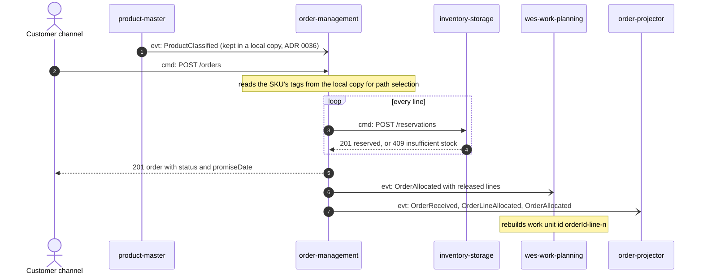
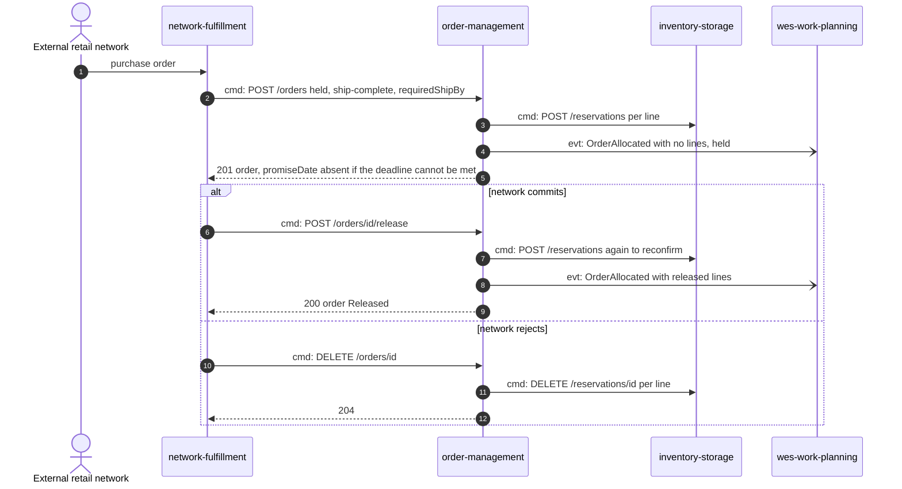
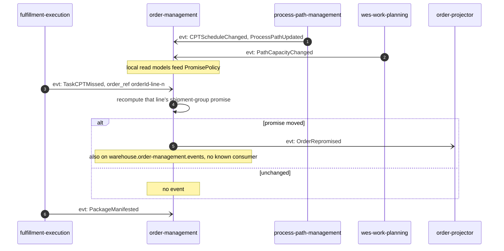
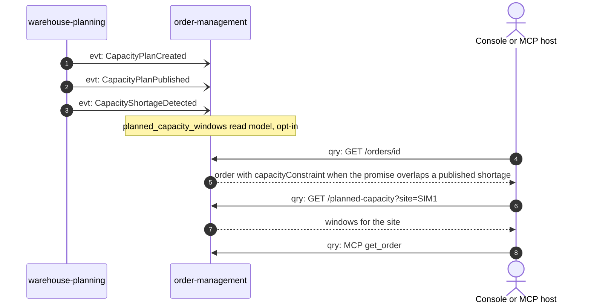

# Domain Message Flow

:::info[Synced from order-management]
This page is a copy of [`docs/docs/ddd/domain-message-flow.md`](https://github.com/IQVO/order-management/blob/develop/docs/docs/ddd/domain-message-flow.md) on `develop`, derived from that repository's code. Edit it there, then re-sync.
:::

Follows
[ddd-crew Domain Message Flow Modelling](https://github.com/ddd-crew/domain-message-flow-modelling).
Participants are bounded contexts, actors and external systems; every
arrow is a real message, prefixed `cmd:` (command), `evt:` (event) or
`qry:` (query). Kafka arrows use the event name; the full CloudEvents type
is `com.warehouse.wes.<context>.<entity>.<EventName>` — see
[Domain Events](/contexts/order-management/domain-events).

## 1. Customer order to released work

Source: `internal/application/usecases/receive_order.go`, `allocation.go`,
`internal/adapters/outbound/inventorystorage/client.go`,
`inbound/kafka/product_classification_consumer.go`,
`outbound/productclassificationcopy/`, `outbound/kafka/publisher.go`.
Omits: the backordered branch (`OrderLineBackordered`, then
`OrderPartiallyAllocated` for a partial-shipment order, nothing to
wes-work-planning for a ship-complete one), the
`OrderAllocationPartiallyFailed` branch, and the outbox hop.

## 2. Network order held, then committed or rejected

Source: ADR 0020, `internal/application/usecases/release_held_order.go`,
`cancel_order.go`, `allocation.go` (`publishOrderAllocationOutcome`).
Omits: network-fulfillment's own translation (PO, acknowledgement) and the
BR3 branch where a reconfirm loses a reservation and nothing is released.
The held-order `OrderAllocated` carries an empty `lines[]`, so
wes-work-planning has nothing to schedule until the release.

## 3. Missed CPT re-promises the order

Source: `internal/adapters/inbound/kafka/repromise_consumer.go`,
`internal/application/usecases/repromise_order.go`,
`internal/adapters/outbound/{kafkacatalog,kafkacptschedule,kafkapathcapacity}`.
Omits: idempotency on the CloudEvents id and the DLQ after three failed
attempts.

## 4. Planned shortage annotates an order

Source: `internal/adapters/inbound/kafka/planned_capacity_consumer.go`,
`internal/application/usecases/planned_capacity.go`,
`internal/domain/order/planned_capacity.go`,
`internal/adapters/inbound/http/server.go`. Omits:
`BottleneckDetected` (ignored), DRAFT vs PUBLISHED precedence, and the MCP
response (it does not carry the capacity annotation). Planned capacity
never moves a promise (ADR 0031).
