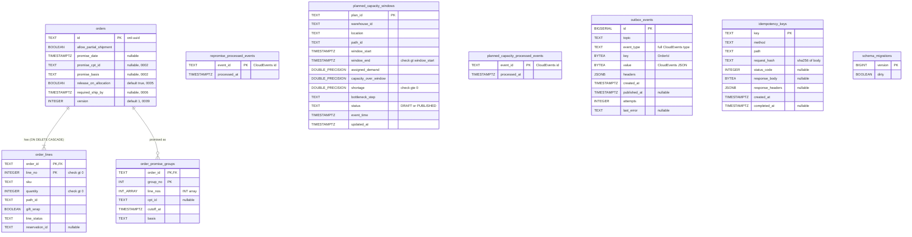
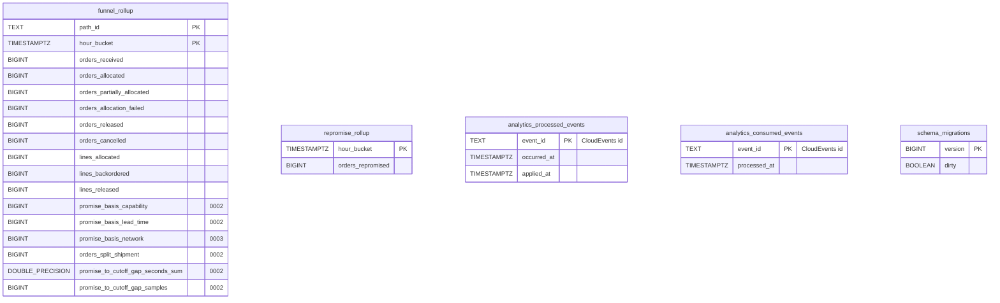

# Entity-Relationship Diagram

:::info[Synced from order-management]
This page is a copy of [`docs/docs/ddd/entity-relationship.md`](https://github.com/IQVO/order-management/blob/develop/docs/docs/ddd/entity-relationship.md) on `develop`, derived from that repository's code. Edit it there, then re-sync.
:::

Two databases, two migration sets, both applied by golang-migrate on boot
(`postgres.RunMigrations`):

- **OLTP** (`DATABASE_URL`, migrations `migrations/0001`–`0010`), migrated
  by `cmd/order` and by `cmd/mcp` (through `MIGRATIONS_DATABASE_URL`,
  ADR 0029).
- **Analytics** (`ANALYTICS_DATABASE_URL`, migrations
  `migrations/analytics/0001`–`0003`), migrated only by
  `cmd/order-projector`; `cmd/order-reports` and `cmd/mcp` only read it.

The diagrams show the **final** schema after applying every `*.up.sql` in
order. `0001_init` created an `events` table that `0007_outbox` dropped, so
it is not shown.

## OLTP database

Source: `migrations/0001_init.up.sql` … `migrations/0010_planned_capacity.up.sql`;
`schema_migrations` is golang-migrate's own bookkeeping table
(`internal/adapters/outbound/postgres/migrate.go`). Omits: secondary
indexes (`idx_order_lines_sku`, `idx_order_lines_status`,
`idx_outbox_events_unpublished` partial on `published_at IS NULL`,
`idx_idempotency_keys_created_at`, `planned_capacity_windows_location_end`).
`INT_ARRAY` stands for Postgres `INT[]`, `DOUBLE_PRECISION` for
`DOUBLE PRECISION`.

Only two real `FOREIGN KEY`s exist: `order_lines.order_id` and
`order_promise_groups.order_id`, both to `orders.id`. Everything else is
deliberately unlinked:

- `order_lines.reservation_id` points into **inventory-storage's** database
  (a `Reservation` id) — another bounded context, so no FK is possible or
  wanted (ADR 0002).
- `order_lines.path_id` and `planned_capacity_windows.path_id` are
  process-path ids owned by process-path-management / warehouse-planning.
- `order_promise_groups.line_nos` refers to `order_lines.line_no` of the
  same order, but as an array, so it is enforced in the aggregate
  (`Order.SetPromiseGroups`), not by the database.
- `outbox_events.key` holds the `OrderId` as the Kafka key — infrastructure,
  not a relation.
- `repromise_processed_events.event_id` and
  `planned_capacity_processed_events.event_id` hold **inbound** CloudEvents
  ids from other contexts.

## Analytics database

Source: `migrations/analytics/0001_report.up.sql`,
`0002_promise_kpis.up.sql`, `0003_promise_basis_network.up.sql`. Omits:
indexes `idx_funnel_rollup_hour_bucket`,
`idx_analytics_processed_events_occurred_at`,
`idx_repromise_rollup_hour_bucket`. There are **no** foreign keys in this
database: every table is a projection or an idempotency ledger.
`analytics_processed_events` is claimed inside the projection transaction
(`analyticsstore.PostgresProjection`) and also drives the freshness lag;
`analytics_consumed_events` backs the consumer's own
`ConsumedEventsRepo`.

## Table ≠ aggregate

| Table | What it is | Aggregate / owner |
| --- | --- | --- |
| `orders` | Aggregate root row | **Order** (`order.Order`) |
| `order_lines` | Entity rows inside the aggregate | **Order** — `order.OrderLine` |
| `order_promise_groups` | Value objects of the aggregate (delete-and-reinsert on every save) | **Order** — `order.PromiseGroup` |
| `planned_capacity_windows` | Read model of another context's data | none — `order.PlannedCapacityWindow` (ADR 0031) |
| `repromise_processed_events` | Infrastructure: inbound idempotency ledger | `ports.RepromiseProcessedEvents` |
| `planned_capacity_processed_events` | Infrastructure: inbound idempotency ledger | `ports.PlannedCapacityProcessedEvents` |
| `outbox_events` | Infrastructure: transactional outbox (ADR 0022) | `postgres.OutboxPublisher` / `OutboxRelay` |
| `idempotency_keys` | Infrastructure: HTTP request de-duplication (ADR 0023) | `inbound/http.RequireIdempotencyKey` |
| `schema_migrations` | Infrastructure: golang-migrate | — |
| `funnel_rollup`, `repromise_rollup` | Analytics projection (ADR 0006/0019) | `report.Row` via `cmd/order-projector` |
| `analytics_processed_events`, `analytics_consumed_events` | Infrastructure: projector idempotency | `analyticsstore` |

One `Order` is persisted as one `orders` row, `N` `order_lines` rows and up
to `N` `order_promise_groups` rows, written in one transaction by
`postgres.OrderRepo.Save` with the `version` guard (ADR 0024).
