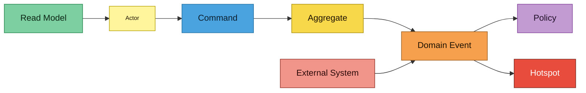
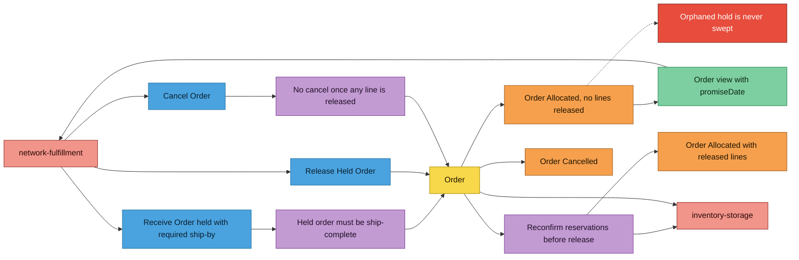
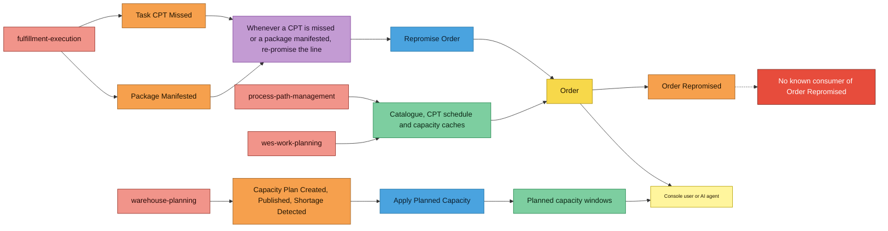

# EventStorming

:::info[Synced from order-management]
This page is a copy of [`docs/docs/ddd/eventstorming.md`](https://github.com/IQVO/order-management/blob/develop/docs/docs/ddd/eventstorming.md) on `develop`, derived from that repository's code. Edit it there, then re-sync.
:::

Design-level EventStorming in the notation of the ddd-crew
[EventStorming glossary and cheat sheet](https://github.com/ddd-crew/eventstorming-glossary-cheat-sheet),
reconstructed from the code on `develop` rather than from a workshop.
Hotspots are only gaps already recorded in ADRs, the README Deferred list
or `.claude/rules/deferred-and-known-gaps.md`.

## Legend

Source: ddd-crew cheat-sheet colours. Omits: nothing — legend only.

## 1. Intake, allocation and release

```mermaid
flowchart LR
  CUS["Customer channel"]:::actor
  CAT["Process path catalogue, CPT schedule, path capacity"]:::readmodel
  PMX["product-master"]:::external
  EPC["Product Classified"]:::event
  APC["Apply Product Classification"]:::command
  CLS["Product classification copy"]:::readmodel
  RO["Receive Order"]:::command
  PS["Path selection policy"]:::policy
  O1["Order"]:::aggregate
  E1["Order Received"]:::event
  INV["inventory-storage"]:::external
  P1["Whenever an order is received, allocate every line"]:::policy
  E2["Order Line Allocated"]:::event
  E3["Order Line Backordered"]:::event
  E4["Order Allocation Partially Failed"]:::event
  PP["Promise policy"]:::policy
  P2["Reconfirm then release unless ship-complete is blocked"]:::policy
  E5["Order Allocated"]:::event
  E6["Order Partially Allocated"]:::event
  E7["Order Line Released"]:::event
  E8["Order Released"]:::event
  WP["wes-work-planning"]:::external
  OP["Operator"]:::actor
  RA["Retry Allocation"]:::command
  H2["No release confirmation from wes-work-planning"]:::hotspot

  CUS --> RO --> O1
  CAT --> PS --> O1
  PMX --> EPC --> APC --> CLS --> PS
  O1 --> E1 --> P1
  P1 --> INV
  INV --> E2
  INV --> E3
  INV --> E4
  E2 --> PP
  PP --> P2
  P2 --> E5
  P2 --> E6
  P2 --> E7
  E7 --> E8
  E5 --> WP
  E6 --> WP
  E3 --> OP --> RA --> O1
  WP -.-> H2

  classDef actor fill:#fff59d,stroke:#b59f00,color:#1f1300,font-size:11px;
  classDef command fill:#4aa3df,stroke:#1f6f9f,color:#0b1e2d;
  classDef aggregate fill:#f7d84a,stroke:#a68b00,color:#1f1300;
  classDef event fill:#f6a04d,stroke:#9a5b1c,color:#1f1300;
  classDef policy fill:#c39bd3,stroke:#7d3c98,color:#1f0f26;
  classDef readmodel fill:#7dcea0,stroke:#1e8449,color:#0b2614;
  classDef external fill:#f1948a,stroke:#922b21,color:#2b0a07;
  classDef hotspot fill:#e74c3c,stroke:#78281f,color:#ffffff;
```

Source: `internal/application/usecases/receive_order.go`, `allocation.go`,
`retry_allocation.go`, `product_classification.go`,
`internal/adapters/inbound/kafka/product_classification_consumer.go`,
`internal/domain/order/path_selection.go`,
`promise_policy.go`. Omits: the reconfirm `Order Line Backordered` (lost
reservation) and the analytics fan-out of every event.

## 2. Hold, release and cancellation

Source: `internal/application/usecases/release_held_order.go`,
`cancel_order.go`, `internal/domain/order/intake_intent.go`, `order.go`
(`EnsureCancellable`, `EnsureReleasable`), ADR 0004, ADR 0020. Omits:
cancellation by a direct customer (same command, different actor).

## 3. Re-promise and planned capacity

Source: `internal/adapters/inbound/kafka/repromise_consumer.go`,
`planned_capacity_consumer.go`, `internal/application/usecases/repromise_order.go`,
`planned_capacity.go`, `internal/adapters/outbound/{kafkacatalog,kafkacptschedule,kafkapathcapacity}`.
Omits: the analytics projector (a read model built from every event, see
[Order Funnel report](https://iqvo.github.io/order-management/docs/analytics/order-funnel-report)).

## Stickies and their evidence

| Sticky | Kind | Code evidence |
| --- | --- | --- |
| Customer channel, Operator, Console user or AI agent | Actor | REST callers of `internal/adapters/inbound/http`, MCP `get_order` |
| Receive Order | Command | `usecases.ReceiveOrder`, `POST /orders` |
| Retry Allocation | Command | `usecases.RetryAllocation`, `POST /orders/{id}/retry-allocation` |
| Release Held Order | Command | `usecases.ReleaseHeldOrder`, `POST /orders/{id}/release` |
| Cancel Order | Command | `usecases.CancelOrder`, `DELETE /orders/{id}` |
| Repromise Order | Command | `usecases.RepromiseOrder` |
| Apply Planned Capacity | Command | `usecases.ApplyPlannedCapacity` |
| Apply Product Classification | Command | `usecases.ApplyProductClassification` (ADR 0036) |
| Order | Aggregate | `order.Order` |
| Order Received … Order Repromised | Domain Event | `internal/domain/shared/events.go` |
| Task CPT Missed, Package Manifested | Domain Event (upstream) | `inbound/kafka/repromise_consumer.go` |
| Capacity Plan Created, Published, Shortage Detected | Domain Event (upstream) | `inbound/kafka/planned_capacity_consumer.go` |
| Product Classified | Domain Event (upstream, product-master) | `inbound/kafka/product_classification_consumer.go` |
| Path selection policy | Policy | `order.PathSelectionPolicy` (ADR 0021) |
| Promise policy | Policy | `order.PromisePolicy` (ADR 0014, 0017, 0020) |
| Allocate every line on receipt | Policy | `ReceiveOrder` calls `allocateAndRelease` |
| Reconfirm then release unless ship-complete is blocked | Policy | `reconfirmBeforeRelease`, `releaseAllocatedLines`, `Order.EnsureReleasable` (BR3) |
| Held order must be ship-complete | Policy | `order.ValidateIntakeIntent` |
| No cancel once any line is released | Policy | `Order.EnsureCancellable` (BR6) |
| Re-promise on CPT missed or package manifested | Policy | `RepromiseConsumer` → `RepromiseOrder` |
| Catalogue, CPT schedule and capacity caches | Read Model | `kafkacatalog`, `kafkacptschedule`, `kafkapathcapacity` |
| Planned capacity windows | Read Model | `planned_capacity_windows`, `order.PlannedCapacityWindow` |
| Product classification copy | Read Model | `product_classification_copy`, `ports.ProductClassificationLookup` (ADR 0036) |
| Order view with promiseDate | Read Model | `GET /orders/{id}` response (`orderResponse`) |
| inventory-storage, product-master, wes-work-planning, process-path-management, fulfillment-execution, warehouse-planning, network-fulfillment | External System | outbound and inbound adapters listed on [Context Map](/contexts/order-management/context-map) |
| Order Line Released and Order Released raised only on the analytics topic | Event | `publishReleaseFacts` in `allocation.go`, [ADR 0034](https://iqvo.github.io/order-management/docs/adr/0034-raise-order-line-released-and-order-released) |
| No release confirmation from wes-work-planning | Hotspot | README Deferred list, ADR 0005 |
| Orphaned hold is never swept | Hotspot | ADR 0020, README Deferred list |
| BR3 blocking a release is a hold, answered 201/200 with a `Backordered` order (no `ship-complete-blocked` problem type) | Policy | `releaseAllocatedLines`, `Order.EnsureReleasable`, `br3_block_test.go`, ADR 0003 |
| No known consumer of Order Repromised | Hotspot | published on `warehouse.order-management.events` (`outbound/kafka.Publisher`), but no sibling consumer is named in this repo's docs or ADR 0018 |
