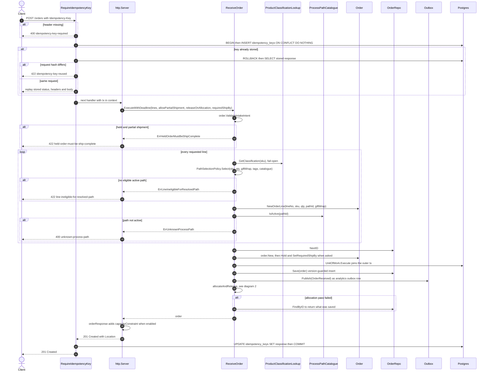
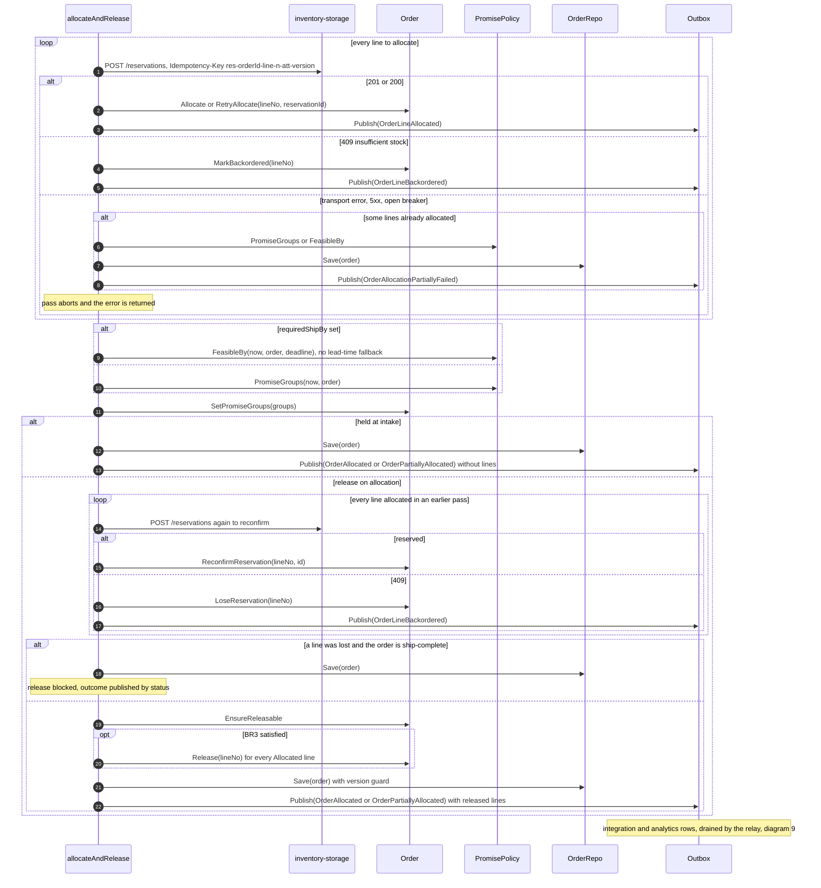
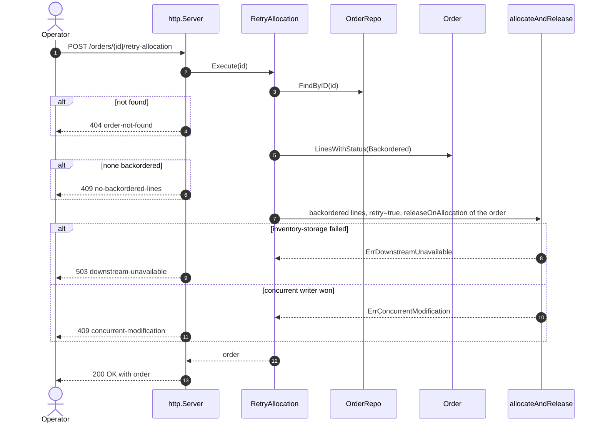
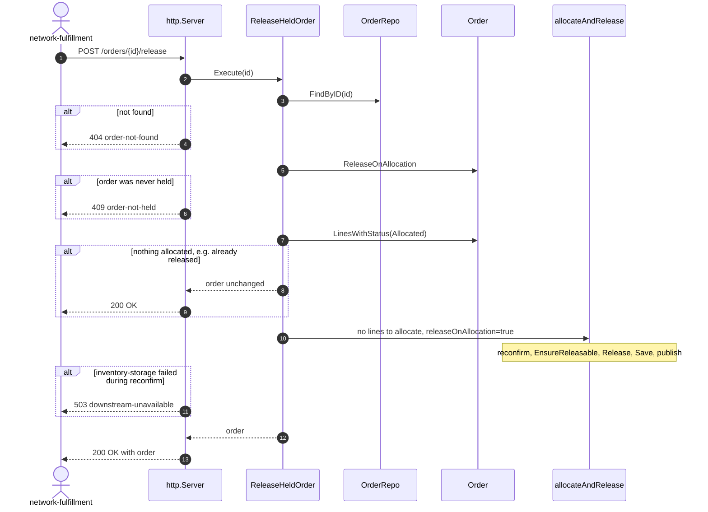
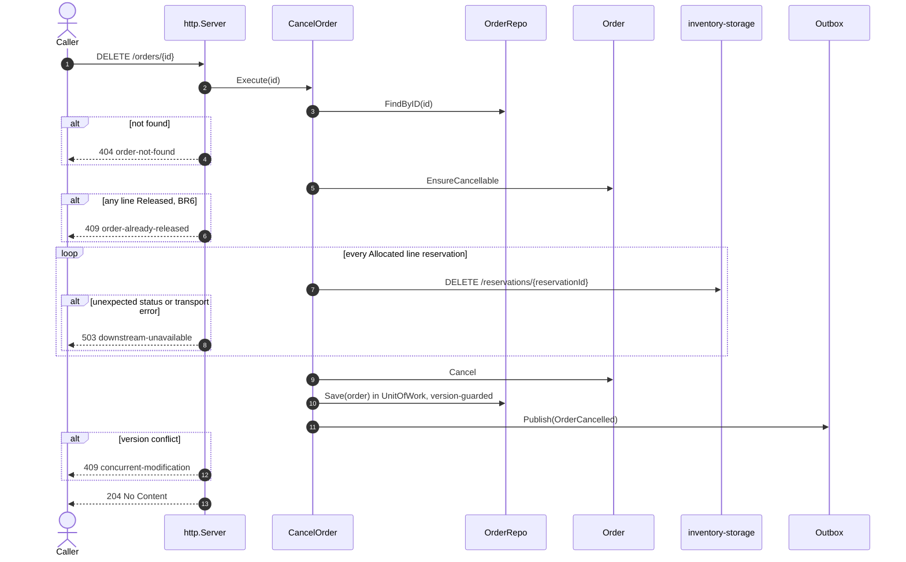
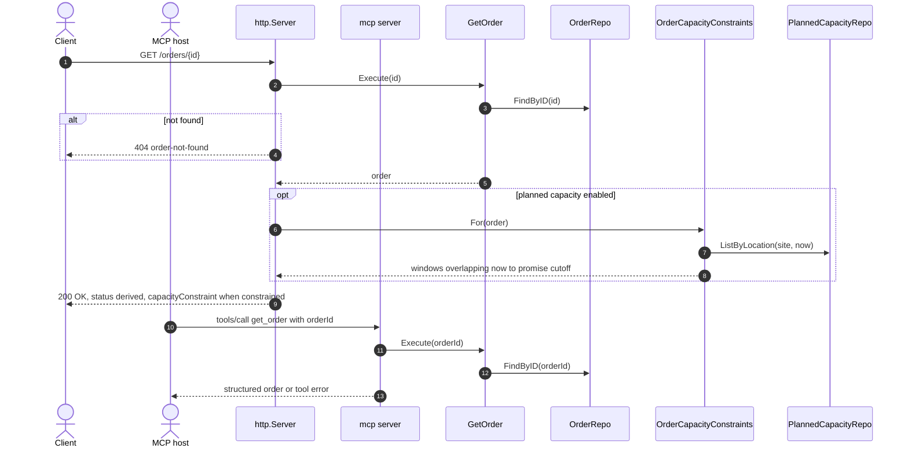
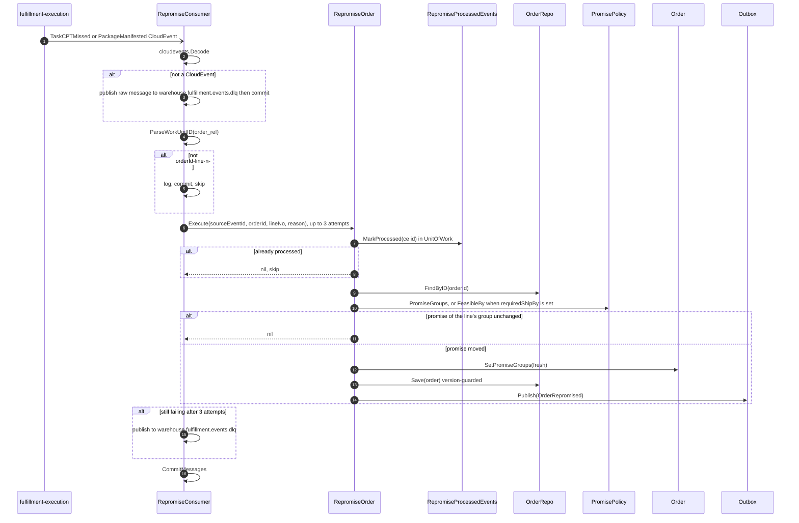
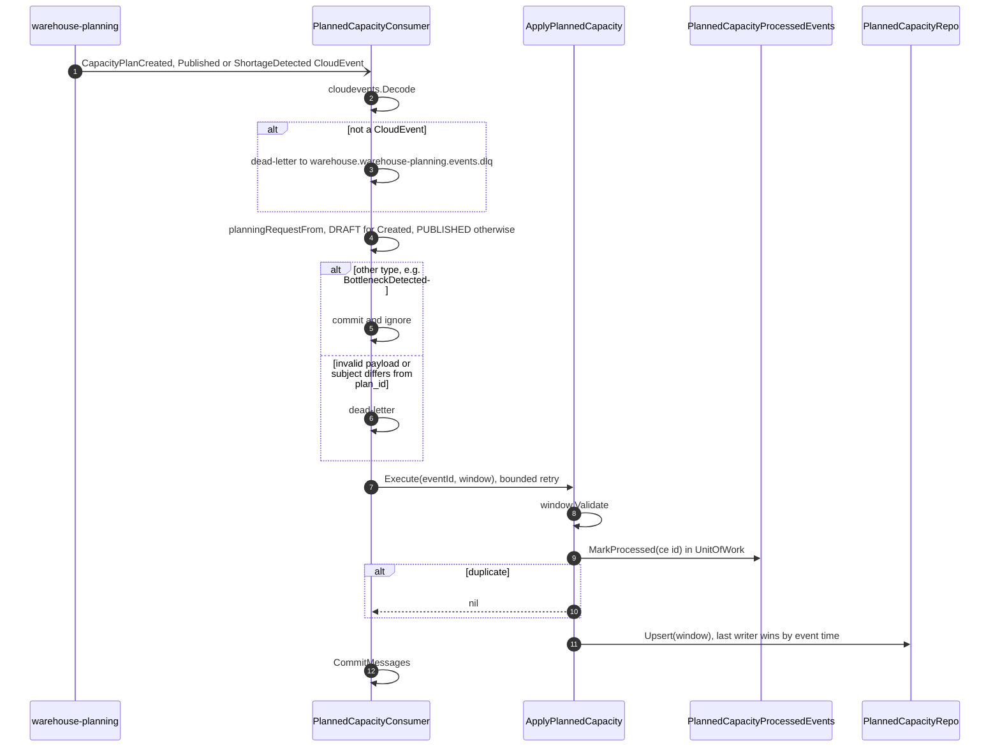
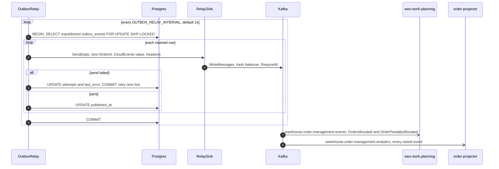

# Sequence Diagrams

:::info[Synced from order-management]
This page is a copy of [`docs/docs/ddd/sequence-diagrams.md`](https://github.com/IQVO/order-management/blob/develop/docs/docs/ddd/sequence-diagrams.md) on `develop`, derived from that repository's code. Edit it there, then re-sync.
:::

One diagram per entry point, traced from the code on `develop`. Participant
names match the code: the inbound adapter, the application use case, the
`Order` aggregate, the repository (`ports.OrderRepo`), the outbox
(`ports.EventPublisher` = `postgres.OutboxPublisher` when
`DATABASE_URL` and `EVENT_PUBLISHER=kafka` are set) and the downstream
system. All diagrams assume the Postgres + Kafka configuration; with no
`DATABASE_URL` there is no idempotency middleware, no outbox and no
transaction, and with `EVENT_PUBLISHER=log` events are only logged.

The [use cases page](https://github.com/IQVO/order-management/blob/develop/docs/docs/ddd/use-cases.md) has the same flows in prose; the
[domain message flow](/contexts/order-management/domain-message-flow) shows them across contexts.

## 1. ReceiveOrder — `POST /orders`

Source: `internal/adapters/inbound/http/idempotency.go`, `server.go`,
`internal/application/usecases/receive_order.go`. Omits: the
`OrderMetrics` accepted/rejected counter, JSON decoding errors
(`400 malformed-request-body`), `400 empty-sku` / `422
non-positive-quantity` from `NewOrderLine`, and the
`OrderReceived` outbox row on the integration topic (none — only the
analytics encoder accepts it). A hard failure in step 2 never fails the
request: the order was received and the response shows whatever was saved.

## 2. The allocation pass — `allocateAndRelease`

Shared by ReceiveOrder, RetryAllocation and ReleaseHeldOrder, inside one
`UnitOfWork` transaction.

Source: `internal/application/usecases/allocation.go`
(`allocateLines`, `salvageAllocationFailure`, `reconfirmBeforeRelease`,
`releaseAllocatedLines`, `publishOrderAllocationOutcome`),
`internal/adapters/outbound/inventorystorage/client.go`. Omits: the circuit
breaker wrapping the inventory client (ADR 0025), and the rule that the
outcome event is skipped when the order ends `Backordered` or the pass
changed nothing.

## 3. RetryAllocation — `POST /orders/{id}/retry-allocation`

Source: `internal/application/usecases/retry_allocation.go`,
`internal/adapters/inbound/http/errors.go`. Omits: the permissive inventory
client (`503 downstream-not-configured`). Unlike ReceiveOrder, a hard
failure here is returned to the caller.

## 4. ReleaseHeldOrder — `POST /orders/{id}/release`

Source: `internal/application/usecases/release_held_order.go`,
`allocation.go`. Omits: the BR3 branch — a held ship-complete order that
lost a reservation releases nothing and still answers `200`.

## 5. CancelOrder — `DELETE /orders/{id}`

Source: `internal/application/usecases/cancel_order.go`,
`internal/adapters/outbound/inventorystorage/client.go` (`204`, `200` and
`404` count as revoked). Omits: a revoke that fails part-way leaves the
earlier revocations in place while the order stays uncancelled — the
caller retries.

## 6. GetOrder — `GET /orders/{id}` and MCP `get_order`

Source: `internal/application/usecases/get_order.go`,
`planned_capacity.go` (`OrderCapacityConstraints`),
`internal/adapters/inbound/http/server.go` (`orderResponse`),
`internal/adapters/inbound/mcp/tools.go`. Omits: `get_promise_health`,
which reads the analytics report store through the MCP adapter's own
`PromiseHealthStore` port, and the reports binary's
`GET /reports/funnel`. A failed capacity lookup only drops the annotation.

## 7. RepromiseOrder — Kafka `warehouse.fulfillment.events`

Source: `internal/adapters/inbound/kafka/repromise_consumer.go`,
`internal/application/usecases/repromise_order.go`. Omits: OpenTelemetry
spans, the DLQ topic-create retry (ADR 0033), and the skip branches for an
unknown order or a line outside every promise group (logged, no event).

## 8. ApplyPlannedCapacity — Kafka `warehouse.warehouse-planning.events`

Source: `internal/adapters/inbound/kafka/planned_capacity_consumer.go`,
`internal/application/usecases/planned_capacity.go`,
`internal/adapters/outbound/postgres/planned_capacity_repo.go`. Omits:
`PlannedCapacityWindow.Supersedes`, which also refuses a DRAFT that would
overwrite a PUBLISHED plan.

## 9. Outbox relay — Postgres to Kafka

Source: `internal/adapters/outbound/postgres/outbox_relay.go`,
`outbox_publisher.go`, `internal/adapters/outbound/kafka/relay_sink.go`,
`writer_config.go`. Omits: the housekeeping sweeper that later deletes
published rows and the `order.outbox.lag_seconds` gauge (both ADR 0032).
`OrderRepromised` is also written to the integration topic; no consumer of
it is known from this repository.
