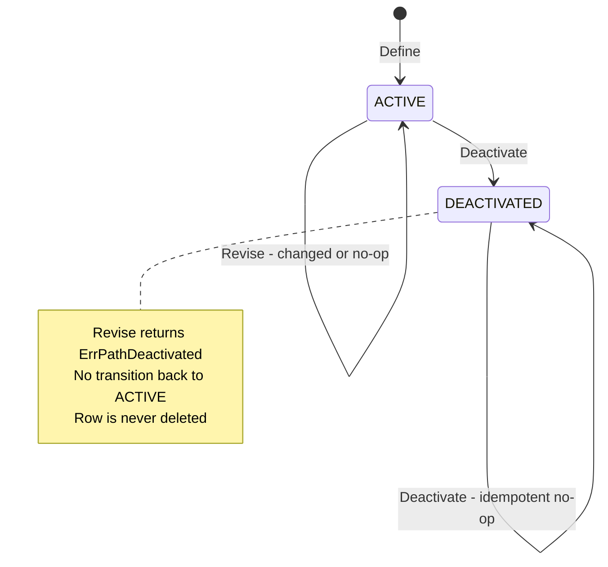
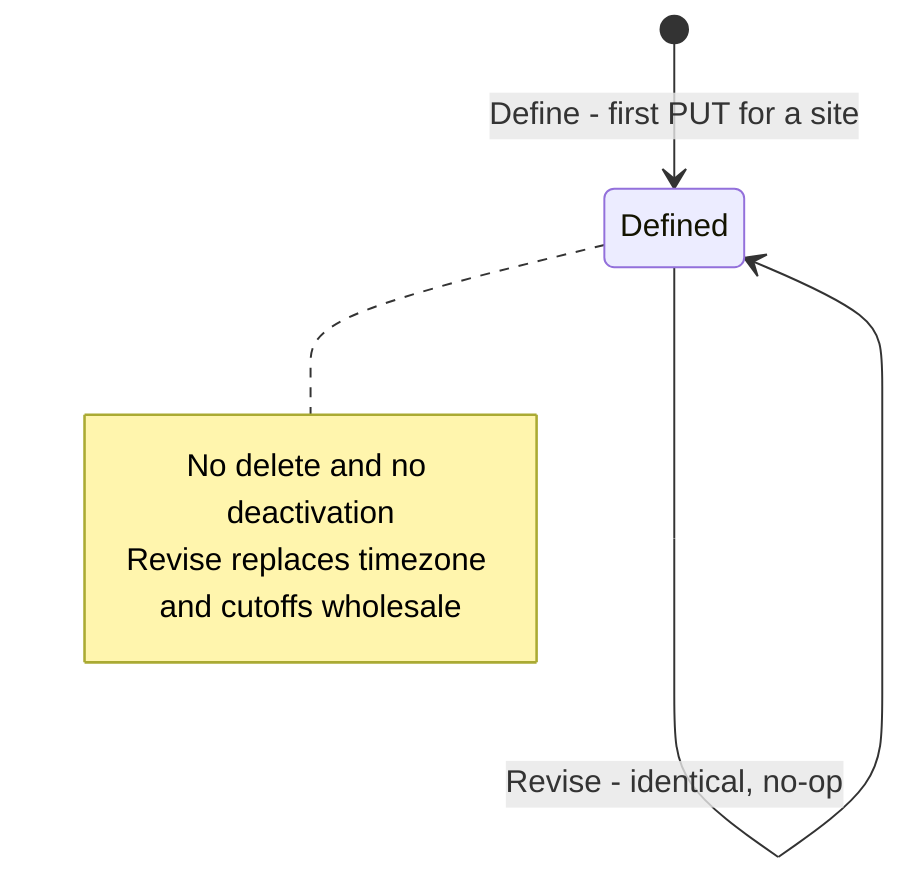

# Aggregate Design Canvas

:::info[Synced from process-path-management]
This page is a copy of [`docs/docs/ddd/aggregate-design-canvas.md`](https://github.com/IQVO/process-path-management/blob/develop/docs/docs/ddd/aggregate-design-canvas.md) on `develop`, derived from that repository's code. Edit it there, then re-sync.
:::

Following the [ddd-crew Aggregate Design Canvas v1.1](https://github.com/ddd-crew/aggregate-design-canvas).
Part of the [DDD artifact pack](https://github.com/IQVO/process-path-management/blob/develop/docs/docs/ddd/ddd-artifacts.md). The domain package
(`internal/domain/**`) has exactly **two aggregate roots**:
`processpath.ProcessPath` and `cptschedule.CPTSchedule`. The narrative
"why" behind the invariants lives in
[Aggregates & Invariants](https://github.com/IQVO/process-path-management/blob/develop/docs/docs/ddd/aggregates-and-invariants.md).

## ProcessPath

### 1. Name

`ProcessPath` (`internal/domain/processpath/process_path.go`), identity
`shared.PathId`.

### 2. Description

The operator-configurable definition of one process path: its canonical
id, the `matchPrefix` rule consumers use to resolve caller-supplied ids,
whether it is `Direct`, the capabilities required to work it, an optional
destination location role, and its fulfillment capability contract
(`cycleTimeP95`, `eligibility`). Persisted by natural key; never deleted.

### 3. State Transitions

Source: `processpath.Status` (`StatusActive = "ACTIVE"`,
`StatusDeactivated = "DEACTIVATED"`), `Define`, `(*ProcessPath).Revise`,
`(*ProcessPath).Deactivate`. Omits: `Rehydrate` (reconstruction, not a
transition).

### 4. Enforced Invariants

| Invariant | Enforced by |
| --- | --- |
| `pathId` non-empty | `processpath.ErrEmptyPathId` in `Define` |
| `matchPrefix` non-empty | `processpath.ErrEmptyMatchPrefix` in `validate` (Define + Revise) |
| `matchPrefix` lower-case, never coerced | `processpath.ErrMatchPrefixNotLowercase` in `validate` |
| at least one required capability | `processpath.ErrNoRequiredCapabilities` in `validate` |
| `destinationLocationRole` empty or Drop/WorkCenter/Shipping | `shared.ErrInvalidDestinationLocationRole` via `shared.ParseDestinationLocationRole` |
| `cycleTimeP95` strictly positive | `processpath.ErrInvalidCycleTime` in `validate` (also returned by the HTTP adapter for an unparsable duration) |
| only an Active path can be revised | `processpath.ErrPathDeactivated` in `Revise` |
| `pathId`, `direct`, `destinationLocationRole` immutable | `Revise` has no parameter for them |
| an id is never re-defined, active or deactivated | `usecases.ErrPathAlreadyExists` in `DefinePath` (use case, needs the repo): a `FindByID` pre-check, backed by the insert-only `ports.ProcessPathRepo.Create` (`INSERT ... ON CONFLICT (id) DO NOTHING` → `ports.ErrAlreadyExists`) so two concurrent defines of one id cannot both succeed |
| a path that a CPT schedule lists cannot be deactivated | `usecases.ErrPathReferencedByCPTSchedule` in `DeactivatePath`, via `ports.CPTScheduleRepo.ListSiteIDsReferencingPath` (409 `path-referenced-by-cpt-schedule`, ADR 0026); race-free since the path row is read `FOR UPDATE` first and `DefineCPTSchedule` holds `FOR SHARE` on every path it lists until commit (`ports.ProcessPathRepo.FindByIDForUpdate` / `LockByIDsForShare`, ADR 0028) |
| no lost update between load and save | `ports.ErrConcurrentModification` from the version-guarded upsert in `postgres.ProcessPathRepo.Save` (ADR 0017) — used by revise and deactivate, not by create |

### 5. Corrective Policies

- Invalid input is rejected synchronously (422 RFC 7807); nothing is
  persisted or published — no compensating action is needed.
- `409 concurrent-modification`: the client reloads and retries.
- Deactivation is not a compensating action for anything downstream:
  this context only publishes `ProcessPathDeactivated`, and each consumer
  applies it to its own local catalogue (for example the
  `applyDeactivated` handlers in the sibling `kafkacatalog` /
  `processpathcache` consumers). What happens to work already in flight
  is each consumer's decision.
- A path that any CPT schedule still lists is **not** deactivated: the
  command is refused with `409 path-referenced-by-cpt-schedule` naming the
  sites, and the operator revises those schedules first (ADR 0026). The
  schedule is never pruned automatically and no `CPTScheduleChanged` is
  raised as a side effect of a deactivation.

### 6. Handled Commands

| Command | Entry point | Use case |
| --- | --- | --- |
| Define path | `POST /process-paths` | `usecases.DefinePath` → `processpath.Define` |
| Revise path | `PUT /process-paths/{pathId}` | `usecases.RevisePath` → `(*ProcessPath).Revise` |
| Deactivate path | `DELETE /process-paths/{pathId}` | `usecases.DeactivatePath` → `(*ProcessPath).Deactivate` |

### 7. Created Events

- `com.warehouse.wes.process-path-management.processpath.ProcessPathCreated`
- `com.warehouse.wes.process-path-management.processpath.ProcessPathUpdated` (only when `changed`)
- `com.warehouse.wes.process-path-management.processpath.ProcessPathDeactivated` (only from ACTIVE)

### 8. Throughput

*Estimate.* Operator-driven configuration: tens of commands per day at
most, close to zero concurrency per instance. Reads (`GET`, MCP) dominate
writes; consumers do not read over REST at all.

### 9. Size

*Estimate.* Lifetime of years. Roughly 1 Created + a handful of Updated +
at most 1 Deactivated event per instance (under ~20). State is a few
hundred bytes; the catalogue holds tens of paths, not thousands.

## CPTSchedule

### 1. Name

`CPTSchedule` (`internal/domain/cptschedule/cpt_schedule.go`), identity
`shared.SiteId`; child entity `Cutoff` (local identity `cptId`).

### 2. Description

A site's recurring Critical Pull Time schedule: an IANA timezone and one
or more cutoffs (`cptId`, `localTime`, `daysOfWeek`, `shipMethod`,
`eligiblePathIds`). Modelled once per site because a CPT belongs to a
departure, not to a path (ADR 0010). Always replaced wholesale.

### 3. State Transitions

The aggregate has **no status enum**; it exists or it does not.

Source: `cptschedule.Define`, `(*CPTSchedule).Revise`,
`usecases.DefineCPTSchedule`. Omits: `Rehydrate`.

### 4. Enforced Invariants

| Invariant | Enforced by |
| --- | --- |
| timezone non-empty | `cptschedule.ErrEmptyTimezone` |
| timezone is a valid IANA zone | `cptschedule.ErrInvalidTimezone` (`time.LoadLocation`) |
| at least one cutoff | `cptschedule.ErrNoCutoffs` |
| `cptId` unique within the schedule | `cptschedule.ErrDuplicateCptId` |
| `cptId` non-empty | `cptschedule.ErrEmptyCptId` (`NewCutoff`) |
| `localTime` present and strict `HH:MM` | `cptschedule.ErrEmptyLocalTime`, `cptschedule.ErrInvalidLocalTime` |
| `daysOfWeek` non-empty, each `Mon`..`Sun` | `cptschedule.ErrNoDaysOfWeek`, `cptschedule.ErrInvalidDayOfWeek` |
| `shipMethod` non-empty | `cptschedule.ErrEmptyShipMethod` |
| `eligiblePathIds` non-empty | `cptschedule.ErrNoEligiblePathIds` |
| every eligible path id is an Active ProcessPath (cross-aggregate) | `usecases.ErrIneligiblePathId` in `DefineCPTSchedule.validateEligiblePathIds` |
| no lost update | `ports.ErrConcurrentModification` from `postgres.CPTScheduleRepo.Save` |

### 5. Corrective Policies

- Invalid schedule → 422, nothing stored or published.
- Concurrent writer → 409, reload and retry.
- Consumers compute concrete cutoff instants themselves from
  `(local_time, days_of_week, timezone)`; this context never publishes
  absolute timestamps.

### 6. Handled Commands

| Command | Entry point | Use case |
| --- | --- | --- |
| Define or revise CPT schedule | `PUT /sites/{siteId}/cpt-schedule` | `usecases.DefineCPTSchedule` → `cptschedule.Define` or `(*CPTSchedule).Revise` |

### 7. Created Events

- `com.warehouse.wes.process-path-management.cptschedule.CPTScheduleChanged` — full snapshot, on first define and on every real revision.

### 8. Throughput

*Estimate.* One schedule per site, revised when carrier departures change
— a few writes per site per week.

### 9. Size

*Estimate.* Lifetime of the site. Tens of cutoffs per schedule; one event
per revision, so a few hundred events per instance over years.

## Not aggregates

| Type | What it is |
| --- | --- |
| `shared.Eligibility`, `shared.DestinationLocationRole`, `shared.PathId`, `shared.SiteId`, `shared.Capability`, `cptschedule.Weekday` | Value objects / identity types |
| `cptschedule.Cutoff` | Entity inside `CPTSchedule` |
| `report.CatalogueReport`, `report.Row` (`internal/analytics/report`) | Read model of the analytics projection — built by `pathmgmt-projector`, served by `pathmgmt-reports` |
| `processPathResponse`, `cptScheduleResponse`, MCP DTOs | Adapter DTOs |
| Consumer catalogue caches in sibling repos | Their read models, not part of this context |
