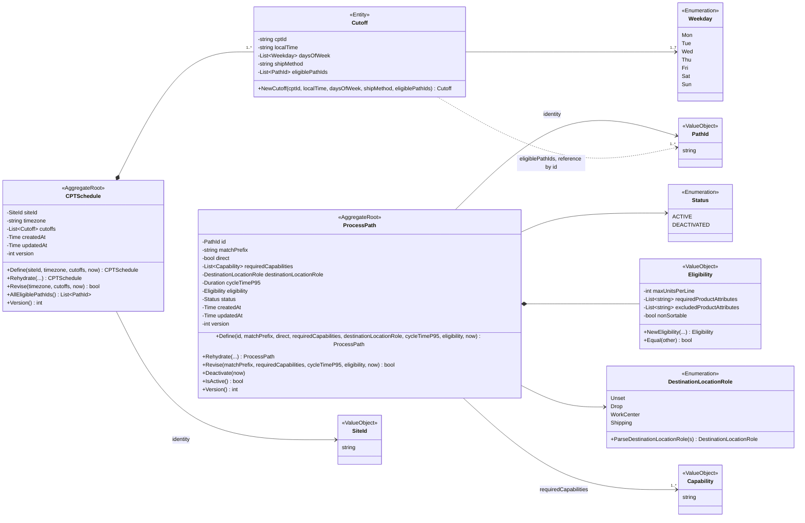
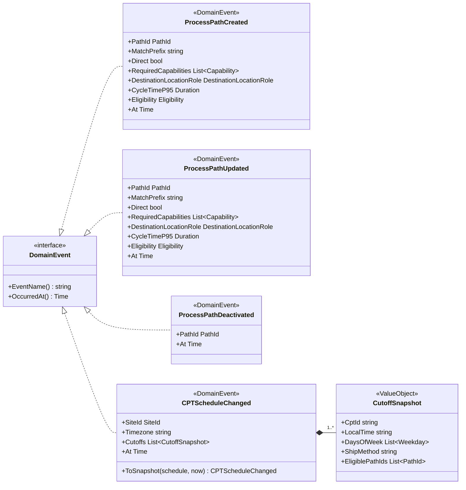
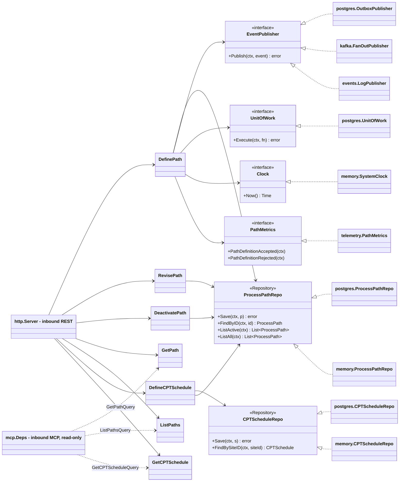

# Class Diagram

:::info[Synced from process-path-management]
This page is a copy of [`docs/docs/ddd/class-diagram.md`](https://github.com/IQVO/process-path-management/blob/develop/docs/docs/ddd/class-diagram.md) on `develop`, derived from that repository's code. Edit it there, then re-sync.
:::

UML class diagrams of `internal/domain/**`, plus the hexagonal ports and
adapters around it. Part of the [DDD artifact pack](https://github.com/IQVO/process-path-management/blob/develop/docs/docs/ddd/ddd-artifacts.md).
Type, field and method names are the real Go identifiers; Go slices are
written `List~T~` and the unexported fields are shown with `-`.

## 1. Aggregates, entities and value objects

Source: `internal/domain/processpath/process_path.go`,
`internal/domain/cptschedule/cpt_schedule.go`,
`internal/domain/shared/shared.go`, `internal/domain/shared/eligibility.go`.
Omits: read accessors (`MatchPrefix()`, `Cutoffs()`, ...), the private
`validate`/equality helpers and the `Err...` sentinels (listed on the
[Aggregate Design Canvas](/contexts/process-path-management/aggregate-design-canvas)).
`maxUnitsPerLine` is a `*int` (nil means unbounded). `Unset` is
`DestinationLocationRoleUnset = ""`. The `Cutoff` to `PathId` link is a
reference by id only: `CPTSchedule` never holds a `ProcessPath`; the
Active-path rule lives in the `DefineCPTSchedule` use case.

## 2. Domain events

Source: `internal/domain/shared/events.go`,
`internal/domain/cptschedule/events.go`. Omits: the wire structs
(`ProcessPathData`, `CPTScheduleData`; see [Domain Events](/contexts/process-path-management/domain-events)).
The three path events live in `shared`; `CPTScheduleChanged` and
`CutoffSnapshot` live in `cptschedule`. Events are built in the use cases,
not by the aggregates.

## 3. Ports and adapters

Source: `internal/application/ports/ports.go`,
`internal/application/usecases/*.go`,
`internal/adapters/inbound/http/server.go`,
`internal/adapters/inbound/mcp/tools.go`,
`internal/adapters/outbound/{postgres,memory,events,kafka,telemetry}`,
`cmd/pathmgmt/main.go`. Omits: `RevisePath`, `DeactivatePath` and
`DefineCPTSchedule` also depend on `EventPublisher`, `UnitOfWork` and
`Clock` (left out to keep the diagram readable); the analytics side
(`internal/analytics/report` ports `ReportStore`/`ProjectionStore`,
`analyticsstore`, the `pathmgmt-projector` Kafka consumer and the
`pathmgmt-reports` HTTP handler); the outbox relay and sweeper, which are
driven by `cmd/pathmgmt`, not by a port. Publisher selection:
`OutboxPublisher` when `EVENT_PUBLISHER=kafka` and `DATABASE_URL` is set;
`FanOutPublisher` from `kafka.NewSharedIdFanOut` (direct to both topics) when `EVENT_PUBLISHER=kafka`
without `DATABASE_URL`; `LogPublisher` otherwise.
