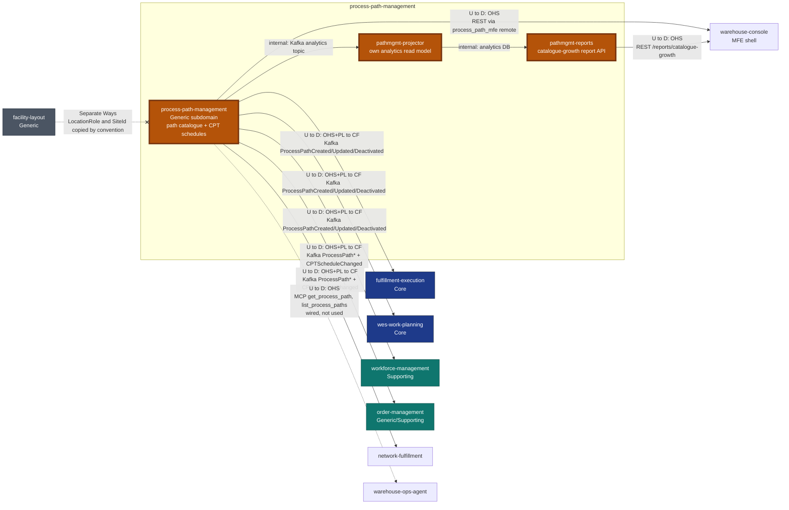

# Context Map

:::info[Synced from process-path-management]
This page is a copy of [`docs/docs/ecosystem/context-map.md`](https://github.com/IQVO/process-path-management/blob/develop/docs/docs/ecosystem/context-map.md) on `develop`, derived from that repository's code. Edit it there, then re-sync.
:::


This page follows the [ddd-crew Context Mapping](https://github.com/ddd-crew/context-mapping)
notation and shows **this bounded context's slice** of the fleet map. It
is part of the [DDD artifact pack](https://github.com/IQVO/process-path-management/blob/develop/docs/docs/ddd/ddd-artifacts.md).

Process Path Management is **always upstream**. It is the **Open Host
Service / Published Language** source for the
`warehouse.process-path-management.events` topic and has **zero outbound
dependency** on any other bounded context: it consumes no other context's
topic and makes no synchronous REST or MCP call to any sibling. This is
enforced in code by `internal/architecture/fitness_test.go`'s
`TestNoSiblingContextOutboundCalls`, which fails the build if
`internal/adapters/outbound/**` ever imports `net/http`. Cross-context
facts it needs (capability names, site ids, facility-layout location
roles, product attributes) are carried as **local, declarative values**,
never looked up live.

## Map



Source: `internal/adapters/outbound/kafka/publisher.go`,
`internal/adapters/kafka/cloudevents/types.go`,
`internal/adapters/inbound/mcp/tools.go`, `cmd/pathmgmt-reports/main.go`,
`internal/architecture/fitness_test.go`, plus the sibling adapter files
listed in the table below (read from each sibling's `origin/develop`).
Omits: the shared Kafka broker, Kong/Nginx edges, and siblings with no
relationship to this context (inventory-storage, labor-performance,
warehouse-planning).

Legend: solid edge = live; dashed edge = wired but unused; crossed edge =
deliberately absent. `U to D` = Upstream to Downstream. Patterns: OHS =
Open Host Service, PL = Published Language, CF = Conformist.

## Relationships

| # | Upstream → Downstream | Pattern | Technology | Status | Evidence |
| --- | --- | --- | --- | --- | --- |
| 1 | process-path-management → fulfillment-execution | OHS + PL → CF | Kafka `warehouse.process-path-management.events`, types `com.warehouse.wes.process-path-management.processpath.ProcessPathCreated` / `...ProcessPathUpdated` / `...ProcessPathDeactivated` | Live | fulfillment-execution `internal/adapters/outbound/kafkacatalog/consumer.go` |
| 2 | process-path-management → wes-work-planning | OHS + PL → CF | Same topic, same three `processpath.*` types | Live | wes-work-planning `internal/adapters/outbound/kafkacatalog/consumer.go` |
| 3 | process-path-management → workforce-management | OHS + PL → CF | Same topic, same three `processpath.*` types | Live | workforce-management `internal/adapters/outbound/kafkacatalog/consumer.go` |
| 4 | process-path-management → order-management | OHS + PL → CF | Same topic: three `processpath.*` types (decoding `cycle_time_p95`, `eligibility`) plus `com.warehouse.wes.process-path-management.cptschedule.CPTScheduleChanged` | Live | order-management `internal/adapters/outbound/kafkacatalog/consumer.go` and `internal/adapters/outbound/kafkacptschedule/consumer.go` |
| 5 | process-path-management → network-fulfillment | OHS + PL → CF | Same topic: three `processpath.*` types (decoding `cycle_time_p95`) plus `cptschedule.CPTScheduleChanged` | Live | network-fulfillment `internal/adapters/outbound/processpathcache/consumer.go`, started from `cmd/netfulfil/main.go` |
| 6 | process-path-management → warehouse-ops-agent | OHS (MCP) → Customer | MCP Streamable HTTP, tools `get_process_path`, `list_process_paths` | Wired but unused | warehouse-ops-agent `internal/adapters/outbound/mcpclient/process_path_management.go`; `cmd/agent/main.go` assigns it to `_` ("kept wired for a future use case") |
| 7 | process-path-management → warehouse-console | OHS (REST) → Customer | `web/` remote `process_path_mfe` calling `POST/PUT/DELETE /process-paths*` through Kong `/api/process-path-management` | Live | this repo's `web/src/api.ts`; warehouse-console `src/App.tsx` (`process_path_mfe/App`) |
| 8 | process-path-management (pathmgmt-reports) → warehouse-console | OHS (REST) → Customer | `GET /reports/catalogue-growth`, `GET /reports/catalogue-growth/freshness` | Live | warehouse-console `src/features/context-reports/processPathManagement.config.tsx` |
| 9 | facility-layout ↔ process-path-management | Separate Ways | none — `DestinationLocationRole` (`Drop`/`WorkCenter`/`Shipping`) and `SiteId` are local copies of facility-layout vocabulary, kept in sync by convention | Deliberately absent | `internal/domain/shared/shared.go` |
| 10 | any sibling → process-path-management (inbound Kafka) | — | none — the only consumer in this repo reads its own analytics topic | Deliberately absent | `internal/adapters/inbound/kafka/analytics_consumer.go` |
| 11 | process-path-management → any sibling (REST/MCP client) | — | none — banned | Deliberately absent | `TestNoSiblingContextOutboundCalls` in `internal/architecture/fitness_test.go` |

The `get_cpt_schedule` and `get_catalogue_growth_report` MCP tools have
no known sibling caller today.

### What the consumers read

- `fulfillment-execution`, `wes-work-planning` and `workforce-management`
  replay the topic into a local catalogue cache. Each decodes
  `destination_location_role`
  ([ADR 0009](https://github.com/IQVO/process-path-management/blob/develop/docs/docs/adr/0009-destination-location-role-on-process-path.md))
  into that cache; none of them consumes `CPTScheduleChanged`. The cutover
  from the static YAML file was executed on 2026-09-06
  ([ADR 0002](https://github.com/IQVO/process-path-management/blob/develop/docs/docs/adr/0002-yaml-to-kafka-cutover.md)).
- `order-management` runs two consumers, one for the path catalogue
  (`cycle_time_p95`, `eligibility`) and one for `CPTScheduleChanged` —
  the fulfillment capability contract of
  [ADR 0010](https://github.com/IQVO/process-path-management/blob/develop/docs/docs/adr/0010-fulfillment-capability-contract.md), from which it
  derives its promise.
- `network-fulfillment` keeps one combined read model of path
  `cycle_time_p95` and site CPT schedules (`processpathcache`), with a
  per-process-unique consumer group replaying from the earliest offset.

Evidence was read with `git grep` against each sibling's locally fetched
`origin/develop`; re-check before relying on a sibling detail.

## Own analytics topic (not a sibling integration)

Every domain event is also published onto
`warehouse.process-path-management.analytics`
([ADR 0007](https://github.com/IQVO/process-path-management/blob/develop/docs/docs/adr/0007-analytical-data-product.md)) in the same outbox
transaction. The only consumer is this service's own
`pathmgmt-projector` (consumer group `process-path-management-analytics`),
which projects the "Process Path Catalogue Growth & Change" report served
by `pathmgmt-reports`. It projects the three `ProcessPath*` types and
skips `CPTScheduleChanged`; a message that is not a valid CloudEvent is
dead-lettered to `warehouse.process-path-management.analytics.dlq`
([ADR 0012](https://github.com/IQVO/process-path-management/blob/develop/docs/docs/adr/0012-kafka-dlq-and-graceful-shutdown.md)).

Every message on both topics is a **CloudEvents 1.0** event in structured
content mode, Kafka header `content-type: application/cloudevents+json;
charset=UTF-8` ([ADR 0016](https://github.com/IQVO/process-path-management/blob/develop/docs/docs/adr/0016-cloudevents-mandatory-event-envelope.md)):

```json
{
  "specversion": "1.0",
  "id": "4f1c2a7e-9d31-4a6b-8f0e-6b2c1d5e7a90",
  "source": "/warehouse/process-path-management",
  "type": "com.warehouse.wes.process-path-management.processpath.ProcessPathCreated",
  "subject": "PICK",
  "time": "2026-09-06T00:00:00Z",
  "datacontenttype": "application/json",
  "dataschema": "urn:warehouse:process-path-management:events:ProcessPathCreated:v1",
  "data": {
    "path_id": "PICK",
    "match_prefix": "pick",
    "direct": true,
    "required_capabilities": ["pick"],
    "cycle_time_p95": "2h0m0s",
    "eligibility": {}
  }
}
```

Exact `type` strings consumers dispatch on (cross-service contract):

| type | consumers |
| --- | --- |
| `com.warehouse.wes.process-path-management.processpath.ProcessPathCreated` | fulfillment-execution, wes-work-planning, workforce-management, order-management, network-fulfillment |
| `com.warehouse.wes.process-path-management.processpath.ProcessPathUpdated` | same five |
| `com.warehouse.wes.process-path-management.processpath.ProcessPathDeactivated` | same five |
| `com.warehouse.wes.process-path-management.cptschedule.CPTScheduleChanged` | order-management, network-fulfillment |

The analytics occurrence carries the same `type`/`id`/`subject`/`time`/`data`
with `dataschema` `urn:warehouse:process-path-management:analytics:<EventName>:v1`.
Per-event payloads: [Domain Events](/contexts/process-path-management/domain-events); full schema:
[apis/asyncapi.yaml](https://github.com/IQVO/process-path-management/blob/develop/apis/asyncapi.yaml).

## Why this is Kafka-event-driven, not synchronous HTTP read-through

Every other cross-context integration in this fleet that resembles "context
A needs a fact that context B owns" is Kafka-driven, never a synchronous
hot-path call. A synchronous read-through here (each consumer calling this
service's REST API on every dispatch decision) would put this
Generic-subdomain service's availability on the hot path of the consuming
contexts' most latency-sensitive operations. See
[ADR 0001](https://github.com/IQVO/process-path-management/blob/develop/docs/docs/adr/0001-process-path-management-bounded-context.md) for the
full reasoning.

## Why this is a separate bounded context, not a package inside an existing one

No single existing context should own the process-path catalogue: it is
needed identically by several services, and none of them is a more natural
owner than the others. This is the same "extract generic logic instead of
duplicating it" argument `facility-layout` was built on — see
[ADR 0001](https://github.com/IQVO/process-path-management/blob/develop/docs/docs/adr/0001-process-path-management-bounded-context.md),
including the retired static-YAML predecessor this service replaces.
