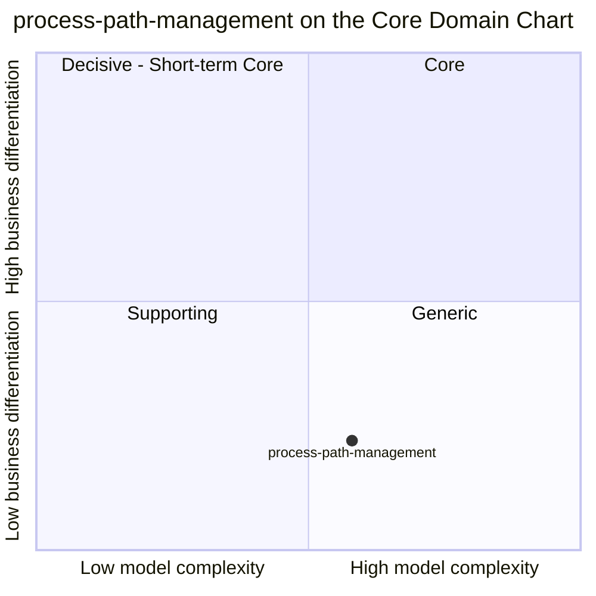

# Core Domain Chart

:::info[Synced from process-path-management]
This page is a copy of [`docs/docs/ddd/core-domain-chart.md`](https://github.com/IQVO/process-path-management/blob/develop/docs/docs/ddd/core-domain-chart.md) on `develop`, derived from that repository's code. Edit it there, then re-sync.
:::

Following the [ddd-crew Core Domain Charts](https://github.com/ddd-crew/core-domain-charts).
Part of the [DDD artifact pack](https://github.com/IQVO/process-path-management/blob/develop/docs/docs/ddd/ddd-artifacts.md).

**Classification: Generic subdomain** — the same verdict as
[ADR 0001](https://github.com/IQVO/process-path-management/blob/develop/docs/docs/adr/0001-process-path-management-bounded-context.md) and the
[Aggregates & Invariants](https://github.com/IQVO/process-path-management/blob/develop/docs/docs/ddd/aggregates-and-invariants.md) page. A
process-path catalogue is well understood and not a competitive
differentiator; it is extracted because several contexts need the same
definition and none of them is its natural owner.

Source: `internal/domain/processpath/process_path.go`,
`internal/domain/cptschedule/cpt_schedule.go`,
`internal/application/usecases/*.go`,
`docs/docs/adr/0001-process-path-management-bounded-context.md`,
`docs/docs/adr/0010-fulfillment-capability-contract.md`.
Omits: sibling contexts (each owns its own chart) and any time dimension.

## Why this position

| Axis | Position | Evidence |
| --- | --- | --- |
| Business differentiation | Low (0.22) | ADR 0001 classifies it Generic. It decides nothing about dispatch, routing or assignment; it declares what a path is. Competitive behaviour (pick/pack/SLAM execution, waveless release, the order promise) lives in its consumers. |
| Model complexity | Moderate (0.58) | 2 aggregate roots (`ProcessPath`, `CPTSchedule`), 1 child entity (`Cutoff`), 3 value types (`Eligibility`, which has no invariant of its own, plus the closed sets `DestinationLocationRole` and `Weekday`), 18 domain error sentinels (6 in `processpath`, 11 in `cptschedule`, 1 in `shared`) plus 1 cross-aggregate rule in a use case (`ErrIneligiblePathId`), 4 published event types, a two-state lifecycle. Infrastructure is heavier than the domain: transactional outbox, idempotency keys, optimistic concurrency, analytics projector (ADRs 0003, 0011, 0017, 0007). |

The point sits right of centre because the CPT schedule (ADR 0010) and the
fulfillment capability contract added real rules. It is still
bottom-right — **Generic** — because none of that logic is a business
differentiator.

## Evolution

| Stage (Wardley) | Applies? | Note |
| --- | --- | --- |
| Genesis | No | |
| Custom-built | Yes, today | Built in-house because the catalogue schema is fleet-specific (`matchPrefix` rule, capability vocabulary, CPT cutoffs). |
| Product | Plausible next | Process-path / labour-path catalogues are standard features of commercial WMS/WES products. |
| Commodity | Direction of travel | A configuration catalogue tends towards commodity; the stable published language is what the fleet depends on. |

Expected movement: right along the evolution axis (custom → product), not
up the differentiation axis. If CPT feasibility logic ever moved here from
`order-management`, the context would move up and would need
re-classification by a new ADR.
