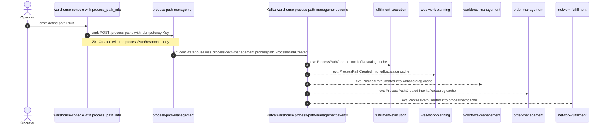
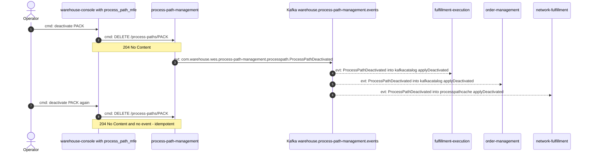
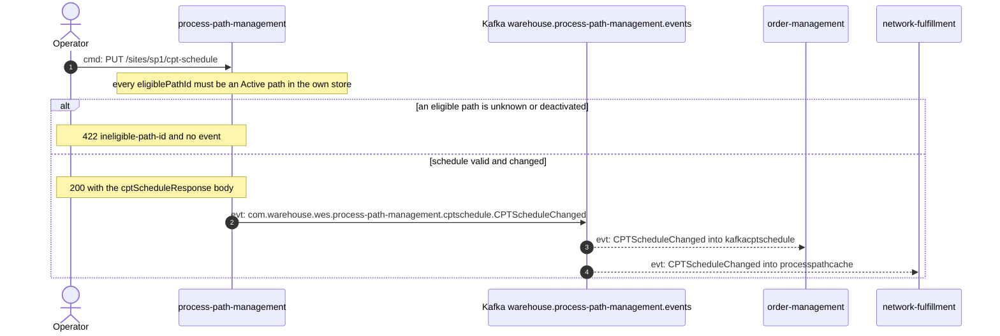
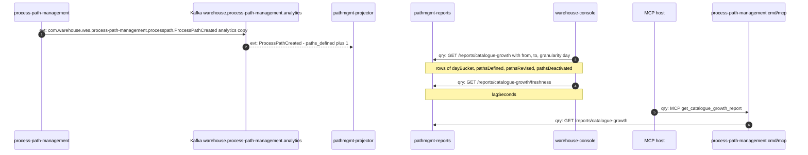

# Domain Message Flow

:::info[Synced from process-path-management]
This page is a copy of [`docs/docs/ddd/domain-message-flow.md`](https://github.com/IQVO/process-path-management/blob/develop/docs/docs/ddd/domain-message-flow.md) on `develop`, derived from that repository's code. Edit it there, then re-sync.
:::

Following [ddd-crew Domain Message Flow Modelling](https://github.com/ddd-crew/domain-message-flow-modelling).
Part of the [DDD artifact pack](https://github.com/IQVO/process-path-management/blob/develop/docs/docs/ddd/ddd-artifacts.md). Every arrow is a real
message: a REST route, a full CloudEvents `type` on a Kafka topic, or an
MCP tool. Prefixes: `cmd:` command, `evt:` event, `qry:` query.
Responses are shown as notes, not arrows. Event
arrows from the Kafka topic to a consumer are the consumer reading the
topic; this context never calls a consumer.

## 1. Operator defines a new process path

Source: `web/src/api.ts`, `internal/adapters/inbound/http/server.go`,
`internal/application/usecases/define_path.go`,
`internal/adapters/outbound/kafka/publisher.go`; sibling consumers listed
on the [Context Map](/contexts/process-path-management/context-map). Omits: the outbox relay
hop and the analytics copy (see [Sequence Diagrams](/contexts/process-path-management/sequence-diagrams)),
validation failures. Revise follows the same shape with
`PUT /process-paths/{pathId}` and `ProcessPathUpdated`.

## 2. Operator retires a process path

Source: `internal/application/usecases/deactivate_path.go`,
`internal/domain/processpath/process_path.go`; fulfillment-execution and
order-management `kafkacatalog/consumer.go`, network-fulfillment
`processpathcache/consumer.go` (each `applyDeactivated`). Omits:
wes-work-planning and workforce-management (same as fulfillment-execution).

## 3. Operator publishes a site's CPT schedule

Source: `internal/application/usecases/cpt_schedule.go`,
`internal/domain/cptschedule/events.go`; order-management
`kafkacptschedule/consumer.go`. Omits: the identical-schedule branch (200,
no event).

## 4. Console shows catalogue growth

Source: `internal/adapters/outbound/kafka/analytics_publisher.go`,
`internal/adapters/inbound/kafka/analytics_consumer.go`,
`internal/adapters/inbound/http/reports_handler.go`,
`internal/adapters/inbound/mcp/report_tool.go`; warehouse-console
`src/features/context-reports/processPathManagement.config.tsx`.
Omits: the DLQ path, and the fact that the MCP report tool is only
registered when `REPORTS_BASE_URL` is set.
