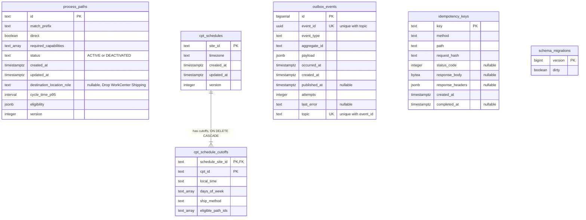
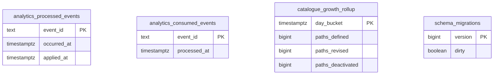

# Entity Relationship

:::info[Synced from process-path-management]
This page is a copy of [`docs/docs/ddd/entity-relationship.md`](https://github.com/IQVO/process-path-management/blob/develop/docs/docs/ddd/entity-relationship.md) on `develop`, derived from that repository's code. Edit it there, then re-sync.
:::

The final schema after applying every migration in order. Part of the
[DDD artifact pack](https://github.com/IQVO/process-path-management/blob/develop/docs/docs/ddd/ddd-artifacts.md). There are **two databases**:
the OLTP database (`DATABASE_URL`, `migrations/0001`–`0007`) and the
separate analytics database (`ANALYTICS_DATABASE_URL`,
`migrations/analytics/0001`), written only by `pathmgmt-projector` and
read only by `pathmgmt-reports` (ADR 0007). Both are migrated with
golang-migrate, which keeps its own `schema_migrations` table in each.

## OLTP database

Source: `migrations/0001_init.up.sql` through
`migrations/0007_version.up.sql`; `schema_migrations` is golang-migrate's
own table (`internal/adapters/outbound/postgres/migrate.go`). `text_array`
stands for Postgres `TEXT[]`. Omits: indexes
(`idx_process_paths_active` partial on `status = 'ACTIVE'`,
`idx_outbox_events_unpublished` partial on `published_at IS NULL`,
`idx_idempotency_keys_created_at`) and the `CHECK` constraints on
`status` and `destination_location_role`.

The only `FOREIGN KEY` in the schema is
`cpt_schedule_cutoffs.schedule_site_id → cpt_schedules.site_id`. Three
logical links deliberately have **no** foreign key:

- `cpt_schedule_cutoffs.eligible_path_ids → process_paths.id` is an
  aggregate boundary. ADR 0010 checks it at write time in the
  `DefineCPTSchedule` use case, "not by a foreign key", and it is stored as
  a `TEXT[]` that is never queried on its own.
- `outbox_events.aggregate_id` holds a `path_id` or `site_id` (the Kafka
  key). The outbox is infrastructure and keeps rows independent of the
  aggregate tables; the sweeper deletes published rows after a retention
  period (ADR 0018).
- `idempotency_keys` stores a recorded HTTP response, not a reference to
  the path it created.

## Analytics database

Source: `migrations/analytics/0001_report.up.sql`. Omits: the indexes on
`occurred_at` and `day_bucket`. There are no foreign keys: the two dedupe
tables hold CloudEvents `id`s, and the rollup is bucketed by UTC day.

## Table ≠ aggregate

| Table | What it is | Aggregate / owner |
| --- | --- | --- |
| `process_paths` | Domain state | `ProcessPath` aggregate (one row per aggregate) |
| `cpt_schedules` | Domain state | `CPTSchedule` aggregate root |
| `cpt_schedule_cutoffs` | Domain state | `Cutoff` entities inside `CPTSchedule`; replaced wholesale on every `CPTScheduleRepo.Save` (delete then insert) |
| `outbox_events` | Infrastructure: transactional outbox (ADR 0003, topic column from ADR 0007) | One row per event per topic, written in the aggregate's transaction |
| `idempotency_keys` | Infrastructure: `Idempotency-Key` replay cache (ADR 0011), swept by TTL (ADR 0018) | none — HTTP adapter |
| `schema_migrations` | Infrastructure: golang-migrate bookkeeping | none |
| `analytics_processed_events` | Analytics projection dedupe and freshness | `pathmgmt-projector` read model |
| `analytics_consumed_events` | Analytics consumer dedupe gate | `pathmgmt-projector` read model |
| `catalogue_growth_rollup` | Analytics projection, "Process Path Catalogue Growth & Change" | `pathmgmt-projector` read model, served by `pathmgmt-reports` |

There is no inbound `processed_events` table in the OLTP database: this
context consumes no other context's topic.
