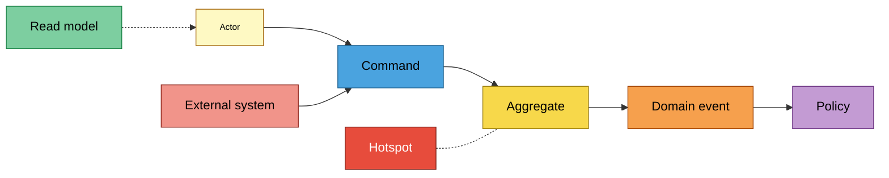
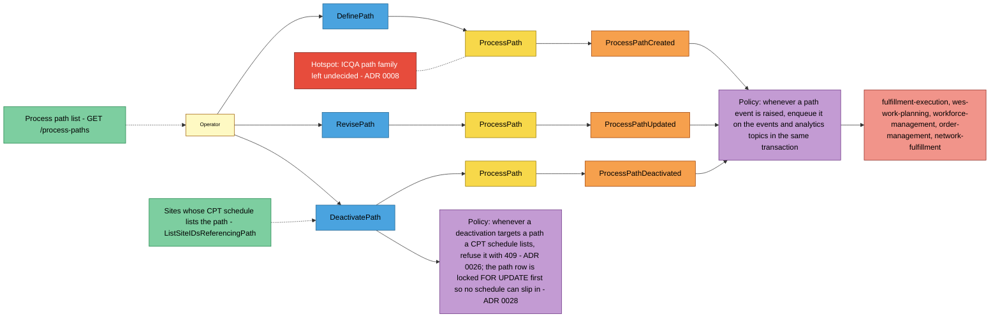
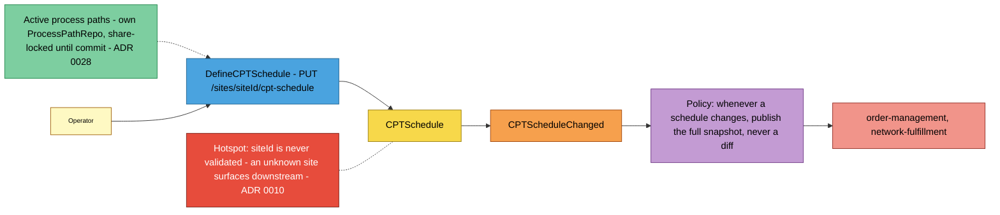
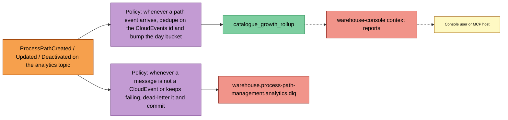

# EventStorming

:::info[Synced from process-path-management]
This page is a copy of [`docs/docs/ddd/eventstorming.md`](https://github.com/IQVO/process-path-management/blob/develop/docs/docs/ddd/eventstorming.md) on `develop`, derived from that repository's code. Edit it there, then re-sync.
:::

Design-level [EventStorming](https://github.com/ddd-crew/eventstorming-glossary-cheat-sheet)
of this context's three processes, reconstructed from the code rather
than from a workshop. Part of the [DDD artifact pack](https://github.com/IQVO/process-path-management/blob/develop/docs/docs/ddd/ddd-artifacts.md).
Read each board left to right: an **actor** issues a **command**, an
**aggregate** decides, a **domain event** records the fact, a **policy**
reacts ("whenever ... then ..."), **read models** inform the next
decision, and **external systems** sit on the edges. **Hotspots** are real
open issues found in the code or recorded in ADRs, not invented ones.

## Legend

Source: ddd-crew EventStorming cheat-sheet colours as fixed by the fleet
documentation brief.

## Process 1 — define, revise and deactivate a process path

Source: `internal/application/usecases/define_path.go`,
`revise_path.go`, `deactivate_path.go`, `queries.go`;
`internal/domain/processpath/process_path.go`;
`internal/adapters/outbound/postgres/outbox_publisher.go`;
`cmd/pathmgmt/main.go` (`buildEventPublisher`). Omits: the no-op branches
(an unchanged revision and a repeated deactivation raise no event) and
validation failures (422, nothing raised). `DefinePath` persists through
the insert-only `ProcessPathRepo.Create`, so two concurrent defines of one
id raise `ProcessPathCreated` once and the loser gets 409. A refused
deactivation (policy P2) raises nothing and leaves the path ACTIVE.

## Process 2 — publish a site's CPT schedule

Source: `internal/application/usecases/cpt_schedule.go`
(`lockAndValidateEligiblePathIds`), `internal/domain/cptschedule/cpt_schedule.go`,
`internal/domain/cptschedule/events.go` (`ToSnapshot`),
`docs/docs/adr/0010-fulfillment-capability-contract.md`. Omits: the
identical-schedule no-op and `GetCPTSchedule`.

## Process 3 — project catalogue growth

Source: `internal/adapters/inbound/kafka/analytics_consumer.go`,
`internal/adapters/outbound/analyticsstore/postgres_projection.go`,
`internal/adapters/inbound/http/reports_handler.go`,
`internal/adapters/inbound/mcp/report_tool.go`, `apis/asyncapi.yaml`.
Omits: the freshness endpoint and `CPTScheduleChanged`, which the
projector commits and skips.

## Stickies and their code evidence

| Sticky | Kind | Evidence |
| --- | --- | --- |
| Operator | Actor | `web/src/screens/ProcessPathsScreen.tsx` (the `process_path_mfe` remote) and direct REST callers |
| DefinePath / RevisePath / DeactivatePath | Command | `usecases.DefinePath`, `usecases.RevisePath`, `usecases.DeactivatePath`; routes `POST /process-paths`, `PUT` and `DELETE /process-paths/{pathId}` |
| DefineCPTSchedule | Command | `usecases.DefineCPTSchedule`; route `PUT /sites/{siteId}/cpt-schedule` |
| ProcessPath | Aggregate | `processpath.ProcessPath` (`Define`, `Revise`, `Deactivate`) |
| CPTSchedule | Aggregate | `cptschedule.CPTSchedule` (`Define`, `Revise`) |
| ProcessPathCreated / Updated / Deactivated | Domain event | `shared.ProcessPathCreated`, `shared.ProcessPathUpdated`, `shared.ProcessPathDeactivated` |
| CPTScheduleChanged | Domain event | `cptschedule.CPTScheduleChanged` |
| Enqueue on both topics | Policy | `postgres.OutboxPublisher.Publish` with `IntegrationEncoder` and `AnalyticsEncoder` (`cmd/pathmgmt/main.go`) |
| Full snapshot, never a diff | Policy | `cptschedule.ToSnapshot` |
| Dedupe and bump the day bucket | Policy | `AnalyticsConsumer.handleFetchedMessage` then `ApplyProcessPath*` |
| Dead-letter and commit | Policy | `AnalyticsConsumer.deadLetterAndCommit` (ADR 0012) |
| Process path list | Read model | `usecases.ListPaths` (`GET /process-paths`, MCP `list_process_paths`) |
| Active process paths | Read model | `ProcessPathRepo.LockByIDsForShare` inside `lockAndValidateEligiblePathIds` (rows share-locked until commit, ADR 0028) |
| Sites whose CPT schedule lists the path | Read model | `ports.CPTScheduleRepo.ListSiteIDsReferencingPath` inside `DeactivatePath`, after `ProcessPathRepo.FindByIDForUpdate` (ADR 0028) |
| Refuse deactivation while a schedule lists the path | Policy | `usecases.DeactivatePath` returning `ErrPathReferencedByCPTSchedule` (ADR 0026) |
| catalogue_growth_rollup | Read model | `migrations/analytics/0001_report.up.sql`, served by `pathmgmt-reports` |
| Five consumer contexts | External system | sibling consumer files on the [Context Map](/contexts/process-path-management/context-map) |
| warehouse-console context reports | External system | warehouse-console `src/features/context-reports/processPathManagement.config.tsx` |

## Hotspots

| Hotspot | Evidence |
| --- | --- |
| `siteId` is never validated | ADR 0010: "A schedule for an unknown site is an operator error that shows up as an unroutable order in order-management, not a coupling here." |
| ICQA path family left undecided | ADR 0008: "ICQA remains a genuinely open question, deliberately not decided here." |
| A schedule written concurrently with the deactivation of a path it lists can slip through | Decided 2026-10-06: closed (ADR 0028). `DefineCPTSchedule` locks the listed path rows `FOR SHARE` and `DeactivatePath` locks the path row `FOR UPDATE` before checking for referencing schedules, both inside their unit of work; the 409 of ADR 0026 is kept. Proven by the Postgres race test `TestCPTSchedule_DefineVsDeactivate_NeverNamesAnInactivePath`. |
