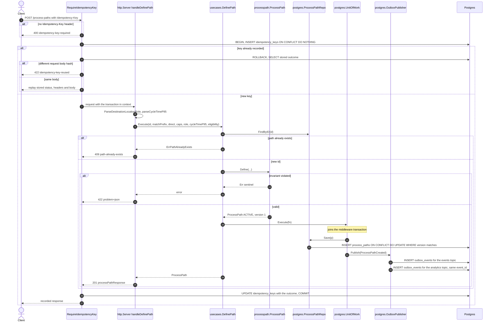
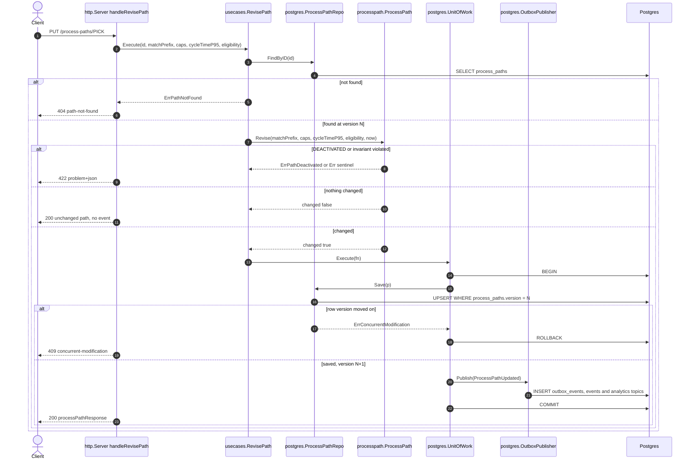
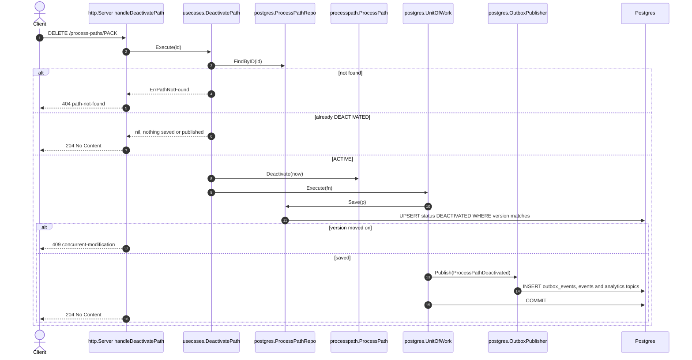
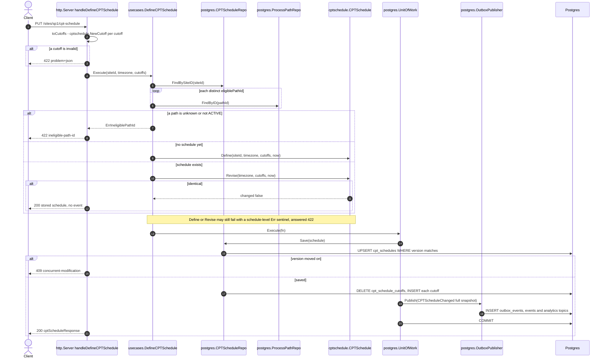
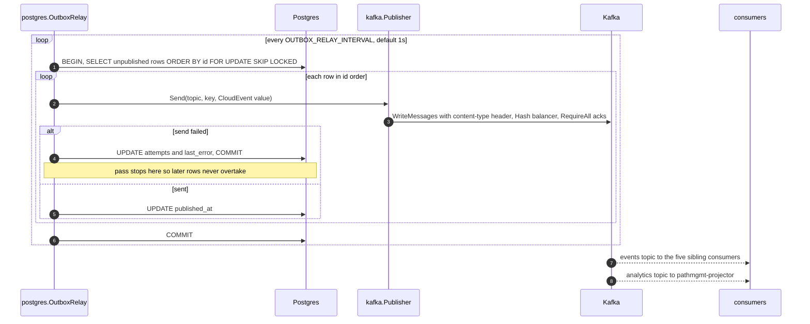
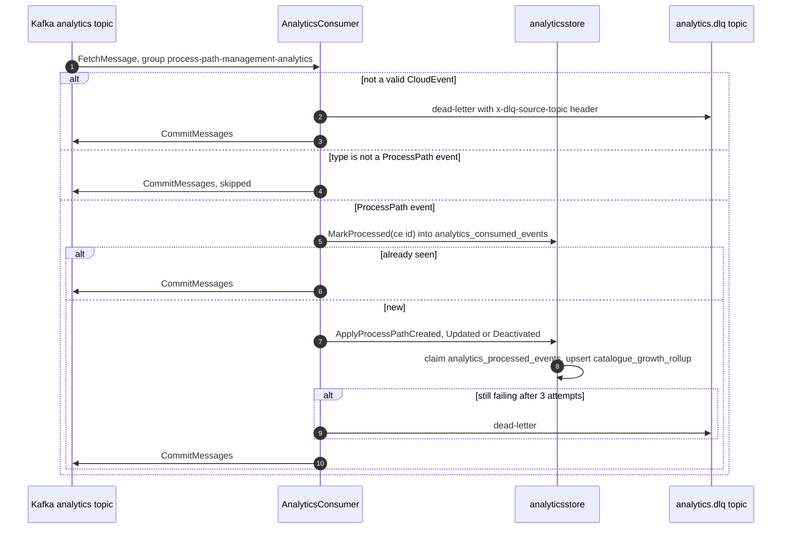

# Sequence Diagrams

:::info[Synced from process-path-management]
This page is a copy of [`docs/docs/ddd/sequence-diagrams.md`](https://github.com/IQVO/process-path-management/blob/develop/docs/docs/ddd/sequence-diagrams.md) on `develop`, derived from that repository's code. Edit it there, then re-sync.
:::

UML sequence diagrams of every command use case, following the code
paths in `internal/application/usecases` and the adapters around them.
Part of the [DDD artifact pack](https://github.com/IQVO/process-path-management/blob/develop/docs/docs/ddd/ddd-artifacts.md). The diagrams show
the production wiring: `DATABASE_URL` set (Postgres repositories,
`postgres.UnitOfWork`, `postgres.OutboxPublisher`) and
`EVENT_PUBLISHER=kafka`. Without `DATABASE_URL` the in-memory
repositories are used, there is no transaction and no idempotency
middleware, and events go straight to Kafka (or to the log publisher).
Read queries (`GetPath`, `ListPaths`, `GetCPTSchedule`, the MCP tools)
are single repository reads and are not drawn.

## 1. Define a process path

Source: `internal/adapters/inbound/http/idempotency.go`
(`RequireIdempotencyKey`, `replayCachedResponse`, `runFreshRequest`),
`internal/adapters/inbound/http/server.go` (`handleDefinePath`),
`internal/application/usecases/define_path.go`,
`internal/domain/processpath/process_path.go`,
`internal/adapters/outbound/postgres/{process_path_repo.go,unit_of_work.go,outbox_publisher.go}`.
Omits: the `PathMetrics` accepted/rejected counter calls, the 400 for a
malformed JSON body, and 500 branches. `UnitOfWork.Execute` reuses the
transaction already in the context (`txFrom`) instead of opening its
own, so the path row, both outbox rows and the idempotency row commit
together.

## 2. Revise a process path

Source: `internal/adapters/inbound/http/server.go` (`handleRevisePath`),
`internal/application/usecases/revise_path.go`,
`internal/domain/processpath/process_path.go` (`Revise`),
`internal/adapters/outbound/postgres/process_path_repo.go` (`Save`),
`internal/adapters/inbound/http/errors.go` (`statusFor`). Omits: the 422
for an unparsable `cycleTimeP95` (raised by the handler before the use
case runs). `PUT` routes carry no idempotency middleware (ADR 0011).

## 3. Deactivate a process path

Source: `internal/application/usecases/deactivate_path.go`,
`internal/domain/processpath/process_path.go` (`Deactivate`),
`internal/adapters/inbound/http/server.go` (`handleDeactivatePath`).
Omits: 500 branches. The row is never deleted; `DELETE` is a soft
deactivation.

## 4. Define or revise a site's CPT schedule

Source: `internal/adapters/inbound/http/server.go`
(`handleDefineCPTSchedule`, `toCutoffs`),
`internal/application/usecases/cpt_schedule.go`
(`DefineCPTSchedule.Execute`, `validateEligiblePathIds`),
`internal/domain/cptschedule/cpt_schedule.go`,
`internal/domain/cptschedule/events.go` (`ToSnapshot`),
`internal/adapters/outbound/postgres/cpt_schedule_repo.go` (`Save`).
Omits: 500 branches.

## 5. Outbox relay to Kafka

Source: `internal/adapters/outbound/postgres/outbox_relay.go`
(`RelayOnce`), `internal/adapters/outbound/kafka/publisher.go`
(`NewPublisher`, `Send`), `internal/adapters/outbound/kafka/writer_config.go`,
`cmd/pathmgmt/main.go`. Omits: the outbox lag gauge and the sweeper
(ADR 0018). A crash between send and commit re-sends the row with the
same CloudEvents `id`; consumers dedupe on it.

## 6. Analytics projection (own topic)

Source: `internal/adapters/inbound/kafka/analytics_consumer.go`,
`internal/adapters/outbound/analyticsstore/{consumed_events_repo.go,postgres_projection.go}`,
`cmd/pathmgmt-projector/main.go`. Omits: retry backoff and the DLQ
topic-readiness wait.
