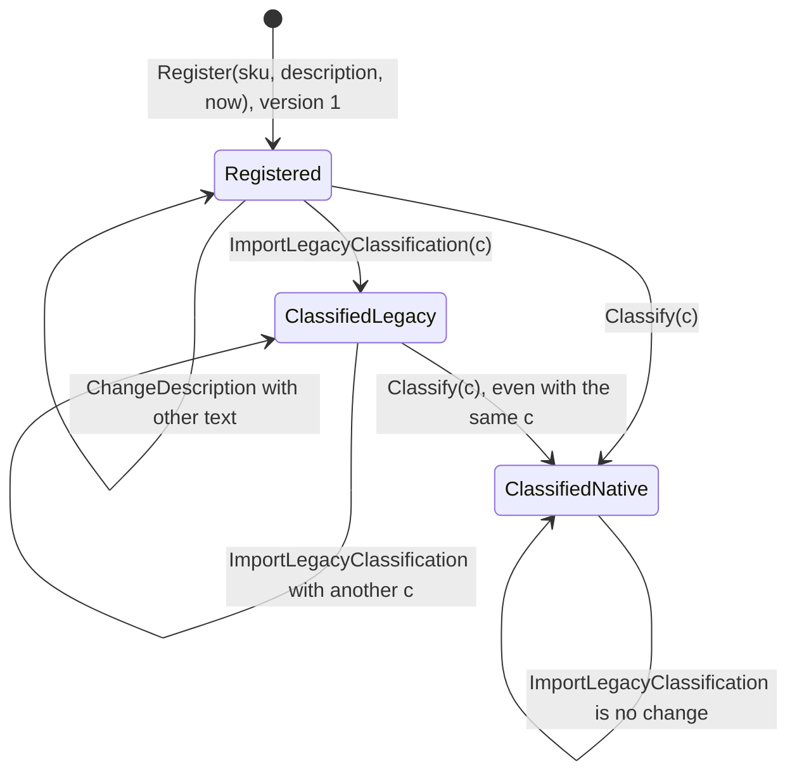
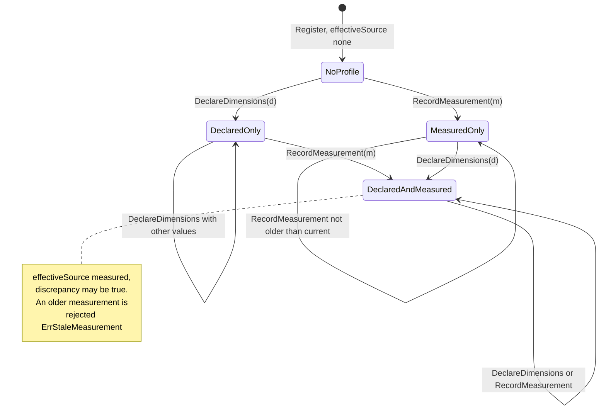

# Aggregate design canvas

:::info[Synced from product-master]
This page is a copy of [`docs/docs/ddd/aggregate-design-canvas.md`](https://github.com/IQVO/product-master/blob/develop/docs/docs/ddd/aggregate-design-canvas.md) on `develop`, derived from that repository's code. Edit it there, then re-sync.
:::

Following the ddd-crew [Aggregate Design Canvas v1.1](https://github.com/ddd-crew/aggregate-design-canvas).
There is one aggregate root in `internal/domain`: `Product`.

## Product

### 1. Name

`Product` (`internal/domain/product/product.go`).

### 2. Description

The master record of one SKU: an optional description, an optional handling
`Classification` with its `ClassificationSource`, and a `PhysicalProfile`
(declared dimensions plus the latest measurement). Identity is the `SKU`.
Every accepted change increments `version`, which guards persistence and rides
on every published event. The aggregate does no I/O; the caller passes `now`.

### 3. State Transitions

The aggregate has no status enum. Its observable states are whether it is
classified (and by which source) and which parts of the physical profile are
set; `version` increases on every transition drawn below except the
self-loops marked "no change".

Source: `internal/domain/product/product.go` (`Register`, `ChangeDescription`,
`Classify`, `ImportLegacyClassification`, `setClassification`,
`DeclareDimensions`, `RecordMeasurement`), `internal/domain/product/physical.go`.
Omits: `Rehydrate` (rebuilds a stored product without events) and the absence
of any delete, unclassify or unregister operation in v1. Identical commands
are no change in every state (no event, no version bump).

### 4. Enforced Invariants

| Invariant | Enforced by |
| --- | --- |
| SKU is 1..64 characters, no whitespace, control characters or `/`; never changes | `NewSKU` (`ErrInvalidSKU`); no setter |
| Description at most 200 characters, no control characters | `validateDescription` (`ErrInvalidDescription`) |
| Classification: at least one tag, closed set, no duplicates | `NewClassification` (`ErrNoHandlingTags`, `ErrUnknownHandlingTag`, `ErrDuplicateHandlingTag`) |
| `TemperatureClass` iff `TemperatureSensitive`, value in the closed set | `checkTemperature` (`ErrTemperatureClassRequired`, `ErrTemperatureClassNotApplicable`, `ErrUnknownTemperatureClass`) |
| `DOTHazardClass` 1..9 and only with `Hazmat` (0 = not recorded) | `checkDOT` (`ErrInvalidDOTHazardClass`, `ErrDOTHazardClassNotApplicable`); also `CHECK (dot_hazard_class BETWEEN 1 AND 9)` |
| A classification always has a source, and vice versa | `setClassification`; `CHECK ((handling_tags IS NULL) = (classification_source IS NULL))` |
| Dimensions 1..20000 mm, weight 1..2000000 g | `NewUnitDimensions` (`ErrInvalidDimension`, `ErrInvalidWeight`) |
| A measurement has `measuredAt`, not after the clock; device id at most 64 runes, no control characters | `NewMeasurement` (`ErrMissingMeasuredAt`, `ErrMeasuredAtInFuture`, `ErrInvalidDeviceID`) |
| The latest measurement is never replaced by an older one | `RecordMeasurement` (`ErrStaleMeasurement`) |
| A legacy import never replaces a `native` classification | `ImportLegacyClassification` |
| `version` starts at 1, +1 per accepted change, unchanged by a no-op | `Register`, `bump`; `CHECK (version >= 1)`; the version-guarded `Save` |

### 5. Corrective Policies

- A REST caller gets a `400` with the slug of the broken rule, `404
  product-not-found` for an unregistered SKU, `409 stale-measurement` for an
  older reading, or `409 concurrent-modification` when another writer saved a
  newer version first; it must re-fetch and retry
  (`internal/adapters/inbound/http/errors.go`).
- An invalid legacy message (`ErrInvalidLegacyImport`) is logged at WARN and
  committed past; it is never retried.
- A discrepancy above 10 % is **not** corrected automatically: the
  measurement is recorded and becomes effective, and the flag is published
  for stewards (ADR 0002).

### 6. Handled Commands

| Command | Use case | Inbound |
| --- | --- | --- |
| `RegisterProductCommand` | `RegisterProduct.Handle` (`Register` or `ChangeDescription`) | `PUT /products/{sku}` |
| `ClassifyProductCommand` | `ClassifyProduct.Handle` (`Classify`) | `PUT /products/{sku}/classification` |
| `DeclareDimensionsCommand` | `DeclareDimensions.Handle` (`DeclareDimensions`) | `PUT /products/{sku}/dimensions/declared` |
| `RecordMeasurementCommand` | `RecordMeasurement.Handle` (`RecordMeasurement`) | `PUT /products/{sku}/dimensions/measured` |
| import of a legacy message | `ImportLegacyClassification.Handle` (`Register` if absent, then `ImportLegacyClassification`) | `LegacyImporter` on `warehouse.inventory.events` |

### 7. Created Events

| Event | When | Full CloudEvents type |
| --- | --- | --- |
| `ProductRegistered` | `Register` | `com.warehouse.wms.product-master.product.ProductRegistered` |
| `ProductDescriptionChanged` | `ChangeDescription` with different text | `com.warehouse.wms.product-master.product.ProductDescriptionChanged` |
| `ProductClassified` | `Classify` or `ImportLegacyClassification` that changes the classification or its source | `com.warehouse.wms.product-master.product.ProductClassified` |
| `ProductDimensionsDeclared` | `DeclareDimensions` with different values | `com.warehouse.wms.product-master.product.ProductDimensionsDeclared` |
| `ProductMeasured` | `RecordMeasurement` with a new reading | `com.warehouse.wms.product-master.product.ProductMeasured` |

Each command raises at most one event; a legacy import of an unknown SKU
raises two (`ProductRegistered` at version 1, then `ProductClassified` at
version 2) in the same unit of work.

### 8. Throughput (estimate)

*Estimate, not measured.* Writes are stewardship actions: registrations and
classifications when SKUs are onboarded (bursts during a catalogue load or the
migration backfill), measurements when a unit passes a dimensioning device.
One SKU is rarely written twice in the same second, so version conflicts
should be rare. Reads by operators are occasional; services do not read it at
request time.

### 9. Size (estimate)

*Estimate.* One row per SKU, a fixed number of scalar columns plus a short tag
array (at most five tags). The aggregate never grows: there is no measurement
history and no child collection. Events per instance grow with its edit count;
each is one outbox row.

## Not aggregates: value objects and technical tables

| Model | Kind | Where | Why it is not an aggregate |
| --- | --- | --- | --- |
| `Classification` | Value object | `classification.go` | Immutable, replaced whole, no identity |
| `UnitDimensions`, `Measurement`, `PhysicalProfile` | Value objects | `physical.go` | Immutable parts of `Product`, replaced whole |
| `processed_events` | Idempotency guard | migration `0001`, `ProcessedEventRepo` | Claims of the legacy importer |
| `outbox_events` | Transactional outbox | migration `0001`, `OutboxRepo` | Encoded messages awaiting the relay |
