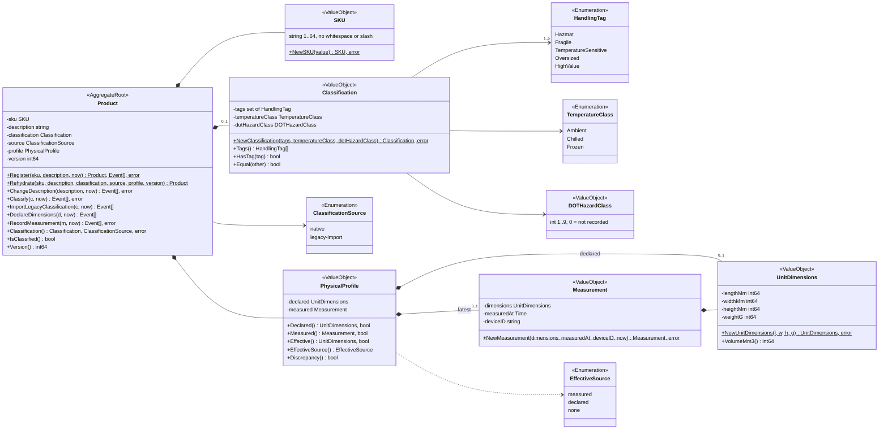
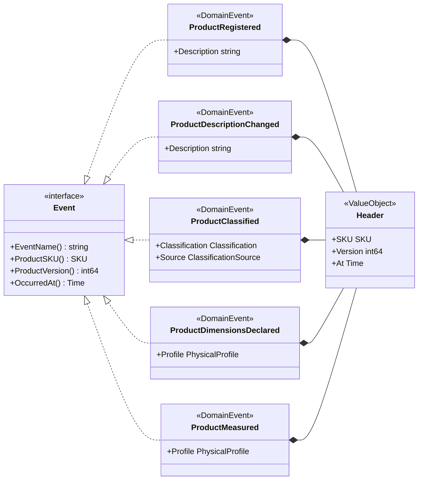
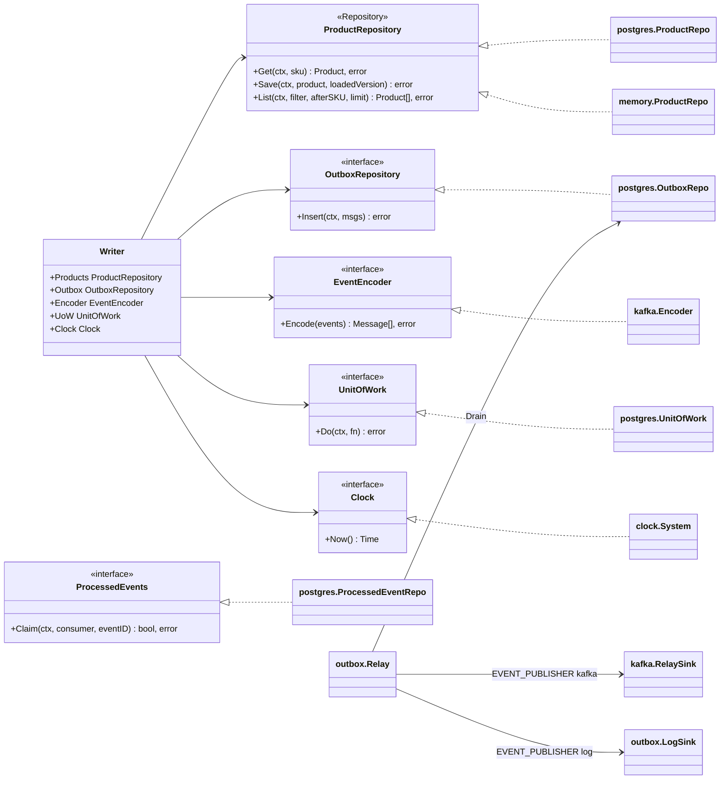
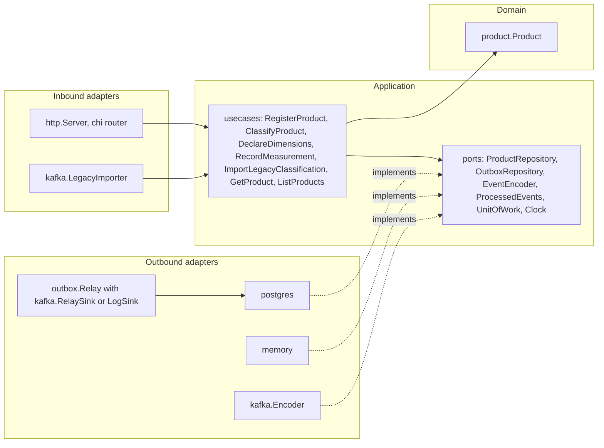

# Class diagrams

:::info[Synced from product-master]
This page is a copy of [`docs/docs/ddd/class-diagram.md`](https://github.com/IQVO/product-master/blob/develop/docs/docs/ddd/class-diagram.md) on `develop`, derived from that repository's code. Edit it there, then re-sync.
:::

UML class diagrams of `internal/domain/product`, then the hexagonal ports and
the adapters that implement them. Field and method names are the real Go
identifiers (unexported fields keep their lower-case names); only
state-changing methods and the key queries are shown.

Stereotypes: `<<AggregateRoot>>`, `<<ValueObject>>`, `<<Enumeration>>`,
`<<DomainEvent>>` and `<<Repository>>` (an outbound port).

## Package `product`

Source: `internal/domain/product/product.go`, `classification.go`,
`physical.go`, `sku.go`.
Omits: the getters (`SKU()`, `Description()`, `LengthMm()` and so on), the
`Rehydrate*` helpers for persisted value objects, the parse functions
(`ParseHandlingTag`, `ParseTemperatureClass`, `ParseClassificationSource`) and
the sentinel errors (listed on the
[aggregate design canvas](/contexts/product-master/aggregate-design-canvas)).

## Domain events

Source: `internal/domain/product/events.go`.
Omits: nothing; every event embeds `Header`, which supplies `ProductSKU`,
`ProductVersion` and `OccurredAt`.

## Ports and adapters

Source: `internal/application/ports/*.go`, `internal/application/usecases/writer.go`,
`internal/adapters/outbound/postgres/*.go`, `internal/adapters/outbound/memory/*.go`,
`internal/adapters/outbound/kafka/encoder.go`, `relay_sink.go`,
`internal/adapters/outbound/outbox/relay.go`, `internal/adapters/outbound/clock/clock.go`.
Omits: the in-memory `OutboxRepo`, `ProcessedEventRepo` and `UnitOfWork`
(same ports as their Postgres twins, used when `DATABASE_URL` is unset), and
the relay's `Store` / `Sink` interfaces, which `OutboxRepo` and the two sinks
implement.

## Hexagonal view

Source: `cmd/api/main.go` (`buildAdapters`, `buildServer`,
`startLegacyImporter`, `startOutboxRelay`), `internal/architecture/architecture_test.go`.
Omits: telemetry, readiness and the CloudEvents helper package.
