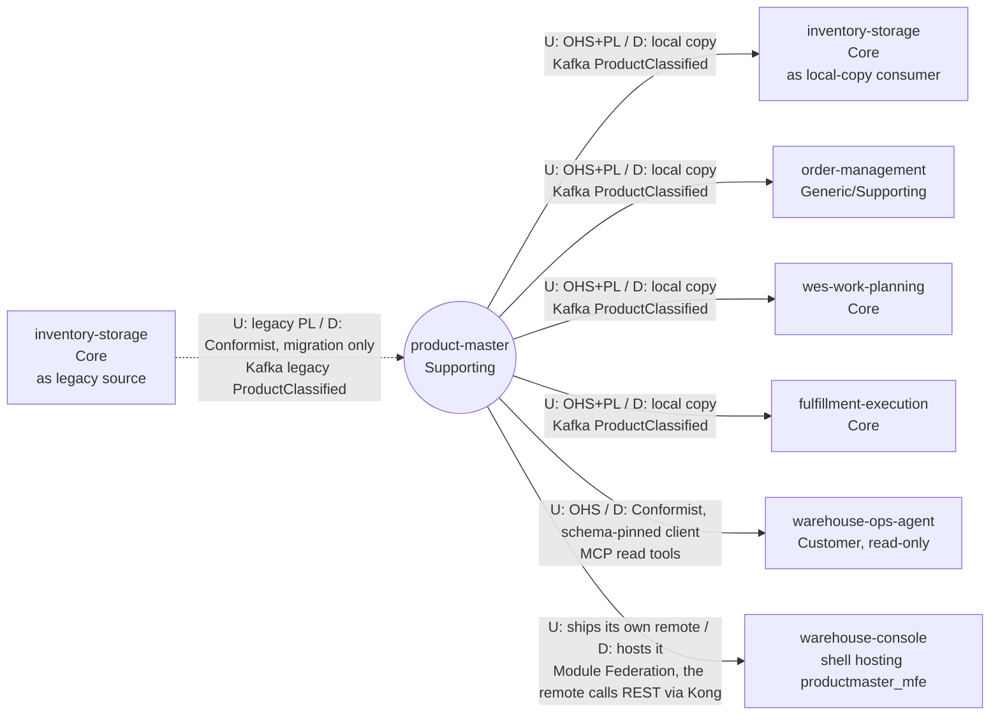

# Context map

:::info[Synced from product-master]
This page is a copy of [`docs/docs/ddd/context-map.md`](https://github.com/IQVO/product-master/blob/develop/docs/docs/ddd/context-map.md) on `develop`, derived from that repository's code. Edit it there, then re-sync.
:::

This context's slice of the fleet map, following ddd-crew
[Context Mapping](https://github.com/ddd-crew/context-mapping). Every edge is
labelled `U` (upstream) / `D` (downstream) with the pattern on each side and
the technology. Solid edges are live in code and deployed in the kind cluster
(warehouse-infra), and dotted edges are migration-only.
Neighbour classifications come from the warehouse-docs contexts table.

Source: `docs/adr/0001-product-master-bounded-context.md` (Context map),
`docs/adr/0003-migration-from-inventory-storage.md`,
`docs/adr/0005-mcp-server-adoption.md`,
`internal/adapters/inbound/kafka/legacy_importer.go`,
`internal/adapters/outbound/kafka/encoder.go`, `cmd/api/main.go`,
`cmd/mcp/main.go`, `web/vite.config.ts`; on the
consumer side (all on `develop`) inventory-storage
`internal/adapters/inbound/kafka/product_master_consumer.go`, order-management
and wes-work-planning `internal/adapters/inbound/kafka/product_classification_consumer.go`,
fulfillment-execution `internal/adapters/inbound/kafka/product_classified_consumer.go`,
warehouse-ops-agent `internal/adapters/outbound/mcpclient/product_master.go`,
warehouse-console `src/App.tsx` and `vite.config.ts` (`productmaster_mfe`).
Omits: the Kafka broker, Kong, the web gateway and the operators who call the
REST API directly.
`inventory-storage` is drawn twice only to keep the upstream and downstream
edges readable; it is one context.

## Relationships

| # | Upstream | Downstream | Patterns (U / D) | Technology | Status | Evidence |
| --- | --- | --- | --- | --- | --- | --- |
| 1 | `product-master` | `inventory-storage` | OHS + Published Language / local copy behind its own consumer (its existing `product_classifications` table, version-guarded) | Kafka `warehouse.product-master.events`, `com.warehouse.wms.product-master.product.ProductClassified` | **Live**, opt-in by `PRODUCT_MASTER_CONSUMER_GROUP` | inventory-storage ADR 0034, `product_master_consumer.go` |
| 2 | `product-master` | `order-management` | OHS + PL / local copy behind the `ProductClassificationLookup` port | same type | **Live** with `PRODUCT_CLASSIFICATION_MODE=kafka` (default `permissive`; the kind cluster runs `kafka`) | order-management ADR 0036 |
| 3 | `product-master` | `wes-work-planning` | OHS + PL / local copy | same type | **Live** with `PRODUCT_CLASSIFICATION_MODE=kafka` (default `permissive`; the kind cluster runs `kafka`) | wes-work-planning ADR 0035 |
| 4 | `product-master` | `fulfillment-execution` | OHS + PL / local copy | same type | **Live** with `PRODUCT_CLASSIFICATION_MODE=kafka` (default `permissive`; the kind cluster runs `kafka`) | fulfillment-execution ADR 0039 |
| 5 | `inventory-storage` | `product-master` | legacy Published Language / **Conformist**: the importer takes inventory-storage's v1 payload field-for-field (`legacyClassifiedData`) | Kafka `warehouse.inventory.events`, `com.warehouse.wms.inventory-storage.product.ProductClassified` | **Migration only**, opt-in by `LEGACY_IMPORT_CONSUMER_GROUP`; removed at ADR 0003 stage E | `legacy_importer.go`, ADR 0003 |
| 6 | `product-master` | `warehouse-ops-agent` | Open Host Service (read-only MCP, ADR 0005) / Conformist: a schema-pinned client of the four read tools (`get_product`, `list_products`, `get_product_classification`, `get_physical_profile`); its `find_master_data_gaps` tool and `GET /master-data-gaps` page through `list_products` | MCP Streamable HTTP, `product-master-mcp:8090/mcp` (`PRODUCT_MASTER_MCP_ENDPOINT`) | **Live** and deployed; unset endpoint = feature off | warehouse-ops-agent ADR 0020, `cmd/mcp/main.go` |
| 7 | `product-master` | `warehouse-console` | this context ships its own UI, the `productmaster_mfe` Module Federation remote (`web/`); the console shell hosts it on `/product-master/*` behind a Product Master tile | Module Federation (`/mfes/product-master/`); the remote calls this context's REST API through Kong (`/api/product-master`) | **Live** and deployed | warehouse-console #66, `web/vite.config.ts`, `web/src/config.ts` |

The other published types (`ProductRegistered`, `ProductDescriptionChanged`,
`ProductDimensionsDeclared`, `ProductMeasured`) have no consumer yet.

There is no Shared Kernel and no Partnership: no sibling Go package is
imported (the legacy payload is restated locally), and the published payloads
are the only shared contract. `product-master` calls no sibling at request
time, and no domain context calls it at request time (ADR 0001); only the
read-side Customers do (rows 6 and 7: the ops-agent over MCP, the console
remote over REST).
