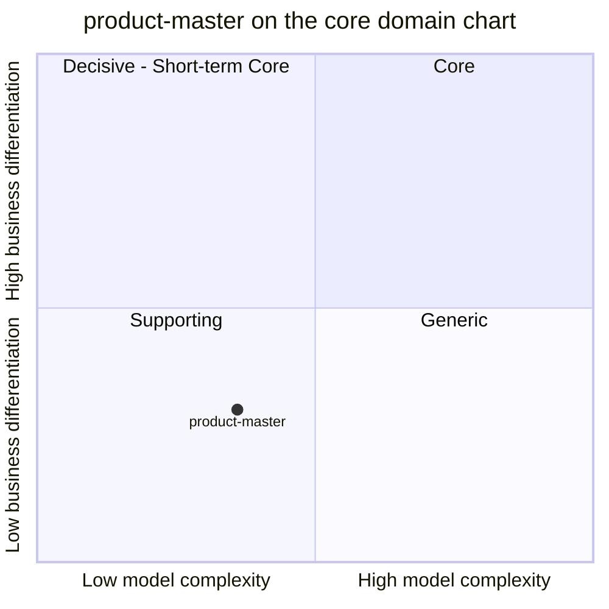

# Core domain chart

:::info[Synced from product-master]
This page is a copy of [`docs/docs/ddd/core-domain-chart.md`](https://github.com/IQVO/product-master/blob/develop/docs/docs/ddd/core-domain-chart.md) on `develop`, derived from that repository's code. Edit it there, then re-sync.
:::

Following the ddd-crew [Core Domain Charts](https://github.com/ddd-crew/core-domain-charts):
business differentiation on the vertical axis, model complexity on the
horizontal axis. Mermaid numbers the quadrants 1 = top-right (Core),
2 = top-left, 3 = bottom-left (Supporting), 4 = bottom-right (Generic).

Source: `docs/adr/0001-product-master-bounded-context.md` (Classification),
`docs/adr/0002-physical-profile-declared-vs-measured.md`,
`internal/domain/product/*.go`.
Omits: the sibling contexts (their own charts place them).

## Classification: Supporting

[ADR 0001](https://iqvo.github.io/product-master/docs/adr/0001-product-master-bounded-context) classifies
`product-master` as a **Supporting subdomain**: "necessary for every warehouse
flow and specific to this warehouse's handling rules, but it is not where the
business differentiates." The warehouse-docs contexts table agrees. The point
sits in the bottom-left quadrant.

**Business differentiation is low (y = 0.30).** Every downstream flow needs a
SKU's handling tags and, later, its size and weight, but nobody chooses this
warehouse because of how it records them. The value is in being right and
being the single source, not in a clever model. It is not at the very bottom
because the taxonomy is this warehouse's own (the closed tag set and the
temperature and DOT rules inherited from inventory-storage ADRs 0009 and
0010), which rules out a bought-in generic product catalogue as-is.

**Model complexity is moderate-low (x = 0.36).** Evidence from the code:

- One aggregate (`Product`) with three value objects (`Classification`,
  `UnitDimensions`, `Measurement`) inside a `PhysicalProfile`.
- Eighteen domain sentinel errors in `internal/domain/product`, all local
  validation (closed sets, bounds, iff-rules between tags and classes) except
  `ErrStaleMeasurement` and `ErrNotClassified`.
- The non-trivial rules are few and small: latest-measurement-wins by
  `measuredAt`, the 10 % discrepancy in integer arithmetic, the effective
  value fallback, "a legacy import never overwrites native", and "no change
  means no event and no version bump".
- No cross-aggregate invariant, no long-running process, no computation over
  sets.

## Evolution

**Custom-built, in genesis.** The context was decided and built on 2026-10-06
(ADRs 0001 to 0004) and is still mid-migration: the legacy importer and
`classificationSource` exist only to move ownership out of `inventory-storage`
(ADR 0003). ADR 0001 lists a long out-of-scope backlog (pack hierarchy, units
of measure, lot/serial/expiry policy, lifecycle states, barcodes), and that is
where a commodity product-information product could later replace parts of
it; the warehouse-specific handling taxonomy should stay custom.
