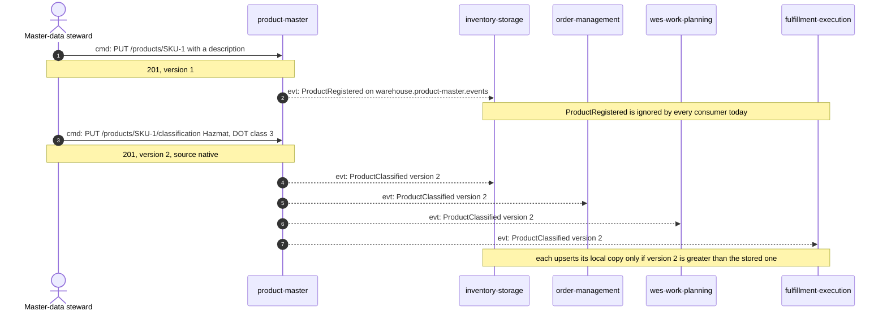
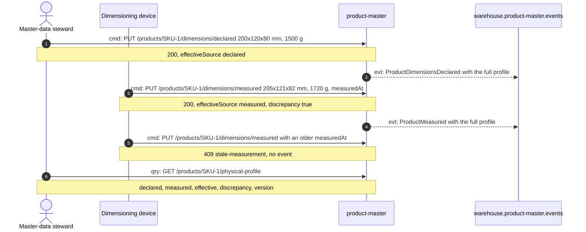
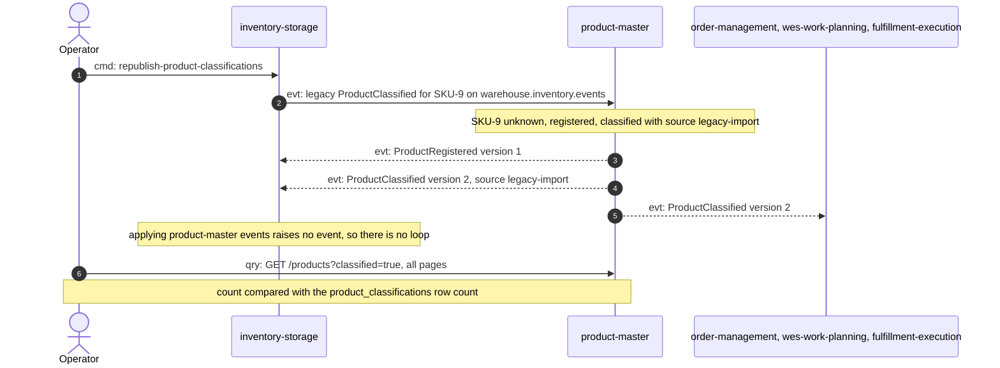

# Domain message flow

:::info[Synced from product-master]
This page is a copy of [`docs/docs/ddd/domain-message-flow.md`](https://github.com/IQVO/product-master/blob/develop/docs/docs/ddd/domain-message-flow.md) on `develop`, derived from that repository's code. Edit it there, then re-sync.
:::

Following ddd-crew [Domain Message Flow Modelling](https://github.com/ddd-crew/domain-message-flow-modelling).
Each arrow is numbered and prefixed `cmd:` (command), `evt:` (event) or `qry:`
(query); replies are notes. Only real messages appear: REST routes from
`NewRouter` and CloudEvents types from the encoder, the legacy importer and
the consumers on each sibling's `develop`.

## 1. A steward classifies a SKU and every consumer updates its copy

Source: `internal/adapters/inbound/http/handlers.go`,
`internal/application/usecases/register_product.go`, `classify_product.go`,
`internal/adapters/outbound/kafka/encoder.go`; the four consumers listed on
[Downstream consumers](https://iqvo.github.io/product-master/docs/ecosystem/downstream-consumers).
Omits: the outbox relay hop between the commit and Kafka (one topic, the
fan-out is Kafka consumer groups), and the consumers' opt-in switches.

## 2. Declared, then measured, with a discrepancy

Source: `internal/application/usecases/physical_profile.go`,
`internal/domain/product/physical.go`, `product.go` (`RecordMeasurement`),
the `ProductMeasured` example in `apis/asyncapi.yaml`.
Omits: consumers, because no sibling consumes the physical-profile events yet
(ADR 0002 names the later uses).

## 3. Migration: legacy classifications flow in, product-master's flow out

Stage A and B of [ADR 0003](https://iqvo.github.io/product-master/docs/adr/0003-migration-from-inventory-storage):
the importer runs (`LEGACY_IMPORT_CONSUMER_GROUP` set) and an operator runs
inventory-storage's one-shot backfill command. In the kind cluster the
importer runs with group `product-master-legacy-import`
(warehouse-infra `helm-values/product-master.yaml`), and the backfill was run
once on 2026-10-07 (6 rows). Stage E (removing the importer and the legacy
type) has not been run.

Source: `internal/adapters/inbound/kafka/legacy_importer.go`,
`internal/application/usecases/import_legacy_classification.go`,
`docs/adr/0003-migration-from-inventory-storage.md` (stages A to C and the
runbook); inventory-storage `cmd/inventory/republish.go` and its ADR 0034.
Omits: a re-run of the backfill after the cutover (every message is then
either skipped because the classification is `native` or identical, so no
change), and the deduplication of a redelivered legacy message by its
CloudEvents id.
