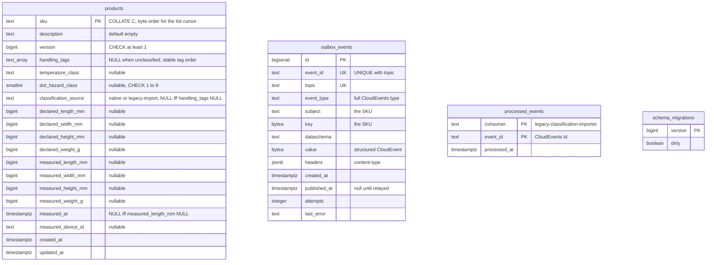

# Entity-relationship diagram

:::info[Synced from product-master]
This page is a copy of [`docs/docs/ddd/entity-relationship.md`](https://github.com/IQVO/product-master/blob/develop/docs/docs/ddd/entity-relationship.md) on `develop`, derived from that repository's code. Edit it there, then re-sync.
:::

The final OLTP schema after applying every migration in order. This service has
**one** Postgres database (`DATABASE_URL`), migrated at boot by `cmd/api` with
golang-migrate (`postgres.RunMigrations`, over `MIGRATIONS_DATABASE_URL` when
set) from `internal/adapters/outbound/postgres/migrations/`. There is a single
migration so far, `0001_products_outbox`. golang-migrate keeps its own
`schema_migrations` table. Without `DATABASE_URL` the service runs on the
in-memory adapters and persists nothing.

## OLTP database

Source: `internal/adapters/outbound/postgres/migrations/0001_products_outbox.up.sql`,
`internal/adapters/outbound/postgres/migrate.go`, `product_repository.go`,
`outbox_repository.go`, `processed_event_repository.go`.
Omits: the indexes (`idx_products_handling_tags`, a GIN index for the
`handlingTag` filter, and `idx_outbox_events_unpublished`, a partial index on
unpublished rows). There are **no foreign keys**: the three tables are
independent, so no relationship line is drawn. `outbox_events.subject` and
`key` carry a SKU by value, not by reference.

## Table is not aggregate

| Table | Backs | Written by | Notes |
| --- | --- | --- | --- |
| `products` | the whole `Product` aggregate, flattened: classification and both halves of the physical profile are columns, not child tables | `ProductRepo.Save` (insert when the loaded version is 0, else `UPDATE ... WHERE sku = $1 AND version = <loaded>`) | One row per SKU; no history. The effective values, `effectiveSource`, `discrepancy` and volume are derived in Go, never stored. |
| `outbox_events` | nothing in the domain: already-encoded Kafka messages | `OutboxRepo.Insert` in the use case's transaction; `OutboxRepo.Drain` marks rows published | Kept after publication (no cleanup job). |
| `processed_events` | nothing in the domain: idempotency claims of the legacy importer | `ProcessedEventRepo.Claim` (`INSERT ... ON CONFLICT DO NOTHING`) in the import's transaction | A rollback un-claims the id. |
