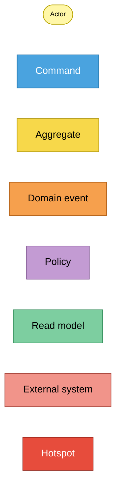
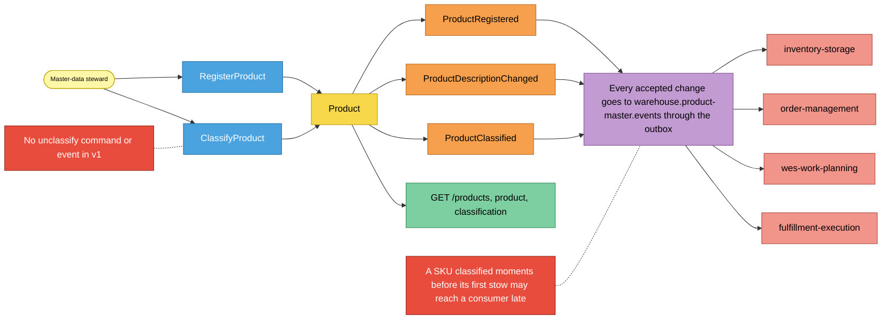
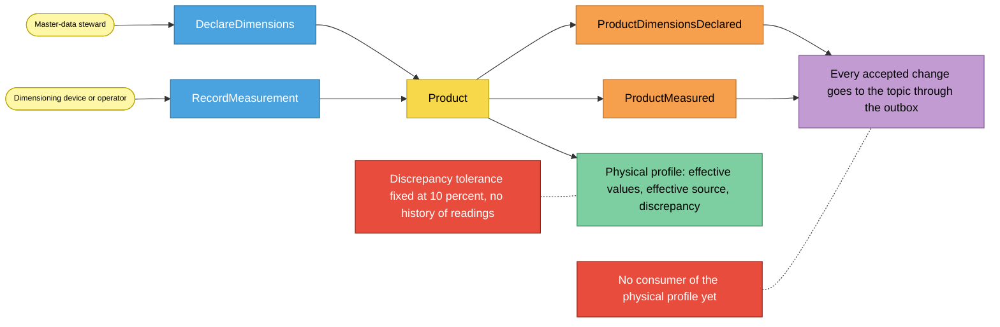
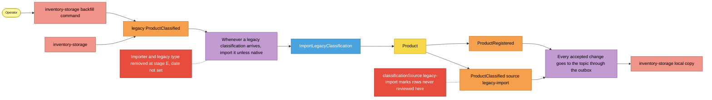

# EventStorming (design level)

:::info[Synced from product-master]
This page is a copy of [`docs/docs/ddd/eventstorming.md`](https://github.com/IQVO/product-master/blob/develop/docs/docs/ddd/eventstorming.md) on `develop`, derived from that repository's code. Edit it there, then re-sync.
:::

Notation from the ddd-crew
[EventStorming glossary and cheat sheet](https://github.com/ddd-crew/eventstorming-glossary-cheat-sheet).
Three processes, each read left to right. Hotspots are real, documented gaps
(ADRs, code comments), not invented ones.

## Legend

Source: ddd-crew cheat-sheet colours as specified for the fleet.
Omits: nothing; this is the key for the three diagrams below.

## 1. Register and classify a SKU

Source: `internal/application/usecases/register_product.go`,
`classify_product.go`, `writer.go`, `internal/domain/product/product.go`,
`internal/adapters/outbound/kafka/encoder.go`; ADR 0001 (Consequences:
eventual consistency).
Omits: the rejection paths (`400` slugs, `404 product-not-found`) and the
consumers' own policies. Only `ProductClassified` is consumed today.

## 2. Declare and measure the physical profile

Source: `internal/application/usecases/physical_profile.go`,
`internal/domain/product/physical.go`, ADR 0002 (Consequences).
Omits: `ErrStaleMeasurement` and `ErrMeasuredAtInFuture` (see the
[sequence diagrams](/contexts/product-master/sequence-diagrams)).

## 3. Import legacy classifications (migration only)

Source: `internal/adapters/inbound/kafka/legacy_importer.go`,
`internal/application/usecases/import_legacy_classification.go`,
`internal/domain/product/product.go` (`ImportLegacyClassification`),
ADR 0003 (stages A, B, E and Consequences).
Omits: the processed-event claim and the retry loop (see the
[sequence diagrams](/contexts/product-master/sequence-diagrams)).

## Sticky inventory

| Sticky | Kind | Code evidence |
| --- | --- | --- |
| Master-data steward, dimensioning device, operator | Actor | REST callers of `internal/adapters/inbound/http/handlers.go` |
| `RegisterProduct`, `ClassifyProduct`, `DeclareDimensions`, `RecordMeasurement`, `ImportLegacyClassification` | Command | `internal/application/usecases/*.go` |
| `Product` | Aggregate | `internal/domain/product/product.go` |
| `ProductRegistered`, `ProductDescriptionChanged`, `ProductClassified`, `ProductDimensionsDeclared`, `ProductMeasured` | Domain event (published) | `internal/domain/product/events.go`, `internal/adapters/outbound/kafka/encoder.go` |
| legacy `ProductClassified` | Domain event (consumed) | `TypeLegacyProductClassified` in `legacy_importer.go` |
| Publish every accepted change through the outbox | Policy | `Writer.persist` in `writer.go`, `outbox.Relay` |
| Import unless native | Policy | `LegacyImporter.HandleMessage`, `Product.ImportLegacyClassification` |
| Product, classification, physical profile, product list | Read model | `GetProduct`, `ListProducts` in `queries.go` |
| inventory-storage, order-management, wes-work-planning, fulfillment-execution | External system | their `ProductClassified` consumers on `develop` |
| Late classification before first stow | Hotspot | ADR 0001, Consequences |
| No unclassify | Hotspot | `Product` has no method that removes a classification, and ADR 0004 lists no such event |
| No physical-profile consumer | Hotspot | ADR 0002, Consequences ("later phases") |
| Fixed 10 % tolerance, no measurement history | Hotspot | ADR 0002 rule 6 and Consequences |
| `legacy-import` rows never reviewed | Hotspot | ADR 0003, Consequences |
| Stage E not scheduled | Hotspot | ADR 0003, stage E ("after the cluster is verified") |
