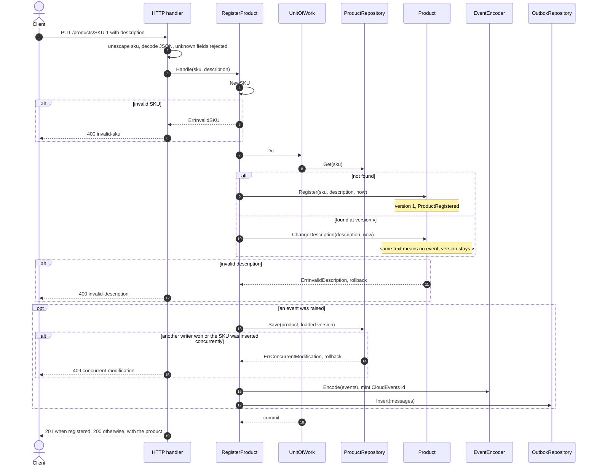
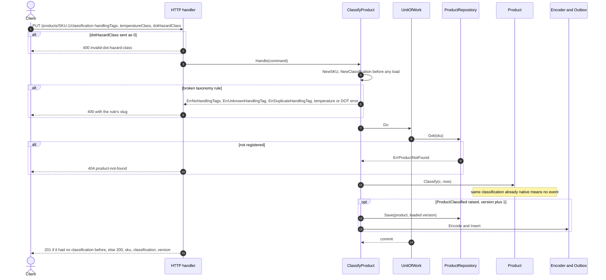
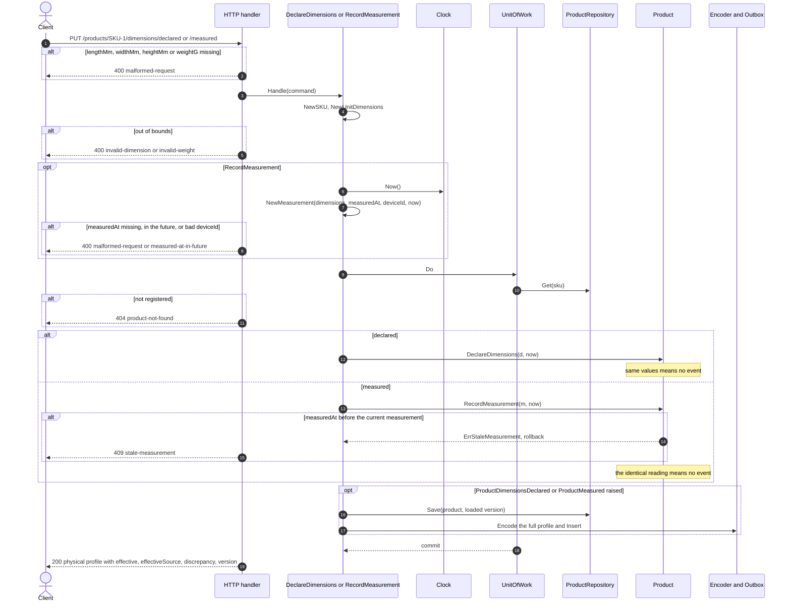
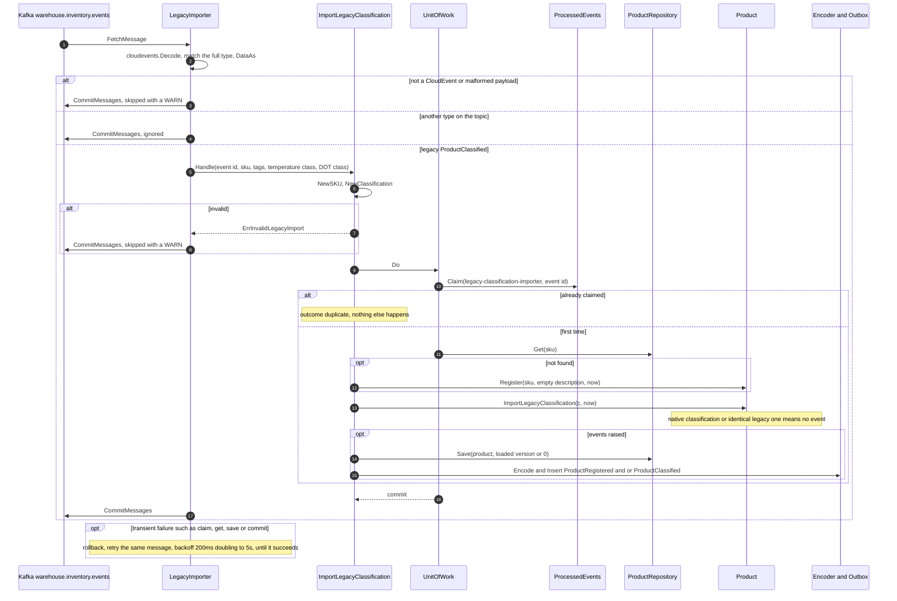
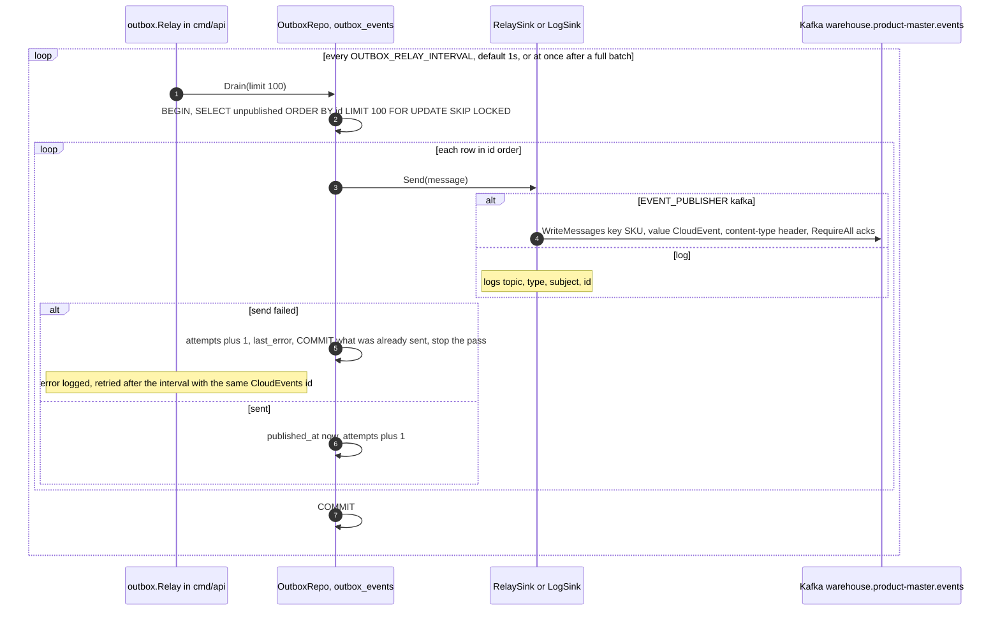

# Sequence diagrams

:::info[Synced from product-master]
This page is a copy of [`docs/docs/ddd/sequence-diagrams.md`](https://github.com/IQVO/product-master/blob/develop/docs/docs/ddd/sequence-diagrams.md) on `develop`, derived from that repository's code. Edit it there, then re-sync.
:::

UML sequence diagrams of every command use case, derived from the use-case
bodies in `internal/application/usecases`, the inbound adapters and the
Postgres adapters. Every write runs in **one** unit of work (one Postgres
transaction): load, aggregate command, version-guarded save, encode, outbox
insert (`writer.go`). There is no `Idempotency-Key` middleware: every write is
an idempotent `PUT`.

## 1. Register a product (REST)

Source: `internal/application/usecases/register_product.go`, `writer.go`,
`internal/adapters/inbound/http/handlers.go` (`handleRegisterProduct`),
`internal/adapters/outbound/postgres/product_repository.go` (`Save`).
Omits: `400 malformed-request` for a bad body and the telemetry middleware.

## 2. Classify a product (REST)

Source: `internal/application/usecases/classify_product.go`, `writer.go`
(`change`), `internal/adapters/inbound/http/handlers.go`
(`handleClassifyProduct`), `internal/domain/product/classification.go`,
`product.go` (`setClassification`).
Omits: the `409 concurrent-modification` branch on `Save` (same as diagram 1).

## 3. Declare dimensions and record a measurement (REST)

Source: `internal/application/usecases/physical_profile.go`, `writer.go`,
`internal/adapters/inbound/http/handlers.go` (`dimensions`,
`handleDeclareDimensions`, `handleRecordMeasurement`),
`internal/domain/product/physical.go`, `product.go`.
Omits: the `409 concurrent-modification` branch on `Save`.

## 4. Legacy import from inventory-storage (Kafka, migration only)

Source: `internal/adapters/inbound/kafka/legacy_importer.go` (`HandleMessage`),
`kafka.go` (`consumeLoop`, `retryUntilOK`),
`internal/application/usecases/import_legacy_classification.go`,
`internal/adapters/outbound/postgres/processed_event_repository.go`.
Omits: the offset-commit retry loop (a failed commit is retried the same way)
and logging of the outcome.

## 5. Outbox relay to Kafka

Source: `internal/adapters/outbound/outbox/relay.go` (`Run`, `RelayOnce`,
`LogSink`), `internal/adapters/outbound/postgres/outbox_repository.go`
(`Drain`, `claim`), `internal/adapters/outbound/kafka/relay_sink.go`,
`cmd/api/main.go` (`startOutboxRelay`).
Omits: the in-memory `OutboxRepo.Drain` used without `DATABASE_URL`, and the
shutdown order (the relay stops last).
