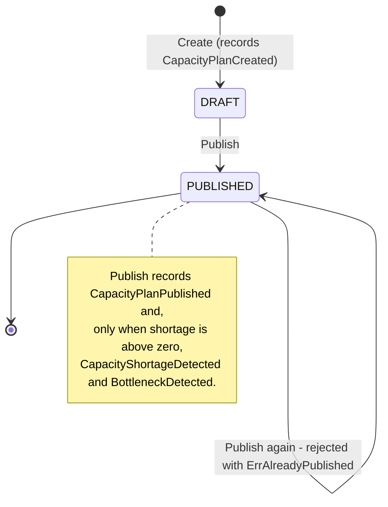

# Aggregate Design Canvas — CapacityPlan

Following the [ddd-crew Aggregate Design Canvas](https://github.com/ddd-crew/aggregate-design-canvas).
`CapacityPlan` (`internal/domain/capacityplan`) is the aggregate that raises
this context's published events. A second aggregate, `ProcessCapacity`
(`internal/domain/processcapacity`), holds the registered constraints and is
summarised at the end of this page.

## Name

**CapacityPlan**

## Description

Ties the demand assigned to a warehouse location and planning window to the
ProcessPath capacity available to serve it, and the resulting shortage.
Identified by a UUID string (natural key `(WarehouseID, PlanningWindow)`, but
several plans may exist for it). Fields: `WarehouseID`, `Location` (the
ProcessCapacity location evaluated — a site code), `PlanningWindow`,
`ProcessPathID`, `AssignedDemand` (orders), and computed at creation:
`PathCapacity` (ORDER per hour), `BottleneckStep`, `CapacityOverWindow`
(`PathCapacity x window hours`) and `Shortage`
(`max(0, demand - capacityOverWindow)`), plus `Status` (`DRAFT` /
`PUBLISHED`), `CreatedAt`, `PublishedAt`, and the informational
`BottleneckConstraint` and `Warnings` (read-model fields — no published event
carries them).

The aggregate performs **no I/O**: `Create` takes the already-computed path
rate and bottleneck plus an explicit id and time, and accumulates events as
plain structs that `PullEvents()` hands over exactly once.

## State Transitions

## Enforced Invariants

1. **Required identity fields.** `id`, `warehouse id`, `location` and
   `process path id` must be non-blank (`ErrRequiredField`).
2. **Non-negative demand.** `AssignedDemand >= 0` (`ErrNegativeDemand`); zero
   is valid — nothing to serve, never a shortage.
3. **The path capacity is an ORDER rate.** `Create` rejects anything else
   (`ErrPathRateNotOrder`): path capacity is always normalized to ORDER by the
   composition before a plan is built.
4. **Shortage is never negative**, and demand exactly equal to the capacity
   over the window is not a shortage.
5. **Publish at most once.** A second `Publish` returns `ErrAlreadyPublished`
   and records nothing — it would re-announce the same shortage to every
   downstream consumer.
6. **The plan keeps the requested window.** The window is not inherited from a
   constraint; `capacity_over_window` is computed from its length (ADR 0003).

## Corrective Policies

- **Demand is an input, not a lookup.** `assigned_demand` and the
  WorkloadProfile factors arrive in the request body; a missing
  `assigned_demand` is `422 missing-assigned-demand`, never silently zero.
- **Capacity gaps are explicit.** A path step with no covering ProcessCapacity
  and no derived STATION constraint is `422 missing-step-capacity`, naming the
  step, location and window — never a guessed rate.
- **Warnings instead of invented numbers.** Stations tallied with no declared
  standard add a warning to the plan; the step uses its registered
  constraints only.

## Handled Commands

| Command | Precondition | Result |
| --- | --- | --- |
| **Create** (`POST /capacity-plans`, MCP `create_capacity_plan`) | ProcessPath registered; every step's capacity resolvable; valid demand and factors | New `DRAFT` plan; `CapacityPlanCreated` queued in the outbox in the same transaction |
| **Publish** (`POST /capacity-plans/{id}/publish`, MCP `publish_capacity_plan`) | Plan exists and is `DRAFT` | `PUBLISHED`; `CapacityPlanPublished` queued, plus `CapacityShortageDetected` and `BottleneckDetected` only when `shortage > 0`, all in one transaction |

Reads (`GET /capacity-plans/{id}`, MCP `get_capacity_plan`) go straight to the
repository.

## Created Events

| Event | Published when |
| --- | --- |
| `CapacityPlanCreated` | `Create` — a plan is created |
| `CapacityPlanPublished` | `Publish` — always |
| `CapacityShortageDetected` | `Publish`, only when `shortage > 0` |
| `BottleneckDetected` | `Publish`, only when `shortage > 0` |

Order on a shortage plan: Created (at creation), then Published,
ShortageDetected, BottleneckDetected (at publish). See
[Domain Events](./domain-events).

## Throughput

**Low-frequency, planner-driven** — a plan is created per location, window and
path when someone (or a tool) evaluates demand, and published at most once.
Concurrent publishes of one plan serialize: the Postgres `FindByID` locks the
row inside the unit of work. The consumed Kafka streams (one message per
`PathPlan` line; one per location slot) are the higher-volume inputs, handled
in an atomic unit of work each.

## Size

**Small.** Scalars, one window value object, a short warnings list and two
timestamps; no child entities. A plan is a snapshot of a computation, not a
growing collection.

## Second aggregate — ProcessCapacity

- **Identity**: `(ProcessType, Location, CapacityWindow)`. The window is part
  of the identity and stays an **exact** key — `POST` / `GET
  /process-capacities` address one aggregate; registering twice at one key
  upserts.
- **Invariants**: at least one constraint (`ErrNoConstraints` otherwise); all
  constraints on one instance share the same native unit (`ErrUnitMismatch` —
  never silently compare UNIT against PACKAGE); re-registering a constraint
  type replaces its rate; a non-negative quantity and a positive period
  (`ErrNegativeQuantity`, `ErrNonPositivePeriod`); window end strictly after
  start (`ErrInvalidWindow`).
- **Behaviour**: `EffectiveRate()` is the minimum across constraints plus the
  binding constraint type; ties go to the earliest-registered constraint.
- **Composition is outside the aggregate.** Coverage resolution and the
  derived STATION constraint run in domain services (`ComposeStepCapacity`,
  `ComposeProcessPathCapacity`) on transient values at read time; the stored
  aggregate and its single-native-unit invariant are untouched (ADR 0002).
- The labor consumer is the only writer of constraints from events
  (`ShiftPlanCommitted` → `LABOR`, `UNIT/HOUR`); the facility consumer only
  maintains a tally.
