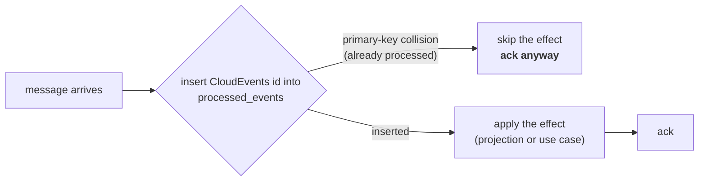

# Async API

Every warehouse-systems service shares **one Kafka broker**
(`localhost:9092` locally). This service does not run its own broker — it
connects to the shared one via `github.com/segmentio/kafka-go` (pure Go, no
cgo).

## The envelope: CloudEvents 1.0 (mandatory)

Every service exchanges CloudEvents 1.0 in structured content mode — the
fleet-wide, mandatory [Event Standard](/strategic-design/event-standard-cloudevents). Every message carries the Kafka header
`content-type: application/cloudevents+json; charset=UTF-8`:

```json
{
  "specversion": "1.0",
  "id": "uuid-v4",
  "source": "/warehouse/wes-work-planning",
  "type": "com.warehouse.wes.work-planning.workunit.WorkReleased",
  "subject": "...",
  "time": "2026-08-21T22:00:00Z",
  "datacontenttype": "application/json",
  "dataschema": "urn:warehouse:wes-work-planning:events:WorkReleased:v1",
  "data": { }
}
```

`id` is a UUID v4 minted once per domain event and persisted with the
outbox row, so a redelivery carries the same `id`; `(source, id)` is the
consumer idempotency key. `time` comes from the **domain clock**, not from
publish time. `subject` is the aggregate instance id. `dataschema`
distinguishes the integration payload (`…:events:…`) from the analytics
payload (`…:analytics:…`) of the same occurrence. `data` is
event-type-specific.

Events are built, validated and (un)marshalled with the official
`github.com/cloudevents/sdk-go/v2/event` package, behind each service's own
`internal/adapters/kafka/cloudevents/` helper (transport stays
`segmentio/kafka-go`). Consumers dispatch on the **full** `type` string,
ignore unknown types, and DLQ/skip — never parse — anything that is not a
valid CloudEvent. There is no flat envelope and no envelope toggle. See the
[generated reference](/api-reference/async/wes-work-planning) for the full
spec document.

## Published

### Topic `warehouse.work-planning.events`

| `type` (suffix after `com.warehouse.wes.work-planning.`) | `data` | Published when | Consumed by |
|---|---|---|---|
| `workunit.WorkReleased` | `{"path_id","work_unit_id","cpt","ref"}` (+ optional `required_capabilities`, `fragile`, `gift_wrap`) | `ReleaseNextWork` releases a unit | **`fulfillment-execution`** → creates a `Task` |
| `workpool.PathCapacityChanged` | `{"path_id","cutoff_at","remaining_units","known"}` | `SampleBacklog` is called with `cutoffAt` set (`GET /paths/{pathId}/telemetry?cutoffAt=…`, ADR-0018) | **`order-management`** — its `kafkapathcapacity` adapter (own per-process consumer group, filters for this one event type) caches remaining capacity keyed by path and cutoff instant |

```json
{
  "specversion": "1.0",
  "id": "1d7e4b90-3c58-4d22-9a6f-8b1c0e5d7a23",
  "source": "/warehouse/wes-work-planning",
  "type": "com.warehouse.wes.work-planning.workunit.WorkReleased",
  "subject": "wu-10231",
  "time": "2026-08-21T22:12:30Z",
  "datacontenttype": "application/json",
  "dataschema": "urn:warehouse:wes-work-planning:events:WorkReleased:v1",
  "data": {
    "path_id": "pick-to-tote",
    "work_unit_id": "wu-10231",
    "cpt": "2026-08-22T02:00:00Z",
    "ref": "order-88421-line-3"
  }
}
```

`PathCapacityChanged` reports the path's remaining admission capacity
(`wipLimit` minus current WIP, never negative), correlated against a CPT
cutoff **timestamp** rather than process-path-management's `cptId`.
`known=false` for a flow-fed path or a release-fed path with no WIP limit
provisioned. See
[ADR-0018](https://github.com/claudioed/wes-work-planning/blob/develop/docs/docs/adr/0018-path-capacity-changed.md).

The other eight domain events are also written to this topic by the
outbound adapter with a `{"path_id": ...}`-shaped payload, but nothing
consumes them today — see [Domain Events](./domain-events). (Separately,
with `EVENT_PUBLISHER=kafka` a second publisher writes every domain event,
as CloudEvents with an `…:analytics:…` `dataschema`, to
`warehouse.wes.analytics` for the analytics data product —
[ADR-0011](https://github.com/claudioed/wes-work-planning/blob/develop/docs/docs/adr/0011-analytical-data-product.md).)

Set `EVENT_PUBLISHER=kafka` (with `KAFKA_BROKERS`) to publish here; the
default `log` publisher writes the same events to the log instead. Both
implement the same `ports.EventPublisher` interface, so the use cases
cannot tell which is wired. With `kafka` **and** `DATABASE_URL` set, the
publishers act only as encoders inside the use case's transaction: one
`outbox_events` row per event per topic, drained onto Kafka by an
in-process relay
([ADR-0014](https://github.com/claudioed/wes-work-planning/blob/develop/docs/docs/adr/0014-transactional-outbox.md)).
Without `DATABASE_URL` events are published directly.

## Consumed

Setting `KAFKA_BROKERS` starts the inbound consumer automatically,
**independent of `EVENT_PUBLISHER`**. It reads four topics concurrently,
one goroutine each, under the consumer group `KAFKA_CONSUMER_GROUP`
(default `wes-work-planning`, shared by every deployed replica). A second
process against the shared broker — a developer's `go run`, the e2e
harness — must set a unique value, or the rebalance hands the single
partition to one member and the other consumes nothing while reporting
healthy.

With `PATH_CATALOGUE_SOURCE=kafka` a fifth, separate consumer replays
process-path-management's topic — see the last section below.

### `warehouse.workforce.events` — `ShiftPlanCommitted`, from `workforce-management`

```json
{
  "specversion": "1.0",
  "id": "...",
  "source": "/warehouse/workforce-management",
  "type": "com.warehouse.wes.workforce-management.shiftplan.ShiftPlanCommitted",
  "subject": "...",
  "time": "...",
  "datacontenttype": "application/json",
  "dataschema": "urn:warehouse:workforce-management:events:ShiftPlanCommitted:v1",
  "data": {
    "building_id": "BLD1", "shift_id": "S1", "path_id": "pick-a",
    "planned_heads": 7, "planned_rate": 95.5, "planned_hours": 8
  }
}
```

Projected into `LaborPlanObserved`, keyed by `path_id`, read at
`GET /paths/{pathId}/labor-plan-view`. Workforce publishes **one message
per path line** of its own shift plan, which is why the projection keys on
`path_id` with one row per path. **It is not fed into this service's own
`ShiftPlan` aggregate or `CommitShiftPlan` use case** — same word,
different bounded context.

### `warehouse.inventory.events` — `StockReserved`, `ReservationRevoked`, from `inventory-storage`

```json
{
  "specversion": "1.0",
  "id": "...",
  "source": "/warehouse/inventory-storage",
  "type": "com.warehouse.wms.inventory-storage.reservation.StockReserved",
  "subject": "...",
  "time": "...",
  "datacontenttype": "application/json",
  "dataschema": "urn:warehouse:inventory-storage:events:StockReserved:v1",
  "data": {"sku": "SKU-8891", "quantity": 4, "demand_ref": "order-88421"}
}
```

Both event types carry the same `data` shape. `StockReserved`
**decrements** the observed usable count for that SKU; `ReservationRevoked`
**increments** it back. Projected into `UsableInventoryObserved`, keyed by
**SKU** — deliberately not by path, because inventory reservations are
SKU-scoped and a SKU-to-path mapping does not exist in the domain. Read at
`GET /inventory-view/{sku}`.

### `warehouse.fulfillment.events` — `TaskCompleted`, from `fulfillment-execution`

```json
{
  "specversion": "1.0",
  "id": "...",
  "source": "/warehouse/fulfillment-execution",
  "type": "com.warehouse.wes.fulfillment-execution.task.TaskCompleted",
  "subject": "...",
  "time": "...",
  "datacontenttype": "application/json",
  "dataschema": "urn:warehouse:fulfillment-execution:events:TaskCompleted:v1",
  "data": {"task_id": "t-551", "station_id": "pack-3", "work_unit_id": "wu-10231"}
}
```

`data.work_unit_id` maps to `RecordCompletionRequest.WorkUnitId` and calls
the **existing** `RecordCompletion` use case — the exact code path
`POST /work-units/{id}/complete` uses. This closes the control loop's
feedback edge: WIP drops, and the next release call can proceed.

### `warehouse.order-management.events` — `OrderAllocated`, `OrderPartiallyAllocated`, from `order-management`

```json
{
  "specversion": "1.0",
  "id": "...",
  "source": "/warehouse/order-management",
  "type": "com.warehouse.wes.order-management.order.OrderAllocated",
  "subject": "...",
  "time": "...",
  "datacontenttype": "application/json",
  "dataschema": "urn:warehouse:order-management:events:OrderAllocated:v1",
  "data": {
    "order_id": "order-1", "promise_date": "2026-08-22T02:00:00Z",
    "lines": [{"line_no": 1, "sku": "SKU-1", "path_id": "pick-a", "gift_wrap": false}]
  }
}
```

Both event types share this identical `data` shape and are handled
identically — both mean "these lines are ready to enqueue." For each entry
in `lines`, the handler calls the **existing** `EnqueueWorkUnit` use case
directly, deriving a **deterministic** `work_unit_id` as
`"{order_id}-line-{line_no}"` — so the same order line always maps to the
same work unit, a second line of defense against duplicate enqueues on top
of the `processed_events` idempotency guard. This integration is
deliberately **fire-and-forget**: there is no reply event back to
order-management.

### `warehouse.process-path-management.events` — the process-path catalogue, from `process-path-management`

Consumed only when `PATH_CATALOGUE_SOURCE=kafka` (the default `file` source
reads the same catalogue from YAML instead). The
`internal/adapters/outbound/kafkacatalog` consumer replays the topic from
the beginning under its **own per-process consumer group** — not
`KAFKA_CONSUMER_GROUP` — folding `ProcessPathCreated`,
`ProcessPathUpdated` and `ProcessPathDeactivated` into the in-memory
catalogue that validates every `pathId`
([ADR-0012](https://github.com/claudioed/wes-work-planning/blob/develop/docs/docs/adr/0012-process-path-catalogue-validation.md)).
Startup blocks until the replay has caught up, then the consumer keeps
following the topic live. It is a state rebuild, not an effect, so it does
not use `processed_events`.

## Idempotency

Kafka is at-least-once, so redelivery is normal, not exceptional. Every
integration-event consumer path is idempotent by construction:



- **Postgres**: table `processed_events (event_id TEXT PRIMARY KEY,
  processed_at TIMESTAMPTZ)` — the column keeps its name and is populated
  from the CloudEvents `id`. The primary-key violation *is* the duplicate
  check — no read-then-write race between two consumers processing the same
  redelivery.
- **In-memory**: a mutex-guarded `map[string]struct{}` with identical
  semantics.

Both sit behind one port, `ProcessedEventRepo.TryMarkProcessed(ctx, eventId,
at) (alreadyProcessed bool, err error)`.

| Redelivered event | Effect |
|---|---|
| `StockReserved` | usable quantity is **not** double-decremented |
| `ReservationRevoked` | usable quantity is **not** double-incremented |
| `ShiftPlanCommitted` | the labour projection is **not** re-written |
| `TaskCompleted` | `RecordCompletion` is **not** called a second time |
| `OrderAllocated` / `OrderPartiallyAllocated` | `EnqueueWorkUnit` is **not** called a second time per line |

The `TaskCompleted` case matters operationally beyond the dedup table
itself: `WorkUnit.Complete` already rejects double-completion with
`ErrAlreadyCompleted`, so the aggregate would be safe regardless. But
without the `id` check, every redelivery would surface a domain error
from a perfectly normal Kafka behaviour — deduplicating first keeps
`ErrAlreadyCompleted` meaning what it says, rather than becoming an error
nobody reads.

## Configuration

| Env var | Default | Effect |
|---|---|---|
| `KAFKA_BROKERS` | *(unset)* | Comma-separated brokers. **Setting it starts the inbound consumer.** |
| `KAFKA_CONSUMER_GROUP` | `wes-work-planning` | Consumer group of the integration-event consumer; set a unique value for any second process on the shared broker. |
| `EVENT_PUBLISHER` | `log` | `kafka` switches the outbound publisher; requires `KAFKA_BROKERS`. With `DATABASE_URL` also set, events go through the transactional outbox. |
| `OUTBOX_RELAY_INTERVAL` | `1s` | How long the outbox relay sleeps between empty passes (outbox mode only). |
| `PATH_CATALOGUE_SOURCE` | `file` | `kafka` replays `warehouse.process-path-management.events` into the catalogue; requires `KAFKA_BROKERS`. |

## Generated reference

For the full AsyncAPI 2.6.0 document — every channel, every message schema,
linted in CI by Spectral — see the
[generated Async API reference](/api-reference/async/wes-work-planning),
built directly from `apis/asyncapi.yaml` in the source repository.
