# Context Map

Following [ddd-crew's context-mapping](https://github.com/ddd-crew/context-mapping)
patterns, this page draws every real integration between the platform's eleven
bounded contexts, labels each edge with its strategic relationship pattern
(Open-Host Service, Published Language, Customer/Supplier, Conformist,
Partnership), and — matching the honesty convention every context's own
docs already use — states plainly which integrations are **live, running
code**, which relationships are **deliberately absent**, and which
upstream organization is **planned but not yet built** (`retail-network`
— see its own dedicated section below).

## The whole platform

```mermaid
flowchart TB
    subgraph WMS["WMS tier — what &amp; where"]
        INV["<b>inventory-storage</b><br/>Core · stock ledger, chaotic stow,<br/>revocable reservations"]
    end

    subgraph WES["WES tier — when &amp; in what order"]
        WP["<b>wes-work-planning</b><br/>Core · the conductor<br/>waveless release, flow balancing"]
        FE["<b>fulfillment-execution</b><br/>Core · Pick/Pack/SLAM<br/>pull-based claimNext + leases"]
        WFM["<b>workforce-management</b><br/>Supporting · shift headcount,<br/>certification-gated assignment"]
        PLN["<b>warehouse-planning</b><br/>Core · capacity plans, shortage<br/>and bottleneck detection"]
    end

    subgraph FRONT["Upstream front door"]
        OM["<b>order-management</b><br/>Generic/Supporting · intake,<br/>allocation, release"]
    end

    subgraph GENERIC["Generic subdomain"]
        FL["<b>facility-layout</b><br/>Site→Zone→Aisle→LocationSlot"]
        PPM["<b>process-path-management</b><br/>operator-configurable path catalogue"]
    end

    subgraph OBSERVE["Downstream observer"]
        LP["<b>labor-performance</b><br/>Supporting · actual-vs-standard scoring"]
    end

    subgraph OPS["Operator tooling"]
        OA["<b>warehouse-ops-agent</b><br/>console BFF · agentic daily brief"]
    end

    subgraph EDGE["External network edge"]
        NF["<b>network-fulfillment</b><br/>Supporting · ACL to an external<br/>retail fulfillment network"]
    end

    subgraph EXTERNAL["Upstream — separate organization, NOT part of this platform"]
        RN["<b>retail-network</b><br/>Open Host Service · plays the role<br/>of an external retail network<br/>(PLANNED, not yet built)"]
    end

    RN -.->|"Vendor API: GET /vendor/purchase-orders, POST /vendor/acknowledgements,<br/>POST /vendor/inventory, PUT /vendor/nodes/{id}/profile, ...<br/>Open Host Service; network-fulfillment is Conformist + ACL<br/>PLANNED — ADR 0001/0002 Accepted, no repo yet"| NF
    NF ==>|"HTTP POST /orders (held) · POST /orders/{id}/release<br/>DELETE /orders/{id}<br/>Customer/Supplier"| OM
    OM ==>|"HTTP POST /reservations<br/>HTTP DELETE /reservations/{id}<br/>GET /products/{sku}/classification<br/>Customer/Supplier"| INV
    OM ==>|"warehouse.order-management.events<br/>OrderAllocated · OrderPartiallyAllocated<br/>OHS + Published Language"| WP
    WP ==>|"warehouse.work-planning.events<br/>PathCapacityChanged<br/>OHS + Published Language"| OM
    FE ==>|"warehouse.fulfillment.events<br/>TaskCPTMissed · PackageManifested<br/>OHS + Published Language"| OM
    PPM ==>|"warehouse.process-path-management.events<br/>ProcessPath* · CPTScheduleChanged<br/>OHS + Published Language"| OM
    WP ==>|"GET /products/{sku}/classification<br/>Customer/Supplier"| INV
    FE ==>|"GET /products/{sku}/classification<br/>Customer/Supplier"| INV
    WP ==>|"GET /distance<br/>Customer/Supplier"| FL
    FE -.->|"GET /locations/{code}<br/>opt-in, not enabled in the cluster"| FL
    WFM ==>|"GET /capacity/{capability}<br/>Customer/Supplier"| FE
    INV ==>|"warehouse.inventory.events<br/>StockReserved · ReservationRevoked<br/>OHS + Published Language"| WP
    WFM ==>|"warehouse.workforce.events<br/>ShiftPlanCommitted<br/>OHS + Published Language"| WP
    WFM ==>|"warehouse.workforce.events<br/>ShiftPlanCommitted<br/>OHS + Published Language"| PLN
    FL ==>|"warehouse.facility.events<br/>LocationSlotRegistered/Decommissioned<br/>OHS + Published Language"| PLN
    %% PLANNED EDGE: warehouse-planning -> order-management is in progress, NOT live. When the order-management consumer ships, flip "-.->" to "==>" and drop the PLANNED wording here, in the edge table below and in contexts/warehouse-planning/*.
    PLN -.->|"warehouse.warehouse-planning.events<br/>CapacityShortageDetected · CapacityPlanPublished<br/>OHS + Published Language<br/>PLANNED / in progress, NOT live"| OM
    WP ==>|"warehouse.work-planning.events<br/>WorkReleased<br/>OHS + Published Language"| FE
    FE ==>|"warehouse.fulfillment.events<br/>TaskCompleted<br/>Partnership (closed loop back to WP)"| WP
    FE ==>|"warehouse.fulfillment.events<br/>TaskCompleted (same fan-out topic)<br/>Customer/Supplier, Conformist"| LP
    LP ==>|"warehouse.labor-performance.events<br/>TaskPerformanceRecorded<br/>OHS + Published Language"| WFM
    FL ==>|"warehouse.facility.events<br/>ZoneRegistered · LocationSlotRegistered/Decommissioned<br/>OHS + Published Language"| INV
    PPM ==>|"warehouse.process-path-management.events<br/>ProcessPathCreated/Updated/Deactivated<br/>OHS + Published Language"| FE
    PPM ==>|"warehouse.process-path-management.events<br/>OHS + Published Language"| WP
    PPM ==>|"warehouse.process-path-management.events<br/>OHS + Published Language"| WFM
    OA -.->|"GET /reservations?demandRef=<br/>read-only fan-out, Conformist"| INV
    OA -.->|"GET /orders/{id}<br/>read-only fan-out, Conformist"| OM
    OA -.->|"cross-service Order Lifecycle fan-out<br/>read-only, Conformist"| WP
    OA -.->|"cross-service Order Lifecycle fan-out<br/>read-only, Conformist"| FE
    OA -.-|"MCP: check_availability, get_bin_occupancy<br/>read-only, Conformist"| INV
    OA -.-|"MCP: get_backlog_telemetry, get_rebalance_recommendation<br/>read-only, Conformist"| WP
    OA -.-|"MCP: get_queue_status, find_claimable_work, diagnose_stuck_tasks<br/>read-only, Conformist"| FE
    OA -.-|"MCP: get_staffing_gap, propose_path_heads<br/>read-only, Conformist"| WFM
    OA -.-|"MCP: list_sites, get_site_layout, get_zone_grid, estimate_travel_distance<br/>read-only, Conformist"| FL
    OA -.-|"MCP: get_order — wired, unconsumed"| OM
    OA -.-|"MCP: get_associate_scorecard/get_task_type_performance/get_labor_standard — wired, unconsumed; get_task_type_utilization — Live, E1 correlation"| LP
    OA -.-|"MCP: get_process_path/list_process_paths/get_catalogue_growth_report — wired, unconsumed"| PPM

    classDef core fill:#1e3a8a,stroke:#1e293b,color:#fff;
    classDef supp fill:#6d28d9,stroke:#4c1d95,color:#fff;
    classDef gen fill:#475569,stroke:#94a3b8,color:#fff;
    classDef ops fill:#7c2d12,stroke:#431407,color:#fff;
    classDef upstream fill:#065f46,stroke:#022c22,color:#fff,stroke-dasharray: 5 5;
    class INV,WP,FE,PLN core;
    class WFM,LP,OM ops;
    class FL,PPM gen;
    class OA,NF ops;
    class RN upstream;
```

**Synchronous `*_MODE` edges are opt-in.** Every consumer binary defaults
its sync-lookup mode to `permissive` (no network call) when the variable is
unset; the edges above drawn bold are the ones the local kind cluster
actually switches on (`warehouse-infra/terraform/locals.tf`,
`sync_edge_env`). `fulfillment-execution`'s station location-role lookup
against `facility-layout` (`LOCATION_ROLE_MODE`, its ADR 0024) exists in
code but is not enabled in the cluster, so it is drawn dashed.
`network-fulfillment` runs against a stub network only (`NETWORK_MODE`);
no sandbox or live network gateway is built yet. The dashed green edge
from `retail-network` is **planned, not live**: no such repository exists
yet (see the dedicated section below) — it is drawn on this diagram
because its shape is already decided (ADR 0001/0002, both Accepted) and
a reader should see where it will attach once built, not because any
code calls it today.

**`warehouse-planning` → `order-management` is also dashed, and also
planned / in progress — NOT live.** `warehouse-planning` (the eleventh
context) really publishes its `capacityplan` events on
`warehouse.warehouse-planning.events`, but no context consumes them yet:
`order-management` consuming them is a separate change in its own repository,
in progress, and `warehouse-ops-agent` and `warehouse-console` do not use
`warehouse-planning` yet either. The two edges flowing *into*
`warehouse-planning` (`ShiftPlanCommitted` from `workforce-management`;
`LocationSlotRegistered` / `LocationSlotDecommissioned` from
`facility-layout`) are live Kafka consumers, drawn bold. This is the edge to
flip to bold when the order-management consumer ships.

**Bold edges are live** — a real publisher and a real consumer, verified
against each context's own `CLAUDE.md` and adapter code, or a real HTTP
client calling a real endpoint. **Dashed edges labeled `GET`/`cross-service
fan-out`** are `warehouse-ops-agent`'s read-only REST fan-out — live reads
that never write into another context. **Dashed edges labeled `MCP:`** are
a *different contract type*: `warehouse-ops-agent`'s outbound MCP
tool-call surface, reaching eight backend bounded contexts (`warehouse-ops-agent`
itself is the Customer, not an Open Host Service, `network-fulfillment`
has no MCP server, and `warehouse-planning`'s own MCP server is not called
by it yet).
Six of those eight (`inventory-storage`, `wes-work-planning`,
`fulfillment-execution`, `workforce-management`, `facility-layout`, and now
`labor-performance`) are **live and actually called** by the E1/E2/E3 use
cases (DailyBrief, FlowBalanceAdvisory). `labor-performance`'s
`get_task_type_utilization` tool graduated from wired-but-unconsumed to
live in PR #45 (ADR 0008) — its other three MCP tools are still unconsumed.
The remaining two (`order-management`, `process-path-management`) are
**wired but unconsumed** — real MCP clients exist in the composition root
(`internal/adapters/outbound/mcpclient/`), with real port interfaces and
full unit test coverage, but no existing use case calls them yet
(`warehouse-ops-agent` ADR 0007). This is a third, distinct state from
either "live and consumed" or "not yet wired" — the client exists and can
reach the upstream MCP server today, but nothing in this repo invokes it.

Every backend integration on this map that has a consumer is now wired.
The relationships that were previously drawn as "strategically decided,
no wire yet" — `process-path-management` → the three catalogue consumers,
`facility-layout` → `inventory-storage`, and `labor-performance` →
`workforce-management` — are live and verified in the running cluster.
`warehouse-ops-agent`'s outbound MCP surface to `labor-performance` is now
partially live too (see below). The remaining exception, stated precisely:
`warehouse-ops-agent`'s `order-management` and `process-path-management`
MCP clients are wired at the adapter level but not yet consumed by any use
case — see the **MCP surface** section below and the **Deliberate
non-integrations** section for edges that are still deliberately absent
altogether.

## Relationship patterns, edge by edge

| Edge | Pattern | Direction |
| --- | --- | --- |
| `network-fulfillment` → `order-management` | Customer/Supplier | network-fulfillment is Customer (and Conformist to the external network upstream, Anti-Corruption Layer for everything downstream); order-management is Supplier. It places network-originated demand as a **held** order and later releases or cancels it (order-management ADR 0020, network-fulfillment ADR 0001). No Kafka on this edge yet |
| `retail-network` → `network-fulfillment` | Open-Host Service, Conformist downstream | **Planned, not live** (ADR 0001/0002, both Accepted). `retail-network` is a *separate organization*, not a fleet context — see the dedicated section below |
| `order-management` → `inventory-storage` | Customer/Supplier | OM is Customer; inventory-storage is Supplier/OHS (reservations, plus the opt-in product-classification lookup) |
| `order-management` → `wes-work-planning` | Open-Host Service + Published Language | Since order-management ADR 0005, release is choreographed: OM publishes `OrderAllocated`/`OrderPartiallyAllocated`, wes-work-planning consumes them. There is no longer a synchronous HTTP call on this edge |
| `wes-work-planning` → `order-management` | Open-Host Service + Published Language | `PathCapacityChanged` feeds OM's capability-derived promise (order-management ADR 0015) |
| `fulfillment-execution` → `order-management` | Open-Host Service + Published Language | `TaskCPTMissed` / `PackageManifested` drive OM's repromise consumer (order-management ADR 0018) |
| `process-path-management` → `order-management` | Open-Host Service + Published Language | Path catalogue (cycle time, eligibility) and `CPTScheduleChanged` feed OM's path selection and promise (order-management ADR 0013/0014/0016) |
| `wes-work-planning`, `fulfillment-execution` → `inventory-storage` | Customer/Supplier | Opt-in `GET /products/{sku}/classification` (`PRODUCT_CLASSIFICATION_MODE`), enabled in the cluster |
| `wes-work-planning` → `facility-layout` | Customer/Supplier | `GET /distance` travel-distance hint at shift-plan commit (`TRAVEL_DISTANCE_MODE`, wes-work-planning ADR 0017), enabled in the cluster |
| `fulfillment-execution` → `facility-layout` | Customer/Supplier | `GET /locations/{code}` station role lookup (`LOCATION_ROLE_MODE`, fulfillment-execution ADR 0024) — in code, **not** enabled in the cluster |
| `workforce-management` → `fulfillment-execution` | Customer/Supplier | `GET /capacity/{capability}` installed-capacity ceiling on shift plans (`INSTALLED_CAPACITY_MODE`, workforce-management ADR 0014), enabled in the cluster |
| `inventory-storage` → `wes-work-planning` | Open-Host Service + Published Language | inventory-storage is upstream OHS; wes-work-planning is downstream Conformist to the event shape |
| `workforce-management` → `wes-work-planning` | Open-Host Service + Published Language | workforce-management is upstream OHS; wes-work-planning is downstream Conformist |
| `wes-work-planning` → `fulfillment-execution` | Open-Host Service + Published Language | wes-work-planning is upstream OHS (`WorkReleased`) |
| `fulfillment-execution` → `wes-work-planning` | Partnership | Closes the loop (`TaskCompleted` back to the conductor) — the two evolve together as one control loop, not a one-way pipeline |
| `fulfillment-execution` → `labor-performance` | Customer/Supplier, Conformist | labor-performance is a pure Conformist downstream reader of the same `TaskCompleted` event, zero write access |
| `labor-performance` → `workforce-management` | Open-Host Service + Published Language, Conformist downstream | **Live.** workforce-management maintains a local, in-memory running-mean cache of `TaskPerformanceRecorded` fed by labor-performance's `warehouse.labor-performance.events` topic, replacing `ProposePathPlan`'s per-request synchronous `GET /task-types/{taskType}/performance` call. Same event-fed-cache-replacing-sync-call pattern as the two edges above, mirroring workforce-management's own existing `kafkacatalog` consumer of process-path-management's events byte-for-byte (per-process-unique consumer group, `FirstOffset` replay, `Ready()`/`WaitReady()` gate). The old sync HTTP client is retained as the configured rollback (`LABOR_PERFORMANCE_MODE=http`; a third mode, `permissive`, also still exists as a no-op fail-open default). Selected via `LABOR_PERFORMANCE_MODE=kafka-cache`. **This is one event-fed cache now carrying two derived signals, not two integrations:** since labor-performance ADR 0014 added an additive, nullable `idle_seconds_before` to the same `TaskPerformanceRecorded` message, the SAME `laborperformancecache.Consumer` instance also keeps a running idle-share total per `TaskType` (sum+count, mirroring its existing running-mean strategy byte-for-byte) alongside the pre-existing measured-rate mean — no new topic, no new consumer group, no new Kafka read. `GetStaffingGap` surfaces the result as `observedIdlePct` (nil when unwired or unobserved), and `ProposePathPlan` trims its proposed heads (floored at 1) when the observed idle share exceeds `IDLE_SHARE_TRIM_THRESHOLD` (default 0.30), returning an auditable `trimReason`; it fails open (no trim) whenever idle data is unavailable. See labor-performance ADR 0013 / ADR 0014, workforce-management ADR 0019 / ADR 0020 |
| `facility-layout` → `inventory-storage` | Open-Host Service + Published Language, Conformist downstream | **Live.** inventory-storage maintains a local read model of location classifications fed by `warehouse.facility.events`, replacing the per-stow synchronous call. Verified with facility-layout scaled to **zero replicas**: stows are still classified correctly from the cache. The old sync `GET /locations/{code}/classification` is retained as the configured rollback (`LOCATION_LOOKUP_MODE=http`), not deleted. See inventory-storage ADR 0013 / facility-layout ADR 0013 |
| `facility-layout` → WES tier | Open-Host Service (REST), plus Published Language on the topic for `warehouse-planning` | `wes-work-planning` and `fulfillment-execution` read facility-layout synchronously, not from its topic: `wes-work-planning` calls `GET /distance`, and `fulfillment-execution` has an opt-in `GET /locations/{code}` lookup (see rows above). The one WES-tier consumer of `warehouse.facility.events` is `warehouse-planning` (next rows) |
| `workforce-management` → `warehouse-planning` | Open-Host Service + Published Language | **Live.** `warehouse-planning` consumes `ShiftPlanCommitted` from `warehouse.workforce.events` (one message per `PathPlan` line) and registers a `LABOR` capacity constraint on `Location = building_id` for `[event time, + planned_hours)`. No live cross-context call: the event is the only channel. Per warehouse-planning ADR 0001 this is a Published Language relationship via Kafka. Same topic and event `wes-work-planning` already consumes |
| `facility-layout` → `warehouse-planning` | Open-Host Service + Published Language | **Live.** `warehouse-planning` consumes `LocationSlotRegistered` / `LocationSlotDecommissioned` from `warehouse.facility.events` into a storage-position and work-center-station tally (the consumer registers no capacity itself); station capacity is composed at read time with an operator-declared `StationStandard` (warehouse-planning ADR 0002). Per ADR 0001 a Published Language relationship via Kafka. Second consumer of the topic, after `inventory-storage` |
| `warehouse-planning` → `order-management` | Open-Host Service + Published Language | **PLANNED / IN PROGRESS — NOT LIVE.** `warehouse-planning` publishes `CapacityPlanCreated`, `CapacityPlanPublished`, `CapacityShortageDetected` and `BottleneckDetected` on `warehouse.warehouse-planning.events` (live publisher), and ADR 0001 names `order-management` as the intended consumer of its shortage/capacity events "in a later, separate change". That change is in a parallel, in-progress effort in the `order-management` repository; no consumer exists yet. Flip this row and the dashed edge on the diagram when it ships |
| `warehouse-planning` → `warehouse-ops-agent`, `warehouse-console` | Open-Host Service (REST/MCP read-only queries, per ADR 0001) | **Not consumed yet.** Neither calls `warehouse-planning` today |
| `process-path-management` ⇢ `warehouse-planning` | *(no edge)* | **Deliberately absent** — see Deliberate non-integrations below. ADR 0001's original sketch of a Conformist identity edge was superseded by its Addendum |
| `process-path-management` → WES tier and `order-management` | Open-Host Service + Published Language, Conformist downstreams | **Live.** `fulfillment-execution`, `wes-work-planning`, `workforce-management` and `order-management` each replay `ProcessPathCreated/Updated/Deactivated` into a local catalogue cache and gate readiness on that replay. The predecessor static YAML (`warehouse-infra/config/process-paths/sortable-fc.yaml`) is frozen and SUPERSEDED, kept only as the rollback target. Verified live: a newly-defined path reached the three original running consumers with **no restart**, and a deactivation propagated the same way. See process-path-management ADR 0002 |
| `warehouse-ops-agent` → `order-management`, `inventory-storage`, `wes-work-planning`, `fulfillment-execution` | Conformist (read-only fan-out) | The console BFF stitches one order's cross-service lifecycle; each stage degrades independently, never a write |

## MCP surface: warehouse-ops-agent's outbound tool-call edges

`warehouse-ops-agent` is a Customer of eight other backend bounded
contexts' published MCP Open Host Services, and the only Customer, not an
Open Host Service, on this surface (`network-fulfillment`, the tenth
context, exposes no MCP server; `warehouse-planning`, the eleventh, exposes
one with 10 tools, but `warehouse-ops-agent` has no client for it yet, so it
is not in the table below). MCP calls carry no credentials: the
fleet's REST and MCP auth layer was removed (warehouse-ops-agent ADR 0006). This is a separate contract type from the REST
fan-out table above (MCP tool calls, not `GET` requests) and from the
Kafka edges on the diagram (synchronous request/response, not
publish/consume), so it gets its own table rather than blurring into
either:

| Upstream | MCP tools | Consumed by a use case today? |
| --- | --- | --- |
| `inventory-storage` | `check_availability`, `get_bin_occupancy` | **Yes** — E1/E2 correlation |
| `wes-work-planning` | `get_backlog_telemetry`, `get_rebalance_recommendation` | **Yes** — E1/E3 correlation |
| `fulfillment-execution` | `get_queue_status`, `find_claimable_work`, `diagnose_stuck_tasks` | **Yes** — E1/E3 correlation |
| `workforce-management` | `get_staffing_gap`, `propose_path_heads` | **Yes** — E1/E3 correlation |
| `facility-layout` | `list_sites`, `get_site_layout`, `get_zone_grid`, `estimate_travel_distance` | **Yes** — E3 daily-brief grouping; `estimate_travel_distance` backs `explain-travel-factor` (ADR 0009) |
| `order-management` | `get_order` | **No.** Client wired in the composition root (`internal/adapters/outbound/mcpclient/order_management.go`), full unit test coverage, but not called by `DailyBrief`, `FlowBalanceAdvisory`, or any other use case |
| `labor-performance` | `get_associate_scorecard`, `get_task_type_performance`, `get_labor_standard`, `get_task_type_utilization` | **Yes** — `get_task_type_utilization` is consumed by E1's `FlowBalanceAdvisory` since ADR 0008. The other three tools remain wired but unconsumed by any use case today |
| `process-path-management` | `get_process_path`, `list_process_paths`, `get_catalogue_growth_report` | **No.** Same wired-but-unconsumed state as above |

The last three MCP client families (`order-management`, `labor-performance`,
`process-path-management`) landed together in `warehouse-ops-agent` PR #44
(ADR 0007), mirroring the precedent already set by `InventoryStorageClient`:
wire the adapter and port as soon as the upstream MCP server exists,
independent of whether a use case needs it yet. `labor-performance`'s client
is the first of the three to graduate from that "wired but unconsumed" state
into "live and consumed": PR #45 (ADR 0008) added
`LaborPerformanceClient.GetTaskTypeUtilization`, calling the same
`get_task_type_utilization` MCP tool labor-performance shipped in its own
ADR 0014. `FlowBalanceAdvisory` now calls it (when a queue-depth reading and
a path→task-type binding both exist) and feeds the result into a small, pure
policy function, `CorrelateUtilization`, which sets a new, purely additive
`Decision.Utilization` field to one of three named outcomes — never changing
the existing `RecommendedAction`/`ProposedHeads`/`Rationale`:

- **`claim_flow_problem`** — queue depth HIGH + idle share HIGH: work is
  available but associates are measured idle, pointing at a
  fulfillment-execution claim/flow problem (stuck tasks, lease churn), not a
  staffing gap.
- **`starvation`** — queue depth LOW + idle share HIGH: idle associates with
  nothing available to claim. Surfaced as WES-facing advisory prose only —
  this agent has zero write capability and does not call any WES action tool
  to auto-trigger release pacing.
- **`staffing_gap_confirmed`** — queue depth HIGH + idle share LOW: the
  existing staffing-gap recommendation is now corroborated in prose by the
  observed utilization percentage.

Every other combination — including a missing binding, a nil client, an
unreachable call, or a `null` `utilizationPct` — degrades identically to a
`nil` `Decision.Utilization` with the pre-existing recommendation completely
unchanged (deterministic fallback). `order-management` and
`process-path-management`'s MCP clients remain wired but genuinely
unconsumed by any use case as of this PR.

## What is deliberately absent

- **`workforce-management` ⇄ `fulfillment-execution`**: no integration, by
  deliberate design (`workforce-management`'s ADR-0002, "stop at the path
  boundary") — workforce headcount stays a planning-time input to
  `wes-work-planning`, never a runtime coupling to execution.
- **No shared database, ever.** Every edge above is either an HTTP call to a
  published REST contract or a Kafka event on a published topic. No context
  reads another's schema directly — matching the OpenWMS-derived
  "database-per-service" convention this platform's reference model calls
  out explicitly.
- **No Shared Kernel exists in this platform.** Every context is a separate
  Go module with zero shared domain types, even where two contexts reference
  the "same" identity (e.g. `PathId`) — each keeps its own local
  representation and never imports another context's package.

## Deliberate non-integrations

These edges do **not** exist, and their absence is a decision rather than
an omission. They are recorded because each one has been mistaken for a gap
at least once:

- **`inventory-storage` does not consume process-path events.** The
  process-path catalogue is consumed by exactly four contexts —
  `fulfillment-execution`, `wes-work-planning`, `workforce-management`,
  `order-management`. inventory-storage has no notion of a process path
  and needs none.
- **`wes-work-planning` and `fulfillment-execution` do not consume
  `warehouse.facility.events`.**
  `facility-layout`'s full Published Language is available on the topic,
  but those two WES-tier contexts only need point lookups (travel distance,
  a station's location role), which they make over REST. The topic has two
  consumers: `inventory-storage` (location classification) and
  `warehouse-planning` (a storage-position and work-center-station tally,
  composed with labor at read time; its ADR 0002).
- **`warehouse-planning` does not consume process-path events.** The
  catalogue stays consumed by exactly four contexts (above).
  `process-path-management`'s `ProcessPath` carries routing and capability
  metadata, never an ordered physical step sequence, so `warehouse-planning`
  owns its own, operator-declared `ProcessPath` and shares only the `path_id`
  string as a loose cross-reference (warehouse-planning ADR 0001 Addendum). No
  edge is drawn between the two.
- **Nothing calls back into `process-path-management`**, and it calls
  nobody. It is the *source* of the process-path language and never a
  consumer of anyone else's; its build fails if an outbound HTTP client to
  a sibling is ever added (`TestNoSiblingContextOutboundCalls`).
- **`labor-performance` makes no outbound REST or MCP call to any
  sibling.** It only consumes `warehouse.fulfillment.events` and publishes
  its own topic.
- **`network-fulfillment` publishes no events yet.** It talks to the fleet
  only through `order-management`'s REST API; its use cases emit domain
  events through a publisher port that is wired to a log-only publisher, so
  nothing reaches Kafka.

## Upstream: retail-network (planned, separate organization)

`retail-network` is **not** one of this platform's eleven bounded contexts
and is drawn outside the main diagram's fleet subgraphs on purpose. It is
the ecosystem's own stand-in for an external retail network — a new
service built to play the structural role a real e-commerce retailer's
fulfillment network would play (poll-driven purchase orders, a 24-hour
fill-or-kill acknowledgement window, asynchronous submission-then-
reconciliation), **not an integration with any real external company**.
It is a genuinely separate organization from this fleet: its own repo
(once created), its own Postgres, its own CI, and a fitness test
enforcing that it never imports fleet Go packages, never consumes a
`warehouse.*` Kafka topic, and never reads fleet data by any channel
other than its own Vendor API.

**Status as of this page: Accepted, not built.** Two companion ADRs
describe the relationship and were both accepted 2026-09-26; the code
(the `retail-network` repository, the live gateway in network-fulfillment)
has not been built yet — that is Phase 2/3 of the rollout plan:

- `retail-network` ADR 0001 — currently staged inside `network-fulfillment`
  at `docs/planning/retail-network-adr-0001-DRAFT-for-new-repo.md`
  (the `retail-network` repository does not exist yet; that file moves
  verbatim into `retail-network`'s own `docs/docs/adr/` once it is
  scaffolded).
- [`network-fulfillment` ADR 0002](https://github.com/claudioed/network-fulfillment/blob/develop/docs/adr/0002-retail-network-not-amazon-counterpart.md) —
  amends `network-fulfillment`'s own ADR 0001 to name `retail-network` as
  the concrete counterpart, rename the ACL adapter package, and tighten
  the PII rule to zero ship-to data reaching `network-fulfillment` at
  all.

**The relationship, once built:** `retail-network` is an **Open Host
Service** with its own Published Language (`poNumber`, `listingId`,
`nodeId`, its own reason codes — deliberately different from this
fleet's vocabulary). `network-fulfillment` is **Conformist** upstream to
it and an **Anti-Corruption Layer** for everything downstream in this
fleet — exactly the same relationship shape `network-fulfillment`'s own
ADR 0001 already established for "an external retail fulfillment
network," now naming the concrete counterpart. The only channel between
the two is `retail-network`'s Vendor API
(`GET /vendor/purchase-orders`, `POST /vendor/acknowledgements`,
`POST /vendor/inventory`, `PUT /vendor/nodes/{nodeId}/profile`,
`POST /vendor/shipping-labels`, `POST /vendor/shipment-confirmations`,
`GET /vendor/transactions/{transactionId}`,
`GET /vendor/nodes/{nodeId}/scorecard`) — never a shared Kafka topic,
never a shared database.

**Why this exists as a real service instead of staying a stub.**
`network-fulfillment`'s `StubGateway` cannot exercise the failure modes
its own crash-safety work needs to survive (a crash mid-poll, an
unacknowledged purchase order expiring, a submission that never
reconciles). `retail-network` is designed to fail, delay, rate-limit and
redeliver on purpose via configurable simulation knobs
(`TX_PROCESSING_DELAY`, `TX_FAILURE_RATE`, `RATE_LIMIT_RPS`,
`PO_REDELIVERY_RATE`), all defaulting to "well-behaved." Owning both
sides also closes two gaps a real external integration could never
close: capability can be genuinely **declared** (a `FulfillmentNode`
profile of cutoffs/handling time/timezone) as well as measured, and the
customer promise's missing half (`deliverBy = shipBy + transit(zone)`)
gets a real owner.

**PII stays inside `retail-network`.** The (synthetic) shopper's
ship-to name, address and phone live in `retail-network`'s own
`CustomerOrder` aggregate and are never forwarded to
`network-fulfillment` — a stronger boundary than a real external
network integration could achieve, and the reason `network-fulfillment`
itself needs no auth for PII reasons under this design.

**Not part of the warehouse data mesh.** As a separate organization,
`retail-network` gets no analytics projector and no
`analytics_services` entry in `warehouse-infra` were it to exist today —
its own scorecard is its read model.

## Transactional outbox: fleet-wide rollout, one repo still open

This page previously stated "no outbox" as a uniform fleet-wide gap. That
is now out of date — the outbox pattern (commit the event's wire form to
an outbox table in the SAME transaction as the aggregate change, with an
in-process relay draining it to Kafka) has rolled out to **six of the
nine** backend contexts with a Kafka publisher; five have their own ADR and
`warehouse-planning` (the newest, same shape as `workforce-management`)
documents it in its `.claude/rules/integration-events.md`.
The remaining three have each recorded the gap explicitly rather than
leaving it undocumented — verified against the real `migrations/` on
`origin/develop`, where exactly those six carry an outbox migration
(`warehouse-planning`'s is `0003_capacity_plan_and_outbox`):

| Context | ADR |
| --- | --- |
| `process-path-management` | [ADR 0003](https://github.com/claudioed/process-path-management/blob/develop/docs/docs/adr/0003-transactional-outbox.md) — the fleet's reference implementation |
| `labor-performance` | [ADR 0010](https://github.com/claudioed/labor-performance/blob/develop/docs/docs/adr/0010-transactional-outbox.md) |
| `workforce-management` | [ADR 0016](https://github.com/claudioed/workforce-management/blob/develop/docs/docs/adr/0016-transactional-outbox.md) |
| `wes-work-planning` | [ADR 0014](https://github.com/claudioed/wes-work-planning/blob/develop/docs/docs/adr/0014-transactional-outbox.md) |
| `fulfillment-execution` | [ADR 0020](https://github.com/claudioed/fulfillment-execution/blob/develop/docs/docs/adr/0020-transactional-outbox.md) |
| `warehouse-planning` | No dedicated ADR — shaped after workforce-management's ADR 0016; see [`integration-events.md`](https://github.com/IQVO/warehouse-planning/blob/develop/.claude/rules/integration-events.md) ("Publishing: the transactional outbox") |
| `order-management` | Documented as an accepted, scoped-down gap in [ADR 0005](https://github.com/claudioed/order-management/blob/develop/docs/docs/adr/0005-choreographed-release-via-kafka.md) — no outbox table; a publish failure after the repository commit still fails the whole request today |
| `inventory-storage` | Documented as an accepted, scoped-down gap in [ADR 0004](https://github.com/claudioed/inventory-storage/blob/develop/docs/docs/adr/0004-kafka-integration-events.md) — same shape as order-management, no outbox table |

`facility-layout` is the one context still genuinely open: it has a
Postgres `EventPublisher` implementation that appends to an `events`
table (a *table*, not a wired outbox — nothing drains it to Kafka) and,
per its own ADR 0009, publishes live via a direct `outbound/kafka`
adapter instead, bypassing that unused table entirely. Its own docs state
the no-outbox `Save`-then-`Publish` gap applies to it plainly (see its
Bounded Context Canvas Open Questions).

The operational consequence for the six outbox contexts is real and
already proven: `process-path-management`'s Postgres store and its Kafka
topic were once found diverged in both directions at once, with its REST
listing looking perfectly healthy — exactly the failure mode the pattern
now closes for those six. For the two contexts that only documented the
gap (`order-management`, `inventory-storage`) and the one still using a
direct publish with an unused outbox table (`facility-layout`), the same
class of divergence remains possible today; each has explicitly recorded
it as a known, accepted risk rather than an oversight.

## Per-context context maps

Every bounded context's own docs site carries a more detailed context map
scoped to that service, including exact request/response shapes and the
honest "not yet wired" callouts this page summarizes. See each context's
[Bounded Context Canvas](/contexts) for the link.
