# Context Map

This is the fleet-wide [ddd-crew Context Map](https://github.com/ddd-crew/context-mapping)
of the fifteen contexts documented on this site: fourteen domain bounded
contexts plus `warehouse-ops-agent`, which is every backend service in the
fleet. `product-master`, decided on 2026-10-06, and its four `ProductClassified`
consumers are merged and run in the reference deployment (K20, deployed
2026-10-07). `inbound-receiving` and `slotting-optimization`, decided on
2026-10-08, are the fourth and fifth `wms` contexts. Both are new: every edge
that touches them below is **absent-planned** (in progress, or planned and not
built), not live, and each is flipped to live or wired when its service PR
merges and the reference deployment switches it on.
`network-inventory-planning` (NIP), the newest context with code behind it,
plans and orchestrates inter-warehouse transfers; its edges are K30 to K36 and
A15 below. Each context's repository has its own context map, synced to this
site and grounded in that repo's code, except NIP's, which was authored here
because its repository has no pack yet. This page
puts those maps together. Where two contexts' maps describe the same edge
differently, this page checked the code and the reference deployment
(`warehouse-infra` on `develop`) and records the difference under
[Where the per-context maps disagree](#where-the-per-context-maps-disagree).

Per-context maps (the source for every row below):
[order-management](/contexts/order-management/context-map) ·
[inventory-storage](/contexts/inventory-storage/context-map) ·
[wes-work-planning](/contexts/wes-work-planning/context-map) ·
[fulfillment-execution](/contexts/fulfillment-execution/context-map) ·
[workforce-management](/contexts/workforce-management/context-map) ·
[facility-layout](/contexts/facility-layout/context-map) ·
[process-path-management](/contexts/process-path-management/context-map) ·
[labor-performance](/contexts/labor-performance/context-map) ·
[warehouse-ops-agent](/contexts/warehouse-ops-agent/context-map) ·
[network-fulfillment](/contexts/network-fulfillment/context-map) ·
[warehouse-planning](/contexts/warehouse-planning/context-map) ·
[product-master](/contexts/product-master/context-map) ·
[network-inventory-planning](/contexts/network-inventory-planning/context-map) ·
[inbound-receiving](/contexts/inbound-receiving) and
[slotting-optimization](/contexts/slotting-optimization) (no per-context
map page yet; their edges are in the table below and on their canvases)

**Pattern legend:** **U/D** upstream/downstream · **OHS** Open Host Service ·
**PL** Published Language · **CF** Conformist · **ACL** Anti-Corruption Layer ·
**C/S** Customer/Supplier · **SW** Separate Ways. No Partnership and no
Shared Kernel exist anywhere in the fleet. Every context is its own Go module,
no context imports a sibling's types, and every per-context map says so.

**Status legend:**

- **live**: real producer and real consumer (or a real client calling a real
  endpoint), switched on in the reference deployment.
- **wired-but-unused**: the code exists on both sides, but nothing exercises
  it today. Either the client sits behind a flag the reference deployment
  leaves off, or it is a rollback path, or a publisher has no consumer, or a
  client is built but no use case calls it.
- **absent-planned**: a relationship the domain needs or an ADR names, with
  no wire yet.
- **deliberately absent**: no relationship, by decision (Separate Ways).
- **retired**: the code for the edge was removed and the consumer rejects
  the old mode at boot; the row stays for traceability.

Many consumers ship with a `permissive` / `file` / `log` binary default and
are switched on per deployment. When a per-context page calls an edge
"opt-in", this page marks it **live** if the reference deployment switches it
on (`warehouse-infra` `terraform/locals.tf` `sync_edge_env`,
`terraform/services.tf`, `helm-values/*.yaml`) and **wired-but-unused** if it
does not.

## The whole map

Arrows point from **upstream to downstream**, the direction the model flows.
That is not always the direction of the network call. For example,
`order-management` calls `POST /reservations`, but it is downstream of
`inventory-storage`.

```mermaid
flowchart LR
    subgraph EXTERNAL["Outside the fleet"]
        RN["retail-network<br/>external network role<br/>stub only"]
        WCS["WCS / equipment<br/>not built"]
    end

    subgraph WMS["wms subdomain"]
        FL["facility-layout<br/>Generic"]
        INV["inventory-storage<br/>Core"]
        PM["product-master<br/>Supporting"]
        INB["inbound-receiving<br/>Supporting"]
        SLOT["slotting-optimization<br/>Supporting"]
    end

    subgraph WES["wes subdomain"]
        OM["order-management<br/>Generic/Supporting"]
        PPM["process-path-management<br/>Generic"]
        WP["wes-work-planning<br/>Core"]
        FE["fulfillment-execution<br/>Core"]
        WFM["workforce-management<br/>Supporting"]
        LP["labor-performance<br/>Supporting"]
        WPL["warehouse-planning<br/>Core"]
        NIP["network-inventory-planning<br/>Core"]
        NF["network-fulfillment<br/>Supporting"]
        OA["warehouse-ops-agent<br/>Supporting"]
    end

    CON["warehouse-console<br/>frontend shell, not a context"]
    NOSUB(["no consumer"])

    OM ==>|"Kafka OrderAllocated,<br/>OrderPartiallyAllocated"| WP
    OM ==>|"Kafka OrderAllocated,<br/>OrderPartiallyAllocated"| WPL
    INV ==>|"Kafka StockReserved,<br/>ReservationRevoked"| WP
    FL ==>|"Kafka ZoneRegistered,<br/>LocationSlot events"| INV
    FL ==>|"Kafka LocationSlot events"| WPL
    WFM ==>|"Kafka ShiftPlanCommitted"| WP
    WFM ==>|"Kafka ShiftPlanCommitted"| WPL
    PPM ==>|"Kafka ProcessPath events"| FE
    PPM ==>|"Kafka ProcessPath events"| WP
    PPM ==>|"Kafka ProcessPath events"| WFM
    PPM ==>|"Kafka ProcessPath events,<br/>CPTScheduleChanged"| OM
    WP ==>|"Kafka WorkReleased"| FE
    WP ==>|"Kafka PathCapacityChanged"| OM
    FE ==>|"Kafka TaskCompleted"| WP
    FE ==>|"Kafka TaskCompleted"| LP
    FE ==>|"Kafka TaskCPTMissed,<br/>PackageManifested"| OM
    LP ==>|"Kafka TaskPerformanceRecorded"| WFM
    WPL ==>|"Kafka CapacityPlan events"| OM

    INV -->|"REST reservations"| OM
    FL -->|"REST distance"| WP
    FE -->|"REST installed capacity"| WFM
    OM -->|"REST held orders, release, cancel"| NF

    INV -->|"MCP, REST, reports"| OA
    WP -->|"MCP, REST, reports"| OA
    FE -->|"MCP, REST, reports"| OA
    WFM -->|"MCP, reports"| OA
    LP -->|"MCP, reports"| OA
    FL -->|"MCP, reports"| OA
    WPL -->|"MCP"| OA
    OM -->|"REST, reports"| OA
    PM -->|"MCP list_products"| OA
    OA -->|"REST console BFF"| CON

    PPM -.->|"Kafka, opt-in cache"| NF
    WP -.->|"Kafka PathCapacityChanged,<br/>opt-in cache"| NF
    INV -.->|"REST usable inventory, opt-in"| NF
    FL -.->|"REST classification, rollback"| INV
    FL -.->|"REST location role, opt-in"| FE
    LP -.->|"REST task-type performance"| WFM
    OM -.->|"MCP get_order, wired only"| OA
    PPM -.->|"MCP, wired only"| OA
    NF -.->|"Kafka networkorder events"| NOSUB
    RN -.->|"Vendor API, planned"| NF
    FE -.-x|"deliberately absent"| WCS

    %% product-master (ADR 0001, 0003). The four Published Language edges are
    %% live in the reference deployment: every consumer keeps a version-guarded
    %% local copy (INV ADR 0034, OM ADR 0036, WP ADR 0035, FE ADR 0039). They
    %% replaced the REST classification lookups R2, R3 and R4. Delete the
    %% INV -.-> PM migration edge at stage E, when the legacy importer is
    %% removed.
    PM ==>|"Kafka ProductClassified,<br/>local copy"| INV
    PM ==>|"Kafka ProductClassified,<br/>local copy"| OM
    PM ==>|"Kafka ProductClassified,<br/>local copy"| WP
    PM ==>|"Kafka ProductClassified,<br/>local copy"| FE
    INV -.->|"Kafka legacy ProductClassified,<br/>Conformist, migration only"| PM

    %% inbound-receiving and slotting-optimization (decided 2026-10-08). None of
    %% these edges is built. Flip an edge to a thick arrow (==>) only when the
    %% consumer's service PR has merged AND the reference deployment
    %% (warehouse-infra) runs it in kafka mode:
    %%  - PM -> INB, FL -> INB: INB local copies (INB service PR)
    %%  - INB -> INV: ReceiptLineReceived handover (inventory-storage handover ADR)
    %%  - PM, FL, OM -> SLOT: SLOT local copies (SLOT service PR)
    %% The two "not built" edges stay dotted until a later ADR in the consumer
    %% builds them: INB -> WPL needs an inbound process path in warehouse-planning,
    %% SLOT -> WP needs a MOVE/REPLENISH task type (process-path-management,
    %% wes-work-planning, fulfillment-execution).
    PM -.->|"Kafka ProductRegistered,<br/>local copy, in progress"| INB
    FL -.->|"Kafka LocationSlot events,<br/>local copy, in progress"| INB
    INB -.->|"Kafka ReceiptLineReceived,<br/>handover, in progress"| INV
    PM -.->|"Kafka ProductClassified, ProductDimensionsDeclared,<br/>ProductMeasured, in progress"| SLOT
    FL -.->|"Kafka ZoneRegistered,<br/>LocationSlot events, in progress"| SLOT
    OM -.->|"Kafka SiteSkuDemandChanged,<br/>in progress"| SLOT
    INB -.->|"Kafka DockAppointmentBooked,<br/>planned, not built"| WPL
    SLOT -.->|"Kafka SlotPlanApproved,<br/>MOVE work, planned, not built"| WP

    %% network-inventory-planning (ADRs 0002, 0003, 0005, 0008, 0010). Edges are
    %% configured in warehouse-infra develop (terraform/network-inventory-planning.tf,
    %% helm-values/inventory-storage.yaml). The dispatch leg of NIP -> WP needs the
    %% path transfer-dispatch to exist in the process-path catalogue.
    FL ==>|"Kafka SiteCapabilityChanged"| NIP
    OM ==>|"Kafka SiteSkuDemandChanged"| NIP
    WPL ==>|"Kafka CapacityPlanPublished"| NIP
    NIP ==>|"Kafka TransferAllocationRequested"| INV
    INV ==>|"Kafka TransferStockAllocated, Rejected,<br/>TransferReceiptStaged, TransferStockStowed"| NIP
    NIP ==>|"Kafka WorkDemandReleased"| WP
    FE ==>|"Kafka TransferPicked, Dispatched,<br/>TransferArrived (reserved)"| NIP
    NIP -->|"MCP read tools"| OA

    classDef core fill:#1e3a8a,stroke:#1e293b,color:#fff;
    classDef supp fill:#6d28d9,stroke:#4c1d95,color:#fff;
    classDef gen fill:#475569,stroke:#94a3b8,color:#fff;
    classDef ext fill:#f1f5f9,stroke:#64748b,color:#334155,stroke-dasharray: 5 5;
    class INV,WP,FE,WPL,NIP core;
    class OM,WFM,LP,NF,OA,PM,INB,SLOT supp;
    class FL,PPM gen;
    class RN,WCS,CON,NOSUB ext;
```

**How to read it.** Thick arrows are live Kafka edges (CloudEvents 1.0
structured mode on one shared broker). Thin solid arrows are live synchronous
REST or MCP reads. Every REST and MCP surface in the fleet is unauthenticated.
Dotted arrows are wired-but-unused or absent-planned, as the table states.
The four thick `product-master` edges are K20; the dotted
`inventory-storage` → `product-master` edge is the migration-only legacy
import (K21). The thin `product-master` → `warehouse-ops-agent` edge is A12.
The seven thick `network-inventory-planning` edges are K30 to K36; the thin
one to the agent is A15. The eight dotted `inbound-receiving` and
`slotting-optimization` edges (K22 to K29) are all absent-planned: six are in
progress in service PRs and two are planned with no build behind them.
The crossed edge is deliberately absent. `order-management` is coloured with
the Supporting contexts because it is classified Generic/Supporting (see
[Subdomain Classification](/strategic-design/subdomain-classification)).
Separate Ways relationships are not drawn. They are listed in
[Separate Ways](#separate-ways).

Omitted from the diagram:

- each context's own analytics topic (`warehouse.<ctx>.analytics`) and
  projector, which are internal to that context;
- the `.dlq` topics;
- every context's own Module Federation remote in `warehouse-console`
  (see [The console](#the-console));
- `warehouse-ops-agent`'s two non-context upstreams: Prometheus/Loki (live)
  and the Anthropic Messages API, which is off by default (`LLM_MODE=off`).

## Edge table

### Kafka (integration topics)

| # | Upstream → Downstream | Pattern (U / D) | Technology | Status | Source |
| --- | --- | --- | --- | --- | --- |
| K1 | `order-management` → `wes-work-planning` | PL / CF per OM, ACL per WP; C/S | `warehouse.order-management.events`: `OrderAllocated`, `OrderPartiallyAllocated` | **live** | [OM](/contexts/order-management/context-map), [WP](/contexts/wes-work-planning/context-map) |
| K2 | `order-management` → `warehouse-planning` | OHS + PL / ACL | same topic and types, read into an expected-demand model | **live**. It is opt-in (`DEMAND_CONSUMER_GROUP`, WPL ADR 0004), and the reference deployment sets it (`helm-values/warehouse-planning.yaml`, `demand.consumerGroup`) | [WPL](/contexts/warehouse-planning/context-map) |
| K3 | `inventory-storage` → `wes-work-planning` | OHS + PL / CF per INV, ACL per WP | `warehouse.inventory.events`: `StockReserved`, `ReservationRevoked` | **live**. Projected, but per WP the projection feeds no decision yet | [INV](/contexts/inventory-storage/context-map), [WP](/contexts/wes-work-planning/context-map) |
| K4 | `facility-layout` → `inventory-storage` | OHS + PL / CF (+ ACL per FL) | `warehouse.facility.events`: `ZoneRegistered`, `LocationSlotRegistered`, `LocationSlotDecommissioned` | **live** with `LOCATION_LOOKUP_MODE=kafka`, which the reference deployment sets | [FL](/contexts/facility-layout/context-map), [INV](/contexts/inventory-storage/context-map) |
| K5 | `facility-layout` → `warehouse-planning` | OHS + PL / ACL (folded into a position and station tally) | `warehouse.facility.events`: `LocationSlotRegistered`, `LocationSlotDecommissioned` | **live** | [FL](/contexts/facility-layout/context-map), [WPL](/contexts/warehouse-planning/context-map) |
| K6 | `workforce-management` → `wes-work-planning` | C/S, PL / ACL (translated into `LaborPlanObserved`) | `warehouse.workforce.events`: `ShiftPlanCommitted` | **live** | [WFM](/contexts/workforce-management/context-map), [WP](/contexts/wes-work-planning/context-map) |
| K7 | `workforce-management` → `warehouse-planning` | C/S, PL / ACL (a LABOR capacity constraint) | `warehouse.workforce.events`: `ShiftPlanCommitted` | **live** | [WFM](/contexts/workforce-management/context-map), [WPL](/contexts/warehouse-planning/context-map) |
| K8 | `process-path-management` → `fulfillment-execution`, `wes-work-planning`, `workforce-management` | OHS + PL / CF | `warehouse.process-path-management.events`: `ProcessPathCreated`, `ProcessPathUpdated`, `ProcessPathDeactivated` | **live**. Each consumer's binary default is a YAML file (`PATH_CATALOGUE_SOURCE=file`), and the reference deployment injects `PATH_CATALOGUE_SOURCE=kafka` (`deploy_process_path_kafka_source`, default `true`) | [PPM](/contexts/process-path-management/context-map), [FE](/contexts/fulfillment-execution/context-map), [WP](/contexts/wes-work-planning/context-map), [WFM](/contexts/workforce-management/context-map) |
| K9 | `process-path-management` → `order-management` | OHS + PL / ACL (local read model) | same topic: the three `processpath.*` types plus `CPTScheduleChanged` | **live** with `PATH_CATALOGUE_SOURCE=kafka` (`deploy_order_management_path_catalogue_kafka`, default `true`) | [PPM](/contexts/process-path-management/context-map), [OM](/contexts/order-management/context-map) |
| K10 | `process-path-management` → `network-fulfillment` | OHS + PL / CF | same topic: `processpath.*` plus `CPTScheduleChanged`, read into the `processpathcache` | **wired-but-unused**. Started only when `CAPABILITY_OFFER_ENABLED=true`, which the reference deployment does not set | [PPM](/contexts/process-path-management/context-map), [NF](/contexts/network-fulfillment/context-map) |
| K11 | `wes-work-planning` → `fulfillment-execution` | C/S; OHS + PL / ACL | `warehouse.work-planning.events`: `WorkReleased` | **live** | [WP](/contexts/wes-work-planning/context-map), [FE](/contexts/fulfillment-execution/context-map) |
| K12 | `wes-work-planning` → `order-management` | C/S; OHS + PL / ACL | `warehouse.work-planning.events`: `PathCapacityChanged` | **live** | [WP](/contexts/wes-work-planning/context-map), [OM](/contexts/order-management/context-map) |
| K13 | `wes-work-planning` → `network-fulfillment` | OHS + PL / CF | `warehouse.work-planning.events`: `PathCapacityChanged` | **wired-but-unused**, behind the same `CAPABILITY_OFFER_ENABLED` gate as K10 | [WP](/contexts/wes-work-planning/context-map), [NF](/contexts/network-fulfillment/context-map) |
| K14 | `fulfillment-execution` → `wes-work-planning` | C/S feedback edge; OHS + PL / CF per FE, ACL per WP | `warehouse.fulfillment.events`: `TaskCompleted` | **live**. This edge closes the release/complete control loop | [FE](/contexts/fulfillment-execution/context-map), [WP](/contexts/wes-work-planning/context-map) |
| K15 | `fulfillment-execution` → `labor-performance` | OHS + PL / CF (C/S with no influence) | `warehouse.fulfillment.events`: `TaskCompleted`, same fan-out topic, own consumer group | **live** | [FE](/contexts/fulfillment-execution/context-map), [LP](/contexts/labor-performance/context-map) |
| K16 | `fulfillment-execution` → `order-management` | OHS + PL / CF per FE, ACL per OM | `warehouse.fulfillment.events`: `TaskCPTMissed`, `PackageManifested` (re-promise loop) | **live** | [FE](/contexts/fulfillment-execution/context-map), [OM](/contexts/order-management/context-map) |
| K17 | `labor-performance` → `workforce-management` | OHS + PL / CF + ACL | `warehouse.labor-performance.events`: `TaskPerformanceRecorded` (measured rate and idle share) | **live** with `LABOR_PERFORMANCE_MODE=kafka-cache`, which the reference deployment sets | [LP](/contexts/labor-performance/context-map), [WFM](/contexts/workforce-management/context-map) |
| K18 | `warehouse-planning` → `order-management` | OHS + PL / ACL (local read model) | `warehouse.warehouse-planning.events`: `CapacityPlanCreated`, `CapacityPlanPublished`, `CapacityShortageDetected`. `BottleneckDetected` is ignored | **live**. It is opt-in (`PLANNED_CAPACITY_CONSUMER_GROUP`, OM ADR 0031), and the reference deployment sets it (`helm-values/order-management.yaml`, `plannedCapacity.consumerGroup`). The read model only annotates orders and serves `GET /planned-capacity`. No promise moves | [WPL](/contexts/warehouse-planning/context-map), [OM](/contexts/order-management/context-map) |
| K19 | `network-fulfillment` → any subscriber | OHS + PL / — | `warehouse.network-fulfillment.events`: `networkorder.*` | **wired-but-unused**. Published only with `EVENT_PUBLISHER=kafka` (chart default `log`), and no consumer exists in the fleet | [NF](/contexts/network-fulfillment/context-map) |
| K20 | `product-master` → `inventory-storage`, `order-management`, `wes-work-planning`, `fulfillment-execution` | PL / local copy per consumer (one row per SKU, applied only when the event `version` is newer) | `warehouse.product-master.events`: `ProductClassified` | **live** (deployed 2026-10-07). INV ADR 0034, consumer group `PRODUCT_MASTER_CONSUMER_GROUP` (`helm-values/inventory-storage.yaml`, `productMasterConsumerGroup`); OM ADR 0036, WP ADR 0035 and FE ADR 0039, `PRODUCT_CLASSIFICATION_MODE=kafka` with `PRODUCT_CLASSIFICATION_CONSUMER_GROUP` (OM: `helm-values/order-management.yaml`, `productClassification`; WP and FE: `sync_edge_env`). It replaced the classification lookups R2, R3 and R4 (product-master ADR 0003, stages C and D) | [PM](/contexts/product-master/context-map), [INV](/contexts/inventory-storage/context-map), [OM](/contexts/order-management/context-map), [WP](/contexts/wes-work-planning/context-map), [FE](/contexts/fulfillment-execution/context-map) |
| K21 | `inventory-storage` → `product-master` | CF, migration only | `warehouse.inventory.events`: `com.warehouse.wms.inventory-storage.product.ProductClassified`, read by product-master's legacy importer (`LEGACY_IMPORT_CONSUMER_GROUP`) | **live, migration only**. The reference deployment starts the importer (`helm-values/product-master.yaml`, `legacyImportConsumerGroup`). `inventory-storage` emits the legacy type only from its one-shot `republish-product-classifications` backfill, run once on 2026-10-07. Removed at stage E together with the importer (product-master ADR 0003) | [PM](/contexts/product-master/context-map) |
| K22 | `product-master` → `inbound-receiving` | PL / local copy (one row per SKU: existence check for ASN lines) | `warehouse.product-master.events`: `ProductRegistered` | **absent-planned** (in progress). Consumer mode defaults to `permissive`, the cluster sets `kafka` once the service PR merges. Flip to **live** when `warehouse-infra` runs `inbound-receiving` in `kafka` mode | [inbound-receiving](/contexts/inbound-receiving/bounded-context-canvas) |
| K23 | `facility-layout` → `inbound-receiving` | OHS + PL / ACL (local copy of dock doors) | `warehouse.facility.events`: `LocationSlotRegistered`, `LocationSlotDecommissioned` | **absent-planned** (in progress). Same flip rule as K22 | [inbound-receiving](/contexts/inbound-receiving/bounded-context-canvas) |
| K24 | `inbound-receiving` → `inventory-storage` | PL; the receiving handover. inventory-storage is the Conformist and runs its existing `ReceiveStock` use case for condition `Good` | `warehouse.inbound-receiving.events`: `receipt.ReceiptLineReceived` | **absent-planned** (in progress, inventory-storage handover ADR). No synchronous call in either direction. Damaged units are not booked as stock in v1. Flip to **live** when the inventory-storage consumer is merged and the reference deployment sets its consumer group | [inbound-receiving](/contexts/inbound-receiving/bounded-context-canvas) |
| K25 | `product-master` → `slotting-optimization` | PL / local copy (classification and effective physical profile per SKU) | `warehouse.product-master.events`: `ProductClassified`, `ProductDimensionsDeclared`, `ProductMeasured` | **absent-planned** (in progress). Same flip rule as K22 | [slotting-optimization](/contexts/slotting-optimization/bounded-context-canvas) |
| K26 | `facility-layout` → `slotting-optimization` | OHS + PL / ACL (local copy of zones and slots) | `warehouse.facility.events`: `ZoneRegistered`, `LocationSlotRegistered`, `LocationSlotDecommissioned` | **absent-planned** (in progress). Same flip rule as K22 | [slotting-optimization](/contexts/slotting-optimization/bounded-context-canvas) |
| K27 | `order-management` → `slotting-optimization` | PL / ACL (pick velocity from the demand feed) | `warehouse.order-management.events`: `siteskudemand.SiteSkuDemandChanged` | **absent-planned** (in progress). Same flip rule as K22 | [slotting-optimization](/contexts/slotting-optimization/bounded-context-canvas) |
| K28 | `inbound-receiving` → `warehouse-planning` | PL, inbound-labor demand | `warehouse.inbound-receiving.events`: `dockappointment.DockAppointmentBooked` | **absent-planned, not built**. `warehouse-planning`'s `CapacityPlan` has no inbound process path; adding one is a separate ADR there. Nothing consumes the event today | [inbound-receiving](/contexts/inbound-receiving/bounded-context-canvas) |
| K29 | `slotting-optimization` → `wes-work-planning` | PL, MOVE work execution | `warehouse.slotting-optimization.events`: `slotplan.SlotPlanApproved` (carries the full forward-pick map and the moves, so a consumer needs no lookup) | **absent-planned, not built**. MOVE and REPLENISH work through the `process-path-management` catalogue, `wes-work-planning` and `fulfillment-execution` is its own ADR-gated phase. Nothing consumes the event today | [slotting-optimization](/contexts/slotting-optimization/bounded-context-canvas) |
| K30 | `facility-layout` → `network-inventory-planning` | OHS + PL / ACL (a last-writer-wins `site_capability` row) | `warehouse.facility.events`: `SiteCapabilityChanged` | **live**. Opt-in (`SITE_CAPABILITY_CONSUMER_GROUP`, NIP ADR 0002), and the reference deployment sets it (`terraform/network-inventory-planning.tf`). `facility-layout`'s own code names no consumer | [NIP](/contexts/network-inventory-planning/context-map) |
| K31 | `order-management` → `network-inventory-planning` | OHS + PL / ACL (a `site_sku_demand` row per order line, `REMOVED` tombstones it) | `warehouse.order-management.events`: `SiteSkuDemandChanged` | **live**. Opt-in (`SITE_SKU_DEMAND_CONSUMER_GROUP`), set in the reference deployment. `order-management`'s own code names no consumer | [NIP](/contexts/network-inventory-planning/context-map) |
| K32 | `warehouse-planning` → `network-inventory-planning` | OHS + PL / ACL (a `published_capacity_plan` row per plan, legacy events without the additive `site_id` excluded) | `warehouse.warehouse-planning.events`: `CapacityPlanPublished` | **live**. Opt-in (`CAPACITY_PLAN_CONSUMER_GROUP`), set in the reference deployment | [NIP](/contexts/network-inventory-planning/context-map), [WPL](/contexts/warehouse-planning/context-map) |
| K33 | `network-inventory-planning` → `inventory-storage` | C/S: the command carries exactly the five fields inventory-storage's consumer defines | `warehouse.network-inventory-planning.events`: `TransferAllocationRequested`, key `transfer_line_id` | **live**. Consumer opt-in (`TRANSFER_ALLOCATION_CONSUMER_MODE=kafka`, default `off`), set in `helm-values/inventory-storage.yaml`; INV ADR 0030 | [NIP](/contexts/network-inventory-planning/context-map), [INV](/contexts/inventory-storage/context-map) |
| K34 | `inventory-storage` → `network-inventory-planning` | OHS + PL / ACL (closed rejection vocabulary, hand-mirrored payloads) | `warehouse.inventory.events`: `TransferStockAllocated`, `TransferStockAllocationRejected`, `TransferReceiptStaged`, `TransferStockStowed` | **live**. Opt-in (`TRANSFER_REPLY_CONSUMER_GROUP`), set in the reference deployment. Drives `ALLOCATING` to `ALLOCATED` or `UNFULFILLABLE`, then `ARRIVED` and `RECEIVED` | [NIP](/contexts/network-inventory-planning/context-map), [INV](/contexts/inventory-storage/context-map) |
| K35 | `network-inventory-planning` → `wes-work-planning` | C/S: the payload mirrors WES's consumed contract | `warehouse.network-inventory-planning.events`: `WorkDemandReleased` (pick and dispatch legs) | **live** on the consumer side: the fifth topic of `wes-work-planning`'s always-on consumer, with a `.dlq` per topic (WP ADR 0033). The pick path is `pick`; the dispatch path `transfer-dispatch` is **not seeded** and must be created in `process-path-management` first (comment in `terraform/network-inventory-planning.tf`), so until then a dispatch demand is dead-lettered | [NIP](/contexts/network-inventory-planning/context-map), [WP](/contexts/wes-work-planning/context-map) |
| K36 | `fulfillment-execution` → `network-inventory-planning` | OHS + PL / ACL (hand-mirrored `TransferFactData`) | `warehouse.fulfillment.events`: `TransferPicked`, `TransferDispatched`, `TransferArrived` (reserved, scan-driven receiving can bypass it) | **live**. Opt-in (`TRANSFER_FACT_CONSUMER_GROUP`), set in the reference deployment | [NIP](/contexts/network-inventory-planning/context-map), [FE](/contexts/fulfillment-execution/context-map) |

Published types with no consumer, as stated by their owners:

- nine of the eleven types on `warehouse.work-planning.events` (all except
  `WorkReleased` and `PathCapacityChanged`);
- nine of the twelve types on `warehouse.facility.events`;
- `OrderRepromised` on `warehouse.order-management.events`;
- `BottleneckDetected` on `warehouse.warehouse-planning.events`;
- `TransferPlanApproved` on `warehouse.network-inventory-planning.events`;
- `ProductRegistered`, `ProductDescriptionChanged`,
  `ProductDimensionsDeclared` and `ProductMeasured` on
  `warehouse.product-master.events` (published contract; no consumer yet.
  Consumers for `ProductRegistered` (K22) and the two physical-profile
  types (K25) are in progress);
- every `warehouse.inbound-receiving.events` type except
  `ReceiptLineReceived` (K24, in progress) and `DockAppointmentBooked` (K28,
  planned, not built): `ASNRegistered`, `ASNCancelled`,
  `DockAppointmentCheckedIn`, `DockAppointmentCancelled`,
  `DockAppointmentCompleted`, `ReceiptOpened` and `ReceiptClosed`;
- all three `warehouse.slotting-optimization.events` types:
  `SlotPlanGenerated`, `SlotPlanRejected`, and `SlotPlanApproved`, whose
  planned consumer (K29) is not built.

No other context consumes `inbound-receiving` or `slotting-optimization`
yet (**not consumed yet**), apart from the in-progress K24. K28 and K29 are
planned and not built.

`product-master` also serves REST, a read-only MCP server (its ADR 0005)
and a master data quality report (its ADR 0006) as an Open Host Service for
operators, `warehouse-console` (its own `productmaster_mfe` remote) and
`warehouse-ops-agent` (A12). No sibling context reads it at request time.

### REST (context to context)

| # | Upstream → Downstream (caller) | Pattern (U / D) | Technology | Status | Source |
| --- | --- | --- | --- | --- | --- |
| R1 | `inventory-storage` → `order-management` | OHS + PL / C/S + ACL | `POST /reservations` (with `Idempotency-Key`), `DELETE /reservations/{id}` | **live** (`INVENTORY_STORAGE_MODE=http`) | [INV](/contexts/inventory-storage/context-map), [OM](/contexts/order-management/context-map) |
| R2 | `inventory-storage` → `order-management` | OHS + PL / C/S + ACL | `GET /products/{sku}/classification` (fail-open routing hint) | **retired** by OM ADR 0036: the `http` mode is removed and rejected at boot, replaced by K20 | [OM](/contexts/order-management/context-map), [INV](/contexts/inventory-storage/context-map) |
| R3 | `inventory-storage` → `wes-work-planning` | OHS / CF | `GET /products/{sku}/classification` at release | **retired** by WP ADR 0035: the `http` mode is removed and rejected at boot, replaced by K20 | [INV](/contexts/inventory-storage/context-map), [WP](/contexts/wes-work-planning/context-map) |
| R4 | `inventory-storage` → `fulfillment-execution` | OHS / ACL | `GET /products/{sku}/classification` at seal time | **retired** by FE ADR 0039: the `http` mode is removed and rejected at boot, replaced by K20 | [INV](/contexts/inventory-storage/context-map), [FE](/contexts/fulfillment-execution/context-map) |
| R5 | `inventory-storage` → `network-fulfillment` | OHS / CF | `GET /inventory/{sku}/usable` | **wired-but-unused**. The client is built only inside the `CAPABILITY_OFFER_ENABLED` wiring | [NF](/contexts/network-fulfillment/context-map), [INV](/contexts/inventory-storage/context-map) |
| R6 | `facility-layout` → `inventory-storage` | OHS / ACL | `GET /locations/{locationCode}/classification` | **wired-but-unused**. This is the rollback for K4 (`LOCATION_LOOKUP_MODE=http`) | [FL](/contexts/facility-layout/context-map), [INV](/contexts/inventory-storage/context-map) |
| R7 | `facility-layout` → `wes-work-planning` | OHS + PL / CF | `GET /distance?from=&to=` at shift-plan commit | **live** (`TRAVEL_DISTANCE_MODE=http` in `sync_edge_env`) | [FL](/contexts/facility-layout/context-map), [WP](/contexts/wes-work-planning/context-map) |
| R8 | `facility-layout` → `fulfillment-execution` | OHS / ACL | `GET /locations/{locationCode}` (station role check) | **wired-but-unused** (`LOCATION_ROLE_MODE` not set in the reference deployment) | [FL](/contexts/facility-layout/context-map), [FE](/contexts/fulfillment-execution/context-map) |
| R9 | `fulfillment-execution` → `workforce-management` | OHS / CF | `GET /capacity/{capability}` (fail-loud ceiling on committed heads) | **live** (`INSTALLED_CAPACITY_MODE=http`) | [FE](/contexts/fulfillment-execution/context-map), [WFM](/contexts/workforce-management/context-map) |
| R10 | `labor-performance` → `workforce-management` | OHS / CF + ACL | `GET /task-types/{taskType}/performance` | **wired-but-unused**. `LABOR_PERFORMANCE_MODE=http` is the alternative to K17 | [LP](/contexts/labor-performance/context-map), [WFM](/contexts/workforce-management/context-map) |
| R11 | `order-management` → `network-fulfillment` | OHS / C/S (NF is the Customer, and OM ADR 0020 changed the Supplier for it) | `POST /orders` (held, `requiredShipBy`), `POST /orders/{id}/release`, `DELETE /orders/{id}` | **live** | [OM](/contexts/order-management/context-map), [NF](/contexts/network-fulfillment/context-map) |
| R12 | `retail-network` → `network-fulfillment` | OHS / CF + ACL | `ports.NetworkGateway`: `PollDemand`, `SubmitAcknowledgement`, `SubmissionStatus`, `SubmitShipmentConfirmation` | **absent-planned**. Only `StubGateway` exists, and `NETWORK_MODE=live` refuses to boot. See [retail-network](#upstream-retail-network-planned) | [NF](/contexts/network-fulfillment/context-map) |

### warehouse-ops-agent (MCP Customer and console BFF)

`warehouse-ops-agent` is downstream of every edge below. It is the Customer and
the Conformist, and every edge is a read. Its zero-write rule is enforced in
CI. It has no Kafka integration at all. The per-tool split between live and
wired comes from the agent's own map and was re-checked against which client
methods its use cases call on `develop`.

| # | Upstream | MCP tools: live (called by a use case) | MCP tools: wired-but-unused | REST | Status |
| --- | --- | --- | --- | --- | --- |
| A1 | `inventory-storage` | `check_availability`, `get_bin_occupancy` | — | `GET /reservations?demandRef=`, flow-accuracy report | **live** |
| A2 | `wes-work-planning` | `get_backlog_telemetry`, `get_rebalance_recommendation` | — | `GET /work-units?reference=`, throughput report | **live** |
| A3 | `fulfillment-execution` | `get_queue_status`, `diagnose_stuck_tasks` | `find_claimable_work` | `GET /tasks?orderRef=`, throughput report | **live** |
| A4 | `workforce-management` | `get_staffing_gap` | `propose_path_heads` | labor report | **live** |
| A5 | `labor-performance` | `get_task_type_utilization` | `get_associate_scorecard`, `get_task_type_performance`, `get_labor_standard` | performance report | **live** |
| A6 | `facility-layout` | `list_sites`, `estimate_travel_distance` | `get_site_layout`, `get_zone_grid` | catalog-growth report | **live** |
| A7 | `warehouse-planning` | `get_process_path_capacity` | `get_capacity_plan`, `get_storage_capacity`, `list_station_standards` | — | **live** (`WAREHOUSE_PLANNING_MCP_ENDPOINT`, set in the reference deployment) |
| A8 | `order-management` | — | `get_order` | `GET /orders/{id}`, funnel report | REST **live**, MCP **wired-but-unused** |
| A9 | `process-path-management` | — | `get_process_path`, `list_process_paths` | — | **wired-but-unused** |
| A10 | `network-fulfillment` | — | — | — | **deliberately absent**. NF serves read-only MCP tools, but the agent has no client for them |
| A11 | `warehouse-ops-agent` → `warehouse-console` | C/S: the agent is the BFF Supplier | — | `/console/orders/{id}/lifecycle`, `/console/reports/wms`, `/console/reports/wes`, `/daily-brief` | **live** |
| A12 | `product-master` | `list_products` (the `find_master_data_gaps` tool and `GET /master-data-gaps`, OA ADR 0020) | `get_product`, `get_product_classification`, `get_physical_profile` | — | **live** (`PRODUCT_MASTER_MCP_ENDPOINT`, set in the reference deployment by `terraform/ops-agent.tf`) |
| A13 | `inbound-receiving` | — | — | — | **absent-planned, not built**. A read-side MCP client in `warehouse-ops-agent` is planned; neither the context's MCP server nor the client exists yet |
| A14 | `slotting-optimization` | — | — | — | **absent-planned, not built**. Same as A13; the agent would read `SlotPlanApproved` data and the forward-slot map |
| A15 | `network-inventory-planning` | `get_transfer`, `find_stuck_transfers`, `simulate_transfer_options` (the transfer-watch use case, OA ADR 0019; the client port also exposes `list_transfers`) | — | — | **live** (`NETWORK_INVENTORY_PLANNING_MCP_ENDPOINT`, set in the reference deployment by `terraform/ops-agent.tf` when MCP servers are deployed) |

The Order Lifecycle screen fans out to four contexts' OLTP APIs: OM, INV, WP
and FE. The `/console/reports/*` endpoints read seven contexts' `*-reports`
binaries.

### Deliberately absent edges with a named seam

| # | Edge | Why | Source |
| --- | --- | --- | --- |
| X1 | `fulfillment-execution` → WCS / equipment | `ports.EquipmentCommandPort` declares no methods and has no adapter (FE ADR-0015) | [FE](/contexts/fulfillment-execution/context-map) |
| X2 | `fulfillment-execution` → `network-fulfillment` (`PackageManifested`) | No persisted `WorkUnitId -> NetworkRef` mapping exists, so shipment confirmation is an explicit REST call to NF instead (NF ADR 0014) | [NF](/contexts/network-fulfillment/context-map) |
| X3 | `order-management` → `wes-work-planning` synchronous `POST /paths/{pathId}/work-units` | Replaced by K1 choreography (OM ADR 0005, WP ADR-0031). No reply event exists | [OM](/contexts/order-management/context-map), [WP](/contexts/wes-work-planning/context-map) |
| X4 | `fulfillment-execution`, `wes-work-planning`, `network-fulfillment` → `warehouse-planning` | Observed capacity and network demand were intended by WPL ADR 0001 but are **absent-planned**: there is no consumer | [WPL](/contexts/warehouse-planning/context-map) |

## Separate Ways

The context maps declare these pairs as having no relationship, by decision:

- **`inventory-storage` ↔ `workforce-management`.** Worker identity must
  never leak into the stock system of record. `inventory-storage` also has no
  relationship with `process-path-management`, `labor-performance` or
  `warehouse-planning`, and it does not consume `warehouse.fulfillment.events`.
  Its `POST /reservations/{id}/confirm-pick` has no sibling caller.
- **`workforce-management` ↔ `fulfillment-execution` at the task level**
  (WFM ADR 0002, "stop at the path boundary"). The one live edge between them
  is R9, which carries capacity, not tasks. WFM also has no edge to
  `facility-layout` ("Conformist, unexercised").
- **`facility-layout` calls nobody and consumes nothing.** It has no
  relationship with `order-management`, `process-path-management`,
  `labor-performance` or `network-fulfillment`. `process-path-management`
  keeps local copies of `LocationRole` and `SiteId`, kept in sync by convention.
- **`process-path-management` and `labor-performance` make no REST or MCP
  call to any sibling.** PPM's build fails if an outbound adapter imports
  `net/http` (`TestNoSiblingContextOutboundCalls`). LP has no outbound client
  package (its ADR 0003). PPM consumes no sibling topic. LP's only input is K15.
- **`wes-work-planning` ↔ `labor-performance`** and
  **`wes-work-planning` ↔ `warehouse-planning`** have no runtime relationship.
- **`warehouse-planning` ↔ `process-path-management`** (WPL ADR 0001
  Addendum): WPL declares its own `ProcessPath` and shares the `path_id`
  string only as a human cross-reference. **`warehouse-planning` ↔
  `inventory-storage`**: "stock is not capacity".
- **`fulfillment-execution` does not consume the inventory, facility or order
  topics.** Those facts reach it only through what `wes-work-planning`
  releases, plus R8; classifications reach it from `product-master` (K20).
- **`network-fulfillment` ↔ `facility-layout`, `workforce-management`,
  `labor-performance`, `warehouse-planning`, `warehouse-ops-agent`.**
- **`network-inventory-planning` ↔ `workforce-management`, `labor-performance`,
  `process-path-management`, `network-fulfillment`, `product-master`.** None of
  their `internal`, `cmd` or `apis` on `develop` names it, and it names none of
  them. The one indirect dependency is configuration: its pick and dispatch
  `path_id` values must exist in `wes-work-planning`'s catalogue, which
  `process-path-management` feeds (see K35).

- **`inbound-receiving` and `slotting-optimization` ↔ every other context
  not named in K22 to K29.** Neither makes a synchronous call to any
  sibling, and they have no relationship with each other: slotting does not
  read receipts, and receiving does not read slot plans. Their local copies
  are built only from the topics named above.

## Where the per-context maps disagree

The rows above follow the code and the reference deployment. These are the
places where two synced pages describe the same edge differently.

**Status disagreements**, resolved against code:

| Edge | Page A says | Page B says | Resolution |
| --- | --- | --- | --- |
| K10 `process-path-management` → `network-fulfillment` | PPM: **Live** | NF: **Wired, opt-in** | NF is correct. `network-fulfillment`'s `cmd/netfulfil/main.go` starts the cache only inside `wireCapabilityOffer`, which returns early unless `CAPABILITY_OFFER_ENABLED=true` (default false). The reference deployment does not set it |
| K13 `wes-work-planning` → `network-fulfillment` | WP: **Live** (behind NF's `CAPABILITY_OFFER_ENABLED`) | NF: **Wired, opt-in** | Same gate as K10, so **wired-but-unused** |
| R5 `inventory-storage` → `network-fulfillment` | INV: **Live**, "no mode switch" | NF: **Wired, opt-in** | NF is correct. `wireInventoryClient()` is called only from `wireCapabilityOffer` |
| R2, R3, R4 product-classification lookups | older synced INV, WP and FE pages: live or opt-in over REST | product-master, OM, WP, FE ADRs: replaced by a Kafka local copy | The consumers' `develop` code wins: each rejects `PRODUCT_CLASSIFICATION_MODE=http` at boot, so all three are **retired** and K20 carries the classification; the reference deployment runs every consumer in `kafka` mode. The reservation calls (R1) are live |
| A12 `product-master` → `warehouse-ops-agent` | PM: "named by ADR 0001, not built" | OA: a `product-master` MCP client (OA ADR 0020) | OA is correct. `product-master` ships `cmd/mcp` (its ADR 0005), the agent's `MasterDataGaps` use case calls `list_products`, and `terraform/ops-agent.tf` sets the endpoint. PM's synced page predates both |
| R7 (WP's distance lookup) | WP: **Wired**, the default `permissive` never calls out | FL: **Live** | **live** in the reference deployment (`sync_edge_env["wes-work-planning"]`). WP's page describes the binary default |
| K8 for FE | FE: **Opt-in** | PPM: live | **live** in the reference deployment. FE's page describes the binary default |
| A3–A6 per-tool status | FE, WFM, FL, LP each list all their tools as consumed by the agent | OA: some tools are wired only | OA is correct. On `develop`, its use cases call only the tools listed as live in A1–A9 |
| K2 `order-management` → `warehouse-planning` | WPL: wired, opt-in | OM's map does not list WPL as a consumer of its topic | WPL's consumer exists and the reference deployment enables it, so **live** |
| K22 to K24 `facility-layout`, `order-management`, `warehouse-planning` → `network-inventory-planning` | `warehouse-planning`'s own synced context map lists `network-inventory-planning` as "No relationship ... Absent"; the other two producers' maps do not mention it | NIP's code and AsyncAPI consume all three topics | NIP is correct. `network-inventory-planning` reads `CapacityPlanPublished` and relies on `warehouse-planning`'s additive `site_id` (which `warehouse-planning` publishes on `develop`). The producers are unaware of the consumer, which is normal for a Published Language edge; the upstream map rows are an upstream follow-up |

**Pattern disagreements** (judgement, not code). The two pages name a
different pattern for the downstream side. The edge table shows both:

- K1 OM → WP, K3 INV → WP, K14 FE → WP: the upstream page says Conformist.
  `wes-work-planning` says it has an ACL: unexported structs in its Kafka
  consumer hold the foreign shape and never leave the adapter.
- K9 PPM → OM and K16 FE → OM: the upstream page says Conformist.
  `order-management` says ACL (a local read model).
- K7 WFM → WPL: WFM says C/S + PL. WPL says ACL and states that it has no
  Conformist relationship with anyone.
- A7 WPL → OA: WPL says "Customer with an ACL". OA says Conformist.

**Corrections to this page's previous version:**

- `inbound-receiving` and `slotting-optimization` (decided 2026-10-08) were
  added with edges K22 to K29 and A13 and A14. None is live.
- K20 was marked live "in code" only, with the reference deployment
  behind. Since 2026-10-07 `warehouse-infra` deploys `product-master` and
  runs all four consumers in `kafka` mode, so K20 is live by the same rule
  as every other row. A12 (`product-master` → `warehouse-ops-agent` over
  MCP) was missing.
- The `product-master` edges were "planned / in progress". All four
  `ProductClassified` consumers are merged (K20), the REST classification
  lookups R2, R3 and R4 are retired, and the legacy import (K21) is wired
  for the migration.
- FE → WP was labelled **Partnership**. Both FE's and WP's maps call it
  Customer/Supplier with a feedback edge. FE's page explains why the WES
  tier is deliberately not a Partnership.
- `warehouse-planning` → `order-management` was "planned, not live". The OM
  consumer exists (OM ADR 0031) and is enabled in the reference deployment
  (K18).
- `warehouse-ops-agent` was said to have no `warehouse-planning` client. It
  has one (OA ADR 0013, A7).
- `network-fulfillment` was said to publish no events. It ships an outbox
  publisher to `warehouse.network-fulfillment.events` behind
  `EVENT_PUBLISHER=kafka` (K19), and nothing consumes it.
- `network-fulfillment` was missing as a downstream of PPM, WP and INV
  (K10, K13, R5). Those edges exist, but none is enabled.
- OM → WPL demand (K2) and LP → WFM REST (R10) were missing.
- `network-inventory-planning` was missing altogether. Its seven Kafka edges
  (K30 to K36) and the agent's transfer-watch client (A15) are added. Their status
  follows the reference deployment's configuration on `develop`
  (`terraform/network-inventory-planning.tf`, `helm-values/inventory-storage.yaml`,
  `terraform/ops-agent.tf`); that configuration was read, not observed on a
  running cluster.
- The retail-network ADR is `network-fulfillment` ADR **0009**. It was
  renumbered from 0002, and 0002 is now a "Moved" stub.

## Upstream: retail-network (planned)

`retail-network` is not one of the fleet's bounded contexts. It plays the role
of an external retail fulfillment network. `network-fulfillment` is
**Conformist** to it and acts as an **Anti-Corruption Layer** for the fleet:
the network's vocabulary stops at `internal/adapters/outbound/network/`, and
the rest of the fleet sees only SKUs, quantities and a deadline. Today only
`StubGateway` exists, and `NETWORK_MODE=live` refuses to boot because there is
no adapter. The reference deployment pins `networkMode = "stub"`. The
relationship is decided in
[`network-fulfillment` ADR 0009](https://github.com/IQVO/network-fulfillment/blob/develop/docs/adr/0009-retail-network-not-amazon-counterpart.md)
(Accepted). Its companion `retail-network` ADR 0001 is still a draft at
`docs/planning/retail-network-adr-0001-DRAFT-for-new-repo.md` in
`network-fulfillment`, and no `retail-network` repository exists yet.

## The console

`warehouse-console` is a Module Federation shell, not a bounded context. Most
contexts ship their own remote in their `web/` directory: `order-mgmt-mfe`,
`inventory-mfe`, `facility-mfe`, `workforce_mfe`, `labor_mfe`,
`process_path_mfe`, `capacity_mfe` (warehouse-planning),
`productmaster_mfe` (product-master, the Product Master tile), `nip_mfe`
(network-inventory-planning, route `/network-inventory/*`), and the
network-fulfillment, fulfillment-execution and wes-work-planning remotes.
`inbound-receiving` and `slotting-optimization` each plan their own remote
and console tile, which are not built yet.
Each remote calls only its own context's REST API. That is presentation
composition, not a domain edge, so the diagram leaves it out. The one
cross-context read path for the console is `warehouse-ops-agent`'s BFF (A11).
