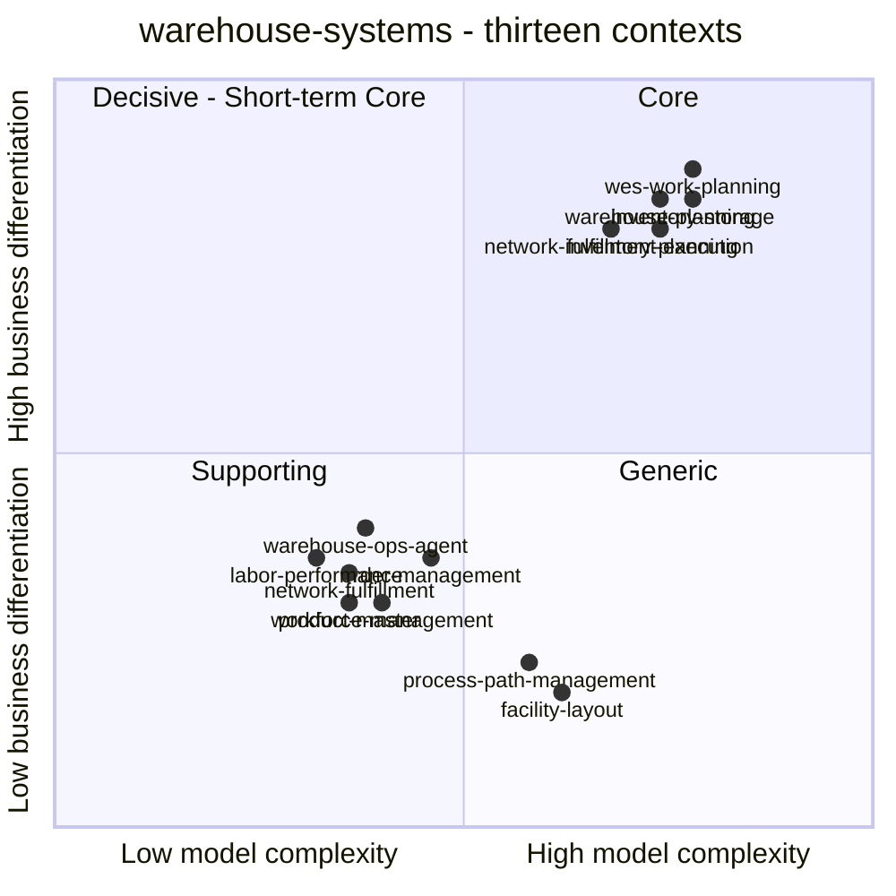

# Core Domain Chart

A [ddd-crew Core Domain Chart](https://github.com/ddd-crew/core-domain-charts)
places each subdomain on two axes: **model complexity** (x) and **business
differentiation** (y). Mermaid numbers the quadrants this way, and every
context's own chart in this fleet uses the same layout:

| Quadrant | Position | Meaning |
| --- | --- | --- |
| 1 · **Core** | top-right | Differentiating and complex. Build it in-house and invest the most here. |
| 2 · **Decisive - Short-term Core** | top-left | Differentiating but simple. Often a quick win whose edge erodes. |
| 3 · **Supporting** | bottom-left | Not differentiating and fairly simple. Build it cheaply. |
| 4 · **Generic** | bottom-right | Not differentiating but complex, because the problem is solved elsewhere. Buy or reuse it. |

Every coordinate is copied from the context's **own** chart. The contexts
mark these positions as judgements grounded in code evidence, not
measurements. The five Core contexts sit close together, so some of their
labels overlap; so do `product-master` and `network-fulfillment` in the
Supporting quadrant. `network-inventory-planning` has no pack of its own yet,
so its point is the one on its page here, authored from its code and ADR 0001.
`inbound-receiving` and `slotting-optimization` are classified Supporting (see
[Subdomain Classification](/strategic-design/subdomain-classification)) but
have no Core Domain Chart of their own yet, so they are not plotted:
this page copies coordinates from context charts and invents none.

## Where each point comes from

| Context | x, y | Quadrant | Fleet classification | Source on the context's own chart |
| --- | --- | --- | --- | --- |
| `wes-work-planning` | 0.78, 0.88 | Core | Core | point `wes-work-planning`, [chart](/contexts/wes-work-planning/core-domain-chart) |
| `inventory-storage` | 0.78, 0.84 | Core | Core | point `inventory-storage`, the whole context. Its chart also plots six capability points. [chart](/contexts/inventory-storage/core-domain-chart) |
| `warehouse-planning` | 0.74, 0.84 | Core | Core | point `warehouse-planning`, [chart](/contexts/warehouse-planning/core-domain-chart) |
| `fulfillment-execution` | 0.74, 0.80 | Core | Core | point `Fulfillment Execution`, the whole context. Its chart also plots six internal slices. [chart](/contexts/fulfillment-execution/core-domain-chart) |
| `workforce-management` | 0.40, 0.30 | Supporting | Supporting | point `workforce management`, [chart](/contexts/workforce-management/core-domain-chart) |
| `labor-performance` | 0.32, 0.36 | Supporting | Supporting | point `labor-performance`, [chart](/contexts/labor-performance/core-domain-chart) |
| `network-fulfillment` | 0.36, 0.34 | Supporting | Supporting | point `network-fulfillment context`, [chart](/contexts/network-fulfillment/core-domain-chart) |
| `warehouse-ops-agent` | 0.38, 0.40 | Supporting | Supporting | point `decision-support policy`. The chart has no whole-context point, so this page uses the higher of its two points. The other, `console-bff read models`, is at 0.18, 0.20, also Supporting. [chart](/contexts/warehouse-ops-agent/core-domain-chart) |
| `order-management` | 0.46, 0.36 | Supporting, near the Generic border | Generic/Supporting | point `order-management today`. Its chart adds `order intake alone` at 0.15, 0.12 and `promise and routing policies` at 0.62, 0.45 "to show why the overall point sits on the Supporting/Generic boundary". [chart](/contexts/order-management/core-domain-chart) |
| `facility-layout` | 0.62, 0.18 | Generic | Generic | point `facility-layout`, [chart](/contexts/facility-layout/core-domain-chart) |
| `process-path-management` | 0.58, 0.22 | Generic | Generic | point `process-path-management`, [chart](/contexts/process-path-management/core-domain-chart) |
| `product-master` | 0.36, 0.30 | Supporting | Supporting | point `product-master`, [chart](/contexts/product-master/core-domain-chart) |
| `network-inventory-planning` | 0.68, 0.80 | Core | Core | point `network-inventory-planning`, authored in this repository because the context repo has no pack yet. [chart](/contexts/network-inventory-planning/core-domain-chart) |

Every context's own chart puts its own point in the quadrant that matches the
fleet classification in [Subdomain Classification](/strategic-design/subdomain-classification).
`order-management` is the one borderline case. Its x of 0.46 sits just left
of the midline, which the fleet's Generic/Supporting label reflects.

:::note[Neighbour placements on other contexts' charts]
Two contexts also plot their neighbours on their own charts for contrast.
Those neighbour points are not the source for this page, and a few of them
disagree with the neighbour's own chart:

- `wes-work-planning`'s chart places `process-path-management` at
  0.30, 0.12. That is the **Supporting** quadrant, but PPM's own chart and
  the fleet classification both say Generic (0.58, 0.22).
- The same chart places `order-management` at 0.58, 0.30, in the Generic
  quadrant. OM's own point is 0.46, 0.36, on the Supporting side of the
  border. The fleet label Generic/Supporting covers both.
- `wes-work-planning`'s and `workforce-management`'s charts each place
  `inventory-storage`, `fulfillment-execution` and `wes-work-planning` at
  slightly different Core coordinates. All of those points are in the Core
  quadrant.

This page keeps each context's own placement and the fleet classification.
:::

## Reading the chart

- **Core: `wes-work-planning`, `inventory-storage`, `warehouse-planning`,
  `fulfillment-execution`, `network-inventory-planning`.**
  - `wes-work-planning` owns the release decision: CPT priority, waveless
    admission, WIP backpressure and Drum-Buffer-Rope flow balancing.
  - `inventory-storage` owns revocable reservations and the chaotic-stow
    ledger. Every customer promise rests on its *usable* answer.
  - `fulfillment-execution` owns pull-based `claimNext` dispatch with
    at-most-once leases.
  - `warehouse-planning` computes the normalized, cross-process effective
    capacity and the forward-looking shortage. No other context computes
    either (its ADR 0001).
  - `network-inventory-planning` decides whether stock should move between
    warehouses and carries an approved transfer to the destination as a saga.
    No other context relates stock, demand and capacity across sites (its ADR
    0001). It sits just below the other Core points because forecasting and
    optimisation are not built yet.
- **Supporting: `workforce-management`, `labor-performance`,
  `network-fulfillment`, `warehouse-ops-agent`, `product-master`, and
  `order-management` on the border.** Each one is necessary, but the differentiating knowledge it uses
  belongs to another context:
  - `workforce-management` records human rebalancing decisions.
  - `labor-performance` measures finished work against standards.
  - `network-fulfillment` asks `order-management` whether an order is
    feasible and never recomputes the answer.
  - `warehouse-ops-agent` only recommends and owns no aggregate.
  - `product-master` must be right and be the single source of SKU master
    data, but nobody chooses the warehouse for how it records handling tags
    and dimensions (its ADR 0001).
  - `order-management`'s promise rules lift it above a commodity order
    front end, but they are not the platform's differentiator.
- **Generic: `facility-layout`, `process-path-management`.** Both are well
  understood and both are extracted once, because several contexts need the
  same model. They sit *right* of the midline: `facility-layout` has eight
  aggregate roots and a travel graph, and `process-path-management` carries
  the CPT schedule and the fulfillment-capability contract. Their complexity
  serves correctness, not differentiation, so they stay in the bottom half.

## Complexity is not classification

The chart separates two things that are easy to confuse:

- **`facility-layout` is complex but Generic.** It has eight aggregate roots
  and 59 typed domain errors, yet nothing in it is where a retailer or 3PL
  wins.
- **`order-management` carries promise and routing policy but stays
  Supporting.** Its own chart expects the point to drift toward the bottom of
  the chart as the promise inputs settle.

Each context's chart also states what would move it:

- `wes-work-planning` would drop to Supporting if a vendor WES replaced its
  release policy behind an ACL.
- `warehouse-ops-agent` would move up only by adding write capability, and
  its ADR 0001 says anything needing an aggregate belongs in a different repo.
- `process-path-management` would move up and need re-classification if CPT
  feasibility logic moved into it from `order-management`.
