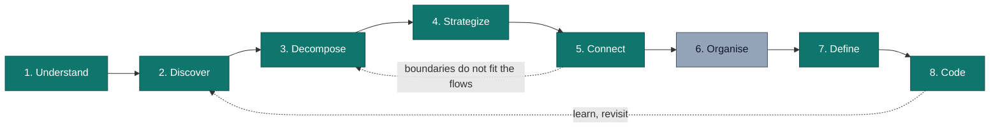

# DDD Starter Modelling Process

ddd-crew's [DDD Starter Modelling Process](https://github.com/ddd-crew/ddd-starter-modelling-process)
is a guide for getting started with Domain-Driven Design. It has eight
steps, from understanding the business model through to writing code.
ddd-crew is explicit that the steps are **not a linear recipe**. Teams
jump between them, repeat them, and revisit earlier steps as they learn.

This page uses the eight steps to index the site. For each step it gives
a short description and names the artifact on this site that is the
step's output for the twelve `warehouse-systems` contexts documented
here (`network-inventory-planning` is not aggregated yet).

Grey marks the one step that has no artifact on this site (see
[Organise](#6-organise)).

## 1. Understand

**What it is:** align on the business model, the users and their needs,
and the organisation's goals before modelling the software. ddd-crew
suggests tools such as the Business Model Canvas, Impact Mapping and User
Story Mapping.

**Output on this site:**

- [Domain Vision](/strategic-design/domain-vision): what the platform
  does, the end-to-end fulfillment flow it serves, and where it wins.
- One **Business Context** page per bounded context, which describes the
  problem the context solves in business language. All twelve are listed
  in the [per-context table](#per-context-artifacts-by-step) below.

## 2. Discover

**What it is:** explore the domain visually and collaboratively, so that
domain experts and engineers build a shared picture of how the business
works. The usual tools are EventStorming and Domain Storytelling.

**Output on this site:**

- [Big Picture EventStorming](/strategic-design/eventstorming-big-picture):
  the fleet-wide, order-to-ship timeline of domain events across every
  context, drawn with ddd-crew's
  [EventStorming notation](https://github.com/ddd-crew/eventstorming-glossary-cheat-sheet).
- One **EventStorming** board per bounded context, synced from that
  context's repository. It covers the context's own commands, policies,
  read models and hotspots.

## 3. Decompose

**What it is:** split the domain into sub-domains, which are loosely
coupled parts that can be reasoned about and changed independently.

**Output on this site:**

- [Subdomain Classification](/strategic-design/subdomain-classification):
  each bounded context, the part of the domain it owns, and why the line
  is drawn there.
- [Bounded Contexts](/contexts): the twelve resulting contexts, with their
  tier and CloudEvents subdomain (`wms` or `wes`).

## 4. Strategize

**What it is:** decide which sub-domains are Core (where the business
must differentiate), Supporting or Generic, so investment goes where it
matters. ddd-crew's tool here is the
[Core Domain Chart](https://github.com/ddd-crew/core-domain-charts).

**Output on this site:**

- [Core Domain Chart](/strategic-design/core-domain-chart): all twelve
  contexts on one chart.
- One **Core Domain Chart** per context, synced from its repository,
  which gives that context's own position and evidence.

The resulting classification:

| Classification | Bounded contexts |
| --- | --- |
| Core | `inventory-storage`, `wes-work-planning`, `fulfillment-execution`, `warehouse-planning` |
| Supporting | `workforce-management`, `labor-performance`, `warehouse-ops-agent`, `network-fulfillment`, `product-master` |
| Generic | `facility-layout`, `process-path-management` |
| Generic/Supporting | `order-management` |

## 5. Connect

**What it is:** connect the sub-domains into an architecture that
delivers the end-to-end business use cases, and make every message and
relationship between them explicit. ddd-crew's tools are
[Domain Message Flow Modelling](https://github.com/ddd-crew/domain-message-flow-modelling)
and [Context Mapping](https://github.com/ddd-crew/context-mapping).

**Output on this site:**

- [Domain Message Flow Modelling](/strategic-design/domain-message-flows):
  the fleet's key business scenarios as commands, events and queries
  between contexts.
- [Context Map](/strategic-design/context-map): every relationship between
  contexts, with its upstream/downstream patterns and technology.
- [Event Standard (CloudEvents 1.0)](/strategic-design/event-standard-cloudevents):
  the one mandatory envelope for every Kafka message that crosses those
  relationships.
- One **Domain Message Flow** and one **Context Map** per context, synced
  from its repository.

## 6. Organise

**What it is:** organise autonomous teams around the bounded contexts so
that team boundaries reinforce the architecture. ddd-crew points to Team
Topologies for this step.

**Output on this site:** **none.** This site has no team-ownership,
team-topology or socio-technical artifact, and none is claimed.
`warehouse-systems` is a study project without real teams to organise.
The nearest structural fact is that each bounded context lives in its own
repository (`github.com/IQVO/<context>`) with its own decision trail,
which the [ADR index](/adr) links to. That is a code-ownership boundary.
It is not a team design.

## 7. Define

**What it is:** define each bounded context's role, responsibilities,
ubiquitous language and inbound and outbound communication before
designing its internals. ddd-crew's tool is the
[Bounded Context Canvas](https://github.com/ddd-crew/bounded-context-canvas).

**Output on this site:**

- One **Bounded Context Canvas** per context, synced from its repository.
  Each row maps to a real route, MCP tool or Kafka topic in that
  context's code.
- One **Ubiquitous Language** page per context, plus the fleet-wide
  [Ubiquitous Language](/strategic-design/ubiquitous-language).

## 8. Code

**What it is:** design the internals of each context, including its
aggregates, invariants, persistence and interactions, and then implement
them. ddd-crew's tool for the aggregate is the
[Aggregate Design Canvas](https://github.com/ddd-crew/aggregate-design-canvas).

**Output on this site:**

- Per context, synced from its repository: **Aggregate Design Canvas**,
  **Class Diagram**, **Entity Relationship** diagram, **Sequence
  Diagrams** and **Domain Events**.
- [Architecture](/architecture): fleet-level summaries such as the
  [Domain Model](/architecture/domain-model) and
  [Data Models](/architecture/data-models), which link to each context's
  detailed pages.
- [API Reference](/api-reference): REST and AsyncAPI references generated
  from each context's own `apis/openapi.yaml` and `apis/asyncapi.yaml`.
- [ADR index](/adr): each context's own Architecture Decision Records. The
  index links to them and does not copy them.

## Per-context artifacts by step

| Context | Understand | Discover | Strategize | Connect | Define | Code |
| --- | --- | --- | --- | --- | --- | --- |
| `order-management` | [Business Context](/contexts/order-management/business-context) | [EventStorming](/contexts/order-management/eventstorming) | [Core Domain Chart](/contexts/order-management/core-domain-chart) | [Message Flow](/contexts/order-management/domain-message-flow), [Context Map](/contexts/order-management/context-map) | [Canvas](/contexts/order-management/bounded-context-canvas) | [Aggregate Canvas](/contexts/order-management/aggregate-design-canvas) |
| `inventory-storage` | [Business Context](/contexts/inventory-storage/business-context) | [EventStorming](/contexts/inventory-storage/eventstorming) | [Core Domain Chart](/contexts/inventory-storage/core-domain-chart) | [Message Flow](/contexts/inventory-storage/domain-message-flow), [Context Map](/contexts/inventory-storage/context-map) | [Canvas](/contexts/inventory-storage/bounded-context-canvas) | [Aggregate Canvas](/contexts/inventory-storage/aggregate-design-canvas) |
| `wes-work-planning` | [Business Context](/contexts/wes-work-planning/business-context) | [EventStorming](/contexts/wes-work-planning/eventstorming) | [Core Domain Chart](/contexts/wes-work-planning/core-domain-chart) | [Message Flow](/contexts/wes-work-planning/domain-message-flow), [Context Map](/contexts/wes-work-planning/context-map) | [Canvas](/contexts/wes-work-planning/bounded-context-canvas) | [Aggregate Canvas](/contexts/wes-work-planning/aggregate-design-canvas) |
| `fulfillment-execution` | [Business Context](/contexts/fulfillment-execution/business-context) | [EventStorming](/contexts/fulfillment-execution/eventstorming) | [Core Domain Chart](/contexts/fulfillment-execution/core-domain-chart) | [Message Flow](/contexts/fulfillment-execution/domain-message-flow), [Context Map](/contexts/fulfillment-execution/context-map) | [Canvas](/contexts/fulfillment-execution/bounded-context-canvas) | [Aggregate Canvas](/contexts/fulfillment-execution/aggregate-design-canvas) |
| `workforce-management` | [Business Context](/contexts/workforce-management/business-context) | [EventStorming](/contexts/workforce-management/eventstorming) | [Core Domain Chart](/contexts/workforce-management/core-domain-chart) | [Message Flow](/contexts/workforce-management/domain-message-flow), [Context Map](/contexts/workforce-management/context-map) | [Canvas](/contexts/workforce-management/bounded-context-canvas) | [Aggregate Canvas](/contexts/workforce-management/aggregate-design-canvas) |
| `facility-layout` | [Business Context](/contexts/facility-layout/business-context) | [EventStorming](/contexts/facility-layout/eventstorming) | [Core Domain Chart](/contexts/facility-layout/core-domain-chart) | [Message Flow](/contexts/facility-layout/domain-message-flow), [Context Map](/contexts/facility-layout/context-map) | [Canvas](/contexts/facility-layout/bounded-context-canvas) | [Aggregate Canvas](/contexts/facility-layout/aggregate-design-canvas) |
| `process-path-management` | [Business Context](/contexts/process-path-management/business-context) | [EventStorming](/contexts/process-path-management/eventstorming) | [Core Domain Chart](/contexts/process-path-management/core-domain-chart) | [Message Flow](/contexts/process-path-management/domain-message-flow), [Context Map](/contexts/process-path-management/context-map) | [Canvas](/contexts/process-path-management/bounded-context-canvas) | [Aggregate Canvas](/contexts/process-path-management/aggregate-design-canvas) |
| `labor-performance` | [Business Context](/contexts/labor-performance/business-context) | [EventStorming](/contexts/labor-performance/eventstorming) | [Core Domain Chart](/contexts/labor-performance/core-domain-chart) | [Message Flow](/contexts/labor-performance/domain-message-flow), [Context Map](/contexts/labor-performance/context-map) | [Canvas](/contexts/labor-performance/bounded-context-canvas) | [Aggregate Canvas](/contexts/labor-performance/aggregate-design-canvas) |
| `warehouse-ops-agent` | [Business Context](/contexts/warehouse-ops-agent/business-context) | [EventStorming](/contexts/warehouse-ops-agent/eventstorming) | [Core Domain Chart](/contexts/warehouse-ops-agent/core-domain-chart) | [Message Flow](/contexts/warehouse-ops-agent/domain-message-flow), [Context Map](/contexts/warehouse-ops-agent/context-map) | [Canvas](/contexts/warehouse-ops-agent/bounded-context-canvas) | [Aggregate Canvas](/contexts/warehouse-ops-agent/aggregate-design-canvas) (no aggregate root) |
| `network-fulfillment` | [Business Context](/contexts/network-fulfillment/business-context) | [EventStorming](/contexts/network-fulfillment/eventstorming) | [Core Domain Chart](/contexts/network-fulfillment/core-domain-chart) | [Message Flow](/contexts/network-fulfillment/domain-message-flow), [Context Map](/contexts/network-fulfillment/context-map) | [Canvas](/contexts/network-fulfillment/bounded-context-canvas) | [Aggregate Canvas](/contexts/network-fulfillment/aggregate-design-canvas) |
| `warehouse-planning` | [Business Context](/contexts/warehouse-planning/business-context) | [EventStorming](/contexts/warehouse-planning/eventstorming) | [Core Domain Chart](/contexts/warehouse-planning/core-domain-chart) | [Message Flow](/contexts/warehouse-planning/domain-message-flow), [Context Map](/contexts/warehouse-planning/context-map) | [Canvas](/contexts/warehouse-planning/bounded-context-canvas) | [Aggregate Canvas](/contexts/warehouse-planning/aggregate-design-canvas) |
| `product-master` | [Business Context](/contexts/product-master/business-context) | [EventStorming](/contexts/product-master/eventstorming) | [Core Domain Chart](/contexts/product-master/core-domain-chart) | [Message Flow](/contexts/product-master/domain-message-flow), [Context Map](/contexts/product-master/context-map) | [Canvas](/contexts/product-master/bounded-context-canvas) | [Aggregate Canvas](/contexts/product-master/aggregate-design-canvas) |

The Decompose step's output is fleet-level only, in
[Subdomain Classification](/strategic-design/subdomain-classification).
The Organise step has no output (see above). Each context's class
diagram, entity-relationship diagram, sequence diagrams and domain events
are linked from that context's [overview page](/contexts).
