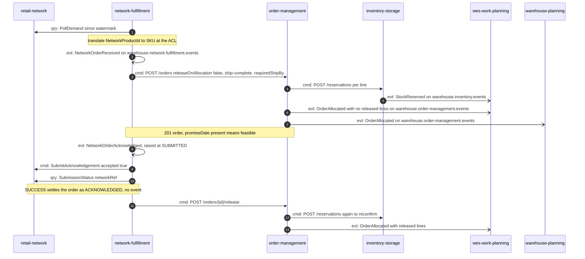
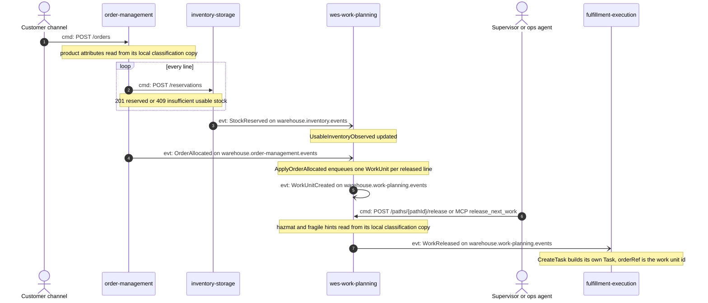
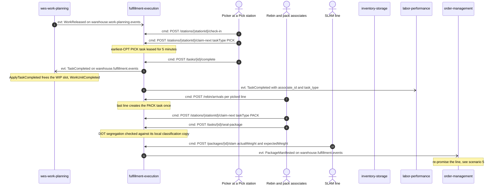
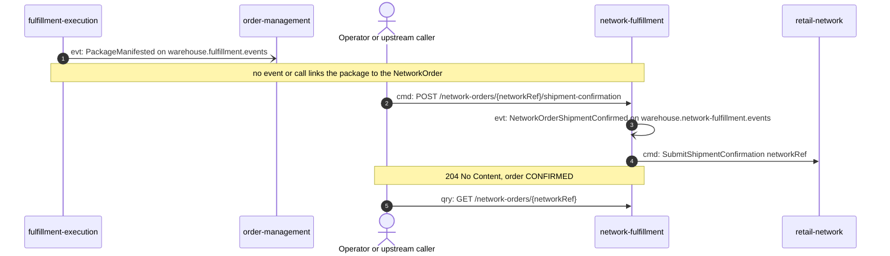
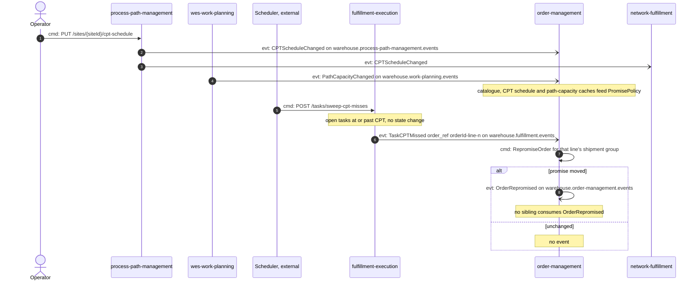
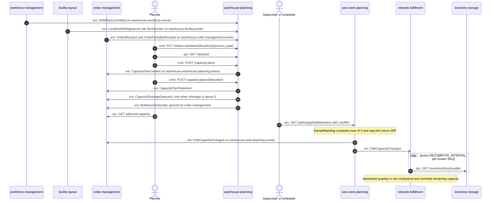
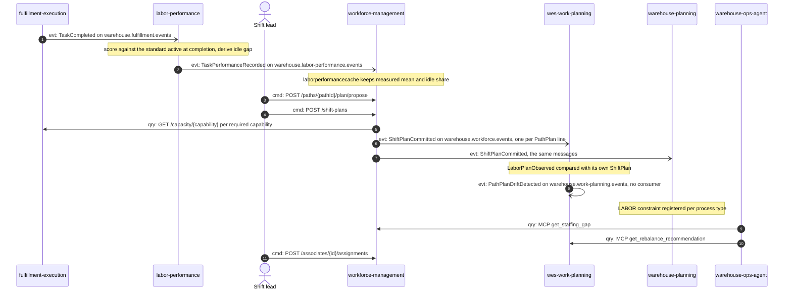
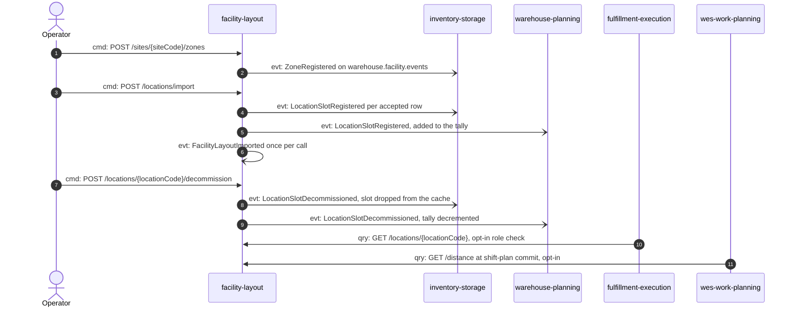
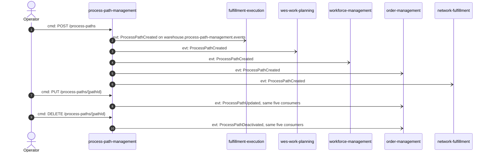
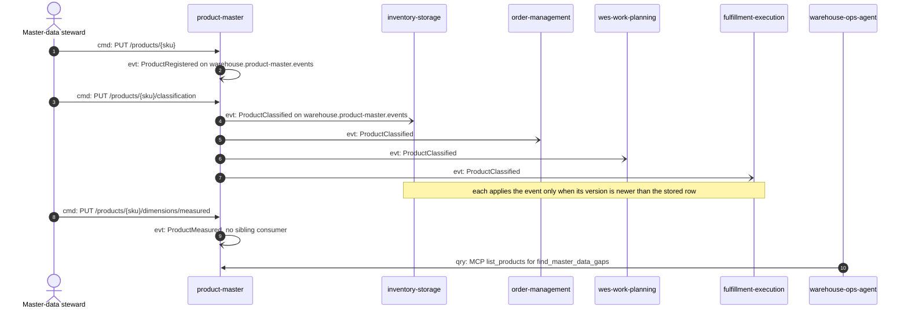

# Domain Message Flow Modelling

This page follows ddd-crew's
[Domain Message Flow Modelling](https://github.com/ddd-crew/domain-message-flow-modelling).
It traces the platform's key business scenarios across bounded-context
boundaries. The per-context pages show one context's view. This page joins
them into end-to-end flows.

**Notation.** Participants are bounded contexts, people and external systems.
Every arrow is numbered and prefixed:

- `cmd:` is a command, a request to change state: a REST write, an MCP write
  tool or a port call to the external network.
- `qry:` is a query, a request for data: a REST `GET` or an MCP read tool.
- `evt:` is a domain event, a fact published as a CloudEvents 1.0 message on
  Kafka. Open arrowheads (`-)`) mark asynchronous Kafka hops. The topic is
  named in the message or in a note.

Inside the diagrams, event names are shortened to their last `type` segment.
The full type is
`com.warehouse.<wms|wes>.<bounded-context>.<entity>.<EventName>` (see the
[Event Standard](/strategic-design/event-standard-cloudevents)). Replies are
folded into notes, so that every arrow is a domain message.

**Sources.** Every message comes from a synced spec (`apis/<context>/openapi.yaml`,
`apis/<context>/asyncapi.yaml`) or from that context's own code-grounded
Domain Message Flow page. Those pages are linked under each scenario. The
diagrams leave out the transactional-outbox relay hop and the analytics
copy that every producer also writes to its `warehouse.<ctx>.analytics`
topic.

## Integration topics at a glance

Only the integration topics are listed. The `*.analytics` topics feed each
context's own projector and are never read by a sibling.

| Topic | Producer | Event types consumed by a sibling | Consumers |
| --- | --- | --- | --- |
| `warehouse.order-management.events` | order-management | `OrderAllocated`, `OrderPartiallyAllocated` | wes-work-planning, warehouse-planning |
| `warehouse.inventory.events` | inventory-storage | `StockReserved`, `ReservationRevoked` | wes-work-planning |
| | | legacy `ProductClassified` (emitted only by the one-shot backfill) | product-master's legacy importer (migration only, removed at stage E) |
| `warehouse.work-planning.events` | wes-work-planning | `WorkReleased` | fulfillment-execution |
| | | `PathCapacityChanged` | order-management, network-fulfillment |
| `warehouse.fulfillment.events` | fulfillment-execution | `TaskCompleted` | wes-work-planning, labor-performance |
| | | `TaskCPTMissed`, `PackageManifested` | order-management |
| `warehouse.workforce.events` | workforce-management | `ShiftPlanCommitted` | wes-work-planning, warehouse-planning |
| `warehouse.labor-performance.events` | labor-performance | `TaskPerformanceRecorded` | workforce-management |
| `warehouse.process-path-management.events` | process-path-management | `ProcessPathCreated`, `ProcessPathUpdated`, `ProcessPathDeactivated` | fulfillment-execution, wes-work-planning, workforce-management, order-management, network-fulfillment |
| | | `CPTScheduleChanged` | order-management, network-fulfillment |
| `warehouse.facility.events` | facility-layout | `ZoneRegistered`, `LocationSlotRegistered`, `LocationSlotDecommissioned` | inventory-storage (all three), warehouse-planning (the two slot events) |
| `warehouse.warehouse-planning.events` | warehouse-planning | `CapacityPlanCreated`, `CapacityPlanPublished`, `CapacityShortageDetected` | order-management (`BottleneckDetected` is ignored) |
| `warehouse.network-fulfillment.events` | network-fulfillment | none | no consumer (wired but unused) |
| `warehouse.product-master.events` | product-master | `ProductClassified` | inventory-storage, order-management, wes-work-planning, fulfillment-execution (local copies) |

Several published types have no sibling consumer today. These are
`OrderRepromised`, nine of the eleven `warehouse.work-planning.events`
types (for example `PathPlanDriftDetected` and `WorkUnitCompleted`),
`BottleneckDetected`, every `warehouse.network-fulfillment.events` type and
the four `warehouse.product-master.events` types other than
`ProductClassified`.
They are listed as hotspots on
[Big Picture EventStorming](/strategic-design/eventstorming-big-picture).
`warehouse-ops-agent` has no Kafka I/O at all. It only issues `qry:`
messages over MCP and REST.

## 1. Network order intake and acceptance

The external retail network's purchase order becomes a **held** order in
`order-management`. It is released to the floor only after the network
confirms our acceptance.

Rejection branches: an untranslatable product leads to `NetworkOrderRejected`
`UNTRANSLATABLE_SKU`, with no call to `order-management`. A null
`promiseDate` leads to `DELETE /orders/{id}`, then `NetworkOrderRejected`
`INFEASIBLE_DEADLINE`. A `FAILURE` on reconcile leads to `DELETE /orders/{id}`,
then `NetworkOrderRejected` `SUBMISSION_FAILED`. Each rejection is followed
by `SubmitAcknowledgement accepted false`, except `SUBMISSION_FAILED`.

Sources: [network-fulfillment flows 1 and 2](/contexts/network-fulfillment/domain-message-flow),
[order-management flow 2](/contexts/order-management/domain-message-flow),
[inventory-storage flow 1](/contexts/inventory-storage/domain-message-flow),
[warehouse-planning flow 2](/contexts/warehouse-planning/domain-message-flow).

## 2. Order allocation to released work

A direct-channel order allocates and releases in one request. Release is
**choreographed**. `order-management` does not call `wes-work-planning`. It
announces released lines on `OrderAllocated`, and `wes-work-planning`
derives one `WorkUnit` per line, with the id `orderId-line-n`.

`OrderPartiallyAllocated` takes the place of `OrderAllocated` when a
partial-shipment order releases only some lines. A ship-complete order with
a backordered line releases nothing. `POST /paths/{pathId}/work-units` is a
REST alternative to the Kafka enqueue. Neither `order-management` nor
`wes-work-planning` asks another context for a SKU's classification at
request time: each reads a local copy fed by product-master's
`ProductClassified` (scenario 10), with `PRODUCT_CLASSIFICATION_MODE=kafka`
in the reference deployment. The binary default, `permissive`, reads no
copy and adds no hint.

Sources: [order-management flow 1](/contexts/order-management/domain-message-flow),
[wes-work-planning scenario 1](/contexts/wes-work-planning/domain-message-flow),
[inventory-storage flow 1](/contexts/inventory-storage/domain-message-flow),
[wes-work-planning context map](/contexts/wes-work-planning/context-map).

## 3. Execution: pick, rebin, pack, SLAM and the completion loop

`fulfillment-execution` dispatches by **pull**. A station claims the next
earliest-CPT task it is equipped for. `TaskCompleted` closes the WIP loop
in `wes-work-planning` and feeds `labor-performance`. `PackageManifested`
reaches `order-management`.

Outside the 5 % weight tolerance, the package is `DIVERTED`. That raises
`WeightDiscrepancyDetected` and `PackageDiverted` on the analytics topic
only, and nothing reaches `order-management`. No sibling calls
`inventory-storage`'s `POST /reservations/{id}/confirm-pick`. The physical
pick therefore never consumes the reservation in the live flow. Only the
`e2e-tests` simulator calls it.

Sources: [fulfillment-execution scenarios 1 and 2](/contexts/fulfillment-execution/domain-message-flow),
[wes-work-planning context map, "The loop"](/contexts/wes-work-planning/context-map),
[labor-performance flow 1](/contexts/labor-performance/domain-message-flow),
[inventory-storage context map](/contexts/inventory-storage/context-map).

## 4. Shipment confirmation back to the network

The network order is closed by an **explicit** shipment confirmation,
which an operator or an upstream caller sends. It is not derived from
`PackageManifested`. `network-fulfillment` keeps no mapping from a work
unit or package to a `NetworkRef`, and its ADR 0014 records that choice.

The synced `apis/network-fulfillment/openapi.yaml` does not yet list the
`shipment-confirmation` route. It is drawn here from the context's
code-grounded flow page. `NetworkOrderShipmentConfirmed` has no Kafka
consumer in the fleet.

Sources: [network-fulfillment flow 1](/contexts/network-fulfillment/domain-message-flow),
[network-fulfillment EventStorming, section 3](/contexts/network-fulfillment/eventstorming),
[network-fulfillment context map](/contexts/network-fulfillment/context-map).

## 5. CPT miss and re-promise

The **CPT** (Critical Pull Time) is a site's carrier cutoff. An external
scheduler drives `fulfillment-execution`'s sweep. Every open task at or
past its CPT is reported, and `order-management` recomputes the affected
line's shipment-group promise from its local read models.

Nothing in `fulfillment-execution` runs the sweep on a timer. The same
overdue task is reported again on every later pass. `order-management`
dedupes on the CloudEvents `id` and sends a message to the DLQ after three
failed attempts.

Sources: [order-management flow 3](/contexts/order-management/domain-message-flow),
[fulfillment-execution scenario 3](/contexts/fulfillment-execution/domain-message-flow),
[process-path-management flow 3](/contexts/process-path-management/domain-message-flow).

## 6. Capacity planning feed

Three planning signals feed promising. `warehouse-planning` composes
**planned** capacity from labor, stations and demand. `wes-work-planning`
publishes **remaining** path capacity. `network-fulfillment` turns both
stock and remaining capacity into a capability offer. Planned capacity
only annotates an order. It never moves a promise (order-management
ADR 0031).

`GET /orders/{id}` carries a `capacityConstraint` when the order's promise
overlaps a published shortage. The capability offer is computed only when
`CAPABILITY_OFFER_ENABLED=true`. It is readable through
`GET /capability-offers` and the MCP tool `list_capability_offers`, but is
not yet submitted to the network: `SubmitAvailability` is unused. That
route is also missing from the synced network-fulfillment `openapi.yaml`.
`warehouse-ops-agent` reads `get_process_path_capacity` over MCP for its
daily brief.

Sources: [warehouse-planning flows 1 to 3](/contexts/warehouse-planning/domain-message-flow),
[order-management flow 4](/contexts/order-management/domain-message-flow),
[wes-work-planning scenario 3](/contexts/wes-work-planning/domain-message-flow),
[network-fulfillment flow 4](/contexts/network-fulfillment/domain-message-flow).

## 7. Staffing and labor feedback

Measured performance flows back into staffing proposals, and committed
staffing flows forward into release planning and capacity planning.
Moving people stays a human decision.

`labor-performance` makes no REST or MCP call to a sibling. It only
consumes `TaskCompleted`. The measured-rate feed into `workforce-management`
uses Kafka when `LABOR_PERFORMANCE_MODE=kafka-cache`. The REST client for
`GET /task-types/{taskType}/performance` is still wired as the alternative.
`wes-work-planning` publishes its own, different
`com.warehouse.wes.work-planning.plan.ShiftPlanCommitted` when a planner
calls `POST /paths/{pathId}/plan`. Consumers must dispatch on the full type.

Sources: [labor-performance flow 1](/contexts/labor-performance/domain-message-flow),
[workforce-management flows 1, 2 and 4](/contexts/workforce-management/domain-message-flow),
[wes-work-planning scenario 2](/contexts/wes-work-planning/domain-message-flow),
[warehouse-planning flow 1](/contexts/warehouse-planning/domain-message-flow),
[warehouse-ops-agent flow 2](/contexts/warehouse-ops-agent/domain-message-flow).

## 8. Facility layout changes

`facility-layout` is the source of truth for physical structure. Its
events maintain local caches in `inventory-storage` and a station tally in
`warehouse-planning`. Other contexts query it only on demand.

`inventory-storage` checks a stow against its cache only when
`LOCATION_LOOKUP_MODE=kafka`. With `http`, it calls
`GET /locations/{locationCode}/classification` instead. The default,
`permissive`, enforces no placement rule. Decommission is one-way.
Re-registering the code returns `409`.

Sources: [facility-layout flows 1 to 4](/contexts/facility-layout/domain-message-flow),
[inventory-storage flow 3](/contexts/inventory-storage/domain-message-flow),
[inventory-storage EventStorming](/contexts/inventory-storage/eventstorming).

## 9. Process-path catalogue propagation

`process-path-management` defines the canonical process paths. Five
contexts replay its events into a local catalogue cache. None of them
calls it synchronously.

`wes-work-planning` and `workforce-management` read the topic only with
`PATH_CATALOGUE_SOURCE=kafka`. Their default is a YAML file.
`warehouse-planning` does not consume these events. Its `ProcessPath` is a
different, locally declared model (see
[Ubiquitous Language](/strategic-design/ubiquitous-language)).

Sources: [process-path-management flows 1 and 2](/contexts/process-path-management/domain-message-flow),
[workforce-management flow 4](/contexts/workforce-management/domain-message-flow),
[wes-work-planning context map](/contexts/wes-work-planning/context-map).

## 10. Product master data propagation

`product-master` is the single source of truth for what a SKU is. A steward
registers and classifies a product there. Four contexts keep a local,
version-guarded copy of the classification. Nobody calls `product-master`
at request time, and `product-master` calls nobody.

`inventory-storage` answers its old `PUT /products/{sku}/classification`
with `410` (`classification-moved`) and keeps applying hazmat placement and
DOT segregation at stow time from its copy. During the migration,
`product-master`'s legacy importer also reads `inventory-storage`'s legacy
`ProductClassified` from `warehouse.inventory.events`, which only the
one-shot `republish-product-classifications` backfill still emits; both are
removed at stage E (product-master ADR 0003).

Sources: [product-master domain message flow](/contexts/product-master/domain-message-flow),
[product-master Async API](/contexts/product-master/async-api),
[product-master context map](/contexts/product-master/context-map),
[warehouse-ops-agent context map](/contexts/warehouse-ops-agent/context-map).
