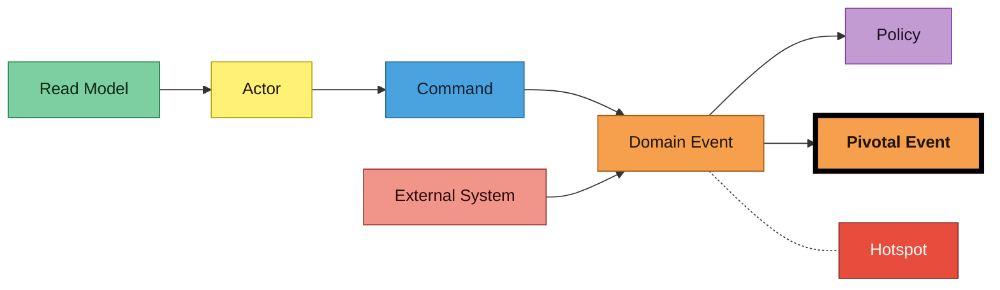
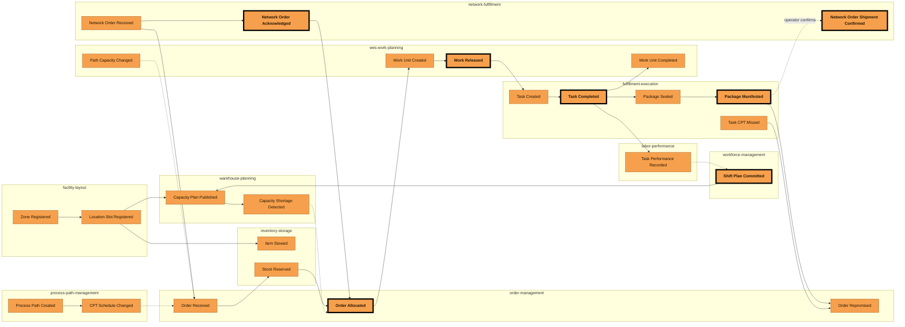
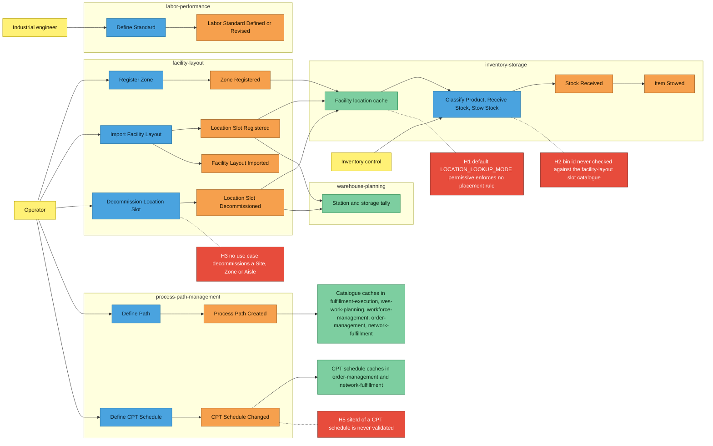
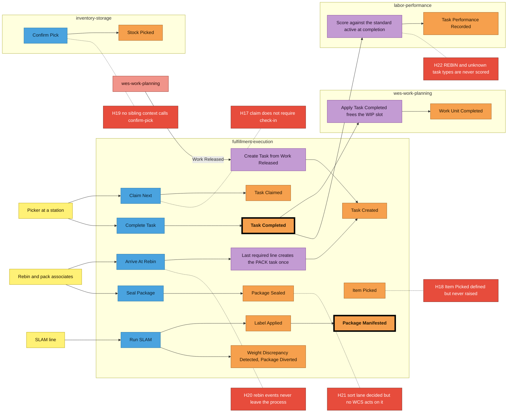
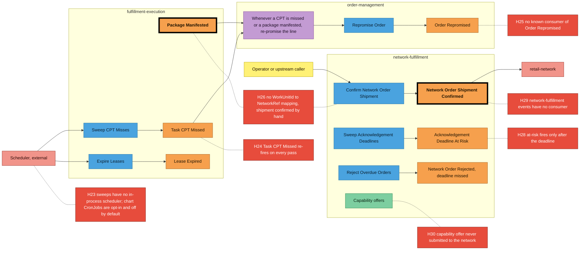

# Big Picture EventStorming

This page is a fleet-level Big Picture EventStorming in the notation of the
ddd-crew
[EventStorming glossary and cheat sheet](https://github.com/ddd-crew/eventstorming-glossary-cheat-sheet).
It lays the order-to-ship timeline across all bounded contexts on one
wall. It was reconstructed from the code-grounded artifacts each context
publishes, not from a workshop. Each context's own design-level
EventStorming page has the detail, and the pages are linked
[at the end](#per-context-eventstorming).

Every orange sticky is a real domain event: it appears in a synced
`apis/<context>/asyncapi.yaml` or on that context's Domain Events page.
Every hotspot is a gap that is already documented somewhere, and the
[hotspot table](#hotspots-and-their-sources) cites the source for each one.
Nothing on this page is a guess.

## Legend

| Sticky | Colour | Meaning here |
| --- | --- | --- |
| Domain Event | orange `#f6a04d` | A fact a context publishes, named in the past tense, for example `WorkReleased` |
| **Pivotal Event** | orange, thick black border | A fact that hands the timeline from one phase to the next |
| Command | blue `#4aa3df` | A request to change state: a REST write, an MCP write tool or a network port call |
| Policy | lilac `#c39bd3` | "Whenever X happens, do Y". These are reactions wired in code. |
| Read Model | green `#7dcea0` | Data a person or policy reads to decide, often a local cache fed by events |
| External System | salmon `#f1948a` | Something outside the eleven contexts: the retail network, an external scheduler |
| Actor | yellow `#fff176` | A person or role who issues a command |
| Hotspot | red `#e74c3c` | A documented gap, numbered `H1` and up and sourced in the table below |

## How to read this page

- **Time flows left to right.** Each diagram is one phase of the timeline.
  The overview strings the pivotal events together.
- **Swimlanes are bounded contexts.** Each boxed lane holds the stickies
  owned by one context. An arrow that crosses lanes is an integration. It is
  a Kafka event, or a synchronous call where the label says so.
- **Pivotal events** have a thick border. They mark the hand-offs:
  shift plan committed, demand accepted, work released, work completed,
  package manifested and shipment confirmed.
- **Hotspots** hang off the sticky they concern with a dotted line. Their
  number points to the source in [the table](#hotspots-and-their-sources).
- Analytics-only events, such as `OrderReceived` or `TaskCreated`, are
  still domain events. They are drawn where they belong in time, even
  though no sibling consumes them. The
  [Domain Message Flows](/strategic-design/domain-message-flows) page
  states which topic carries each event and who consumes it.
- `warehouse-ops-agent` has no lane. It publishes and consumes no events
  and issues no commands. It only queries the other contexts over MCP and
  REST.

## Timeline overview

Solid arrows are the causal order of the happy path. Dotted arrows are
feedback and read-model feeds. `PathCapacityChanged`, `CPTScheduleChanged`
and published shortages are cached locally by `order-management`, and its
promise and order view read from those caches. `TaskPerformanceRecorded`
reaches the next staffing proposal. The `FE4` to `NF3` arrow is dotted on
purpose. No event or call links a manifested package to the network order,
and an operator closes the loop by hand (hotspot H26).

Sources: event names from every `apis/*/asyncapi.yaml`. Causal order from
the per-context [Domain Message Flow](/contexts/order-management/domain-message-flow)
pages, joined on [Domain Message Flows](/strategic-design/domain-message-flows).

## Phase 0: the building, the catalogue and the standards

Reference data has to exist before the first order arrives. Facility
structure, process paths and CPT schedules, labor standards and stock on
the shelves are all set up in this phase.

Sources: [facility-layout flows 1 and 3](/contexts/facility-layout/domain-message-flow),
[process-path-management flows 1 to 3](/contexts/process-path-management/domain-message-flow),
[labor-performance flow 2](/contexts/labor-performance/domain-message-flow),
[inventory-storage flow 3](/contexts/inventory-storage/domain-message-flow).

## Phase 1: demand intake and allocation

Two entry points converge on `OrderAllocated`. A direct customer order
allocates and releases at once. A network purchase order is held until the
network confirms our acceptance.

```mermaid
flowchart LR
    RN["retail-network"]:::external
    CUS["Customer channel"]:::actor
    subgraph S_NF["network-fulfillment"]
        direction LR
        C1["Receive Network Demand"]:::command
        E1["Network Order Received"]:::event
        P1["Unknown product rejects the whole order"]:::policy
        P2["Null promiseDate means infeasible"]:::policy
        E2["Network Order Rejected"]:::event
        E3["Network Order Acknowledged"]:::pivotal
        P3["Reconcile: SUCCESS releases the hold"]:::policy
    end
    subgraph S_OM["order-management"]
        direction LR
        C2["Receive Order"]:::command
        E4["Order Received"]:::event
        P4["Allocate every line"]:::policy
        E5["Order Line Allocated or Backordered"]:::event
        C3["Release Held Order"]:::command
        E6["Order Allocated"]:::pivotal
        E7["Order Partially Allocated"]:::event
        E8["Order Cancelled"]:::event
        R1["Process path, CPT schedule and path capacity caches"]:::readmodel
    end
    subgraph S_INV["inventory-storage"]
        direction LR
        C4["Reserve Stock"]:::command
        E9["Stock Reserved"]:::event
        E10["Reservation Revoked"]:::event
    end

    RN --> C1 --> E1
    E1 --> P1 --> E2
    E1 -- "POST /orders held" --> C2
    CUS --> C2
    R1 --> C2
    C2 --> E4 --> P4
    P4 -- "POST /reservations" --> C4 --> E9
    E9 --> E5
    E5 --> E6
    E5 --> E7
    E6 --> P2
    P2 --> E3
    P2 --> E2
    E3 --> RN
    E3 --> P3
    P3 -- "POST /orders/id/release" --> C3 --> E6
    E2 -- "DELETE /orders/id" --> E8
    E8 --> E10

    H6["H6 Acknowledged fires at SUBMITTED, before reconciliation"]:::hotspot
    H7["H7 no event for SUBMITTED to ACKNOWLEDGED"]:::hotspot
    H8["H8 crash after raising the hold leaves a NEW order with no localOrderId"]:::hotspot
    H9["H9 orphaned held order is never swept"]:::hotspot
    H11["H11 no background sweeper for timed-out reservations"]:::hotspot
    E3 -.- H6
    P3 -.- H7
    C2 -.- H8
    C3 -.- H9
    E9 -.- H11

    classDef actor fill:#fff176,stroke:#b59f00,color:#1f1300
    classDef command fill:#4aa3df,stroke:#1f6f9f,color:#0b1e2d
    classDef event fill:#f6a04d,stroke:#9a5b1c,color:#1f1300
    classDef pivotal fill:#f6a04d,stroke:#000000,stroke-width:5px,color:#1f1300,font-weight:bold
    classDef policy fill:#c39bd3,stroke:#7d3c98,color:#1f0f26
    classDef readmodel fill:#7dcea0,stroke:#1e8449,color:#0b2614
    classDef external fill:#f1948a,stroke:#922b21,color:#2b0a07
    classDef hotspot fill:#e74c3c,stroke:#78281f,color:#ffffff
```

The held order publishes `OrderAllocated` twice. The first one, at intake,
carries no released lines. The second one follows `Release Held Order` and
carries the released lines that `wes-work-planning` schedules.

Sources: [network-fulfillment flows 1 and 2](/contexts/network-fulfillment/domain-message-flow),
[network-fulfillment EventStorming](/contexts/network-fulfillment/eventstorming),
[order-management flows 1 and 2](/contexts/order-management/domain-message-flow),
[order-management EventStorming](/contexts/order-management/eventstorming),
[inventory-storage flows 1 and 2](/contexts/inventory-storage/domain-message-flow).

## Phase 2: staffing, capacity planning and release

Released lines become work units. Each shift's staffing and planned
capacity set how much work the floor can absorb, and the release policy
admits work continuously, without waves.

```mermaid
flowchart LR
    LEAD["Shift lead"]:::actor
    PLN["Planner"]:::actor
    SUP["Supervisor or ops agent"]:::actor
    OMX["order-management"]:::external
    subgraph S_WFM["workforce-management"]
        direction LR
        C1["Propose Path Plan"]:::command
        E1["Shift Plan Proposed"]:::event
        R1["Measured rate and idle share cache"]:::readmodel
        C2["Commit Shift Plan"]:::command
        E2["Shift Plan Committed"]:::pivotal
        E3["Path Understaffed"]:::event
    end
    subgraph S_WPL["warehouse-planning"]
        direction LR
        R2["Labor constraints, station tally, expected demand"]:::readmodel
        C3["Create and Publish Capacity Plan"]:::command
        E4["Capacity Plan Created, Published"]:::event
        E5["Capacity Shortage Detected"]:::event
        E6["Bottleneck Detected"]:::event
    end
    subgraph S_WWP["wes-work-planning"]
        direction LR
        P1["Apply Order Allocated: one work unit per released line"]:::policy
        E7["Work Unit Created"]:::event
        R3["Labor Plan Observed"]:::readmodel
        E8["Path Plan Drift Detected"]:::event
        R4["Usable Inventory Observed"]:::readmodel
        C4["Release Next Work"]:::command
        E9["Work Released"]:::pivotal
        C5["Sample Backlog"]:::command
        E10["Path Capacity Changed"]:::event
        E11["Backlog Threshold Breached"]:::event
    end

    LEAD --> C1 --> E1
    R1 --> C1
    LEAD --> C2 --> E2
    E2 --> R3 --> E8
    E2 --> R2
    PLN --> C3
    R2 --> C3 --> E4
    E4 --> E5
    E4 --> E6
    E5 --> OMX
    OMX -- "Order Allocated" --> P1 --> E7
    OMX -- "Order Allocated" --> R2
    SUP --> C4 --> E9
    E7 --> C4
    SUP --> C5 --> E10 --> OMX
    C5 --> E11

    H12["H12 Usable Inventory Observed feeds no decision"]:::hotspot
    H13["H13 no code path creates a flow-fed pool or changes the WIP limit"]:::hotspot
    H14["H14 Path Plan Drift Detected has no consumer"]:::hotspot
    H15["H15 Bottleneck Detected has no consumer"]:::hotspot
    H31["H31 default INSTALLED_CAPACITY_MODE permissive rejects every commit"]:::hotspot
    R4 -.- H12
    C4 -.- H13
    E8 -.- H14
    E6 -.- H15
    C2 -.- H31

    classDef actor fill:#fff176,stroke:#b59f00,color:#1f1300
    classDef command fill:#4aa3df,stroke:#1f6f9f,color:#0b1e2d
    classDef event fill:#f6a04d,stroke:#9a5b1c,color:#1f1300
    classDef pivotal fill:#f6a04d,stroke:#000000,stroke-width:5px,color:#1f1300,font-weight:bold
    classDef policy fill:#c39bd3,stroke:#7d3c98,color:#1f0f26
    classDef readmodel fill:#7dcea0,stroke:#1e8449,color:#0b2614
    classDef external fill:#f1948a,stroke:#922b21,color:#2b0a07
    classDef hotspot fill:#e74c3c,stroke:#78281f,color:#ffffff
```

`order-management` is drawn as an external box here only to keep the
lane count readable. It is the Phase 1 lane. `Usable Inventory Observed`
is fed by `Stock Reserved` and `Reservation Revoked` from Phase 1.
`Path Capacity Changed` also reaches `network-fulfillment`'s capability
offer.

Sources: [workforce-management flows 1 and 2](/contexts/workforce-management/domain-message-flow),
[workforce-management EventStorming](/contexts/workforce-management/eventstorming),
[warehouse-planning flows 1 and 2](/contexts/warehouse-planning/domain-message-flow),
[wes-work-planning scenarios 1 to 3](/contexts/wes-work-planning/domain-message-flow),
[wes-work-planning EventStorming](/contexts/wes-work-planning/eventstorming).

## Phase 3: execution on the floor

`Work Released` becomes a task that a station pulls. Completing the task
closes the WIP loop and scores the associate. The last rebin arrival
creates the pack task, and SLAM ends in a manifested package.

`Item Picked` and `Stock Picked` are drawn unconnected on purpose. One is
never raised and the other is never triggered in the live flow (H18, H19).

Sources: [fulfillment-execution scenarios 1 and 2](/contexts/fulfillment-execution/domain-message-flow),
[fulfillment-execution EventStorming](/contexts/fulfillment-execution/eventstorming),
[labor-performance flow 1](/contexts/labor-performance/domain-message-flow),
[labor-performance EventStorming](/contexts/labor-performance/eventstorming),
[inventory-storage EventStorming](/contexts/inventory-storage/eventstorming).

## Phase 4: ship, close and the exception loop

A manifested package, or a missed CPT, re-promises the order line. The
network order is closed by an explicit shipment confirmation. Overdue
acknowledgements are reported and then refused.

`network-fulfillment`'s two deadline passes run on their own tickers. Its
capability offer is computed from Phase 2's `Path Capacity Changed`, the
CPT schedule and usable stock, but it is never sent to the network (H30).

Sources: [order-management flow 3](/contexts/order-management/domain-message-flow),
[fulfillment-execution scenario 3](/contexts/fulfillment-execution/domain-message-flow),
[network-fulfillment flows 1, 3 and 4](/contexts/network-fulfillment/domain-message-flow),
[network-fulfillment EventStorming](/contexts/network-fulfillment/eventstorming).

## Hotspots and their sources

Every hotspot comes from one of three places. It is either a hotspot
already on a context's own EventStorming page, or a "wired but unused"
edge on a context map, or an entry in the docs-agents' spec/code
discrepancy log from the 2026-10-05 sync. That log is not published on
this site, and the corroborating context page is linked instead.

| # | Context | Hotspot | Source |
| --- | --- | --- | --- |
| H1 | inventory-storage | The binary default `LOCATION_LOOKUP_MODE=permissive` enforces no placement rule | [inventory-storage EventStorming](/contexts/inventory-storage/eventstorming) H3. Discrepancy log. |
| H2 | inventory-storage | A bin id is never validated against facility-layout's slot catalogue | [inventory-storage EventStorming](/contexts/inventory-storage/eventstorming) H1 |
| H3 | facility-layout | No use case decommissions a Site, Zone or Aisle, or sets `UnderMaintenance` | [facility-layout EventStorming](/contexts/facility-layout/eventstorming) H1 |
| ~~H4~~ | process-path-management | ~~Deactivating a path does not revisit CPT schedules that name it~~ **Resolved 2026-10-06.** Now rejected with 409 `path-referenced-by-cpt-schedule` (ADR 0026). | [process-path-management ADR 0026](https://github.com/IQVO/process-path-management/blob/develop/docs/docs/adr/0026-reject-deactivating-a-path-named-by-a-cpt-schedule.md) |
| H5 | process-path-management | A CPT schedule's `siteId` is never validated (ADR 0010) | [process-path-management EventStorming](/contexts/process-path-management/eventstorming), Hotspots |
| H6 | network-fulfillment | `NetworkOrderAcknowledged` fires at `SUBMITTED`, before reconciliation | [network-fulfillment EventStorming](/contexts/network-fulfillment/eventstorming), sticky inventory |
| H7 | network-fulfillment | No event when an order settles from `SUBMITTED` to `ACKNOWLEDGED` | [network-fulfillment EventStorming](/contexts/network-fulfillment/eventstorming), sticky inventory |
| H8 | network-fulfillment | A crash after raising the hold leaves a `NEW` order with no `localOrderId` | [network-fulfillment EventStorming](/contexts/network-fulfillment/eventstorming), sticky inventory |
| H9 | order-management | An orphaned held order is never swept | [order-management EventStorming](/contexts/order-management/eventstorming) H3 |
| ~~H10~~ | order-management | ~~`OrderLineReleased` and `OrderReleased` are never raised~~ **Resolved 2026-10-06.** Raised on the analytics topic only (ADR 0034). | [order-management EventStorming](/contexts/order-management/eventstorming) |
| H11 | inventory-storage | No background sweeper. An unread, expired reservation keeps its stock until the next read. | [inventory-storage EventStorming](/contexts/inventory-storage/eventstorming) H5 |
| H12 | wes-work-planning | `UsableInventoryObserved` is projected but feeds no decision | [wes-work-planning EventStorming](/contexts/wes-work-planning/eventstorming), Hotspots. Discrepancy log. |
| H13 | wes-work-planning | No code path creates a flow-fed pool or changes the WIP limit | [wes-work-planning EventStorming](/contexts/wes-work-planning/eventstorming), Hotspots. Discrepancy log. |
| H14 | wes-work-planning | `PathPlanDriftDetected` has no consumer | [wes-work-planning EventStorming](/contexts/wes-work-planning/eventstorming), Hotspots. [wes-work-planning context map](/contexts/wes-work-planning/context-map) ("published but unconsumed"). |
| H15 | warehouse-planning | `BottleneckDetected` has no consumer | [warehouse-planning EventStorming](/contexts/warehouse-planning/eventstorming). [order-management flow 4](/contexts/order-management/domain-message-flow). |
| ~~H16~~ | workforce-management | ~~The headcount proposal divides by `MeanActualSeconds`, a duration, where a per-head rate is expected~~ **Resolved 2026-10-06.** Now converts to a per-hour rate, 3600 / seconds (ADR 0033). | [workforce-management Ubiquitous Language](/contexts/workforce-management/ubiquitous-language) |
| H17 | fulfillment-execution | A claim does not require a station check-in | [fulfillment-execution EventStorming](/contexts/fulfillment-execution/eventstorming) |
| H18 | fulfillment-execution | `ItemPicked` is defined but never raised | [fulfillment-execution EventStorming](/contexts/fulfillment-execution/eventstorming) |
| H19 | inventory-storage | No sibling context calls `POST /reservations/{id}/confirm-pick` | [inventory-storage EventStorming](/contexts/inventory-storage/eventstorming) H7. [inventory-storage context map](/contexts/inventory-storage/context-map) row 7. Discrepancy log. |
| H20 | fulfillment-execution | Rebin events never leave the process | [fulfillment-execution EventStorming](/contexts/fulfillment-execution/eventstorming) |
| H21 | fulfillment-execution | The sort lane is decided, but no WCS acts on it | [fulfillment-execution EventStorming](/contexts/fulfillment-execution/eventstorming) |
| H22 | labor-performance | `REBIN` and other unknown task types are never scored | [labor-performance EventStorming](/contexts/labor-performance/eventstorming) |
| H23 | fulfillment-execution | No in-process scheduler for `expire-leases` or `sweep-cpt-misses`. Opt-in chart CronJobs exist (`sweeps.enabled`, default off; ADR 0003 and 0025). | [fulfillment-execution EventStorming](/contexts/fulfillment-execution/eventstorming) |
| H24 | fulfillment-execution | `TaskCPTMissed` re-fires on every sweep pass | [fulfillment-execution EventStorming](/contexts/fulfillment-execution/eventstorming) |
| H25 | order-management | No known consumer of `OrderRepromised` | [order-management EventStorming](/contexts/order-management/eventstorming) H5. [order-management context map](/contexts/order-management/context-map). |
| H26 | network-fulfillment | No persisted WorkUnitId-to-NetworkRef mapping, so shipment confirmation is an explicit call (ADR 0014) | [network-fulfillment EventStorming](/contexts/network-fulfillment/eventstorming), section 3 |
| ~~H27~~ | network-fulfillment | ~~Confirming a shipment before acknowledgement surfaces as HTTP 500~~ **Resolved 2026-10-06.** Now 409 `confirm-before-acknowledge` (ADR 0015). | [network-fulfillment EventStorming](/contexts/network-fulfillment/eventstorming) |
| H28 | network-fulfillment | `AcknowledgementDeadlineAtRisk` fires only after the deadline, while ADR 0001 says "approaching" | [network-fulfillment EventStorming](/contexts/network-fulfillment/eventstorming), sticky inventory |
| H29 | network-fulfillment | `warehouse.network-fulfillment.events` is wired but unused: no consumer in the fleet | [network-fulfillment context map](/contexts/network-fulfillment/context-map) |
| H30 | network-fulfillment | The capability offer is never submitted outward. `SubmitAvailability` is unused. | [network-fulfillment EventStorming](/contexts/network-fulfillment/eventstorming), section 4 |
| H31 | workforce-management | The default `INSTALLED_CAPACITY_MODE=permissive` rejects every shift-plan commit | [workforce-management EventStorming](/contexts/workforce-management/eventstorming). [workforce-management context map](/contexts/workforce-management/context-map). |
| ~~H32~~ | fulfillment-execution | ~~`apis/openapi.yaml` expands CPT as "Committed Processing Time"~~ **Resolved 2026-10-06.** Now reads "Critical Pull Time". | [fulfillment-execution Ubiquitous Language](/contexts/fulfillment-execution/ubiquitous-language) |

Other wired-but-unused edges are not drawn, because they sit outside
the order-to-ship timeline. They are `warehouse-ops-agent`'s MCP clients
for `process-path-management` and `order-management`, warehouse-planning's
`get_capacity_plan`, `get_storage_capacity` and `list_station_standards`
tools, and `workforce-management`'s REST client to `labor-performance`.
They are listed on the
[warehouse-ops-agent](/contexts/warehouse-ops-agent/context-map),
[warehouse-planning](/contexts/warehouse-planning/context-map) and
[workforce-management](/contexts/workforce-management/context-map) context
maps.

## Per-context EventStorming

Each context's design-level EventStorming has its aggregates, the full
sticky inventory and the code evidence:

| Context | EventStorming |
| --- | --- |
| `order-management` | [/contexts/order-management/eventstorming](/contexts/order-management/eventstorming) |
| `inventory-storage` | [/contexts/inventory-storage/eventstorming](/contexts/inventory-storage/eventstorming) |
| `wes-work-planning` | [/contexts/wes-work-planning/eventstorming](/contexts/wes-work-planning/eventstorming) |
| `fulfillment-execution` | [/contexts/fulfillment-execution/eventstorming](/contexts/fulfillment-execution/eventstorming) |
| `workforce-management` | [/contexts/workforce-management/eventstorming](/contexts/workforce-management/eventstorming) |
| `facility-layout` | [/contexts/facility-layout/eventstorming](/contexts/facility-layout/eventstorming) |
| `process-path-management` | [/contexts/process-path-management/eventstorming](/contexts/process-path-management/eventstorming) |
| `labor-performance` | [/contexts/labor-performance/eventstorming](/contexts/labor-performance/eventstorming) |
| `warehouse-ops-agent` | [/contexts/warehouse-ops-agent/eventstorming](/contexts/warehouse-ops-agent/eventstorming) |
| `network-fulfillment` | [/contexts/network-fulfillment/eventstorming](/contexts/network-fulfillment/eventstorming) |
| `warehouse-planning` | [/contexts/warehouse-planning/eventstorming](/contexts/warehouse-planning/eventstorming) |
